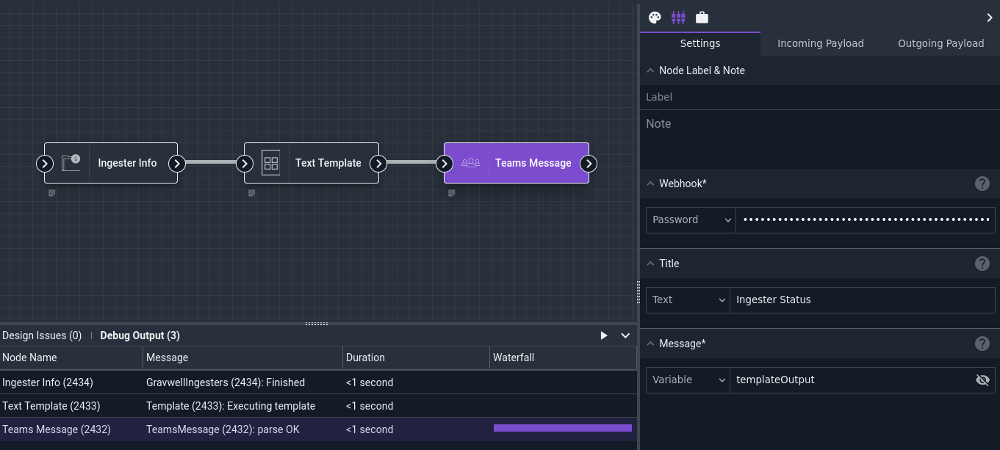
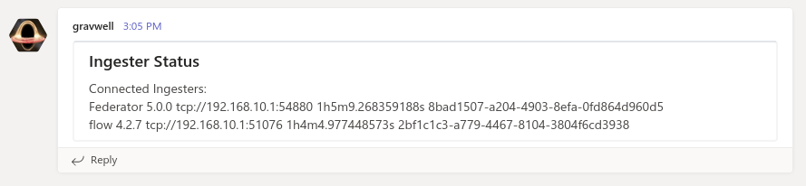

# Teams Message Node

The Teams Message node sends a message to a Microsoft Teams recipient.

## Configuration

* `Webhook`, required: an [incoming webhook](https://docs.microsoft.com/en-us/microsoftteams/platform/webhooks-and-connectors/what-are-webhooks-and-connectors) URL for Microsoft Teams.
* `Title`: an optional title for the message.
* `Message`, required: the body of the message to send.

## Output

The node does not modify the payload.

## Example

This example gathers information about currently-connected ingesters, formats that information into a text representation, and posts it to a Teams channel.



The [Text Template](template.md) node is configured with the following template:

```
Connected Ingesters:
{{ range .gravwell_ingesters }}
{{ .Name }} {{ .Version }} {{ .RemoteAddress }} {{ .Uptime }} {{ .UUID }}
{{ end }}
```

The output in Teams looks like this:


