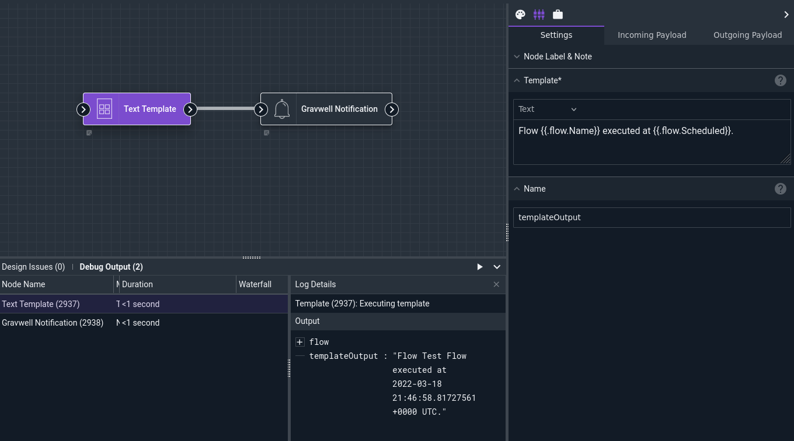
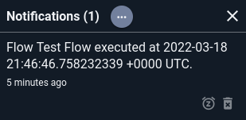

# Text Template Node

The Text Template node can format text using the [Go text/template library](https://pkg.go.dev/text/template). Using this node, you can generate text combining elements from the payload for display as a notification or as the body of an email.

## Configuration

* `Template`, required: the [Go text template](https://pkg.go.dev/text/template) to be applied by the node. The template cursor is set to the payload, meaning that values in the payload can be accessed in the template: `Flow name is {{.flow.Name}}`.
* `Name`: the name to use for the output in the payload, default `templateOutput`.

## Output

The node inserts a value into the payload using the name specified in the `Name` config variable.

## Example

This example generates a message containing the flow's name & execution time, then sets a notification with that message:



```
Flow {{.flow.Name}} executed at {{.flow.Scheduled}}.
```

The resulting notification:


