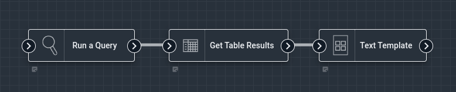

# Text Template Node

The Text Template node can format text using the [Go text/template library](https://pkg.go.dev/text/template). Using this node, you can generate text combining elements from the payload for display as a notification or as the body of an email.  A Text Template node can be used to manually craft data into almost any text based form, everything from building out custom HTML templates for an HTML email to manually building JSON objects that might have to fit a very specific format.

Text Templates implement a version of the [Mustache Template System](https://en.wikipedia.org/wiki/Mustache_(template_system)), which is essentially formatting language which is designed to allow for embedded logic, control flow, and data access directly into a schema.  The Gravwell Text Template flow node uses the Go *text/template* package and more or less implements a standard *Mustache* system.

```{note}
A word of caution, the Text Template node is as much a sledgehammer as the `regex` search module; it can do almost anything with enough brute force.
```

## Configuration

* `Template`, required: the [Go text template](https://pkg.go.dev/text/template#hdr-Examples) to be applied by the node. The template cursor is set to the payload, meaning that values in the payload can be accessed in the template: `Flow name is {{.flow.Name}}`.
* `Name`: the name to use for the output in the payload, default `templateOutput`.

## Output

The node inserts a value into the payload using the name specified in the `Name` config variable.

## Usage

When a text template executes it has access to all [flow payload variables](/flows/flows.html#payloads) under the base dot (*.*) accessor; this means you can directly embed the name of your flow via *.flow.Name*.  Paths in the payload system are case sensitive, so *.name* is a different variable than *.Name*.  Templates can access any variable in the payload that has been produced "upstream" of the Text Template node.

The Go implementation of Mustache Templates includes a variety of control systems for iterating over arrays, performing conditional output, and even setting local variables.  For a deep dive on examples see the [package documentation on Actions](https://pkg.go.dev/text/template#hdr-Actions).

## Example - Simple Notification

This example generates a message containing the flow's name & execution time, then sets a notification with that message:


```
Flow {{.flow.Name}} executed at {{.flow.Scheduled}}.
```

The resulting notification:


## Example - Iterating Over Slice

Text templates can iterate over slices of values; in this example we use the [Get Table Results](/flows/nodes/gettableresults) node to pull back a set of entries from a query using the [table renderer](/search/table/table) and then iterate over them to output a set of headers and TSV rows:



```text
Results from Flow: {{ .flow.Name }}

{{ range .tableResults.Headers }}{{ . }}\t{{ end }}
{{ range .tableResults.Data }}{{ range . }}{{ . }}\t{{ end }}
{{ end }}
```

The resulting data payload for our query of `tag=gravwell syslog Hostname Appname | stats count by Hostname Appname | table Hostname Appname count` would be:

```text
Results from Flow: my test flow

Hostname	Appname		count
host1		webserver	6450
host2		indexer		29
host3		searchagent	124
```

## Example - Using Embedded Template Functions

The Text Template engine also has several standard embedded functions that can be called, including `printf`.  This example shows using the `printf` function to print a slightly more elaborate header in our output:

```text
{{printf "Running: %s (%q)\n" .flow.Name .flow.Description }}
{{printf "Scheduled every %v\n" .flow.Interval }}
{{printf "Last Run: %v\n" .flow.LastRun }}
```

The output is well formatted, taking native types into account:

```text
Running: foobar ("foo to the bar")
Scheduled every 1h0m0s
Last Run: 2023-02-16 20:01:45.606580068 +0000 UTC
```
