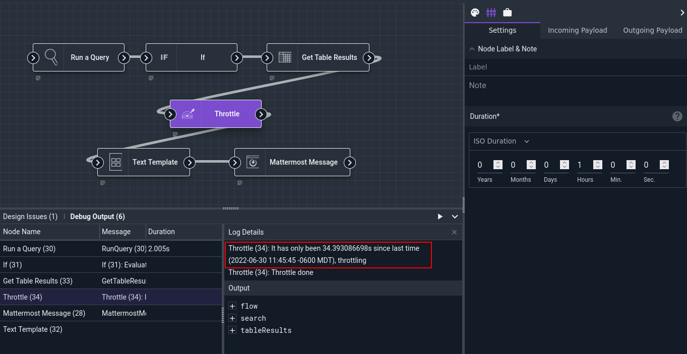
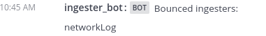
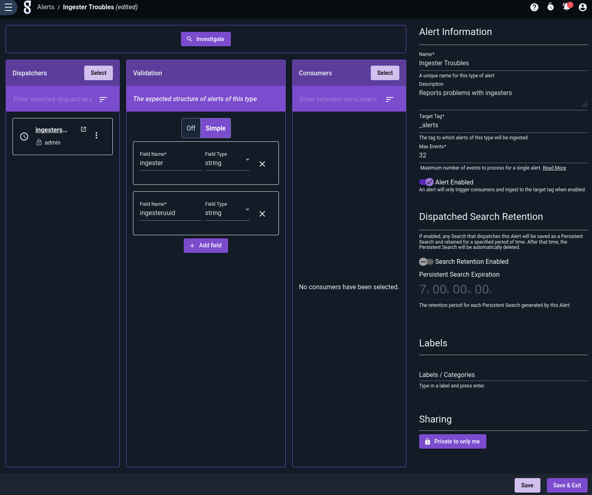
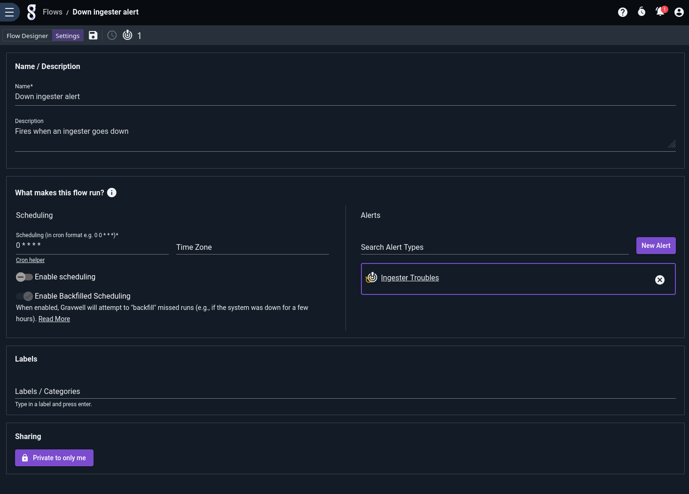
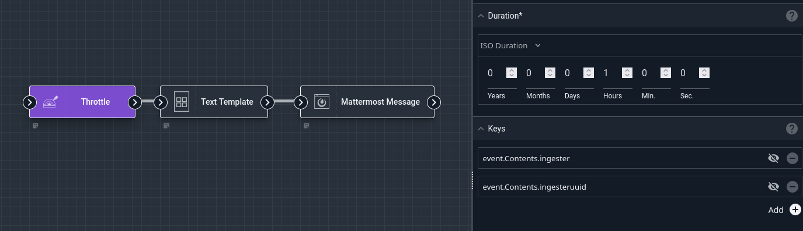
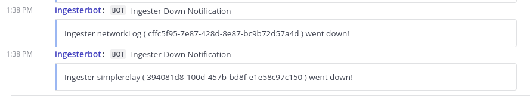
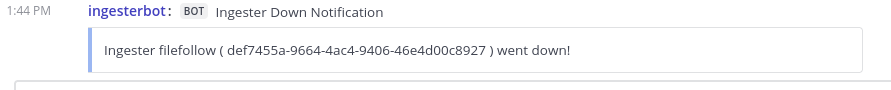

# Throttle Node

The Throttle node allows you to control how often certain nodes within a flow are executed. For instance, suppose you want to run a query every minute to check for a particular event, but you don't want to send out an *email* about that event more than once an hour. Injecting a Throttle node in front of the Email node accomplishes that.

The throttle node can operate in *basic* mode, where it allows execution exactly once in a given duration, or it can operate in *keyed* mode, where it allows execution once per duration for **each different combination of key values**. Keyed mode is explained further below.

## Configuration

* `Duration`, required: how long to wait between executions. The node will block any downstream nodes from executing if it has been less than Duration since the last time it allowed execution.
* `Keys`, optional: a list of variables to use as keys. The contents of the specified variables will be checked at run time; execution will only be allowed to continue if that particular set of values has *not* been seen in the specified duration. Any variables which do not exist in the payload will be ignored.

Note: If the Duration is specified via a variable, it should be a string containing a duration, either a [Go duration](https://pkg.go.dev/time#ParseDuration) such as "2m30s" or an [ISO8601 duration](https://en.wikipedia.org/wiki/ISO_8601#Durations) e.g. "P1DT12H30M".

## Output

The node does not modify the payload.

## Throttling Modes

To operate in **basic mode**, set only the `Duration` config. In this mode, the Throttle node will allow execution to continue to "downstream" nodes once per duration. This can be useful when your flow runs frequently, perhaps every minute, to check for rare events, but you don't want to take *action* on those events more than once in a given time period.

To operate in **keyed mode**, set the `Duration` and then select one or more variables in the `Keys` config. At runtime, the Throttle node will read the values of each of those variables. It will then check when that particular combination was last seen. If the time delta exceeds `Duration`, execution is allowed to continue. This mode is especially useful when working with [Alerts](/alerts/alerts).

## Examples

### Basic Throttling

This example runs a query which checks for ingesters disconnecting; if any are found, it generates a message listing them and sends that message to a Mattermost channel. The flow is configured to run *once a minute*, but to avoid spamming Mattermost we will only send a message *hourly* at most.



Note that in the screenshot above, the Throttle node has blocked further execution of the Text Template and Mattermost Message nodes, because it has only been 34 seconds since the last successful execution.

The [Run Query](runquery) node is configured to run the following query over the last hour:

```gravwell
tag=gravwell syslog Hostname Message~"Ingest routine exiting" Structured.ingester Structured.ingesterversion Structured.ingesteruuid Structured.client 
| alias Hostname indexer 
| regex -p -e client "://(?P<client>.+):\d+" 
| stats count by indexer ingesteruuid client 
| table indexer ingester client ingesterversion ingesteruuid count
```

The [If](if) node checks if `search.Count` is greater than 0. If so, the [Get Table Results](gettableresults) node fetches those results as a table.

The Throttle node is configured with a Duration of 1 hour. When the flow is run for the first time, it will allow downstream execution to continue and note the current time. The next time the flow is run, the Throttle node will check if it has been more than an hour since the last time it allowed execution. If so, it allows execution again and updates the stored timestamp; otherwise, it blocks further execution.

The [Text Template](template) node generates a simple message from the table results:

```
Bounced ingesters:
{{ range .tableResults.Data }}
{{  index  . 1 }}
{{ end }}
```

And the [Mattermost Message](mattermost) node sends the results to a Mattermost channel:



### Keyed Throttling

The previous example has a weakness: it notifies no more than once per hour, meaning if one ingester goes offline shortly after another, we won't find out about that second ingester's problem until nearly an hour later.

We can make up for this deficiency by combining [Alerts](/alerts/alerts) and *keyed throttling*.

First, we create a scheduled search using a modified version of the query above, configuring it to run every minute over the last hour of data. This query returns one entry for each unique ingester that goes offline:

```gravwell
tag=gravwell syslog Hostname Message~"Ingest routine exiting" Structured.ingester Structured.ingesterversion Structured.ingesteruuid Structured.client 
| alias Hostname indexer 
| unique ingesteruuid 
| table ingester ingesteruuid
```


Then we create an alert with that search as a dispatcher, and define a schema with some of the fields we care about:



Last, we create a flow which consumes the output of that alert. Recall that when an alert triggers a flow, it triggers it once per line from the scheduled search results, meaning this flow will run once for every ingester. We create the flow and associate it with the alert:



Then lay out the nodes as seen below:



Note that we have referenced `event.Contents.ingester` and `event.Contents.ingesteruuid` in the Keys configuration for the Throttle node. This tells it to allow execution once per hour for every combination seen in the those two variables (which come from the alert we defined above).

The [Text Template](template) node generates a simple message using those same two variables:

```
Ingester {{ .event.Contents.ingester }} ( {{ .event.Contents.ingesteruuid }} ) went down!
```

And the [Mattermost Message](mattermost) node sends the results to a Mattermost channel:



Note that there are two separate messages there, one for each ingester that went down. If another ingester goes down -- either a different type of ingester, like File Follower, or another Network Capture or Simple Relay ingester with a different UUID -- an alert will be sent to that effect immediately:



```{note}
If any of the specified variables do not actually exist, the Throttle node will behave as if those variables were not in the list of keys for this particular execution. This means that if you have set your keys to `foo` and `bar`, each of the following combinations of keys & values is considered unique:

| `foo`   | `bar`   |
|---------|---------|
| "a"     | [unset] |
| [unset] | "b"     |
| "a"     | "b"     |
| [unset] | [unset] |
```


