# Common Flow Patterns

This page demonstrates how to accomplish some common tasks in the flows system.

## Send Query Results via Email

One of the simplest but most useful things you can do in a flow is to periodically send the results of a query via email. It only takes two nodes to do this:


The [Run Query](/flows/nodes/runquery) node is configured to execute a search, in this case `tag=gravwell syslog Appname | stats count by Appname | table`.

The [Email](/flows/nodes/email) node is then configured to use `search.Results` as the *Body* of the email. Gravwell will automatically format the search results as HTML when sending.


The resulting email is shown below:

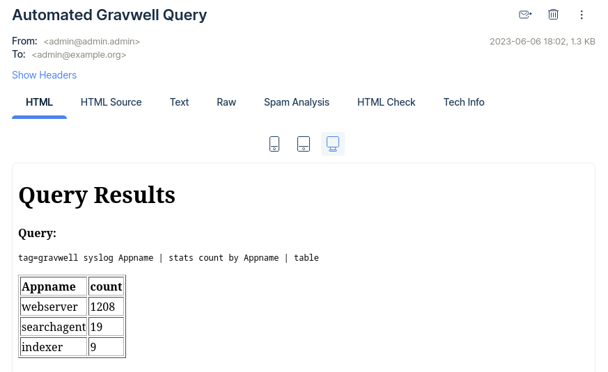

## Build an arbitrary HTML email body

Although you can send the results of a single query via email using just two nodes (Email and Run Query), sometimes you want to include more explanation or have multiple search results. The following flow shows an example of a more complex email:

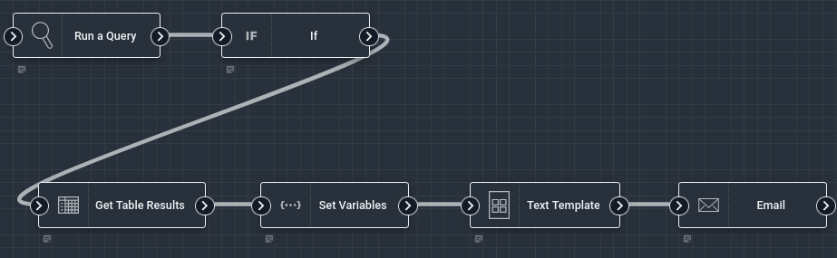

The [Run Query](/flows/nodes/runquery) node executes a search using the table renderer; for the sake of the example we use `tag=gravwell syslog Appname | stats count by Appname | table Appname count`. We then use the [If](/flows/nodes/if) node to check if `search.Count` is greater than 0. If there were results, the flow will continue on to format and send the email.

Immediately after the If node, we use the [Get Table Results](/flows/nodes/gettableresults) node to fetch the actual results of the query. Then we use the [Set Variables](/flows/nodes/inject) node to inject the Gravwell system's hostname into the payload, for our convenience in the next step:

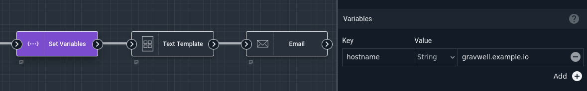

The next node is the most complex. We use the [Text Template](/flows/nodes/template) node to format our search results into a nice HTML email and place the formatted text into a variable named `templateOutput`:

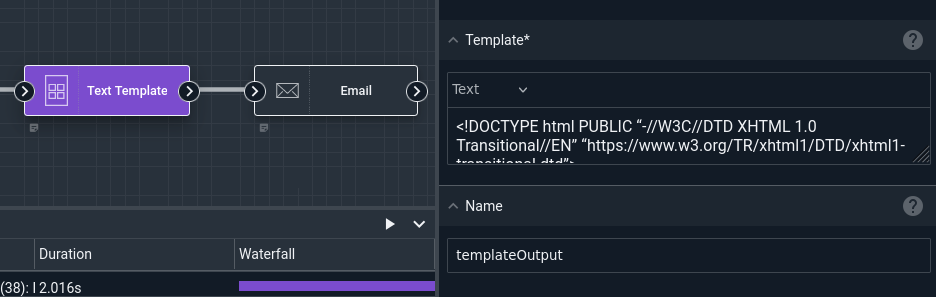

The full template definition is below:

```
<!DOCTYPE html PUBLIC “-//W3C//DTD XHTML 1.0 Transitional//EN” “https://www.w3.org/TR/xhtml1/DTD/xhtml1-transitional.dtd”>
<html xmlns=“https://www.w3.org/1999/xhtml”>
<head>
<style>
th, td {
  border: 1px solid black;
  padding-right: 10px;
  white-space: pre;
}
</style>
</head>
<body>

<div>{{ .flow.Name }} generated an alert, results attached.</div>
<br>
<div><b>Flow owner:</b> {{ .flow.User }}</div>
<div><b>Flow description:</b> {{ .flow.Description }}</div>


<h3> Query Results</h3>
<table border="1">
<tr>{{ range .tableResults.Headers }} <th>{{ . }}</th>{{ end }}</tr>
{{ range .tableResults.Data }}
   <tr>{{ range . }} <td> {{ . }} </td> {{ end }}</tr>
{{ end }}
</table>

<h4>Query</h4>
<a href="https://{{.hostname}}/search/launch?query={{urlquery .search.Query}}&start={{.search.Start}}&end={{.search.End}}"><pre>{{ .search.Query }}</pre></a>

<p><i>This is an un-monitored email address. Do not reply.</i></p>
</body>
</html>
```

Finally, the [Email](/flows/nodes/email) node is configured to send the output of the Template node to our designated recipient:

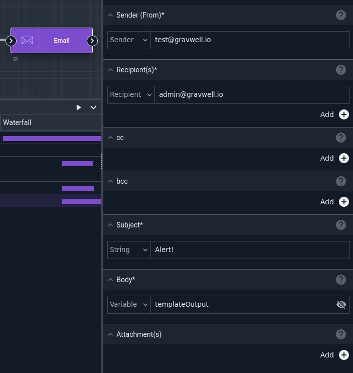

The resulting email looks like this:

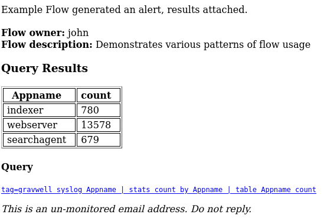

Note that the text template is reasonably generic: it will work properly regardless of what query you use, because it generates the email on the fly based on the contents of the payload.

## Generate & Share a PDF

The example in the [PDF node documentation](/flows/nodes/pdf) shows how to build a PDF from multiple Gravwell query results and send it via email. You can of course send that PDF out via multiple different methods, too:

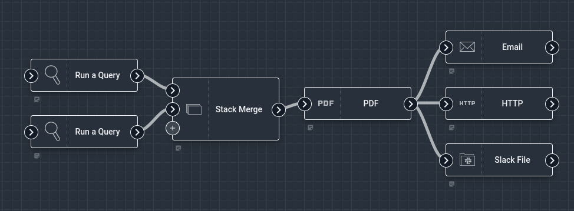

## Ingest Data from HTTP Services

The following flow hits 4 different HTTP APIs and ingests the results into different tags:

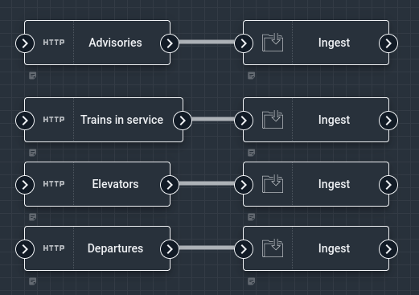

The [HTTP nodes](/flows/nodes/http) are configured with the desired URLs and HTTP methods:

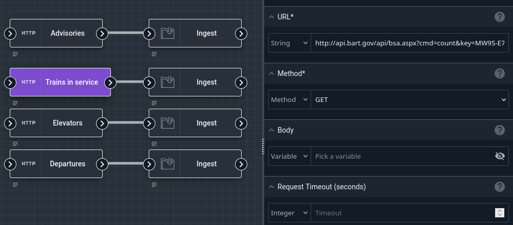

The [Ingest nodes](/flows/nodes/ingest) are configured to ingest the HTTP node's `response` output into specific tags:

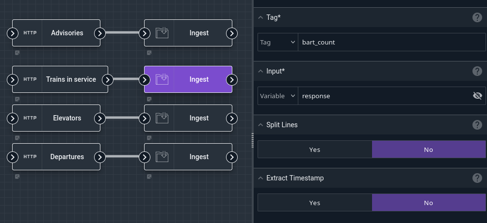

## Build an arbitrary JSON object

It is often necessary to encode data as JSON, usually in preparation for sending it to an HTTP endpoint. Sometimes it is enough to just use the [JSON Encode](/flows/nodes/json) node by itself; in the example below, we encode the `flow` object from the payload into a variable named `encoded_output`, which is shown as base64-encoded data in the payload result:

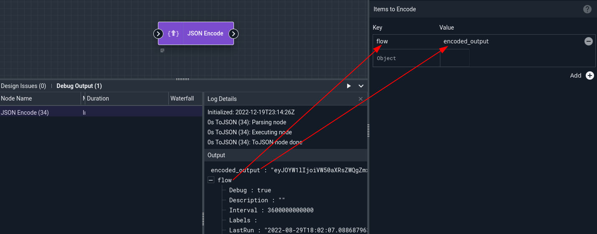

However, it is sometimes necessary to combine multiple objects from the payload into a single JSON structure. For instance, suppose we wish to send an HTTP endpoint the flow's scheduled execution time (`flow.Scheduled`) and the number of results from a Gravwell query (`search.Count`)? We can use the [Javascript](/flows/nodes/javascript) node and the JSON Encode node in concert.

First, we configure the Javascript node with the following script and specify that there will be an output named `combined`. The screenshot below shows this configuration; it also shows how the Javascript node creates an object in the payload named `combined` which contains the specified fields:

```
payload.combined = {
    "result_count": payload.search.Count,
    "scheduled_time": payload.flow.Scheduled
}
```

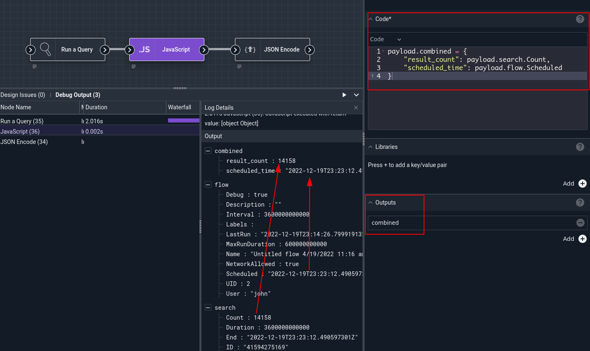

Then we tell the JSON Encode node to encode the `combined` variable into `encoded_output`:

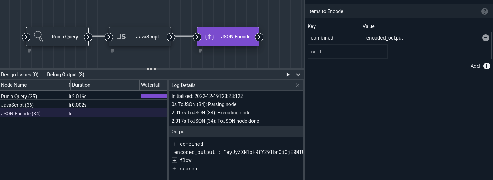

When decoded from base64, the `encoded_output` variable contains the following:

```
{"result_count":14158,"scheduled_time":"2022-12-19T23:23:12.490597301Z"}
```

## Go from a curl command to an HTTP node

It's common to see examples of API access as `curl` invocations. These can be easily translated to the [HTTP flow node](/flows/nodes/http). Consider the following curl invocation, which fetches a list of notifications from a Gravwell server:

```
curl 'https://gravwell.example.org/api/notifications' -X GET --max-time 5 
--insecure -H 'Authorization: Bearer 7b22316c676[...]3989'
```

Here's the same request accomplished via the HTTP node:

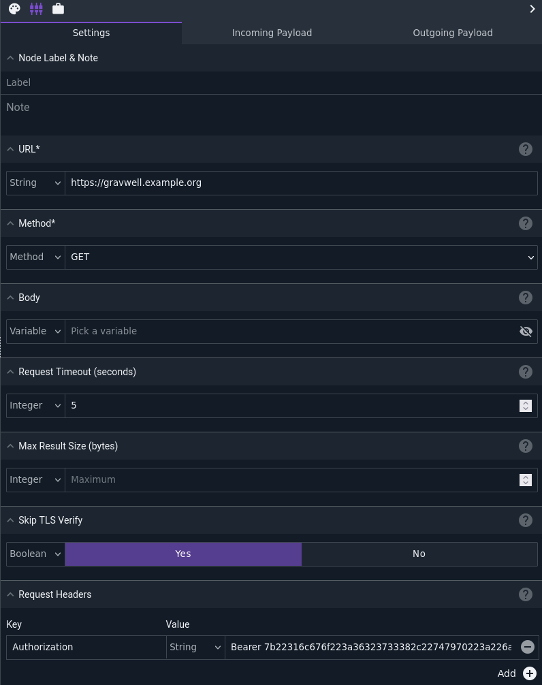

* `https://gravwell.example.org/api/notifications`: set the same URL in the "URL" config.
* `-X GET`: select GET in the "Method" config.
* `--max-time 5`: set "Request Timeout" to 5.
* `--insecure`: set "Skip TLS Verify" to true.
* `-H 'Authorization: Bearer 7b22316c6...'`: click Add in the "Request Headers" config, set the Key to "Authorization" and the Value to "Bearer 7b22316c6..."
