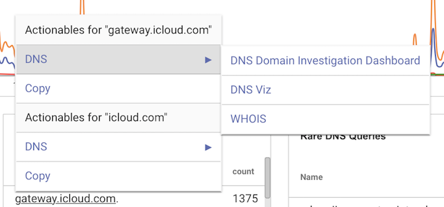
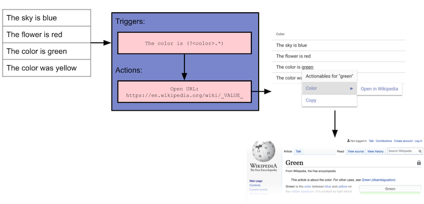
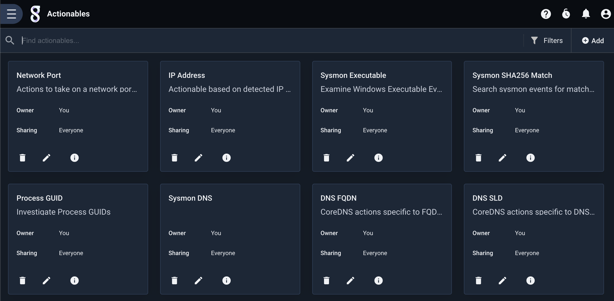
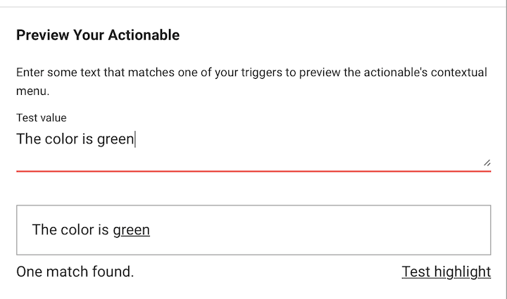
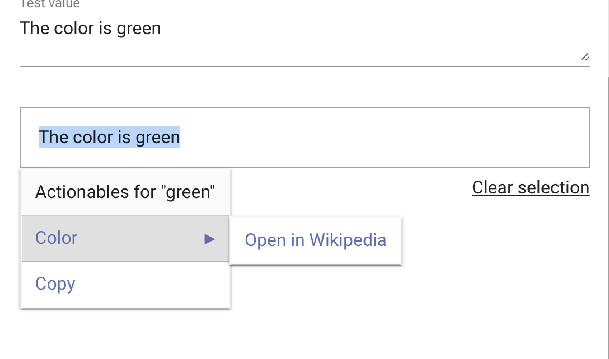
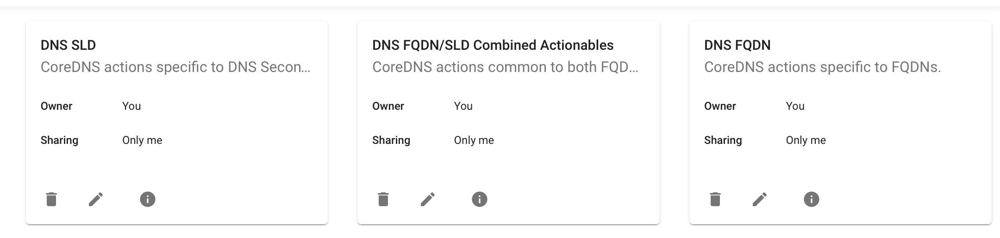
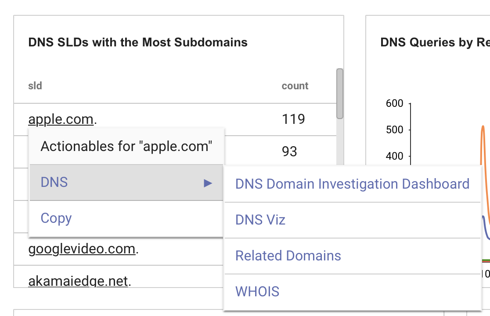
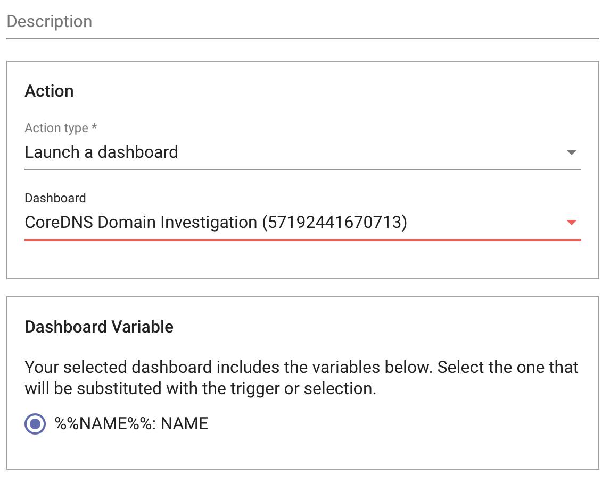

# Actionables

## Overview

Actionables provide a way to create custom triggers and menus that key on any text rendered in a query and take one or more actions when selected. Similar to an HTML Hyperlink, actionables can be used to open external URLs that key on data, but actionables can also be leveraged to submit new Gravwell queries, launch dashboards, and execute templates.

Actionables are created by specifying one or more regular expressions, along with one or more actions. Gravwell automatically parses all text rendered with the [table](#!/search/table/table.md) and [chart](#!/search/chart/chart.md) renderers and creates menus for any provided triggers.



## Actionable Structure



Actionables are made up of two components - triggers, which are simply regular expressions that Gravwell uses to match on text, and actions, which are the actions that can be taken on a matched trigger.

An actionable can contain more than one trigger and triggers can enumerate values within a regular expression. For example, if you wanted to extract the color "green" from the phrase "The color is green". You could write this regular expression trigger as:

```The color is (?<color>.*)```

Gravwell would then match on the named color, and provide any actions available to the word "green", such as looking up the color on Wikipedia.

## Creating Actionables

To get started with actionables, first open the Actionables menu, found in the main menu.

Actionables are listed by name, and it's possible for two actionables to have the same name. By allowing actionables to have the same name, Gravwell can automatically group like actionables from different sources. For example, both the Netflow and CoreDNS kits provide actionables for IP addresses, and both are named "IP Address". 



## Triggers

Triggers are simply regular expressions, as defined by the [JavaScript regular expression syntax](https://developer.mozilla.org/en-US/docs/Web/JavaScript/Guide/Regular_Expressions). An actionable may contain multiple triggers, and triggers can contain a capture group that can be used in queries, URLs, and other actions. 

For example, we could have a trigger to extract a given color from multiple forms of sentences, such as:

```The color is (?<color>.*)```

```The sky is (?<color>.*)```

For a given actionable with both of these triggers any listed actions will appear for any instance of either of these triggers.

In the trigger menu a "test" field is provided to allow you to enter example data to test the trigger.



### Trigger Modes

Triggers have two modes that control when the actionable menu should be presented - "Click and Text", and "Text". In the "Click and Text" mode (the default mode), any matching triggers are hyperlinked, allowing the user to simply click on the matching trigger to present the menu. 

On "Text" only triggers, the user must first highlight a block of text in order to parse the trigger. Using "Text" mode triggers can be useful where the text that should be triggered on cannot be meaningfully matched by a regular expression, such as a number. In this case, a "Click and Text" mode trigger would hyperlink all numbers.



### Grouping Actionables

By default, actionables menus are named by the name of the actionable itself. Actionables with the same name are automatically grouped by menu. Additionally, you can provide the menu name of an actionable to force it into another menu. This is helpful to group like actionables.

For example, the CoreDNS Kit provides several actionables based on the format of the domain names. Each of these actionables are put in the "DNS" menu, as shown below.




## Actions

Actions provide operations that can be executed on text matched by an actionable trigger. An actionable can contain any number of actions. Actions include opening URLs, launching other searches, and more.

### The `_VALUE_` Variable

Some actions allow using the text of a capture group from the regular expression of a trigger to be used in the action itself. For example, we can use the contents of the "color" capture group in a URL:

```The color is (?<color>.*)```

The capture group contents can then be used in a URL, using `_VALUE_` for the matched text:

```https://en.wikipedia.org/wiki/_VALUE_```

The keyword `_VALUE_` is the default placeholder for the matched text, and can be changed in some actions.

### Action Types

Gravwell provides several actions, and an actionable can use any or all actions in a single actionable. 

#### Run a Query

This action simply runs a new query, with the contents of the matched text as `_VALUE_`.

#### Execute a Template

The template action runs a pre-made template, using the matched text as the input variable to the template. 

#### Launch a Dashboard

The launch dashboard action opens a dashboard. If the dashboard has template variables, the user is prompted to select which variable to populate with the matched text.



#### Open a URL

The URL action supports opening a new window/tab with a given URL and matched text, and additionally provides a set of timestamp options for providing the time range arguments from the search that the actionable triggered on. 

The "Open in a modal" option opens the URL in a window within the current Gravwell instance, similar to an HTML iframe.

#### Run a Saved Query

Simply run a query from the Query Library. 


