# Dashboards

Dashboards are Gravwell's way of showing the results from multiple searches at the same time. A dashboard contains many *tiles*, each associated with a Gravwell query. If you see something interesting on a dashboard, it is extremely easy to pivot off from the dashboard into a series of exploratory searches.

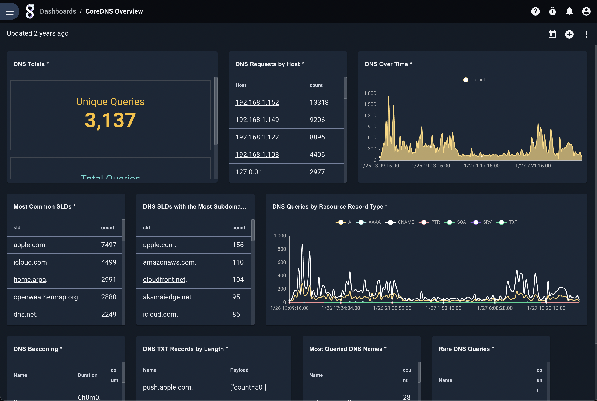

## Creating Dashboards & Basic Options

Creating a new dashboard is easy: simply click the "Add" button in the upper right corner of the Dashboards page (found in the main menu). Gravwell will prompt for basic information about the dashboard before creating it:

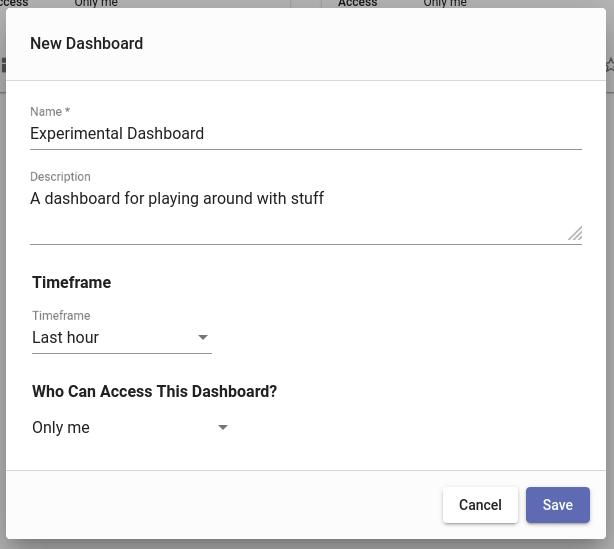

In the screenshot above, we have chosen to keep the default *timeframe*, "Last hour". Every tile in this dashboard will run its query over the last hour unless explicitly configured with an override timeframe.

After we click "Save", we are taken back to the Dashboards overview page, now showing a new tile for our newly-created dashboard. There are a few shortcut operations available to us from the tile itself:

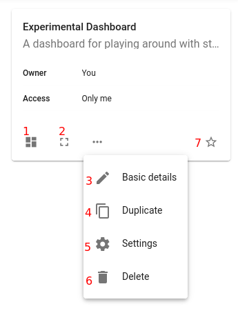

1. Opens the dashboard
2. Opens the dashboard in full-screen mode
3. Modifies basic information (name, description, timeframe, group access)
4. Creates a new dashboard identical to this one
5. Opens the dashboard's advanced settings page
6. Deletes the dashboard
7. Adds the dashboard to the user's favorites

## Populating Searches

Once a dashboard has been created, we need to add tiles to it. There are two ways to add a tile: from a completed Gravwell search, or from the dashboard itself. We'll show how to add a tile from a completed search first, being simpler, then describe all the options available when adding a tile through the dashboard interface

### Adding a tile from a completed search

When manually running searches, you can at any time add the current search to a dashboard. Click the three-dot menu in the upper right of the search results page, then select "Add to dashboard":

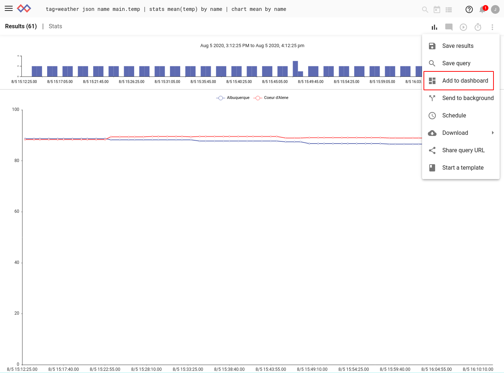

A dialog will come up prompting you to select a dashboard (or create a new one). In the screenshot below, we have selected our experimental dashboard and given the new tile a name ("Temperature by City").

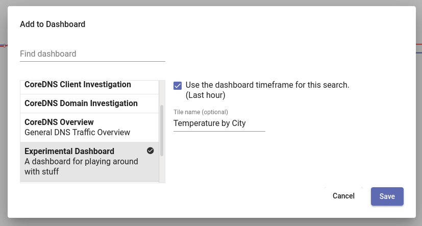

### Adding a tile from the dashboard UI

When viewing a dashboard, you can add a new tile at any time by clicking the "+" icon in the upper right of the page. This will bring up a "New Tile" dialog:

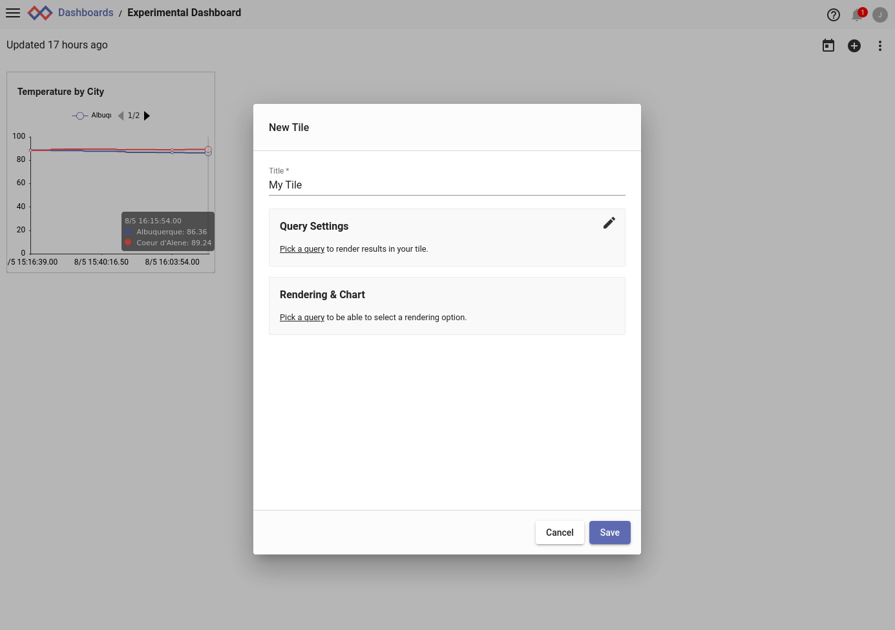

This dialog provides a lot of fine-grained options for setting up the tile. After assigning a title, we need to pick a query to provide the results. Clicking "Pick a query" brings us to the query selection tile. Here we can select queries from a variety of sources:

* Dashboard searches - queries already stored in the dashboard, typically because they're used in another tile.
* New query - enter a new query directly
* Query library - select a saved query from the query library
* Recent searches - select a query from the user's search history
* Persistent searches - use the query string from one of the searches in the 'Persistent Searches' page
* Templates - use a template search (more on this later)

In the screenshot below, we have chosen to add a query from the Query Library. From the list of available queries, we selected "DNS Over Time". 

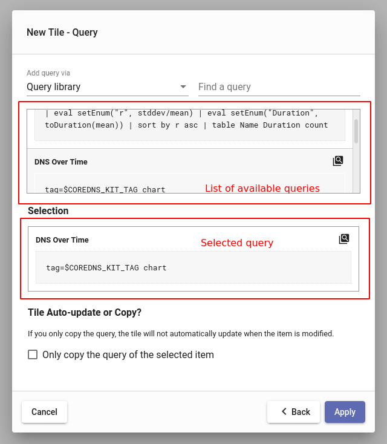

Note that for queries selected from the query library, the UI asks if we wish to copy the query or not. If we check the "Only copy the query of the selected item" box, the dashboard tile will make a copy of the query string. If we leave the box *unchecked*, the dashboard will instead store a reference to the underlying query library entry, so that if the query library entry is changed, **the dashboard will reflect those changes**.

After selecting a query, we click "Apply" and are taken back to the first page of the dialog, where we must select an appropriate renderer for the query. In this case, we select "Area chart".

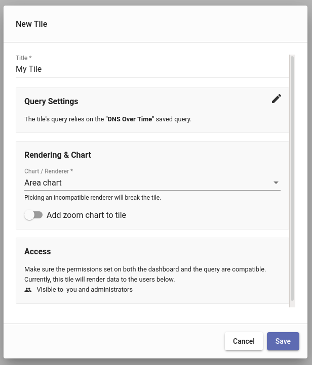

After clicking "Save", we see our new tile in the dashboard:

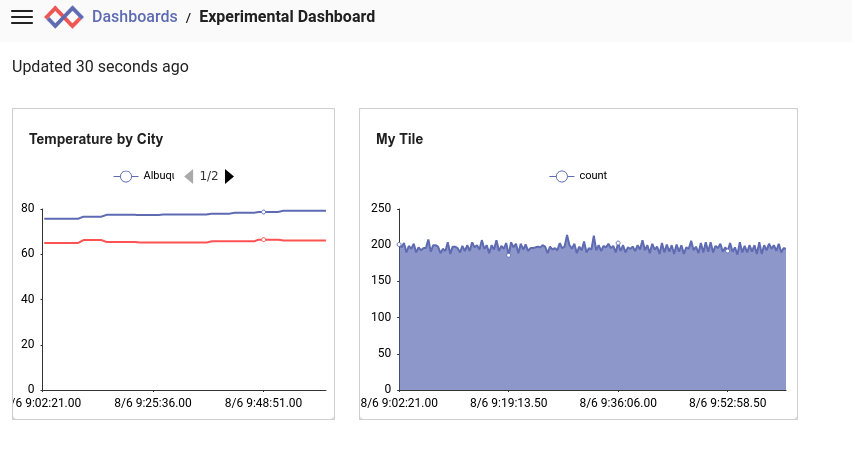

## Tile Actions

Hovering the mouse over a tile will bring up four icons:

1. Run search - executes the search in this tile over a timeframe you select.
2. Actions menu - described below
3. Maximize tile - displays that tile in a larger format for closer examination
4. Move tile - click and drag to move the tile within the dashboard

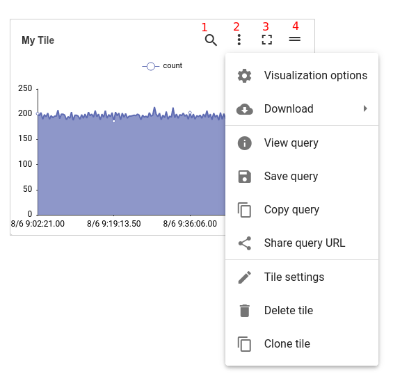

### Run search

Clicking the 'Run Search' icon will bring up a menu of possible search timeframes. Selecting one will run that tile's query over the selected timeframe.

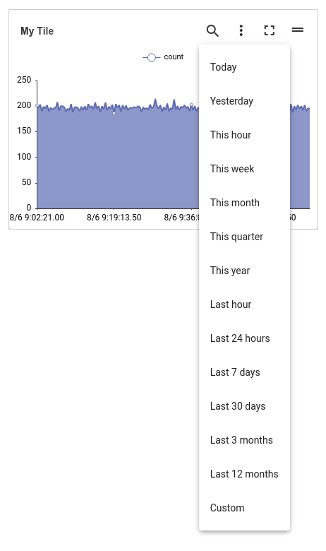

### Actions menu

Clicking the "Tile actions" icon brings up a menu of possible actions for that tile.

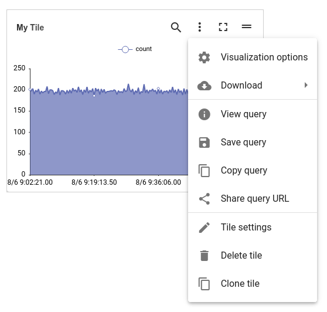

The menu items are:

* Visualization options - change settings for the tile's renderer
* Download - download the results of the query in a variety of formats
* View query - show the query associated with this tile
* Save query - save the query associated with this tile as a new entry in the query library
* Copy query - copy the query associated with this tile to the clipboard
* Share query URL - generates a shareable URL which, when opened, will execute the query in this tile
* Tile settings - modify the tile's query or renderer, as described in the "Adding a tile from the dashboard UI" section
* Delete tile - deletes the tile
* Clone tile - creates a new tile identical to this tile. Useful if you want multiple renderings of the same data

### Maximize tile

Clicking the "Maximize tile" icon will zoom in on that particular tile, taking up the entire display area. Clicking the "Minimize tile" icon in the upper right will return to the usual view.

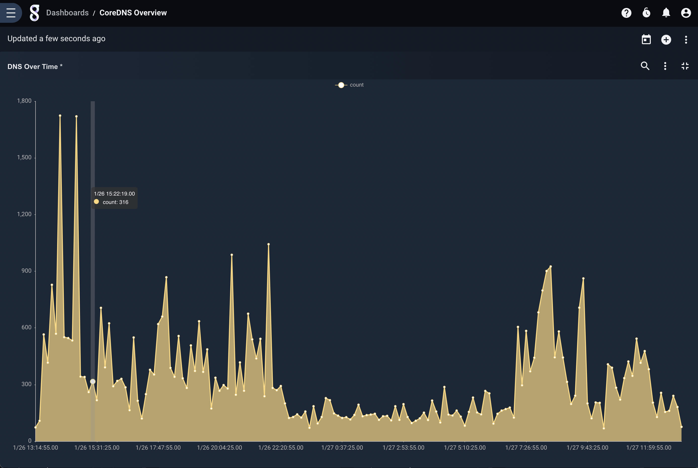

## Arranging the Dashboard

Tiles can be reshaped by clicking and dragging their corners, as you would with windows on your desktop environment. Tiles may be re-arranged by clicking and dragging the "Move tile" icon in the upper-right corner of the tile.

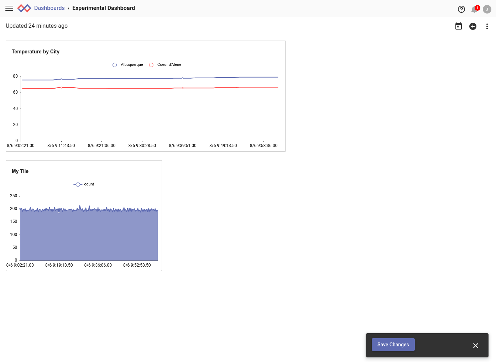

Attention: Modifications to the dashboard layout are not permanent until you click the "Save Changes" button which appears in the lower right. Until that button is clicked, you can revert to the old layout by refreshing the page.

## Live Updating

A dashboard may be configured for *live update*, in which the queries are re-executed at a specified interval to display the most recent results. To enable this, open the dashboard's settings page and go to the "Timeframe, Updates & Caching" tab. There, turn on the "Enable live update" toggle and select an update interval:

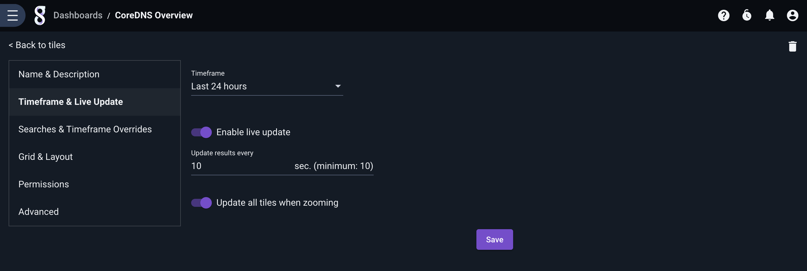

After clicking "Save" and "Back to tiles", the dashboard should now begin automatically updating. You can pause updates by clicking the new "Pause live update" button which has been added to the dashboard:

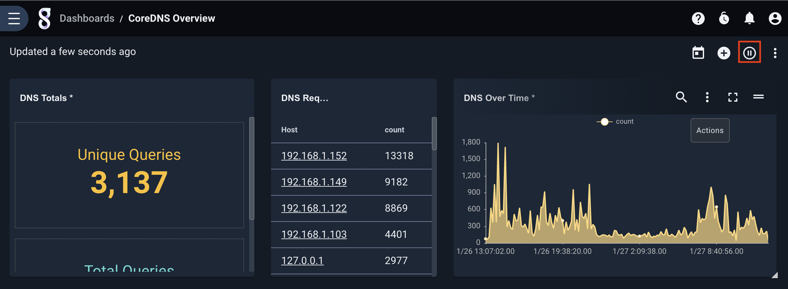

## Templates

Gravwell supports a particular kind of saved query called a *template*, which defines variables in the query string itself. If you use a template query in a dashboard tile, the dashboard will prompt you for values for each variable when you load it. Below, observe the highlighted variables in the queries when viewing a list of templates:

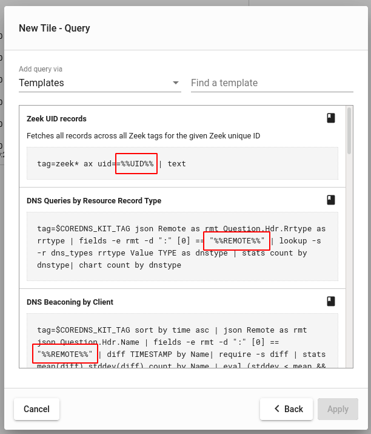

After adding the tile, we must enter a value for the variable before the dashboard can be viewed:

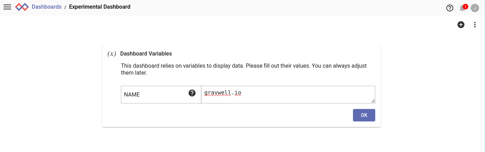

Dashboards with template queries can also be used in conjunction with *actionables*, meaning you can click on a value in your search results and use that to populate the template variable:

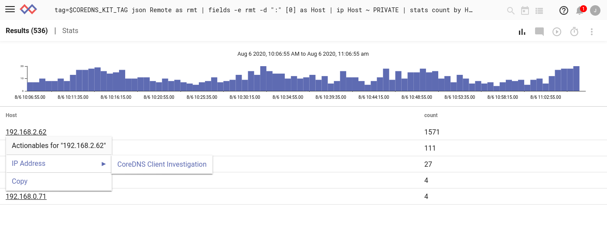

See the [documentation on actionables](#!gui/actionables/actionables.md) for more information.

