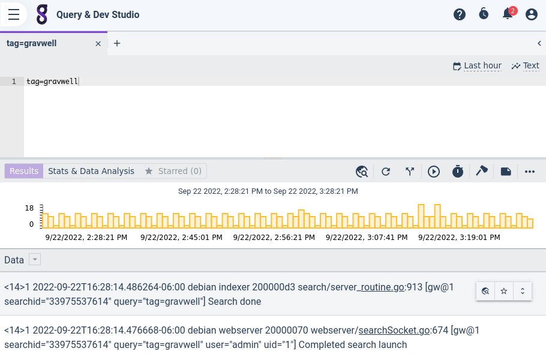
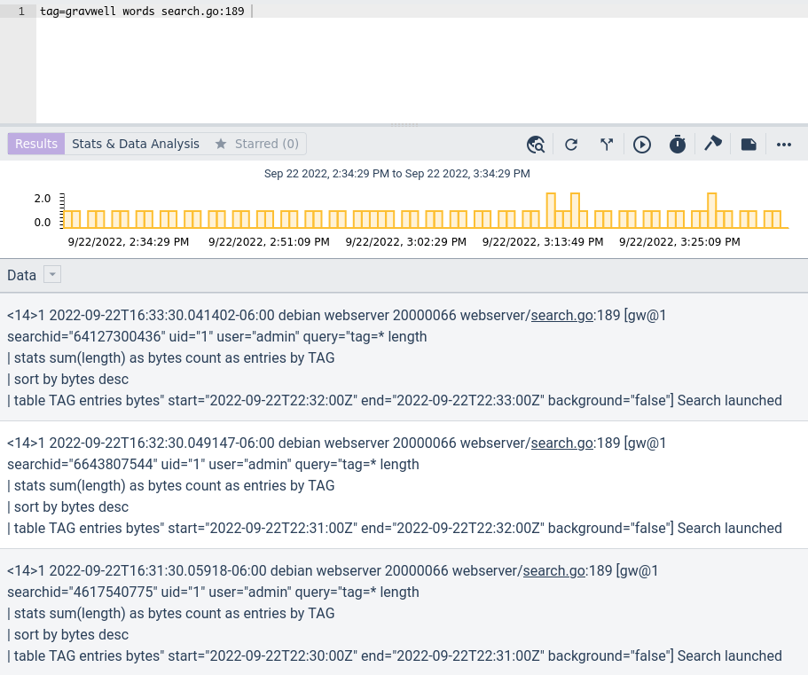
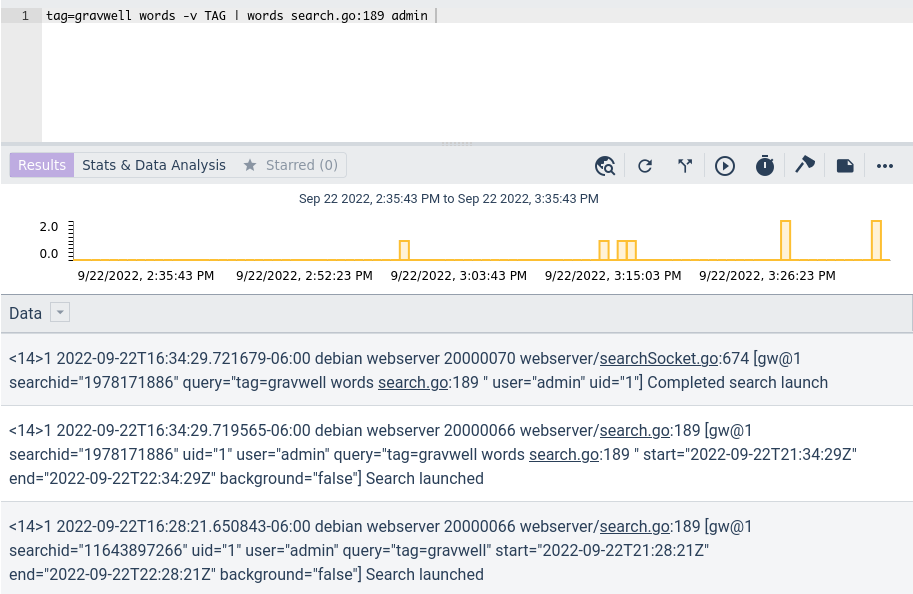
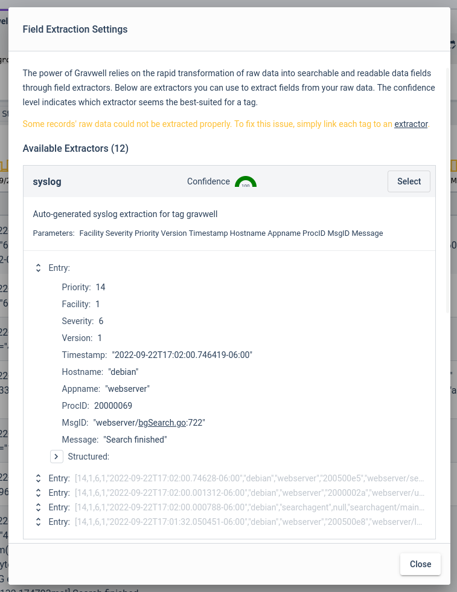
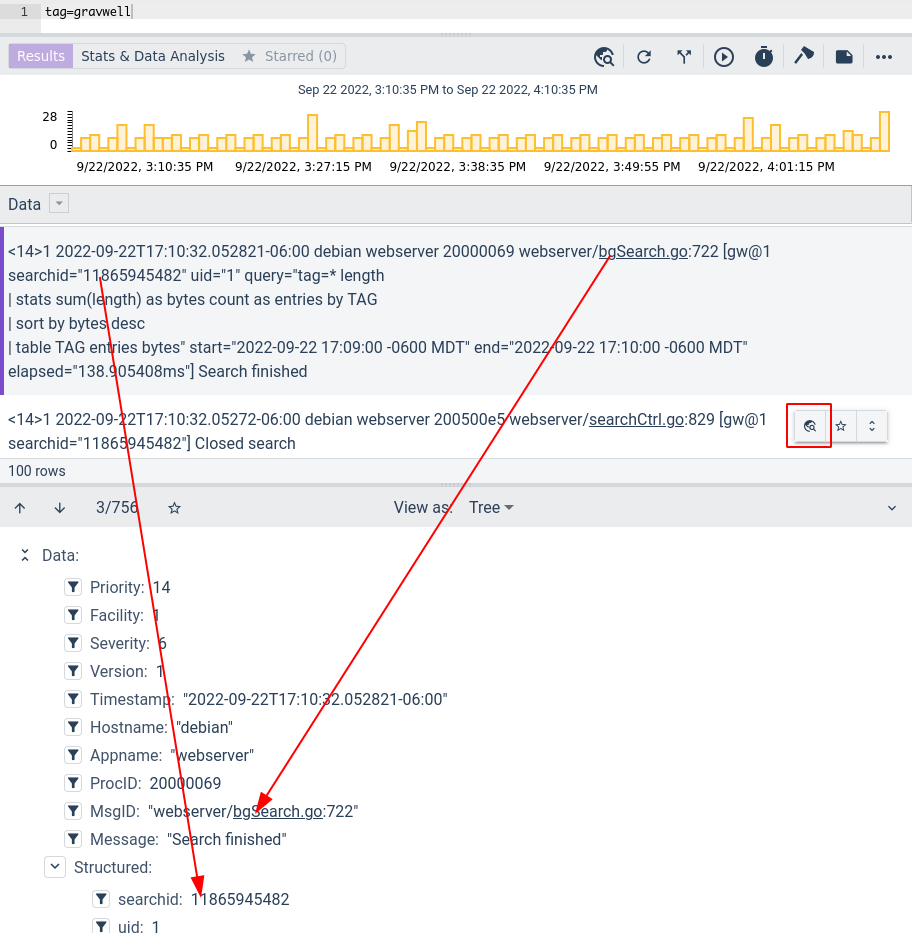
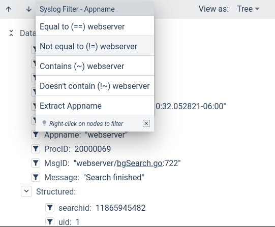
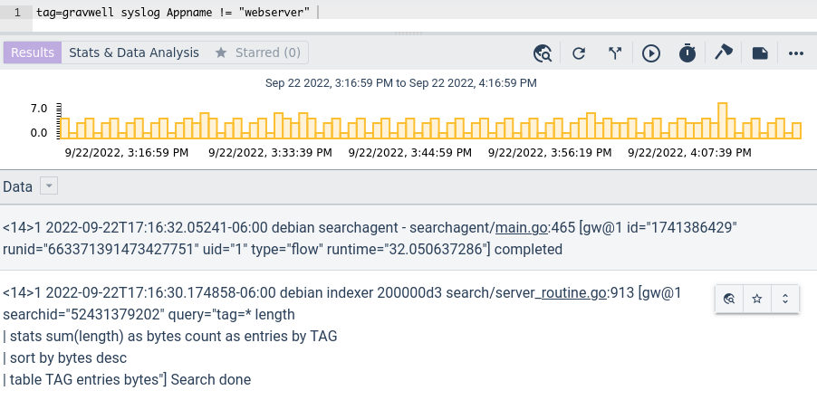

# Data Exploration

Gravwell provides several tools to help make sense of data with little or no knowledge of the data itself or of the Gravwell query language. We call this *Data Exploration*.

## Word Filtering

The most basic form of data exploration is word filtering, in which the user clicks a word within the raw entry and either includes it or excludes it from the search. For example, if we run the query `tag=gravwell`, we'll see a bunch of textual results:



If we move the mouse cursor over the results, individual words are highlighted. We can click on a highlighted word to bring up a context menu which allows us to *include* or *exclude* the selected word from the search.


```{note}
In the screenshot above, the string `search.go` is also highlighted by an [actionable](/gui/actionables/actionables); the menu item "search.go" contains a sub-menu with the actionable's actions in it.
```

If we click "Include search.go:189", the query will be automatically modified to `tag=gravwell words search.go:189`. We can then re-run the query to see the new results:



We can do this multiple times, including and excluding words, and the query will continue to update:



Note that if we have written a query already, we can still click on words and have them properly inserted into the query. For instance, if we manually run the query `tag=gravwell syslog Appname!=webserver` and then click on the word "flow" in the results, the query will be automatically rewritten to `tag=gravwell words flow | syslog Appname!=webserver`.

### Word Filtering Caveats

At this time, word filtering only works on queries which use the [text renderer](/search/text/text). We hope to introduce clickable options for the table renderer in the future.

## Field Extraction

The Query Studio also has the ability to parse many data formats and split out individual fields. For example, a user may run the search `tag=gravwell` just to see what the raw entries look like. Clicking the Details Pane icon, highlighted below, tells Query Studio to attempt to parse the data and split out individual fields:


If this is the first time the user is looking at this tag, Gravwell must determine the most appropriate format for parsing the data. A window will appear presenting several options:



In this case, Gravwell believes the data to be syslog-formatted and shows a preview of the first result parsed as syslog. The user examines this result and, deeming it acceptable, clicks "Select" and saves the selected extraction.

Now the UI shows the Details Pane at the bottom of the window, with individual fields broken out for easier reading. Note the purple bar on the left side of the raw entry; that indicates which entry is currently being displayed in the Details Pane:



Note how each entry, when pointed to with the mouse cursor, displays the Details Pane icon in a floating button group. Clicking that icon will switch the Details Pane over to show the fields of *that* entry.

Within the extracted fields of the Details Pane, you can click the filter icon and add filters on the given field. In the screenshot below, we are adding a filter to *exclude* any messages where the Appname is "webserver":



Selecting the menu option will automatically update the query with a filter on the specified field. Re-run the query to get the updated results:



You can then continue in this way, selecting fields from the Details Pane (or clicking on words in the raw entries, see the "Word Filtering" section!) to drill down into precisely the data you care about.
