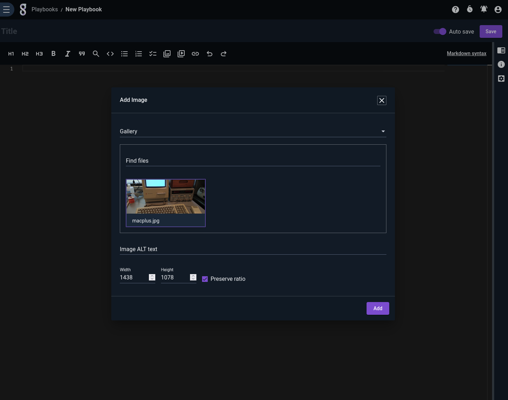
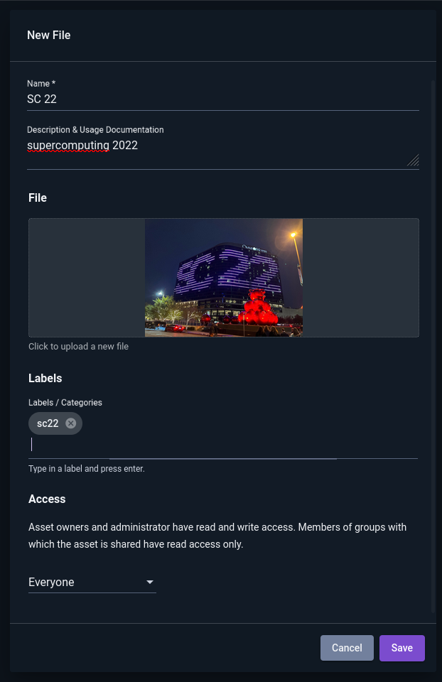
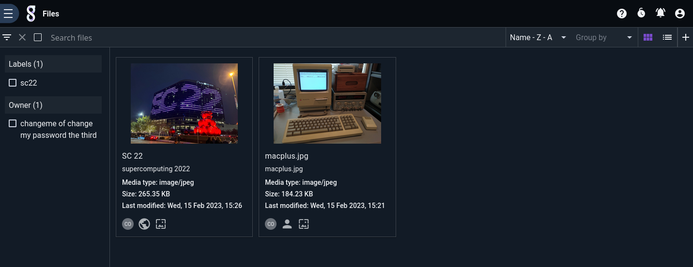

# User Files

Gravwell users can upload small (default 8MB) files for use in [playbooks](/gui/playbooks/playbooks), as cover images for kits, etc. Typically, these files are created or selected at the point of use: via a picker in the playbook editor, in the kit builder, etc.



To view all files on the system, open the Files page, found in the Tools & Resources section of the Main Menu:


New files may be uploaded here by clicking the "+" icon in the upper right:



Files may be sorted and filtered as usual:



```{warning}
Take care before deleting a file! Make sure you're not using it in any playbooks, that it's not the cover image for a kit, and so on. Similarly, if you change the access permissions on a file, you may break a playbook for another user.
```
