# Playbooks

Playbooks are hypertext documents within Gravwell which help guide users through common tasks, describe functionality, and record information about data in the system. Most Gravwell kits include a playbook or two to help users get oriented in the kit, but regular users can also create playbooks for themselves, documenting their data investigations with a mix of text, images, and *executable queries*.

The Playbooks page (Main Menu→Tools & Resources→Playbooks) lists the playbooks currently in the system and allows the creation of new ones:

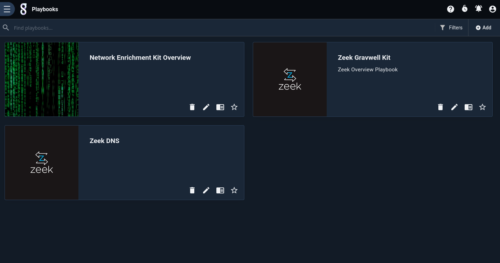

Clicking a playbook will open it. It will look more or less like a regular web page, with section headings, hyperlinks, and images, but it can also include embedded queries. Clicking the `Launch' button will run that query.

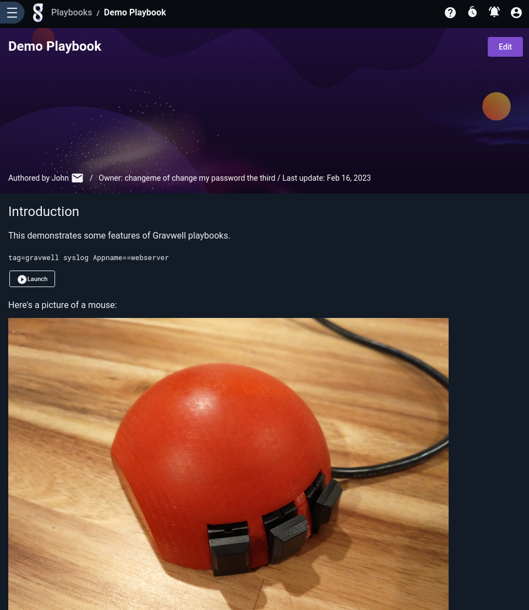

## The Playbook Editor

To create a new playbook, click the 'Add' button on the Playbooks page, or select the Edit icon (a pencil) on an existing playbook's card. If you have permission to edit a playbook, an "Edit" button will be displayed in the upper right of the page when viewing the playbook.

The playbook editor will initially show only the source of the playbook:

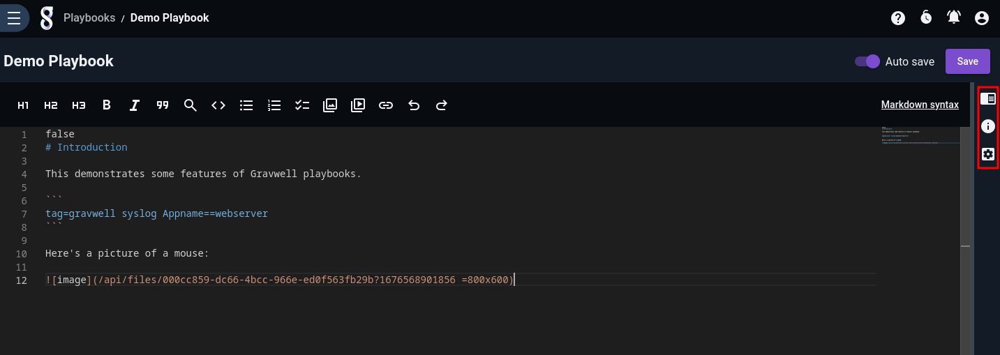

The three icons on the right-hand margin, highlighted above, will expand a pane containing additional utilities. The first icon shows a preview of the playbook, updated live as you type:

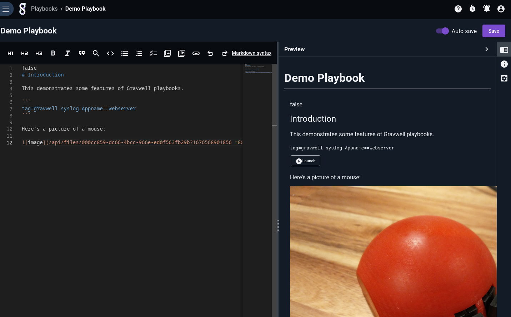

The second icon lets you edit metadata about the playbook:

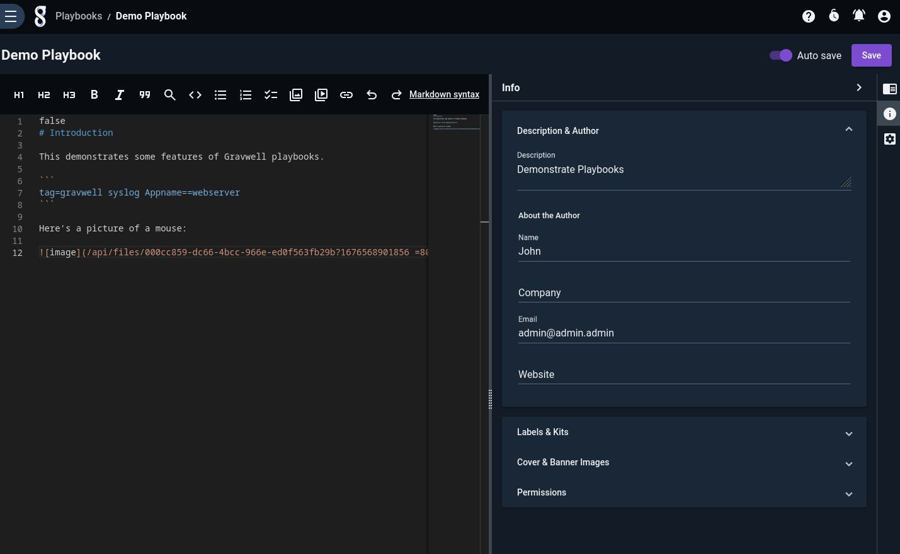

Note particularly the "Cover & Banner Images" section, which lets you upload images or select from existing [user files](/gui/files/files) for the playbook's cover and banner images:

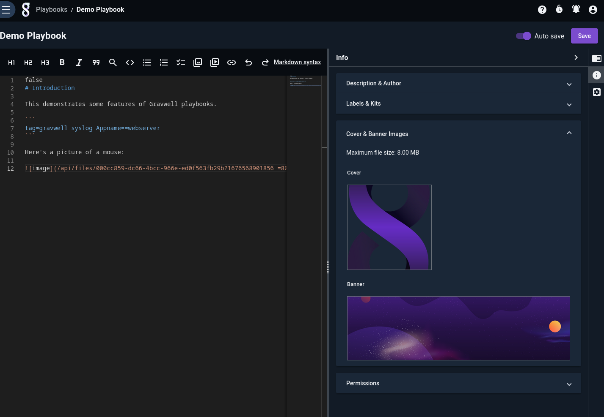

The final icon lets you set editor options such as the font size and the theme:

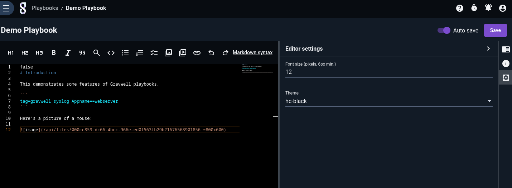

## Markdown

Playbooks are written in [Markdown](https://www.markdownguide.org/basic-syntax/). The basic structures (headings, italics, bold, links, lists, etc.) are available and, for convenience, are also available via icons at the top of the editor pane.

```{note}
The only major caveat of the Markdown used for playbooks is that code blocks (text wrapped in backticks, triple backticks, or indented by at least 4 spaces/1 tab) are considered *queries*; Gravwell will attempt to parse the contents of the code block as a Gravwell query. To insert plain unformatted text, use HTML `pre` tags.
```

## Inserting Queries

You can insert runnable queries by wrapping the query text in triple backticks or single backticks, or by indenting it at least 4 spaces / 1 tab:

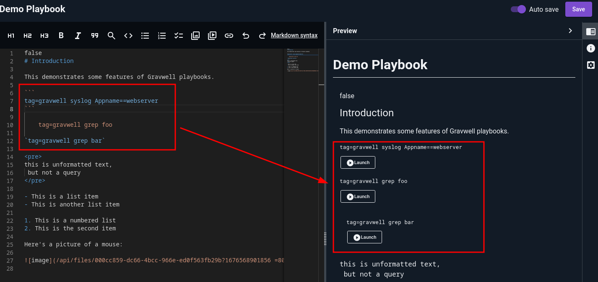

The "Add query" icon in the toolbar (a magnifying glass) will insert the appropriate markers for you.

## Inserting Images

To insert an image, click the "Add image" icon in the toolbar. This will bring up a dialog with several options in a drop-down menu. The first is to upload a new image as a [user file](/gui/files/files):

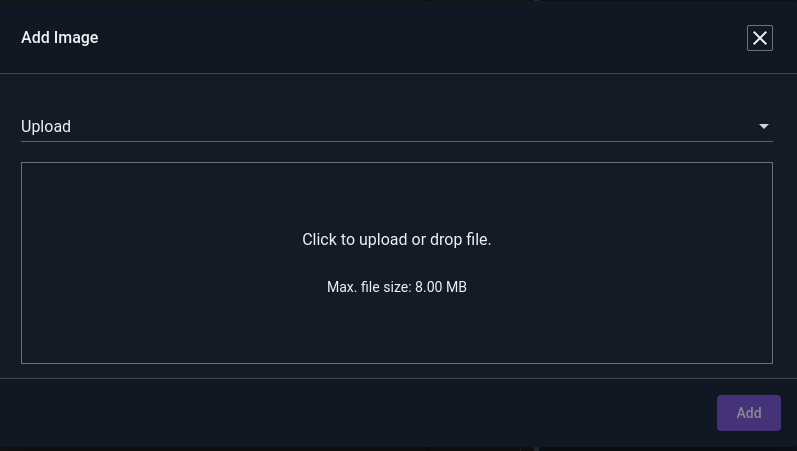

Once you have selected an image to upload, the dialog will let you set details about the file if desired, and optionally change the display size of the image in the playbook:

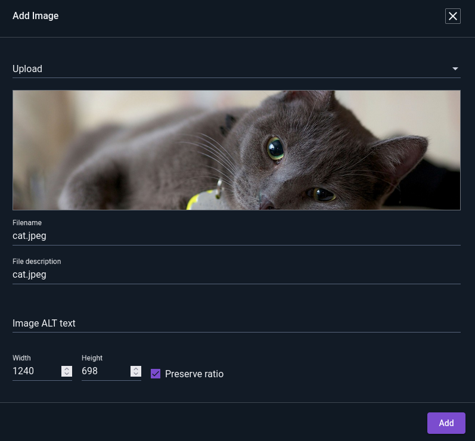

The second option in the drop-down allows you to choose an image from a gallery of existing files already in Gravwell:


Once you have selected an image, scroll down to optionally set alt text and display width/height:

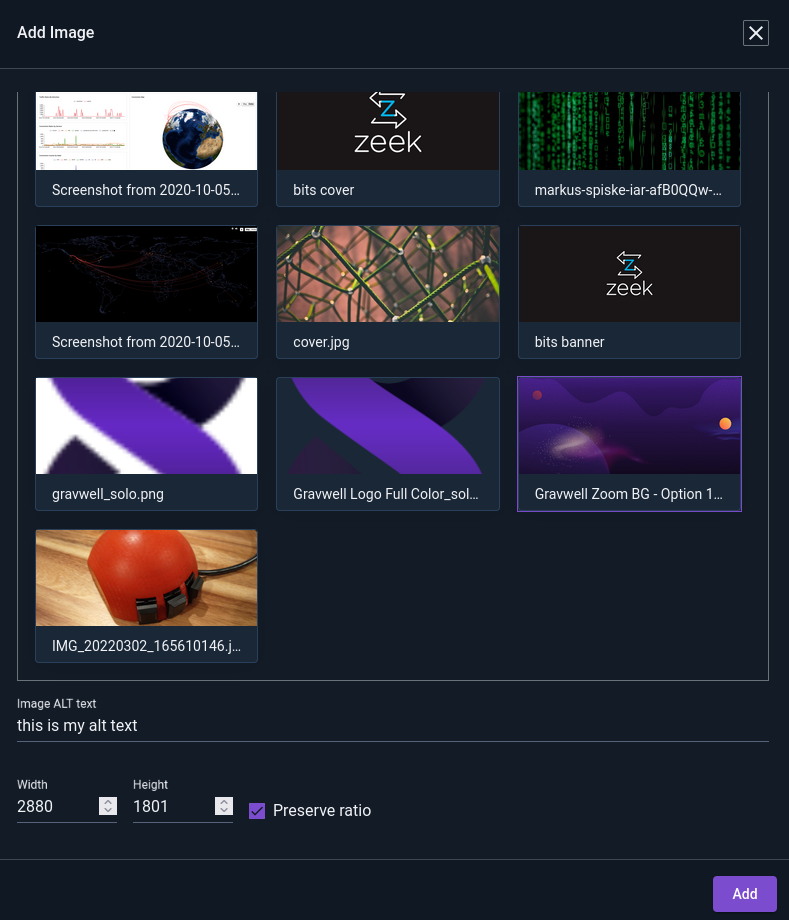

The final option allows you to specify the URL of an image directly:

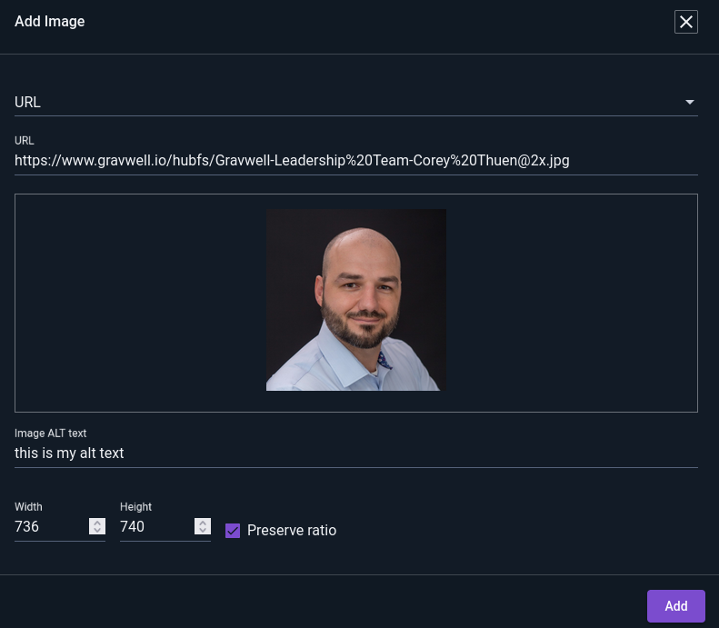

Note that inserting an image via URL will not create a new user file on Gravwell, but will instead point at that URL.

## Linking to Other Resources

You can insert links to dashboards, playbooks, and query library queries via the "Add link to another resource" icon in the toolbar:

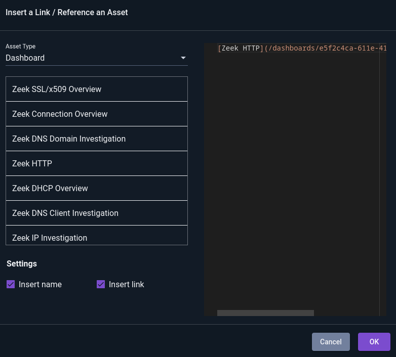
