# The Search Bar & Query Interfaces

Although investigations may begin with an email alert from an automated script, or when the user notices something strange on a dashboard, actual *data exploration* typically involves running queries manually, iterating over different timeframes and queries to drill down to the information of interest. This document describes the **user interfaces** Gravwell provides for building and running queries; for discussion of how to actually build the queries, see [the search documentation](#!search/search.md).

## New Search Page

The New Search page is the default homepage for Gravwell users. It can also be reached by clicking the Gravwell logo in the upper left of the UI, or by opening the main menu and selecting "New Search".

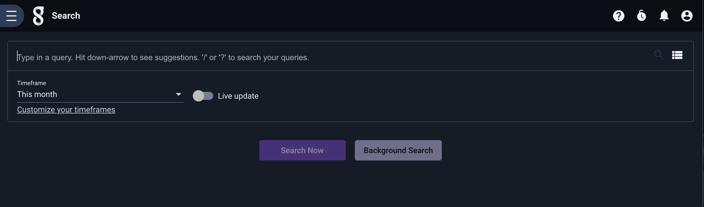

From this page, you can enter a new search entirely from scratch, re-run previous searches, or load a search from the Query Library. You can also select the desired timeframe and optionally enable live updates for the query.

### Entering a search manually

To run a search entirely from scratch, simply begin typing. Once a valid query, such as `tag=* stats count by TAG | chart count by TAG`, has been entered, the "Search Now" and "Background Search" buttons will be enabled. At this point you can launch the query by either clicking one of those buttons or by hitting "Enter".

### Accessing search history

To re-run a previous search, either hit the down-arrow or click the list icon on the far-right side of the search bar:

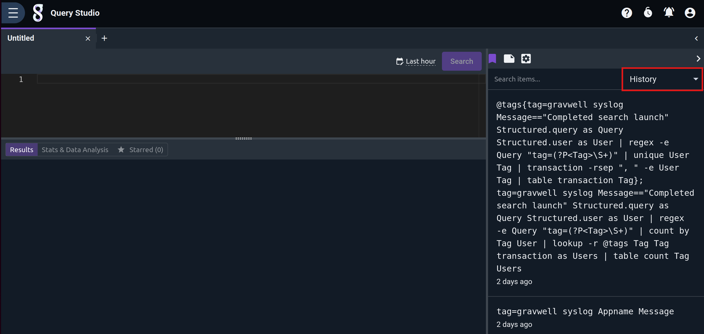

Click the desired search from the history list. This will collapse the history dropdown; click "Search Now" to run the search.

### Accessing the query library

The queries stored in the query library are also available through the search bar. Click the list icon on the far-right side of the search bar as when accessing search history, *then* click "Query library" at the bottom of the dropdown to switch views:

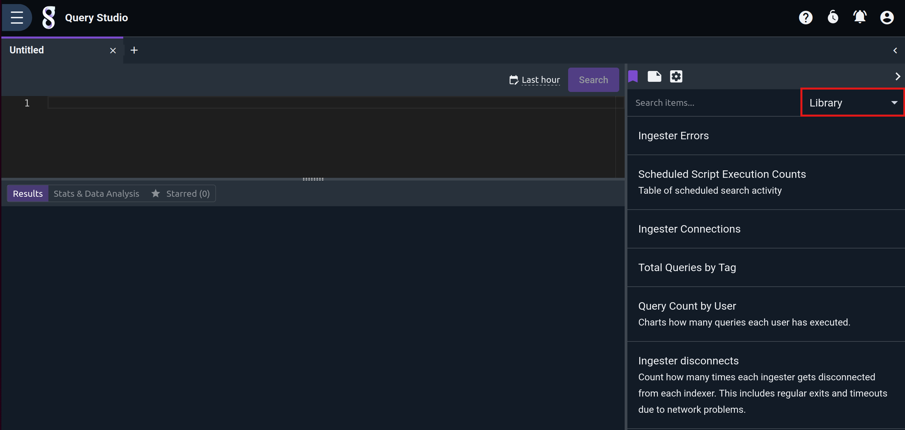

## Selecting a Timeframe

By default, queries run over the last hour of data. This is easily changed through the Timeframe dropdown below the query bar:

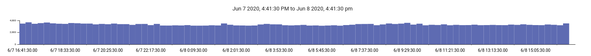

Selecting "Last hour" will run the query over the span of time from the current second back through exactly one hour previous. If the search is launched at 9:22, the query will run over the data from 8:22 through 9:22. "Last 24 hours", "Last 7 days", and so on operate similarly.

Selecting "This hour", on the other hand, will run the search from *the top of the most recent hour* to the present. Thus if the search is launched at 9:22, the query will run over data from 9:00 through 9:22. "Today", "This week", "This month", and so on operate similarly. "Yesterday" is a special case which runs from 00:00 through 23:59 of the previous calendar day.

The "Date range" option brings up selectors for the start and end date/times, as shown below.

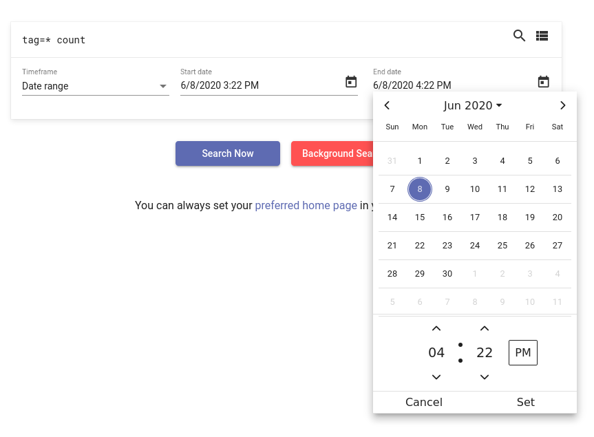

Similarly, "Unix timestamp" provides fields where you can enter Unix timestamps (seconds since the epoch) manually, which may be useful when referencing other data which uses Unix timestamps:

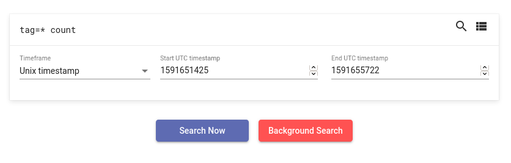

"Custom duration" lets you enter how many years, months, days, hours, minutes, and seconds into the past the search should run. In the screenshot below, the user has indicated that they wish to search over the last 2 days, 3 hours, and 12 minutes:

Finally, "ISO 8601 duration" allows you to specify a duration in [ISO-8601 format](https://en.wikipedia.org/wiki/ISO_8601#Durations). In the screenshot below, the user has entered "P13DT", meaning the last 13 days:

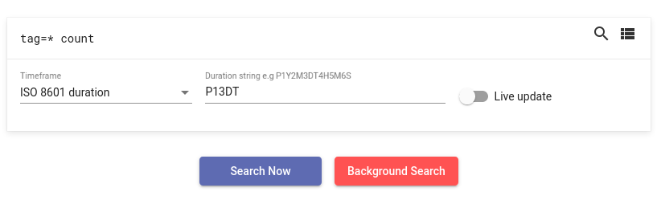

Note: "Date range" and "Unix timestamp" can be used to search into the future, which is useful if data has been ingested with bad timestamps.

## Search Results Page

When you run a query, Gravwell displays the *search results page* to show the output. From this page, you can drill down into subsections of the results, modify & re-run the query, change the timeframe, save the results, and more.

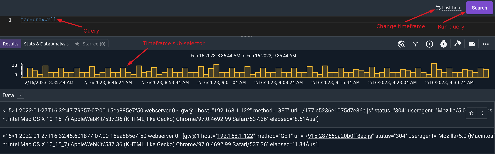

As seen in the screenshot above, the search results page shows the current query at the top of the page. You can edit the query in this box, then click the magnifying glass icon to re-run the query. If you want to use a different timeframe, use the calendar icon to select a different timeframe before re-running.

You can also use the history/library dropdown icon to completely change the query to one from either the search history or the query library; this can be useful after you have selected a sub-region of the timeframe (see the Timeframe sub-selection section).

The results page also has a menu of additional actions for the search results, accessible by clicking the three vertical dots on the right side of the page as shown below. The individual options in this menu are covered in the following subsections.

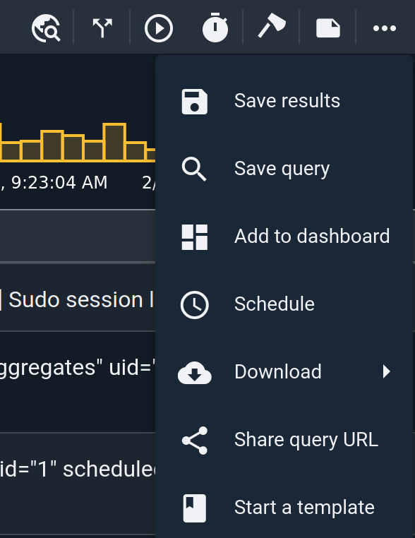

### Save results

This option marks the search as SAVED. The results will be accessible in the [Persistent Searches](#!gui/persistent/persistent.md) page until the search is deleted by the user.

### Save query

Saves the current search in the query library for later reuse.

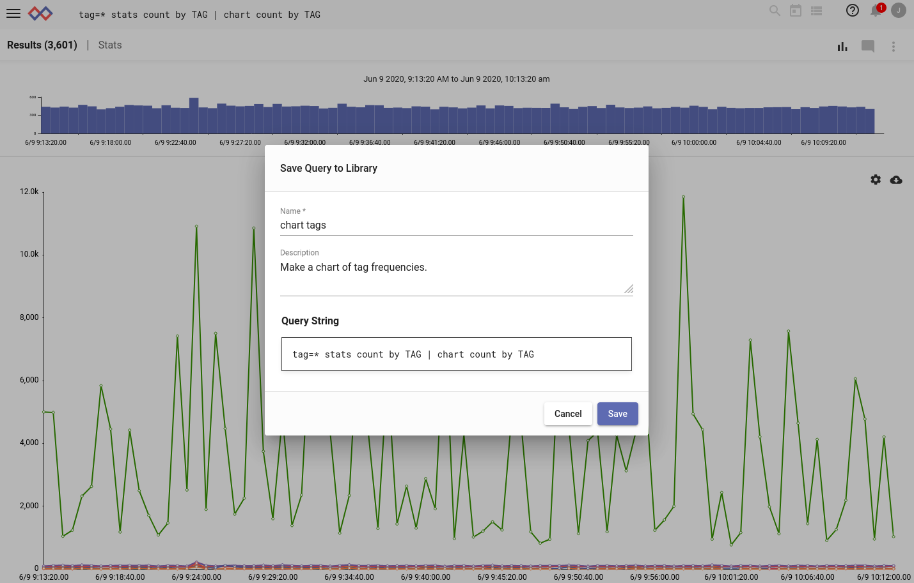

### Add to dashboard

This option lets you add the search to an existing dashboard, or create a new dashboard with this search as the first tile. You can use the "Find dashboard" field to filter your existing dashboards to find the right one.

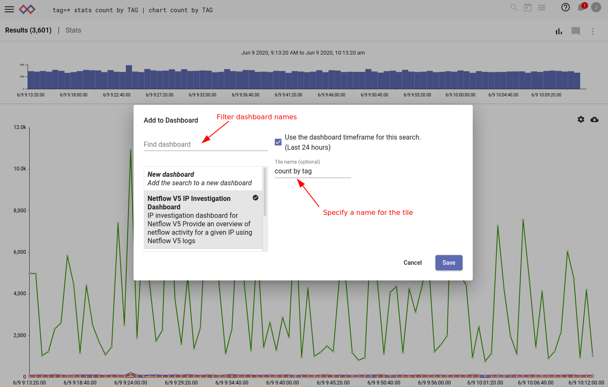

### Send to background

This option is useful when a search is taking longer than expected to complete. Clicking "send to background" will make the search continue running in the background even after you navigate away from the results page; this allows you to do other things while the search completes. You can monitor the search's status and view the completed results from the [Persistent Searches](#!gui/persistent/persistent.md) page. Note that backgrounded searches do *not* persist across webserver restarts; to keep results around permanently, use the "Save results" option.

### Schedule

Clicking "Schedule" takes you to the New Scheduled Search page, with the current query pre-populated in the query field. The timeframe selector will also be set to match your most recently-run timeframe, if possible. Simply give the scheduled search a name, description, and schedule, then click save.

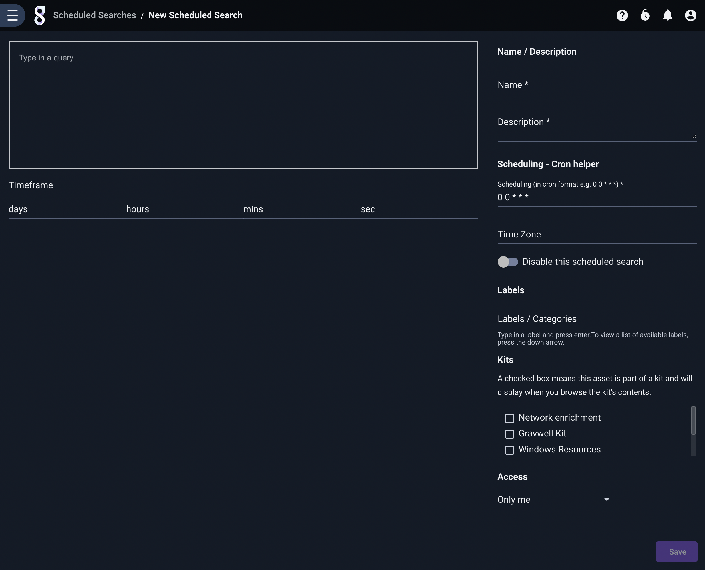

### Download

The "Download" menu gives options for downloading the search results in various formats. 

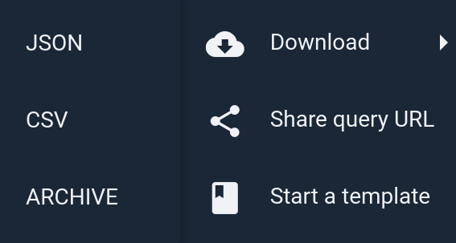

Different renderers will give different download formats; in the screenshot above, the chart renderer offers JSON and CSV formats. You may find it useful to download a chart in CSV format and import it into a spreadsheet, for instance.

One particularly useful combination is downloading JSON results from the [raw renderer](#!search/raw/raw.md). The resulting file can be used with Gravwell's [reimport ingester](https://github.com/gravwell/gravwell/tree/master/ingesters/reimport) to re-ingest the same entries into a different Gravwell instance. If you email Gravwell support about a problem, they may request that you send entries in this format for testing.

### Share Query URL

The "Share Query URL" option brings up a dialog showing a URL which you can copy and paste to another user. Opening the URL will re-run the same query you just ran. This is a convenient way to show some data to another person when they can't come look at your screen.

### Start a template

The "Start a template" option opens the New Template page with the current query pre-populated. Templates are essentially stored queries in Gravwell which contain a *variable*. They are used to build investigative dashboards or in combination with actionables to launch a query based on a portion of the results of a previous search. Templates, actionables, and investigative dashboards are documented elsewhere.

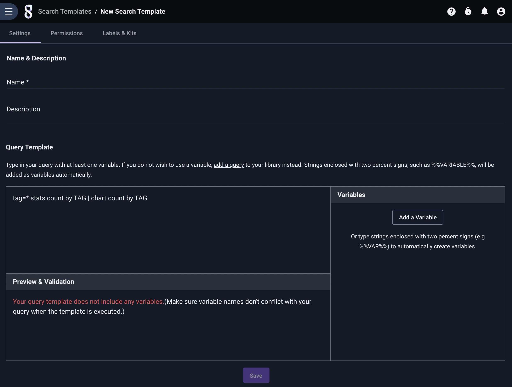

## Timeframe sub-selection

For many queries, Gravwell will display a timeframe sub-selection interface above the search results. This is a small chart, where the x-axis covers the query's timeframe and the y-axis represents the number of entries.

In the screenshot above, we see that entries were pretty uniformly distributed across the timeframe (16:41 Jun 7 through 14:41 Jun 8). The following screenshot shows a more sparse distribution of entries, with some stretches of time where no entries appear at all:

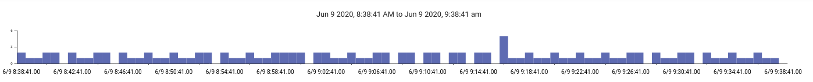

You can use the timeframe selector to zoom in on a portion of the search results. For instance, here is a search run over the last hour:

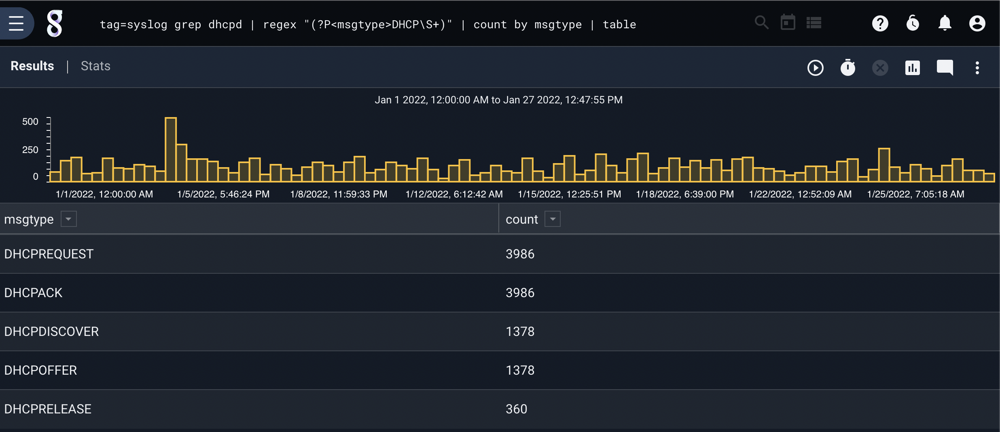

By clicking and holding the left mouse button on the timeframe selector, we can highlight a portion of the timeframe. Releasing the mouse button will cause Gravwell to zoom in on the selected portion, re-calculating the appropriate results *without* re-running the query:

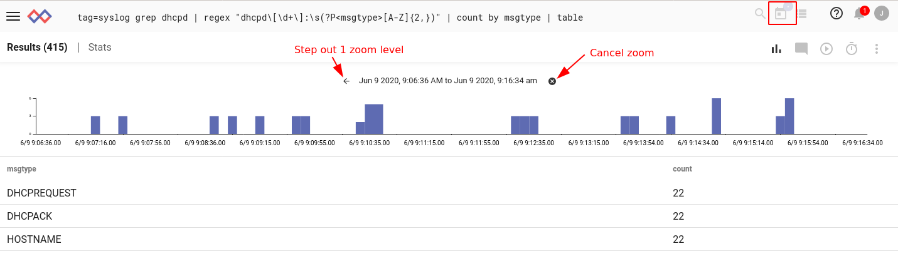

You can zoom in multiple times, down to a minimum zoom level (determined by the original query's timeframe). At this point the GUI adds two new buttons on the timeframe selector. The arrow button will step out by one zoom level; this is useful if you have zoomed in multiple times and wish to go back. The "x" button will cancel the zoom entirely and return you to the original query's timeframe.

Note that the timeframe button on the query bar now has a dot on it. This indicates that if you re-run the query at this time, it will run over *the currently selected timeframe*. This is extremely useful when you're starting from a wide set of results and want to drill down into one particular area.

Note: Not all queries will display the timeframe selector. Some modules or module options (like the table renderer's `-nt` flag) force Gravwell into *non-temporal mode*, which disallows zooming.

## Live Update Queries

If you want to track a particular query, updating the results as new entries come into Gravwell, you can use the Live Update function. Either click the "Live update" toggle button on the new search page, or use the timeframe dropdown menu in the search results page to turn it on and re-run the search.

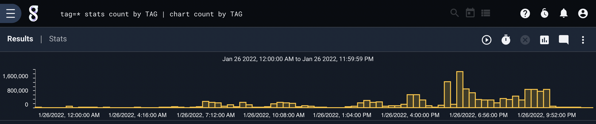

A search with live updating turned on will re-execute on a given interval, updating the results. Note that this *does* require running the whole search again, so searches involving large quantities of data (which take a long time to run) may not be suitable for live updating.

When a search has live updating enabled, the search results page adds two new buttons:

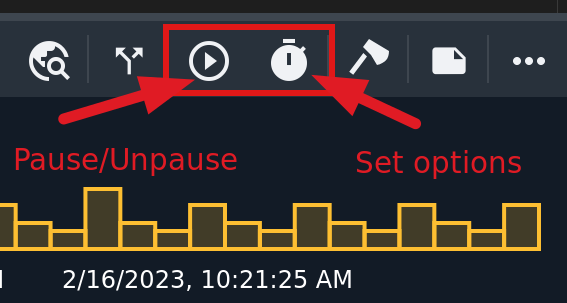

The left button, labeled "pause updates", will temporarily disable live updating. Clicking it again will re-enable updates.

The right button lets you change how often the live update occurs:

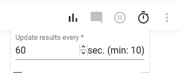

By default, the search updates every minute. You can update as frequently as every 10 seconds, or as infrequently as you wish.