# The Query Library

The query library lets you store commonly-used search queries for quick recall. You can pull up queries from the library at the [Gravwell search prompt](#!gui/queries/queries.md) and embed them in [dashboards](#!gui/dashboards/dashboards.md).

## The Query Library Page

You can access the query library management page from the main menu, in the "Searches" section:

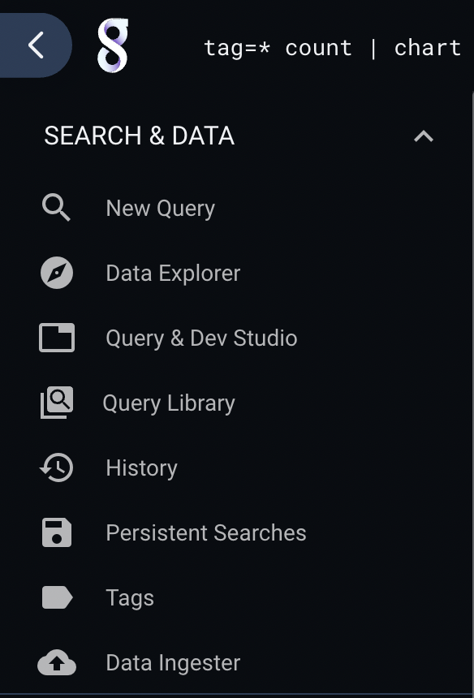

The page displays tiles for all the user's stored queries:

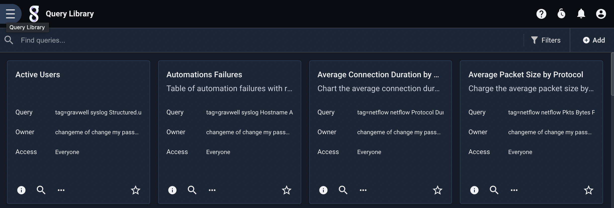

## Creating a Query

There are two ways to create a new entry in the query library: by storing a search you have run, or by filling in a form on the management page.

### Save query from search

When you have run a manual search and decide you want to save that query for later, you can select 'Save query' from the search results menu:

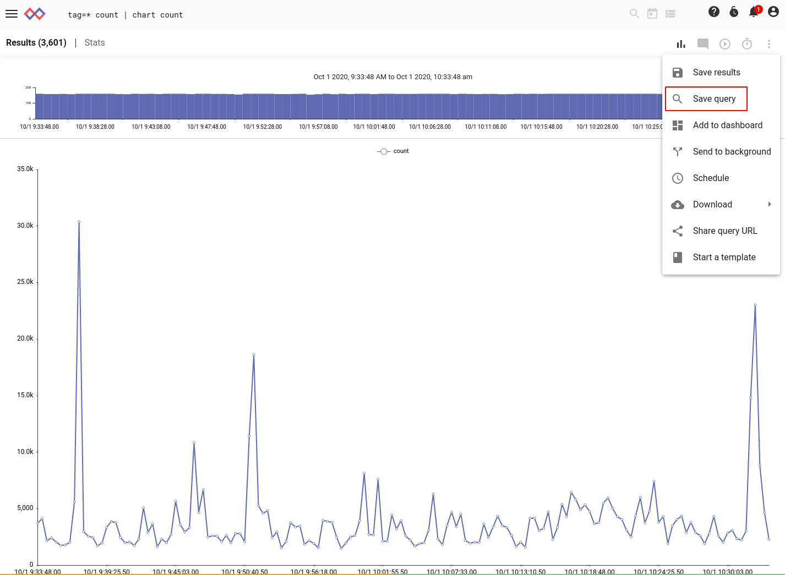

The GUI will bring up a dialog prompting for a name and description of the query to be saved:

Once you fill in the name and description and click Save, the query will be available in the query library.

### Add query manually

You can also add a query to the library manually, by clicking the 'Add' button in the upper right corner of the query library management page. You will be presented with a page prompting for a query string, name, and description, plus some optional fields (labels, etc.)

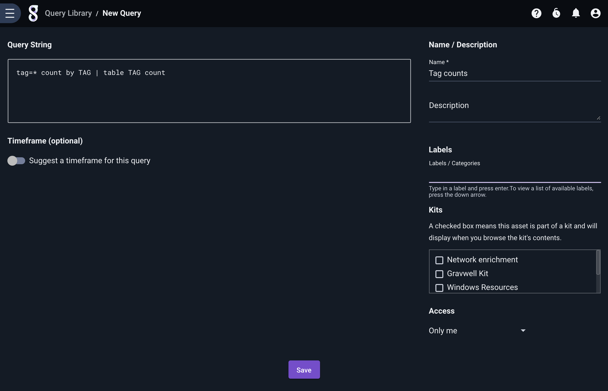

## Running a Query

You can run a query by clicking the search icon on the query's tile in the query library page. The UI will prompt for a timeframe; once you select a timeframe, the search will be launched:

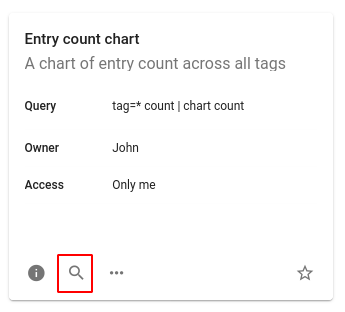

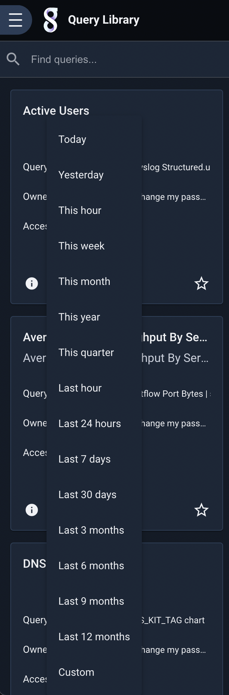

The queries stored in the query library are also available through the search bar. Click the list icon on the far-right side of the search bar as when accessing search history, *then* click "Query library" at the bottom of the dropdown to switch views. You can now select from the entries in your query library:

## Sharing a Query

Clicking the "Share Query URL" entry in the query tile's extended menu (shown below) will bring up a dialog with a URL. That URL can be copied and sent to other users, who can open the link to run the query themselves, *provided* you have granted them permission to view the query.

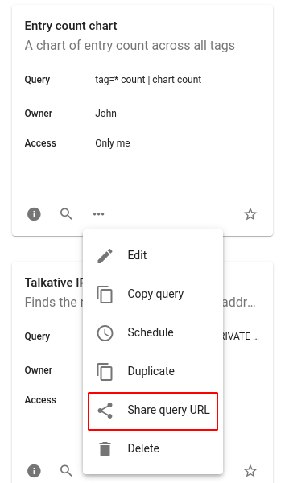

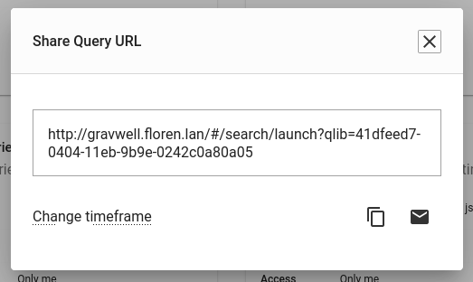

You may also change the timeframe used in the query by clicking "Change timeframe" and selecting a different timeframe:

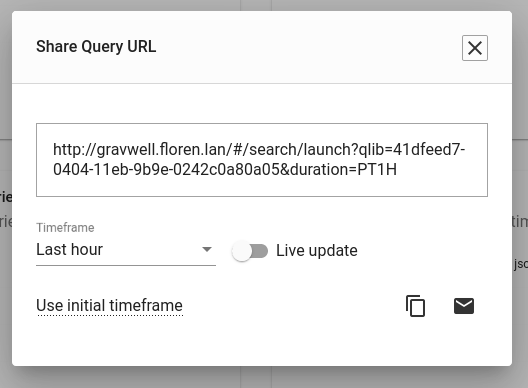

## Scheduling a Query

You can easily create a [scheduled search](#!scripting/scheduledsearch.md) from a query library item by selecting the "Schedule" option in the extended menu. This will take you to a scheduled search creation page with the selected query pre-populated; fill in the the name, description, schedule, etc. and click 'Save' to create a scheduled search.

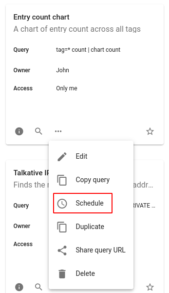

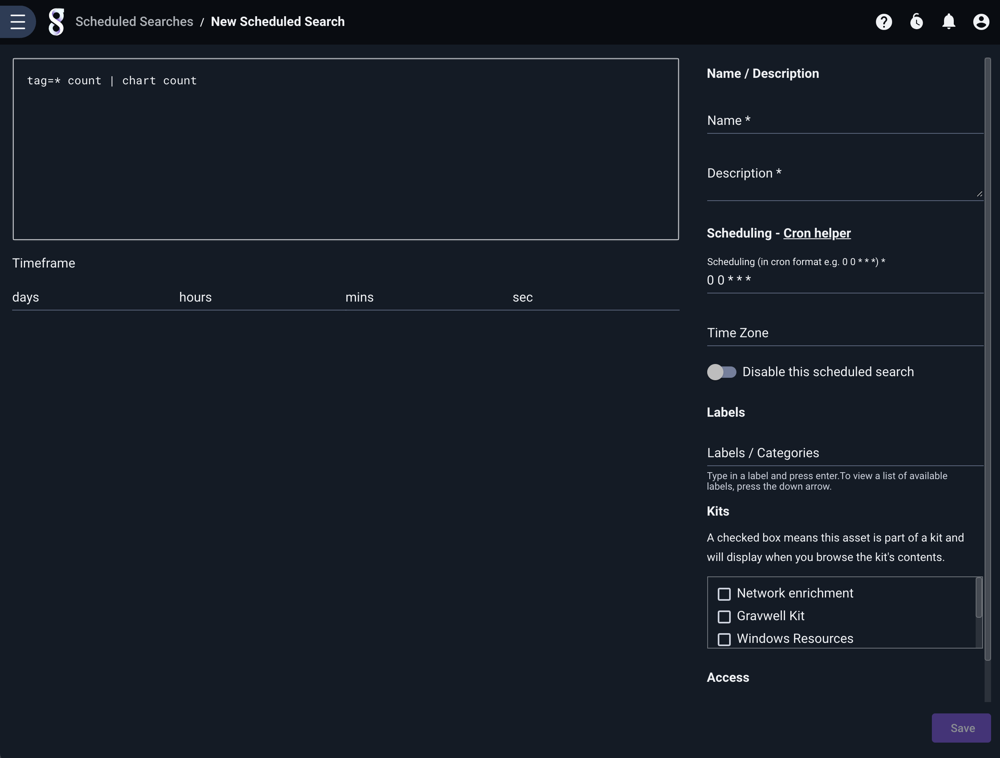