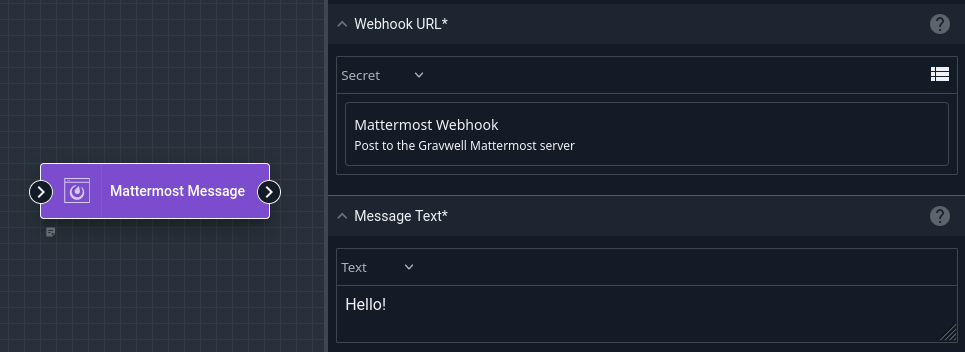
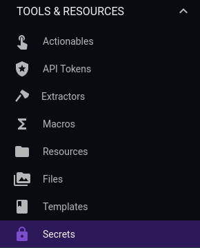
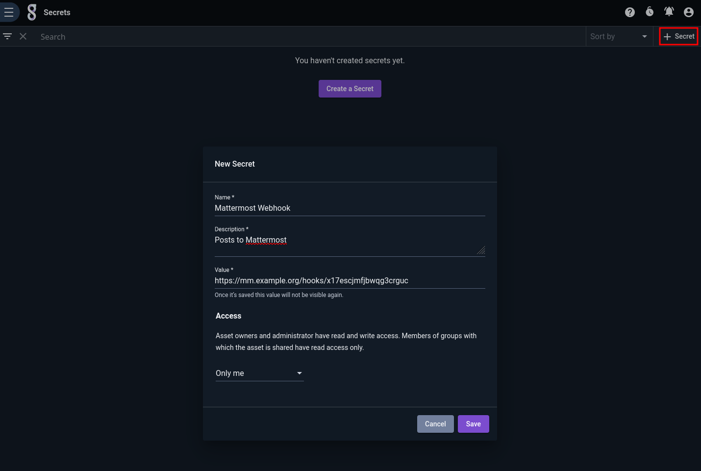
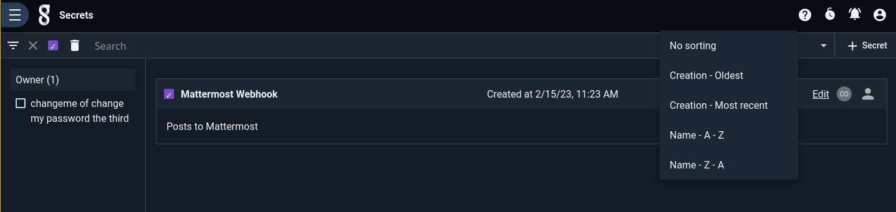
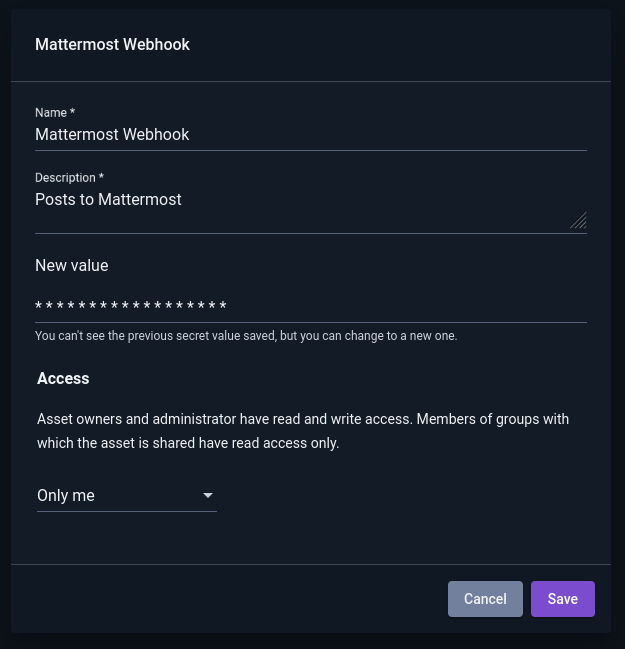
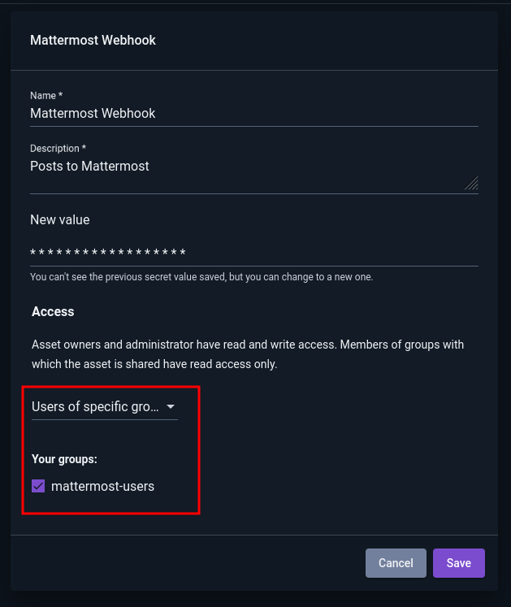

# Secrets

Gravwell can store secret strings for use in flows. Once created, the user cannot read the contents of the secret again, although they may *change* the value later. The user may then refer to the secret in certain node types when building a flow; for instance, in the screenshot below, the user has set the `Webhook URL` field of the [Mattermost Message node](/flows/nodes/mattermost) to use a secret named "Mattermost Webhook".



## Creating & Managing Secrets

Secrets are managed via the Secrets page in the Tools & Resources section of the Gravwell main menu:



To create a new secret, click the "+ Secret" button in the upper right and fill out the fields in the dialog:



Secrets may be filtered, sorted, or deleted in the usual ways:



Note that once a secret has been created, the user cannot retrieve the *value* of the secret again. Clicking "Edit" on a secret allows the user to change the secret's other attributes or to *modify* the value of the secret:



## Sharing Secrets

Secrets may be shared with other users. For instance, an administrator may decide that users in the group named `mattermost-users` should be allowed to use a common Mattermost webhook to send notifications from their flows. Sharing the secret with that group allows those users to use it in their flows, but prevents them from retrieving the actual contents of the secret:



## Security Considerations

Although Gravwell does its best to protect the contents of secrets, there are several fundamental issues which must be faced by *any* system which uses stored secrets in automations. In brief, anyone who has root access to the Gravwell webserver systems can probably extract your secrets with a little work. Further details are given below.

```{warning}
Before creating a secret, think through what could happen if the secret were leaked and how you would respond. Adding a secret containing a Mattermost webhook URL to your internal corporate Gravwell system is low-risk; creating a secret containing your SSH private key on a publicly-accessible Gravwell system is higher-risk.
```

* Secrets are stored unencrypted on the webserver's filesystem (and on the datastore, if used). This means that anyone who can read files in `/opt/gravwell/etc` on the Gravwell server(s) can theoretically extract the contents of a secret from the database.
* If Gravwell is configured with HTTPS disabled, secrets will cross the network unencrypted; anyone who can sniff network traffic may be able to retrieve them.
* Secrets must be available to the search agent component for use in flows. The search agent retrieves the secret values after authenticating via a special method used only by the search agent. The search agent authenticates using a token stored in `/opt/gravwell/etc`; in theory, anyone who can read the files containing the token could impersonate the search agent and retrieve the secrets.
