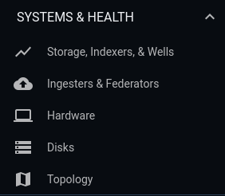
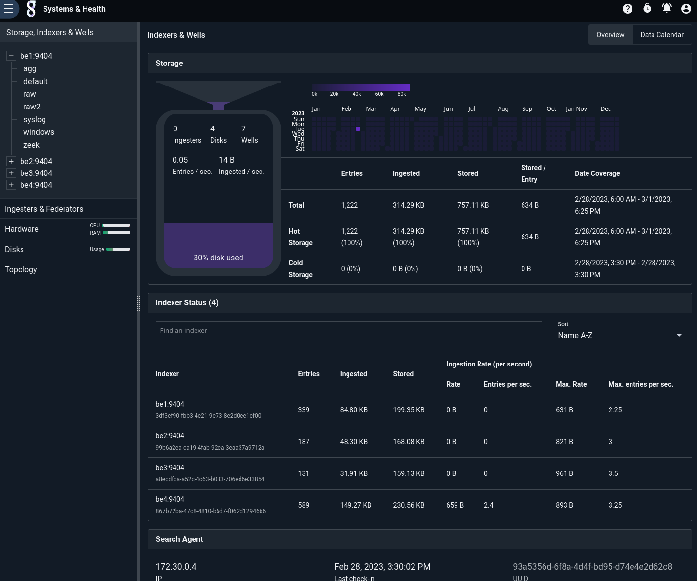
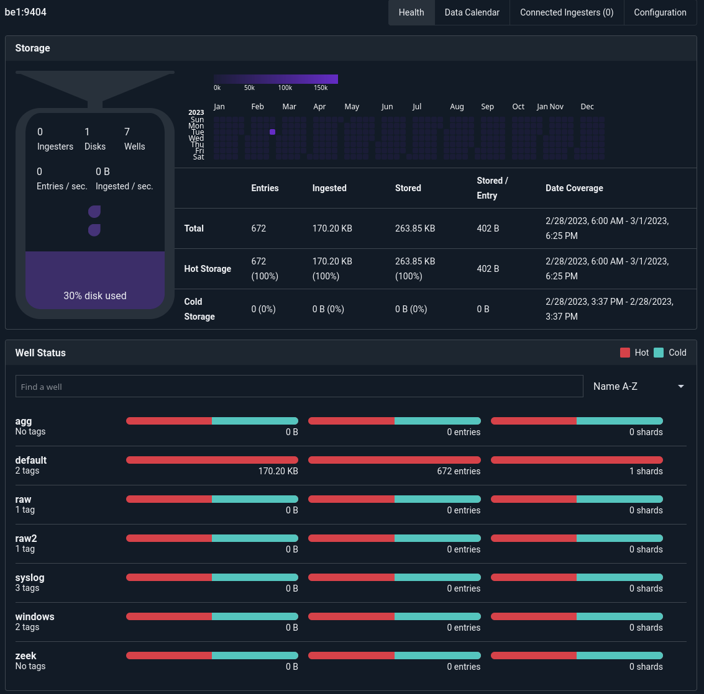
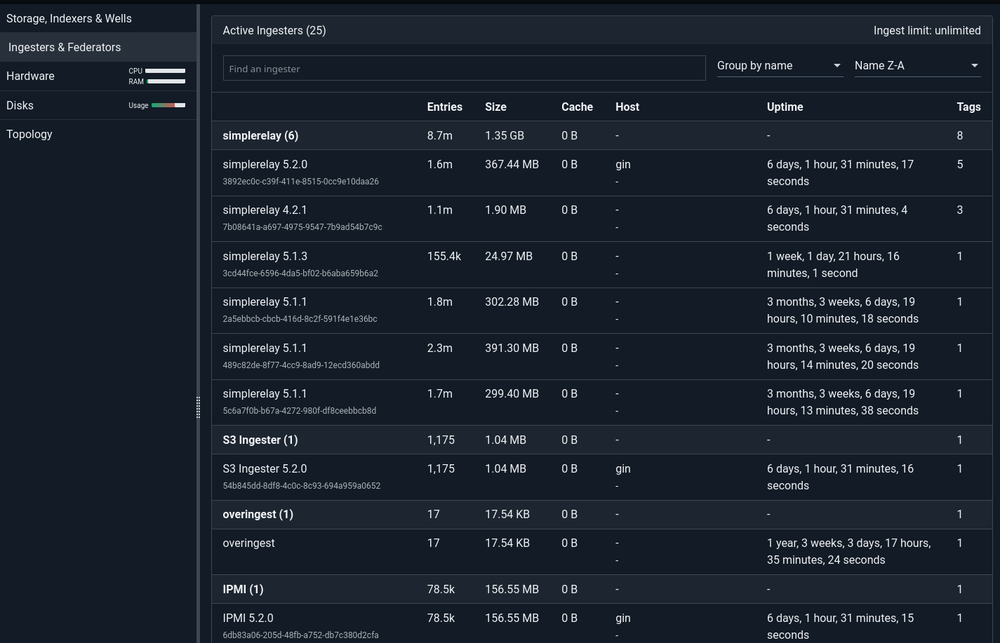
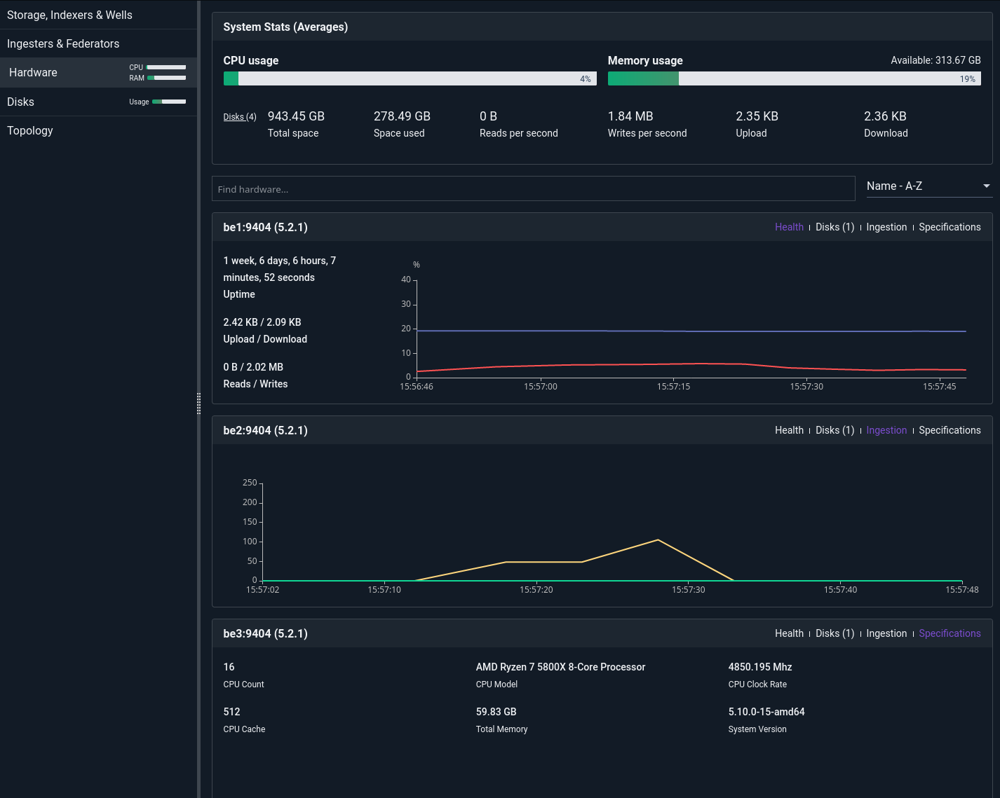
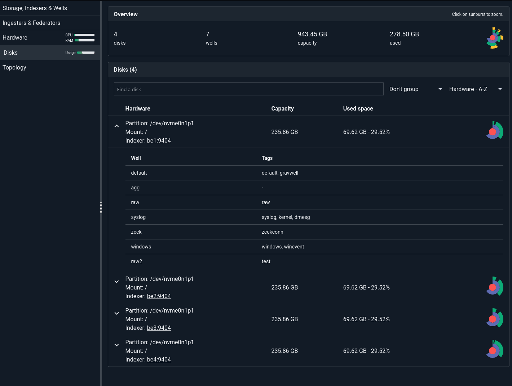
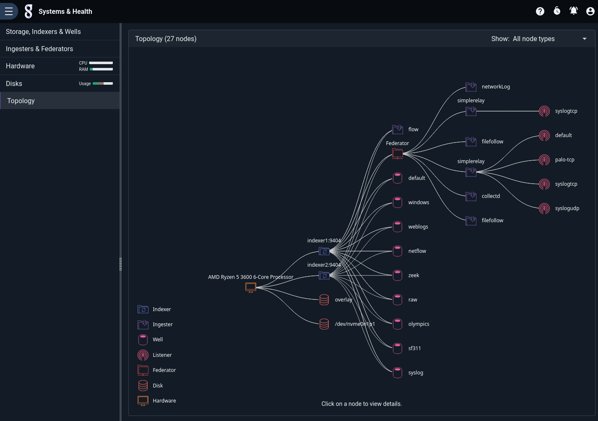

# Systems & Health Menu

The Systems & Health sub-menu contains pages which describe the current state of the Gravwell cluster.

## Storage, Indexers, & Wells

This page shows information about the data stored in the indexers of the Gravwell system.

The Storage section shows a summary of how much data is in the system, with separate stats for hot and cold storage. The "dropper" graphic indicates how fast new entries are entering the system.

At the bottom of the page, the Search Agent section shows information about the search agent component and when it last "checked in".

The Indexer Status section shows how much data is on each indexer and how quickly each is ingesting new data. If you see that one indexer has much less data than the others, you may need to investigate your ingester configs to make sure they are configured to use *all* indexers. Clicking on an indexer in this section, or clicking on it in the left-hand menu, will open a page which displays more detailed information specific to that indexer:

## Ingesters & Federators

This page shows information about ingesters. The ingester list is searchable and sortable. Ingesters which have connected via Federators will appear in this page, as will the Federators themselves; be aware that entry/byte counts for Federators are the sum of counts from all ingesters connected to them.

## Hardware

The Hardware page shows information about the individual computers which make up the Gravwell cluster. At the top of the page is information about cluster-wide CPU and memory usage, ingest rates, etc.; below are individual "cards" for each indexer (be1, be2, be3):

Each card has several different display options, selected via the links in the upper-right corner of each card. "Health" shows uptime, CPU and memory usage, and network/disk read & write stats. "Ingestion" shows the rate at which new entries are being ingested into that particular indexer. "Specifications" shows system specs for the hardware. "Disks" shows information about the storage on the system, but in general that information is more conveniently viewed on the Disks page.

## Disks

The Disks page contains information about disk storage on the cluster. Only disks which contain Gravwell data will be displayed, to avoid clutter. In the screenshot below, the root disk of indexer `be1` has been expanded to show the wells contained in Gravwell's storage area on that disk.

## Topology

The Topology page shows how indexers and ingesters are connected.

Note how both indexer1 and indexer2 connect to the same set of wells. This means that the same wells are defined on each indexer. Note also that the "flow" ingester is connected directly to the ingesters, while the others connect via a Federator.
