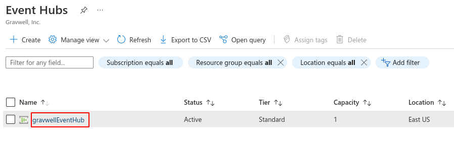
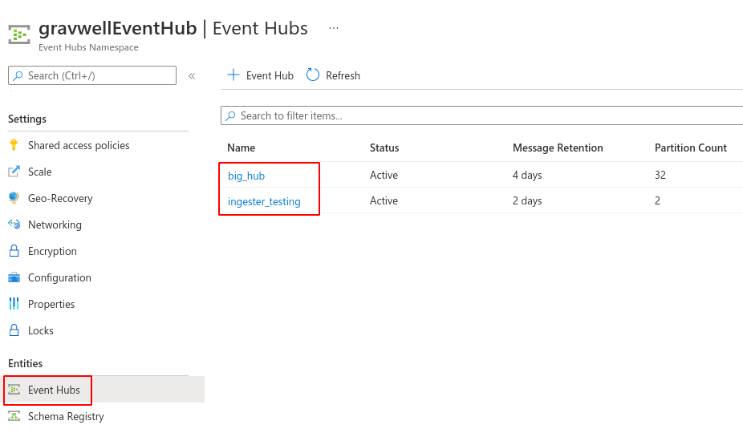
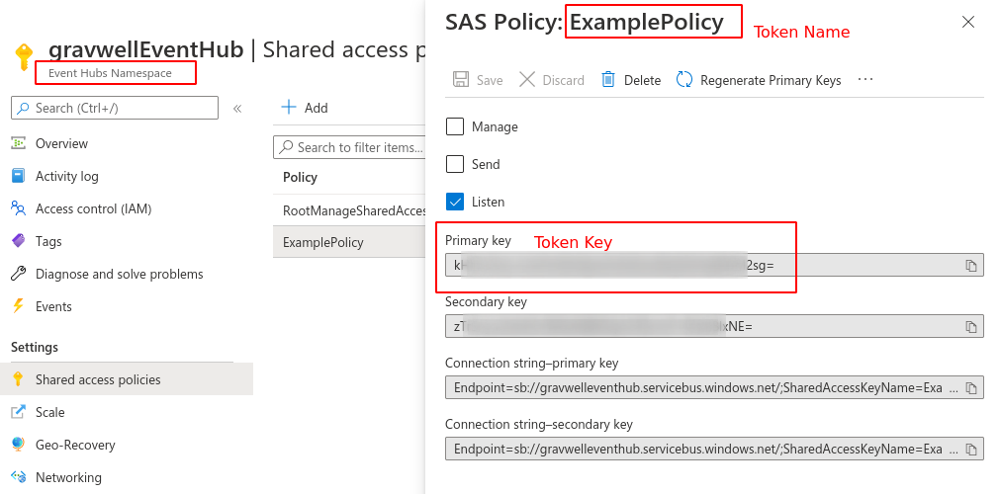
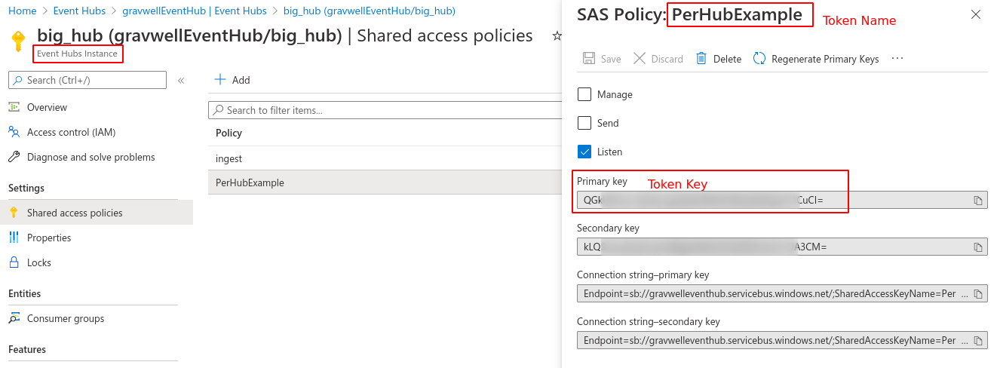

# Azure Event Hubs Ingester

The Azure Event Hubs Ingester pulls events from Microsoft Azure's [Event Hubs](https://docs.microsoft.com/en-us/azure/event-hubs/event-hubs-about), a "big data streaming platform". We take care to track which events have been ingested from each hub, to avoid double-ingest. When configuring a hub for the first time, you may chose to have the ingester consume all events currently in the hub first, or to have it only consume newly-created events.

## Basic Configuration

The Event Hubs ingester uses the unified global configuration block described in the [ingester section](#!ingesters/ingesters.md#Global_Configuration_Parameters).  Like most other Gravwell ingesters, SQS supports multiple upstream indexers, TLS, cleartext, and named pipe connections, a local cache, and local logging.

The configuration file is located in `/opt/gravwell/etc/azure_event_hubs.conf`. There is also a directory, `/opt/gravwell/etc/azure_event_hubs.conf.d`, into which additional configuration files may be dropped; this is a convenient way to manage individual Event Hub configurations, rather than maintaining one large config file.

## Event Hub Configuration

In order to consume events from an Event Hub, you will need the following pieces of information:

* The name of the *Namespace* in which the Event Hub exists.
* The name of the *Event Hub* itself.
* The name of the Shared Access Policy token to use for authentication.
* The primary key of the Shared Access Policy token to use for authentication.

The Event Hubs Namespace is a grouping which contains your Event Hubs. When the Event Hubs page is first opened within the Azure portal, the names listed are *Namespaces*; in the screenshot below, there is a single Namespace named "gravwellEventHub":



Selecting the Namespace, you may then select the "Event Hubs" option to see a list of Event Hub names; in the screenshot below, there are two hubs named "big_hub" and "ingester_testing":



The Shared Access Policy token is used to authenticate with Azure. Each token has a name and a key. Tokens may be defined at the Namespace level, giving access to all Event Hubs in the Namespace:



Or a token may be defined for a single Event Hub:



Having gathered these four essential pieces of information, you may populate an EventHub block in the configuration file:

```
[EventHub "my_hub"]
	Event-Hubs-Namespace=gravwellEventHub
	Event-Hub=ingester_testing	# the pubsub topic you want to ingest from
	Token-Name=ExamplePolicy
	Token-Key=`kND0cTMvV/gpTf0wkIgcquaHPonL7VWIkrtrB1HA2sg=`
	Tag-Name=eventhubs_ingester_testing
```

This will fetch entries from the `ingester_testing` Hub in the `gravwellEventHub` Namespace, using the `ExamplePolicy` token (the token value shown here is random nonsense, please don't attempt to use it). The data fetched from the Event Hub will be ingested into a Gravwell tag named `eventhubs_ingester_testing`.

By default, the ingester will start fetching data from the oldest available entry and move forward. If you wish to only ingest *new* data created after the ingester starts, see the `Initial-Checkpoint` parameter in the next section.

## Event Hub Configuration Parameters

This section describes which parameters are valid for use in an `EventHub` configuration block.

The following parameters are required:

* `Event-Hubs-Namespace`, string: the Event Hubs Namespace which contains the desired Event Hub.
* `Event-Hub`, string: the name of the Event Hub to ingest from.
* `Token-Name`, string: the name of the Shared Access Policy token to use.
* `Token-Key`, string: the primary key of the desired Shared Access Policy token.
* `Tag-Name`, string: the Gravwell tag into which entries should be ingested.

The following optional parameters modify how data is read from the Event Hub:

* `Consumer-Group`, string (default "$Default"): sets an Event Hubs consumer group to use when reading data. The default consumer group used is "$Default".
* `Initial-Checkpoint`, string (default "start"): set to "start" to read all entries from the beginning of the Event Hub stream. Set to "end" to only read new entries which are created *after* the ingester starts.

The following optional parameters modify how the Timestamp field is set for entries:

* `Parse-Time`, boolean (default false): if set to true, the ingester will attempt to extract a timestamp from the *body* of each event read from the Event Hub. By default, the timestamp is instead read from the `EnqueuedTime` property on the event.
* `Timezone-Override`, string: if set to a string such as "America/Chicago", the ingester will use the specified timezone when attempting to extract timestamps from event bodies, rather than assuming UTC. This is useful when parsing timestamps which do not specify a UTC offset explicitly. Note that this parameter has no effect if `Parse-Time` is false!
* `Assume-Local-Timezone`, boolean: if set to true, the ingester will use the system timezone when extracting timestamps from event bodies, rather than assuming UTC. Note that this parameter has no effect if `Parse-Time` is false!

Each EventHub configuration block may also specify one or more `Preprocessor` parameters to invoke [Gravwell ingest proprocessors](#!ingesters/preprocessors/preprocessors.md) as needed.