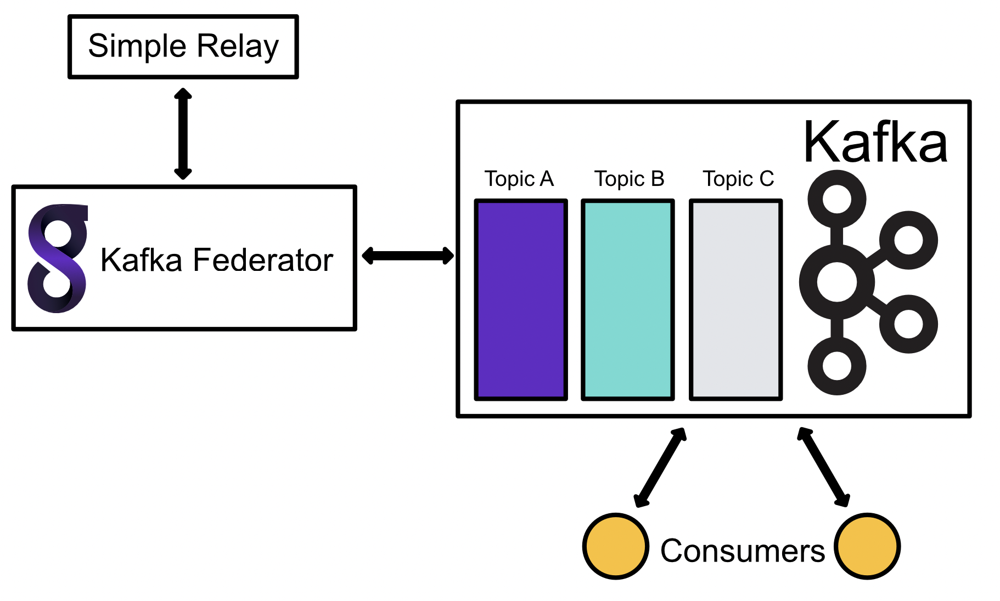

---
myst:
  substitutions:
    package: "gravwell-kafka-federator"
    standalone: "gravwell_kafka_federator"
    dockername: "kafka_federator"
---
# Kafka Federator

Gravwell also provides a Kafka Federator, that behaves exactly like the Federator, except that it uses Kafka as an upstream transport. Ingesters can connect to it just as with Federator, and ingested entries will be put into Kafka Topics as messages. 



The Kafka Federator can be paired with the [Kafka Consumer](/ingesters/kafka) to read messages from a topic and ingest them into a Gravwell indexer.

## Installation

```{include} ../installation_instructions_template.md 
```

## Configuration

Kafka Federator defines listeners and Kafka headers. A listener is similar to a Federator listener, in which ingesters may connect and send entries. Listeners also define what topic to publish messages on. A header sets arbitrary key value pairs in the generated Kafka header. 

Additionally, the global section defines a group leader to connect to and a partition.  Because the Kafka Federator is designed to send data to a Kafka broker rather than a Gravwell indexer, the `[Global]` section of the configuration file is different than typical Gravwell ingesters.  The following configuration parameters are available in the `[Global]` section:


| Configuration Parameter | Description | Required |
|----------|-------------|------|
| Leader | Host:Port that specifies a Kafka broker leader to connect to | X |
| Partition | Partition ID | Defaults to 0 |
| Enable-Gravwell-Tag | Enables the internal Gravwell tag logging through Kafka | |
| Gravwell-Tag-Topic | Specifies the topic to send Gravwell tag entries | Required when Enable-Gravwell-Tag=true |
| Timeout | Timeout when connecting to Kafka and sending values | Defaults to 1 second |
| Log-File | Specify log file for status and error logs | |
| Log-Level | Logging level | |
| Entry-Buffer-Len | Set the internal memory buffer for relaying entries | |
| Cache-Depth | Specify how many entries can be kept in flight before a forced flush | |
| Cache-Mode | Set the caching strategy | |
| Ingest-Cache-Path | Specify the cache storage location | |
| Max-Ingest-Cache | Specify the maximum disk available for a local cache | |
| Use-TLS | Enable TLS when connecting to Kafka | |
| Insecure-Skip-TLS-Verify | Allow invalid certificates when connecting via TLS (INSECURE) | |
| Auth-Type | Enable SASL authentication and specify the mechanism | |
| Username | Specify username for Kafka SASL authentication | |
| Password | Specify password for Kafka SASL authentication | |


### Authentication

The Kafka Federator supports the following SASL authentication mechanisms: `PLAIN`, `SCRAMSHA256`, and `SCRAMSHA512`.  To enable authentication set the `Auth-Type` configuration parameter to the desired authentication type and provide a `Username` and `Password`.  The following is a valid configuration snippet from the `[Global]` section of a Kafka Federator that is configured to use plaintext authentication:

```
[Global]
	Auth-Type=plain
	Username=TheDude
	Password="a super secret password"
```

Valid `Auth-Type` options are `plain`, `scramsha256`, and `scramsha512`.

### Headers

The Kafka Federator supports the ability to set headers in Kafka Messages.  Headers can either be derived from entries using special variables or static values.  This can be useful when the Federator may be feeding non-Gravwell endpoints like Splunk.

Headers are enabled by creating a `KafkaHeaders` configuration and then enabling it in an ingest listener using the `Kafka-Header-Set` configuration parameter.  For example we might want to set a static header value to assist with downstream routing as well as the source  and tag.  The configuration for the `KafkaHeaders` would look like so:

```
[KafkaHeaders "routingheaders"]
	source=$SRC
	gravwelltag=$TAG
	routeid="business network"
```

When enabled on a listener this configuration will attach three header values to each message in Kafka.  The `source` and `gravwelltag` headers will extract their values from the Gravwell entries, creating text representations of the source and tag, the `routeid` value is a static string "business network" which might be useful for a consumer looking to attach metadata to entries.  The entry timestamp attached to Gravwell entries is always copied to the Kafka value.


Kafka headers can be populated with special variables, as shown in the example above.

| Variable | Description |
|----------|-------------|
| $TAG | The entry tag |
| $SRC | The entry source |

## Example

This example generates a single listener that allows tags "windows" and "syslog". Messages are published to the "testing" Kafka topic. A header is also defined that sets several key/value pairs. Note that the special `$TAG`, `$SRC` values are available for use in setting values in a Kafka header. 

```
[Global]
	Leader=10.10.0.1:9092
	Partition=0
	Log-Level=INFO
	Log-File=/opt/gravwell/log/kafka_federator.log

[IngestListener "enclaveA"]
	Ingest-Secret = CustomSecrets
	Cleartext-Bind = 0.0.0.0:4423
	Tags=windows
	Tags=syslog
	Topic=testing
	Kafka-Header-Set=headers

[KafkaHeaders "headers"]
	TAG=$TAG
	SRC=$SRC
	source=$SRC
	foo=bar
```
