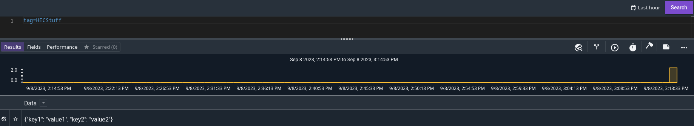
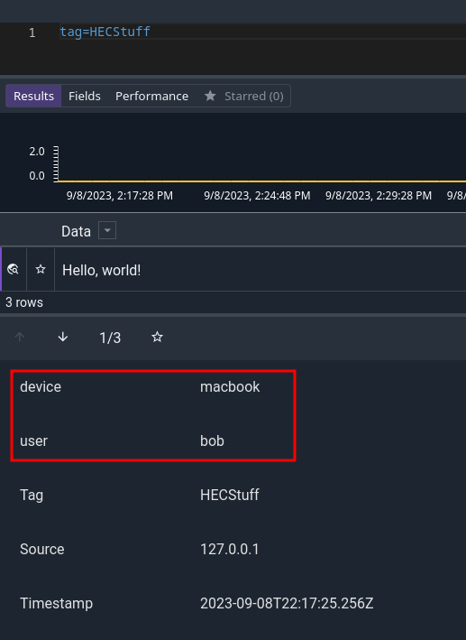
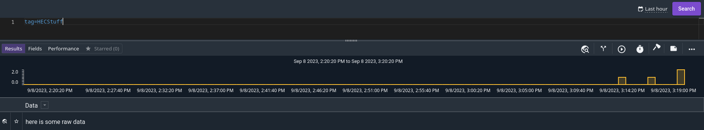
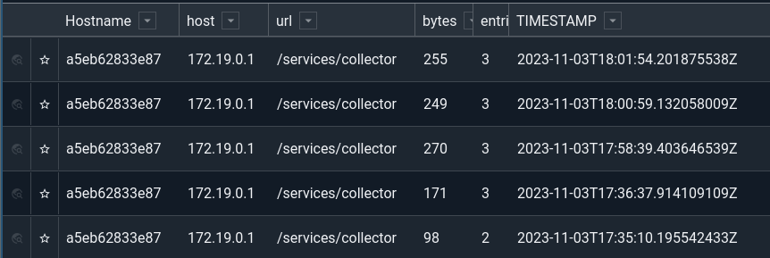

---
myst:
  substitutions:
    package: "gravwell-http-ingester"
    standalone: "gravwell_http_ingester"
    dockername: "http_ingester"
---
# HTTP

The HTTP ingester sets up HTTP listeners on one or more paths. If an HTTP request is sent to one of those paths, the request's Body will be ingested as a single entry.

This is an extremely convenient method for scriptable data ingest, since the `curl` command makes it easy to do a POST request using standard input as the body.

## Installation

```{include} installation_instructions_template 
```

## Basic Configuration

The HTTP ingester uses the unified global configuration block described in the [ingester section](ingesters_global_configuration_parameters).  Like most other Gravwell ingesters, the HTTP ingester supports multiple upstream indexers, TLS, cleartext, and named pipe connections, a local cache, and local logging.

The configuration file is at `/opt/gravwell/etc/gravwell_http_ingester.conf`. The ingester will also read configuration snippets from its [configuration overlay directory](configuration_overlays) (`/opt/gravwell/etc/gravwell_http_ingester.conf.d`).

### Additional Global Configuration Parameters

| Config Parameter          | Type         | Required | Default Value   | Description                         |
|---------------------------|--------------|----------|-----------------|-------------------------------------|
| Bind                      | string       | yes      |                 | Host:Port pair specifying HTTP server bind. |
| Health-Check-URL          | string       | no       |                 | An optional URL that provides unauthenticated ingester health check status. |

### Resource Controls Configuration

The HTTP ingester is designed to handle many connections and concurrent requests. A single, moderately-capable system can happily service 100k requests per second spread across many hundreds of connections.  However, no system can service an infinite number of connections nor an infinite number of concurrent requests.  The HTTP Ingester has a safety system designed to prevent overwhelming the host by limiting the number of active connections and concurrent HTTP requests.


| Config Parameter          | Type         | Required | Default Value   | Description                         |
|---------------------------|--------------|----------|-----------------|-------------------------------------|
| Max-Body                  | integer      | no       | 4194304 (4MB)   | Maximum size of a request body in a single ingest request.  A low default of 4MB is used to prevent extremely large uploads from exhausting resources. |
| Max-Connections           | integer      | no       | 10240           | Maximum number of active connections. Once the maximum is reached, new connections will be queued and accepted as existing connections terminate. |
| Max-Concurrent-Requests   | integer      | no       | 16384           | Maximum number of concurrent HTTP requests for all connections.  System will return HTTP code 429 (Too Many Requests) until the number of active requests is reduced. |

Maximum connection and/or maximum concurrent request controls can be disabled by setting the configuration parameter to `-1`, which effectively allows for unlimited connections or unlimited concurrent requests.

A request is only concurrent if it is actively being handled, setting `Max-Concurrent-Requests=10` may still allow for hundreds of thousands of requests per second if only a few clients are sending requests and each client is completing a single request at a time.


## Listener Examples

In addition to the universal configuration parameters used by all ingesters, the HTTP POST ingester has two additional global configuration parameters that control the behavior of the embedded webserver.  The first configuration parameter is the `Bind` option, which specifies the interface and port that the webserver listens on.  The second is the `Max-Body` parameter, which controls how large of a POST the webserver will allow.  The Max-Body parameter is a good safety net to prevent rogue processes from attempting to upload very large files into your Gravwell instance as a single entry.  Gravwell can support up to 1GB as a single entry, but we wouldn't recommend it.

Multiple "Listener" definitions can be defined allowing specific URLs to send entries to specific tags. 

```
 Example using basic authentication
[Listener "basicAuthExample"]
	URL="/basic"
	Tag-Name=basic
	AuthType=basic
	Username=user1
	Password=pass1

[Listener "jwtAuthExample"]
	URL="/jwt"
	Tag-Name=jwt
	AuthType=jwt
	LoginURL="/jwt/login"
	Username=user1
	Password=pass1
	Method=PUT # alternate method, data is still expected in the body of the request

[Listener "cookieAuthExample"]
	URL="/cookie"
	Tag-Name=cookie
	AuthType=cookie
	LoginURL="/cookie/login"
	Username=user1
	Password=pass1
	Method=PUT # alternate method, data is still expected in the body of the request

[Listener "presharedTokenAuthExample"]
	URL="/preshared/token"
	Tag-Name=pretoken
	AuthType="preshared-token"
	TokenName=Gravwell
	TokenValue=Secret

[Listener "presharedTokenAuthExample"]
	URL="/preshared/param"
	Tag-Name=preparam
	AuthType="preshared-parameter"
	TokenName=Gravwell
	TokenValue=Secret
```

## Configuring HTTPS

By default the HTTP Ingester runs a cleartext HTTP server, but it can be configured to run an HTTPS server using x509 TLS certificates.  To configure the HTTP Ingester as an HTTPS server provide a certificate and key PEM files in the Global configuration space using the `TLS-Certificate-File` and `TLS-Key-File` parameters.

```{note}
The Amazon-Firehose-Listener type requires the use of HTTPS.
```

An example global configuration with HTTPS enabled might look like the following:

```
[Global]
	TLS-Certificate-File=/opt/gravwell/etc/cert.pem
	TLS-Key-File=/opt/gravwell/etc/key.pem
```

### Listener Configuration Options

Listener configuration blocks (except the Amazon-Firehose-Listener) support the following configuration parameters:


| Parameter                 | Type         | Required | Default Value                | Description                         |
|---------------------------|--------------|----------|------------------------------|-------------------------------------|
| URL                       | string       | YES      |            | Endpoint URL to handle requests. |
| Method                    | string       | NO       | `POST``  | HTTP method for requests. |
| Tag-Name                  | string       | YES      |                              | Tag assigned to entries received by the endpoint. |
| Multiline                 | boolean      | NO       | false                        | Treat request body as a multiline file and process each line as an individual entry. |
| Ignore-Timestamps         | boolean      | NO       | false                        | Do not extract or process timestamps, use current time. |
| Assume-Local-Timezone     | boolean      | NO       | false                        | Assume local timezone on timestamps without a specified timezone. |
| Timezone-Override         | string       | NO       |  | Specify a specific timezone to attach to entries if the derived timestamp does not contain a timezone. |
| Timestamp-Format-Override | string       | NO       |    | Force timestamp processing to look for a specific timestamp format. |
| AuthType                  | string       | NO       | none | Specify authentication type (basic, jwt, cookie, etc...). |
| Username                  | string       | NO       |      | Username credential, required when using cookie, basic, or JWT based authentication methods. |
| Password                  | string       | NO       |      | Password credential, required when using cookie, basic, or JWT based authentication methods. |
| LoginURL                  | string       | NO       |      | Specify login URL when performing cookie or JWT based authentication.  Required when using login based authentication methods. |
| TokenName                 | string       | NO       |      | Authorization token name, required when using preshared-token or preshared-parameter authentication method.|
| TokenValue                | string       | NO       |      | Authorization token value, required when using preshared-token or preshared-parameter authentication method.|
| Preprocessor              | string array | NO       |      | Set of preprocessors to apply to entries. |
| Attach-URL-Parameter      | string array | NO       |      | Set of URL parameter values that will be attached to all entries in a request if they are found in the request URL. |

### Listener Authentication

Each HTTP Ingester listener can be configured to enforce authentication.  The supported authentication methods are:

* none
* basic
* jwt
* cookie
* preshared-token
* preshared-parameter

When specifying an authentication system other than none credentials must be provided.  The `jwt` and `cookie` and cookie authentication systems require a username and password while the `preshared-token` and `preshared-parameter` must provide a token value and optional token name.

```{warning}
Like any other webpage, authentication is NOT SECURE over cleartext connections and attackers that can sniff traffic can capture tokens and cookies.
```

### No Authentication

The default authentication method is none, allowing anyone that can reach the ingester to push entries.  The `basic` authentication mechanism uses HTTP Basic authentication, where a username and password is base64 encoded and sent with every request.

Here is an example listener using the basic authentication system:

```
[Listener "basicauth"]
	URL="/basic/data"
	Tag-Name=stuff
	AuthType=basic
	Username=secretuser
	Password=secretpassword
```

An example curl command to send an entry with basic authentication might look like:

```
curl -d "only i can say hi" --user secretuser:secretpassword -X POST http://10.0.0.1:8080/basic/data
```

### JWT Authentication

The JWT authentication system uses a cryptographically signed token for authentication.  When using jwt authentication you must specify an Login URL where clients will authenticate and receive a token which must then be sent with each request.  The jwt tokens expire after 48 hours.  Authentication is performed by sending a `POST` request to the login URL with the `username` and `password` form fields populated.

Authenticating with the HTTP ingester using jwt authentication is a two step process and requires an additional configuration parameter.  Here is an example configuration:

```
[Listener "jwtauth"]
	URL="/jwt/data"
	LoginURL="/jwt/login"
	Tag-Name=stuff
	AuthType=auth
	Username=user1
	Password=pass1
```

Sending entries requires that endpoints first authenticate to obtain a token, the token can then be reused for up to 48 hours.  If a request receives a 401 response, clients should re-authenticate.  Here is an example using curl to authenticate and then push data.

```
x=$(curl -X POST -d "username=user1&password=pass1" http://127.0.0.1:8080/jwt/login) #grab the token and stuff it into a variable
curl -X POST -H "Authorization: Bearer $x" -d "this is a test using JWT auth" http://127.0.0.1:8080/jwt/data #send the request with the token
```

### Cookie Authentication

The cookie authentication system is virtually identical to JWT authentication other than the method of controlling state.  Listeners that use cookie authentication require that a client login with a username and password to acquire a cookie which is set by the login page.  Subsequent requests to the ingest URL must provide the cookie in each request.

Here is an example configuration block:

```
[Listener "cookieauth"]
	URL="/cookie/data"
	LoginURL="/cookie/login"
	Tag-Name=stuff
	AuthType=basic
	Username=secretuser
	Password=secretpassword
```

An example set of curl commands that login and retrieve the cookie before ingesting some data might look like:

```
curl -c /tmp/cookie.txt -d "username=user1&password=pass1" localhost:8080/cookie/login
curl -X POST -c /tmp/cookie.txt -b /tmp/cookie.txt -d "this is a cookie data" localhost:8080/cookie/data
```

### Preshared Token

The Preshared token authentication mechanism uses a preshared secret rather than a login mechanism.  The preshared secret is expected to be sent with each request in an Authorization header.  Many HTTP frameworks expect this type of ingest, such as the Splunk HEC and supporting AWS Kinesis and Lambda infrastructure.  Using a preshared token listener we can define a capture system that is a plugin replacement for Splunk HEC.

```{note}
If you do not define a `TokenName` value, the default value of `Bearer` will be used.
```

An example configuration which defines a preshared token:

```
[Listener "presharedtoken"]
	URL="/preshared/token/data"
	Tag-name=token
	AuthType="preshared-token"
	TokenName=foo
	TokenValue=barbaz
```

An example curl command the sends data using the preshared secret:

```
curl -X POST -H "Authorization: foo barbaz" -d "this is a preshared token" localhost:8080/preshared/token/data
```

### Preshared Parameter

The Preshared Parameter authentication mechanism uses a preshared secret that is provided as a query parameter.  The `preshared-parameter` system can be useful when scripting or using data producers that typically do not support authentication by embedding the authentication token into the URL.

```{note}
Embedding the authentication token into the URL means the proxies and HTTP logging infrastructure may capture and log authentication tokens.
```

An example configuration which defines a preshared parameter:

```
[Listener "presharedtoken"]
	URL="/preshared/parameter/data"
	Tag-name=token
	AuthType="preshared-parameter"
	TokenName=foo
	TokenValue=barbaz
```

An example curl command the sends data using the preshared secret:

```
curl -X POST -d "this is a preshared parameter" localhost:8080/preshared/parameter/data?foo=barbaz
```

## Listener Methods

The HTTP Ingester can be configured to use virtually any method, but data is always expected to be in the body of the request.

For example, here is a Listener configuration that expects the PUT method:

```
[Listener "test"]
	URL="/data"
	Method=PUT
	Tag-Name=stuff
```

The corresponding curl command would be:

```
curl -X PUT -d "this is a test 2 using basic auth" http://127.0.0.1:8080/data
```

The HTTP Ingester can go out of spec on methods, accepting almost any ASCII string that does not contain special characters.

```
[Listener "test"]
	URL="/data"
	Method=SUPER_SECRET_METHOD
	Tag-Name=stuff
```

```
curl -X SUPER_SECRET_METHOD -d "this is a test 2 using basic auth" http://127.0.0.1:8080/data
```

## Splunk HEC Compatibility

The HTTP ingester supports a listener block that is API compatible with the Splunk HTTP Event Collector.  This special listener block enables a simplified configuration so that any endpoint that can send data to the Splunk HEC can also send to the Gravwell HTTP Ingester.  The HEC compatible configuration block looks like so:

```
[HEC-Compatible-Listener "testing"]
	URL="/services/collector"
	TokenValue="thisisyourtoken"
	Tag-Name=HECStuff
```

The `HEC-Compatible-Listener` block requires the `TokenValue` and `Tag-Name` configuration items. If the `URL` configuration item is omitted, it will default to `/services/collector`.

Both `Listener` and `HEC-Compatible-Listener` configuration blocks can be specified on the same HTTP ingester.

The `HEC-Compatible-Listener` supports the following configuration parameters:

| Parameter          | Type         | Required | Default Value         | Description                                                 |
|--------------------|--------------|----------|-----------------------|-------------------------------------------------------------|
| URL                | string       | NO       | `/services/collector` | Endpoint URL for Splunk events.                             |
| TokenValue         | string       | YES      |                       | Authentication Token.                                       |
| Tag-Name           | string       | YES      |                       | Tag assigned to entries received by the endpoint.           |
| Ignore-Timestamps  | boolean      | NO       | false                 | Do not extract or process timestamps, use current time.     |
| Ack                | boolean      | NO       | false                 | Acknowledge receipt and respond with entry IDs.             |
| Max-Size           | unsigned int | NO       | 524288 (512k)         | Maximum size for each decoded entry.                        |
| Tag-Match          | string array | NO       |                       | Sourcetype value to tag mapping, multiple can be specified. |
| Routed-Token-Value | string array | NO       |                       | Token value used for authentication and tag routing.        |
| Debug-Posts        | boolean      | NO       | false                 | Emit additional debugging info on the gravwell tag for each POST. |
| Preprocessor       | string array | NO       |                       | Set of preprocessors to apply to entries.                   |
| Attach-URL-Parameter | string array | NO     |      | Set of URL parameter values that will be attached to all entries in a request if they are found in the request URL. |
| Token-Name         | string       | NO       |                       | Optional override of authentication token name, default is "Splunk". |

### Using the HEC-Compatible Listener

A `HEC-Compatible-Listener` should work with all the examples shown in the [Splunk documentation](https://docs.splunk.com/Documentation/Splunk/9.0.3/Data/HECExamples). The body of your request should be a JSON structure with the desired contents of the entry's DATA field in `event`:

```
curl "http://example.org/services/collector" -H "Authorization: Splunk thisisyourtoken" \
-d '{"event": {"key1": "value1", "key2": "value2"}}'
```



You can attach intrinsic enumerated values by setting the `fields` value of the body too:

```
curl "http://example.org/services/collector" -H "Authorization: Splunk thisisyourtoken" \
-d '{"event": "Hello, world!", "fields": {"device": "macbook", "user": "bob"}}'
```



You can also send raw strings, rather than JSON-formatted events, by appending `/raw` to the URL:

```
curl "http://example.org/services/collector/raw" -H "Authorization: Splunk thisisyourtoken" \
-d 'here is some raw data'
```



The listener supports gzip-encoded data, too:

```
echo '{"event": "Hello, world!", "fields": {"device": "macbook", "user": "bob"}}' \
| gzip \
| curl "http://example.org/services/collector" -H "Authorization: Splunk thisisyourtoken" \
--data-binary @- -H "Content-Encoding: gzip"
```

#### Sending Multiple Entries

Each of the HEC endpoints support sending multiple entries in a single request; batching up multiple entries in a single request is dramatically more efficient than one entry per request.

The structured data endpoints can specify a sourcetype value which will be applied to the `Tag-Match` config parameter; if a match is found, a new tag is applied.  The raw endpoints can provide a sourcetype as a query parameter, or a direct tag value can be provided to bypass the sourcetype translations entirely and explicitly specify the tag.

This curl command shows sending several structured entries to the structured endpoint:

```
curl --http1.1 -X POST -v http://example.gravwell.io/services/collector/event \
    -H "Authorization: Splunk thisisyourtoken" -d '
    {"event": "Hello, this is a structured event"}
    {"event": "Hello, this is another structured event"}
    {"event": "Hello, this is yet another structured event"}'
```

This curl command shows sending several entries to the raw endpoint:

```
curl --http1.1 -X POST -v http://example.gravwell.io/services/collector/raw \
    -H "Authorization: Splunk thisisyourtoken" -d '
    hello, welcome to raw #1
    hello, welcome to raw #2
    hello, welcome to raw #3'
```


The following curl commands show sending several entries to the raw endpoint and providing a sourcetype and tag as a query parameter.

Override the sourcetype to use the Tag-Match parameter:
```
curl --http1.1 -X POST -v http://example.gravwell.io/services/collector/raw?sourcetype=foobar \
    -H "Authorization: Splunk thisisyourtoken" -d '
    hello, welcome to raw #1
    hello, welcome to raw #2
    hello, welcome to raw #3'
```

Override the tag value directly:
```
curl --http1.1 -X POST -v http://example.gravwell.io/services/collector/raw?tag=testing \
    -H "Authorization: Splunk thisisyourtoken" -d '
    hello, welcome to raw #1
    hello, welcome to raw #2
    hello, welcome to raw #3'
```

This curl command shows sending several entries to the structured endpoint with a default tag and setting specific entry sourcetypes:

```
curl --http1.1 -X POST -v http://example.gravwell.io/services/collector \
    -H "Authorization: Splunk thisisyourtoken" -d '
    {"event": "invalid sourcetype things", "sourcetype": "things", "time": 1699034250}
    {"time": 1699034251, "sourcetype": "stuff", "event": "valid sourcetype stuff"}
    {"time": 1699034252, "event": "no sourcetype, use default"}'
```

#### Tag-Match

By specifying one or more Sourcetype:Tag pairs with the Tag-Match configuration option, the HEC-Compatible listener can route events to specific tags by a named source type. 

For example, to route all Sourcetype "foo" events to the tag "bar":

```
Tag-Match=foo:bar
```

Multiple Tag-Match pairs can be given:

```
Tag-Match="foo:bar"
Tag-Match=`ping:pong`
Tag-Match=`"look:mom:i:have:colons":look_mom_i_have_no_colons`
```

```{note}
Some characters that are supported in a Splunk sourcetype are not supported in a Gravwell tag. If you need to specify a sourcetype with special characters, surround the Tag-Match argument in backticks to specify a raw string and surround the sourcetype in double quotes.
```

#### Tag-Override

The HEC compatible routes also support a direct tag override by specifying a tag string in the request URL.  Regardless of defined route, requests can specify a default destination tag by setting a URL parameter named `tag`.  If a specified tag is invalid or not allowed for the ingester, the request will fail with a 400 error.

The `tag` parameter only sets the default; structured entries that contain a `sourcetype` value will still attempt a lookup against the `Tag-Match` values.  Consider the following configuration and requests:

```
[HEC-Compatible-Listener "testing"]
	URL="/services/collector"
	TokenValue="thisisyourtoken"
	Tag-Name=stuff
	Tag-Match="foo:bar"
```

```
curl -X POST -v http://example.gravwell.io/services/collector?tag=testing \
    -H "Authorization: Splunk thisisyourtoken" -d '
    {"event": "invalid sourcetype things", "sourcetype": "things", "time": 1699034250}
    {"time": 1699034251, "sourcetype": "foo", "event": "valid sourcetype foo"}
    {"time": 1699034252, "event": "no sourcetype, use default"}'
```

The resulting entries will have the following tags:

| TAG     | DATA    |
|---------|---------|
| testing | `invalid sourcetype things` |
| bar     | `valid sourcetype foo` |
| testing | `no sourcetype, use default` |


#### Routed-Token-Value

The HEC compatible routes support routing data to a specific tag based on the authentication token used; this can be especially useful for third-party systems that do not support altering the default HEC URL.  A `Routed-Token-Value` enables multiple data sources to use the same HEC URL and still be routed to the appropriate tag even if the data producer is not providing sourcetype values in the request.  A `Routed-Token-Value` is used in the exact same way as a traditional HEC token when performing authentication; the HTTP HEC handler will determine the appropriate tag if no other overrides are present.  It is valid to combine a `Routed-Token-Value` with sourcetype overrides on specific entries and a default `TokenValue` is not required if at lease one `Routed-Token-Value` is specified.

Consider the following configuration:

```
[HEC-Compatible-Listener "testing"]
	URL="/services/collector"
	TokenValue="thisisyourtoken"
	Tag-Name=stuff
	Tag-Match="foo:bar"
        Routed-Token-Value="supersekrettoken:baz"
```

Given the following curl request:
```
curl -X POST -v http://example.gravwell.io/services/collector \
    -H "Authorization: Splunk supersekrettoken" -d '
    {"event": "invalid sourcetype things", "sourcetype": "things", "time": 1699034250}
    {"time": 1699034251, "sourcetype": "foo", "event": "valid sourcetype foo"}
    {"time": 1699034252, "event": "no sourcetype, use default"}'
```

The resulting entries will have the following tags:

| TAG     | DATA    |
|---------|---------|
| baz     | `invalid sourcetype things` |
| bar     | `valid sourcetype foo` |
| baz     | `no sourcetype, use default` |


#### Debug-Posts

The `Debug-Posts` configuration option enables additional logging on each HTTP POST request to the HTTP ingester endpoint.  Only successful transactions will be logged when using the `Debug-Posts` configuration option.  Authentication failures, structure failures, or just bad requests are logged using the existing systems.  The debug logs are sent to the `gravwell` tag.

Here is a raw log entry emitted from a HEC debug post:
```
<14>1 2023-11-03T18:01:54.201875Z example.gravwell.io httpingester - HttpIngester/hec.go:234 [gw@1 host="172.19.0.1" method="POST" url="/services/collector" bytes="255" entries="3"] HEC request
```

Generating a table of the relevant data might use the following query:

```
tag=gravwell syslog Appname==httpingester Message == "HEC request" Hostname 
  Structured[gw@1].host Structured[gw@1].url Structured[gw@1].bytes Structured[gw@1].entries
| table Hostname host url bytes entries TIMESTAMP
```




#### Token-Name

Many third party services which are designed to send data to a HEC compatible listener have been observed sending authentication tokens with various random names; the default expected authentication header structure is `Authorization: Splunk <token>`, but we have seen everything from "User" to "user_name".  The `Token-Name` configuration parameter can override the Authorization header token name so that the HEC compatible listener can still authenticate and support third party services that do not adhere to the HEC guidance.

An example curl command that would authenticate with a `Token-Name` of `foobar` and a `TokenValue` of `soopersekrit` would be:

```
curl -X POST -v http://example.gravwell.io/services/collector \
    -H "Authorization: foobar soopersekrit" -d '
    {"event": "sample event", "time": 1699034250}
```

## Amazon Firehose support

The `Amazon-Firehose-Listener` type supports the [Amazon Firehose](https://aws.amazon.com/firehose/) API. The Firehose API requires the use of HTTPS and an authentication token. 

```
[Amazon-Firehose-Listener "foo"]
	URL="/foo"
	TokenValue="thisisyourtoken" #set the access control token
	Tag-Name=bar
```

In the above example, the HTTP ingester will listen on the `/foo` path for an Amazon Firehose request, authenticated with the token "thisisyourtoken", and ingesting to tag "bar". In the AWS console, you would set the Firehose endpoint to `your.domain/foo`, and provide the same token.

The `Amazon-Firehose-Listener` supports the following configuration parameters:

| Parameter         | Type         | Required | Default Value         | Description                                                 |
|-------------------|--------------|----------|-----------------------|-------------------------------------------------------------|
| URL               | string       | YES       | | Endpoint URL for Amazon Firehose events.                             |
| TokenValue        | string       | YES      |                       | Authentication Token.                                       |
| Tag-Name          | string       | YES      |                       | Tag assigned to entries received by the endpoint.           |
| Ignore-Timestamps | boolean      | NO       | false                 | Do not extract or process timestamps, use current time.     |
| Preprocessor      | string array | NO       |                       | Set of preprocessors to apply to entries.                   |

## Health Checks

Some systems (such as AWS load-balancers) require an unauthenticated URL that can be probed and interpreted as "proof of life".  The HTTP ingester can be configured to provide a URL which will always return a 200 OK when accessed with any method, body, and/or query parameters.  To enable this health check endpoint, add the `Health-Check-URL` stanza to the Global configuration block.

Here is a minimal example configuration snippet with the health check URL `/logbot/are/you/alive`:

```
[Global]
Ingest-Secret = IngestSecrets
Connection-Timeout = 0
Pipe-Backend-Target=/opt/gravwell/comms/pipe #a named pipe connection, this should be used when ingester is on the same machine as a backend
Log-Level=INFO #options are OFF INFO WARN ERROR
Bind=":8080"
Max-Body=4096000 #about 4MB
Log-File="/opt/gravwell/log/http_ingester.log"
Health-Check-URL="/logbot/are/you/alive"

```

## Timestamp Formats

The HEC data format expects the timestamps to be Unix timestamps in seconds formatted as an integer or optionally a floating point number; the limited documentation also states that the timestamp should be encoded in the JSON object as a number.  The Gravwell HEC compatible ingester will make a best effort to extract and process timestamps generated by data providers that communicate with HEC endpoints However, if a timestamp cannot be interpreted at all, the endpoint will return a 400 response rather than attempt to process a potentially invalid timestamp.

The HEC compatible endpoint contains special processing logic for timestamps where any Unix timestamps that are approximately the zero time will be treated as "NOW" and given the timestamp of ingest.  For example, a HEC event with the timestamp of `"time": 42` will be assigned the current UTC time.

## Dynamic Configuration Reload

The HTTP ingesters supports dynamic configuration reloading for many configuration items; the ingester can dynamically reload Listener, HEC, and Amazon Firehose listener configuration blocks without restarting.  The Ingester uses the `SIGHUP` system signal as a notification mechanism to reload its configuration.

Upon successful reload of a configuration the ingester will emit a log to the `gravwell` tag with `loaded new config` in the `Message` portion.

```
<14>1 2025-10-28T20:21:03.459615Z 8aa069286fc3 httpingester - HttpIngester/main.go:170 - loaded new config
```

If the ingester cannot load the configuration set due to errors in the config, it will emit an error to the `gravwell` tag with `failed to parse new configuration` in the message body and continue using the same config.  Attempting to hot reload a broken config will NOT break the running ingester.

```
<11>1 2025-10-28T20:23:23.291203Z 8aa069286fc3 httpingester - HttpIngester/main.go:166 [gw@1 error="failed to load configuration Config file \"/opt/gravwell/etc/gravwell_http_ingester.conf\" returned error failed to load \"/opt/gravwell/etc/gravwell_http_ingester.conf.d/test.conf\" 1:1: expected section header
"] failed to parse new configuration
```

A common way to signal the HTTP ingester is the `kill` or `killall` system command:

```
killall -SIGHUP gravwell_http_ingester #use killall to resolve the process name
kill -SIGHUP `pidof gravwell_http_ingester` # use kill and the pidof command to resolve the process name
```

```{note}
The ingester cannot modify `[global]` configuration block items like ingester connections, TLS configuration, bound ports, request limiting controls, ingest cache controls.
```
