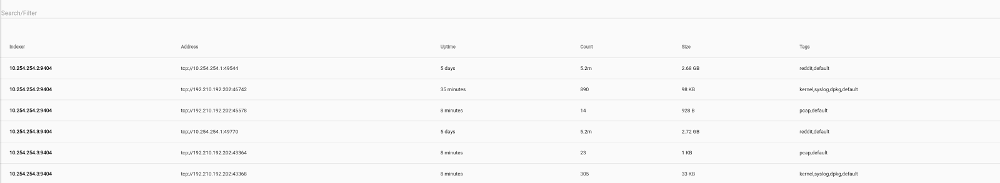
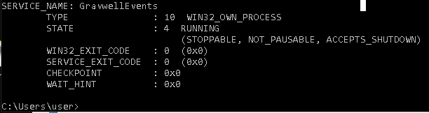
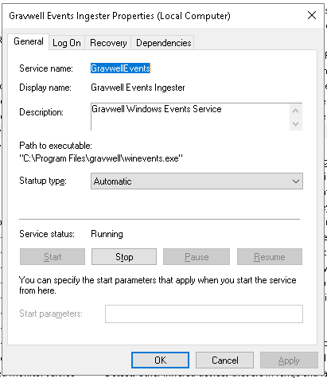
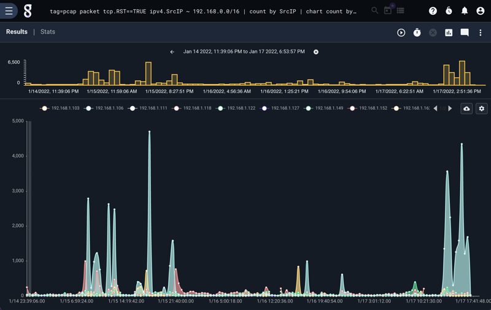
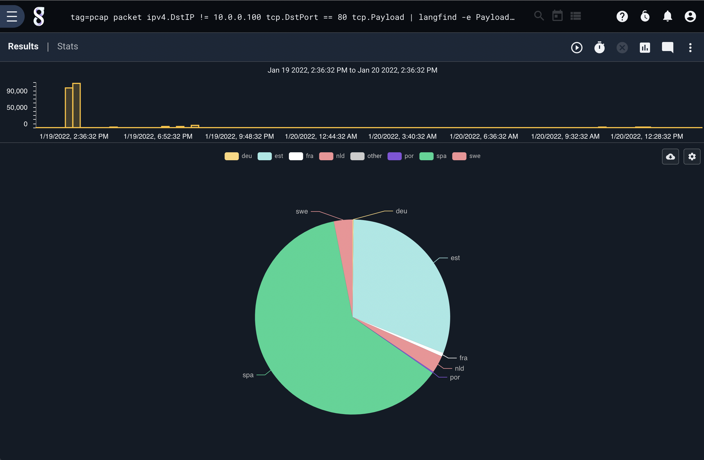
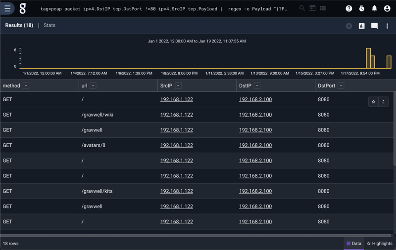
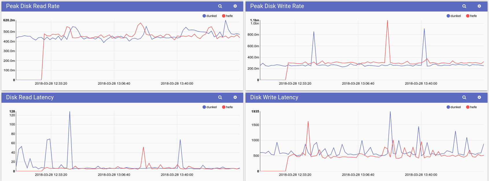
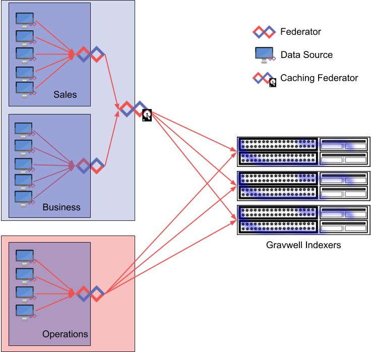

# Ingesters

This section contains more detailed instruction for configuring and running Gravwell ingesters.

The Gravwell-created ingesters are released under the BSD open source license and can be found on [Github](https://github.com/gravwell/ingesters). The ingest API is also open source, so you can create your own ingesters for unique data sources, performing additional normalization or pre-processing, or any other manner of things. The ingest API code [is located here](https://github.com/gravwell/ingest).

In general, for an ingester to send data to Gravwell, the ingester will need to know the “Ingest Secret” of the Gravwell instance, for authentication. This can be found by viewing the `/opt/gravwell/etc/gravwell.conf` file on the Gravwell server and finding the entry for `Ingest-Auth`. If the ingester is running on the same system as Gravwell itself, the installer will usually be able to detect this value and set it automatically.

The Gravwell GUI has an Ingesters page (under the System menu category) which can be used to easily identify which remote ingesters are actively connected, for how long they have been connected, and how much data they have pushed.



Attention: The [replication system](#!configuration/replication.md) does not replicate entries larger than 999MB. Larger entries can still be ingested and searched as usual, but they are omitted from replication. This is not a concern for 99.9% of use cases, as all the ingesters detailed in this page tend to create entries no larger than a few kilobytes.

## Tags

Tags are an essential Gravwell concept. Every entry has a single tag associated with it; these tags allow us to separate and categorize data at a basic level. For example, we may chose to apply the "syslog" tag to entries read from a Linux system's log files, apply "winlog" to Windows logs, and "pcap" to raw network packets. The ingesters determine which tags are applied to the entries.

From the user's point of view, tags are strings such as "syslog", "pcap-router", or "default". The following characters are not allowed in tag names:

```
!@#$%^&*()=+<>,.:;"'{}[]|\
```

You should also refrain from using nonprinting or difficult-to-type characters when selecting tag names, as this will make querying a challenge for users. Although you *could* ingest into a tag named ☺, that doesn't mean it's a good idea!

### Tag Wildcards

When chosing tag names, keep in mind that Gravwell allows wildcards when specifying tag names to query. By selecting your tag names carefully, you can make later querying easier.

For instance, if you are collecting system logs from five servers, of which two are HTTP servers, two are file servers, and one is an email server, you may chose to use the following tags:

* syslog-http-server1
* syslog-http-server2
* syslog-file-server1
* syslog-file-server2
* syslog-email-server1

This will allow your [queries](#!search/search.md) greater flexibility in selecting logs. You can search over all system logs by specifying `tag=syslog-*`. You can search over all HTTP server logs by specifying `tag=syslog-http-*`, or you can select a single server by saying `tag=syslog-http-server1`. You can also select multiple wildcard groups, e.g. `tag=syslog-http-*,syslog-email-*`.

### Tag Internals

Reading this section is not necessary to use Gravwell, but it may help to understand how tags are managed internally.

Internally, Gravwell *indexers* store tags as 16-bit integers. Each indexer maintains its own mapping of tag names to tag numbers, which can be found in `/opt/gravwell/etc/tags.dat`. Never modify or delete this file unless explicitly instructed by Gravwell support!

When an *ingester* connects to an indexer, it sends a list of tag names it intends to use. The indexer then responds with the mapping of tag name to tag numbers. Whenever the ingester sends an entry to that indexer, it will add the appropriate *tag number* to the entry.

## Global Configuration Parameters

Most of the core ingesters support a common set of global configuration parameters.  The shared Global configuration parameters are implemented using the [ingest config](https://godoc.org/github.com/gravwell/ingest/config#IngestConfig) package.  Global configuration parameters should be specified in the Global section of each Gravwell ingester config file.  The following Global ingester paramters are available:

* Ingest-Secret
* Connection-Timeout
* Insecure-Skip-TLS-Verify
* Cleartext-Backend-Target
* Encrypted-Backend-Target
* Pipe-Backend-Target
* Ingest-Cache-Path
* Max-Ingest-Cache
* Cache-Depth
* Cache-Mode
* Log-Level
* Log-File
* Source-Override

### Ingest-Secret

The Ingest-Secret parameter specifies the token to be used for ingest authentication.  The token specified here MUST match the Ingest-Auth parameter for Gravwell indexers.

### Connection-Timeout

The Connection-Timeout parameter specifies how long we want to wait to connect to an indexer before giving up.  An empty timeout means that the ingester will wait forever to start.  Timeouts should be specified in durations of minutes, seconds, or hours.

#### Examples
```
Connection-Timeout=30s
Connection-Timeout=5m
Connection-Timeout=1h
```

### Insecure-Skip-TLS-Verify

The Insecure-Skip-TLS-Verify token tells the ingester to ignore bad certificates when connecting over encrypted TLS tunnels. As the name suggests, any and all authentication provided by TLS is thrown out the window and attackers can easily Man-in-the-Middle TLS connections.  The ingest connections will still be encrypted, but the connection is by no means secure.  By default TLS certificates are validated and the connections will fail if the certificate validation fails.

#### Examples
```
Insecure-Skip-TLS-Verify=true
Insecure-Skip-TLS-Verify=false
```

### Cleartext-Backend-Target

Cleartext-Backend-Target specifies the host and port of a Gravwell indexer.  The ingester will connect to the indexer using a cleartext TCP connection.  If no port is specified the default port 4023 is used.  Cleartext connections support both IPv6 and IPv4 destinations.  **Multiple Cleartext-Backend-Targets can be specified to load balance an ingester across multiple indexers.**

#### Examples
```
Cleartext-Backend-Target=192.168.1.1
Cleartext-Backend-Target=192.168.1.1:4023
Cleartext-Backend-Target=DEAD::BEEF
Cleartext-Backend-Target=[DEAD::BEEF]:4023
```

### Encrypted-Backend-Target

Encrypted-Backend-Target specifies the host and port of a Gravwell indexer. The ingester will connect to the indexer via TCP and perform a full TLS handshake/certificate validation.  If no port is specified the default port of 4024 is used.  Encrypted connections support both IPv6 and IPv4 destinations.  **Multiple Encrypted-Backend-Targets can be specified to load balance an ingester across multiple indexers.**

#### Examples
```
Encrypted-Backend-Target=192.168.1.1
Encrypted-Backend-Target=192.168.1.1:4023
Encrypted-Backend-Target=DEAD::BEEF
Encrypted-Backend-Target=[DEAD::BEEF]:4023
```

### Pipe-Backend-Target

Pip-Backend-Target specifies a Unix named socket via a full path.  Unix named sockets are ideal for ingesters that are co-resident with indexers as they are extremely fast and incur little overhead.  Only a single Pipe-Backend-Target is supported per ingester, but pipes can be multiplexed alongside cleartext and encrypted connections.

#### Examples
```
Pipe-Backend-Target=/opt/gravwell/comms/pipe
Pipe-Backend-Target=/tmp/gravwellpipe
```

### Ingest-Cache-Path

The Ingest-Cache-Path enables a local cache for ingested data.  When enabled, ingesters can cache locally when they cannot forward entries to indexers.  The ingest cache can help ensure you don't lose data when links go down or if you need to take a Gravwell cluster offline momentarily.  Be sure to specify a Max-Ingest-Cache value so that a long-term network failure won't cause an ingester to fill the host disk.  The local ingest cache is not as fast as ingesting directly to indexers, so don't expect the ingest cache to handle 2 million entries per second the way the indexers can.

Attention: The ingest cache should **not** be enabled for the File Follower ingester. Because this ingester reads directly from files on the disk and tracks its position within each file, it does not need a cache.

#### Examples
```
Ingest-Cache-Path=/opt/gravwell/cache/simplerelay.cache
Ingest-Cache-Path=/mnt/storage/networklog.cache
```

### Max-Ingest-Cache

Max-Ingest-Cache limits the amount of storage space an ingester will consume when the cache is engaged.  The maximum cache value is specified in megabytes; a value of 1024 means that the ingester can consume 1GB of storage before it will stop accepting new entries.  The cache system will NOT overwrite old entries when the cache fills up. This is by design, so that an attacker can't disrupt a network connection and cause an ingester to overwrite potentially critical data at the point the disruption happened.

#### Examples
```
Max-Ingest-Cache=32
Max-Ingest-Cache=1024
Max-Ingest-Cache=10240
```

### Cache-Depth

Cache-Depth sets the number of entries to keep in an in-memory buffer. The default value is 128, and the in-memory buffer is always enabled, even if Ingest-Cache-Path is disabled. Setting Cache-Depth to a large value enables absorbing burst behavior on ingesters as the expense of more memory consumption.

#### Example
```
Cache-Depth=256
```

### Cache-Mode

Cache-Mode sets the behavior of the backing cache (enabled by setting Ingest-Cache-Path) at runtime. Available modes are "always" and "fail". In "always" mode, the cache is always enabled, allowing the ingester to write entries to disk any time the in-memory buffer (set with Cache-Depth) is full. This can occur on a dead or slow indexer connection, or when the ingester is attempting to push more data than is possible over the connection it has to the indexer. By using "always" mode, you ensure the ingester will not drop entries or block data ingest at any time. Setting Cache-Mode to "fail" changes the cache behavior to only enable when all indexer connections are down.

#### Examples
```
Cache-Mode=always
Cache-Mode=fail
```

### Log-File

Ingesters can log errors and debug information to log files to assist in debugging installation and configuration problems.  An empty Log-File parameter disables file logging.

#### Examples
```
Log-File=/opt/gravwell/log/ingester.log
```

### Log-Level

The Log-Level parameter controls the logging system in each ingester for both log files and metadata that is sent to indexers under the "gravwell" tag.  Setting the log level to INFO will tell the ingester to log in great detail, such as when the File Follower follows a new file or Simple Relay receives a new TCP connection. On the other end of the spectrum, setting the level to ERROR means only the most critical errors will be logged. The WARN level is appropriate in most cases. The following levels are supported:

* OFF
* INFO
* WARN
* ERROR

#### Examples
```
Log-Level=Off
Log-Level=INFO
Log-Level=WARN
Log-Level=ERROR
```

### Source-Override

The Source-Override parameter will override the SRC data item that is attached to each entry.  The SRC item is either an IPv6 or IPv4 address and is normally the external IP address of the machine on which the ingester is running.

#### Examples
```
Source-Override=10.0.0.1
Source-Override=0.0.0.0
Source-Override=DEAD:BEEF::FEED:FEBE
```

## Data Consumer Configuration

Besides the global configuration options, each ingester which uses a config file will need to define at least one *data consumer*. A data consumer is a config definition which tells the ingester:

* Where to get data
* What tag to use on the data
* Any special timestamp processing rules
* Overrides for fields such as the SRC field

The Simple Relay ingester and the HTTP ingester define "Listeners"; File Follow uses "Followers"; the netflow ingester defines "Collectors". The individual ingester sections below describe the ingester's particular data consumer types and any unique configurations they may require. The following example shows how the File Follower ingester defines a "Follower" data consumer to read data from a particular directory:

```
[Follower "syslog"]
        Base-Directory="/var/log/"
        File-Filter="syslog,syslog.[0-9]" #we are looking for all authorization log files
        Tag-Name=syslog
        Assume-Local-Timezone=true #Default for assume localtime is false
```

Note how it specifies the data source (via the `Base-Directory` and `File-Filter` rules), which tag to use (via `Tag-Name`), and an additional rule for parsing timestamps in the incoming data (`Assume-Local-Timezone`).

## Time Parsing Overrides

Most ingesters attempt to apply a timestamp to each entry by extracting a timestamp from the data. There are several options which can be applied to each *data consumer* for fine-tuning of this timestamp extraction:

* `Ignore-Timestamps` (boolean): setting `Ignore-Timestamps=true` will make the ingester apply the current time to each entry rather than attempting to extract a timestamp. This can be the only option for ingesting data when you have extremely incoherent incoming data.
* `Assume-Local-Timezone` (boolean): By default, if a timestamp does not include a time zone the ingester will assume it is a UTC timestamp. Setting `Assume-Local-Timezone=true` will make the ingester instead assume whatever the local computer's timezone is. This is mutually exclusive with the Timezone-Override option.
* `Timezone-Override` (string): Setting `Timezone-Override` tells the ingester that timestamps which don't include a timezone should be parsed in the specified timezone. Thus `Timezone-Override=US/Pacific` would tell the ingester to treat incoming timestamps as if they were in US Pacific time. See [this page](https://en.wikipedia.org/wiki/List_of_tz_database_time_zones) for a complete list of acceptable timezone names (in the 'TZ database name' column). Mutually exclusive with Assume-Local-Timezone.
* `Timestamp-Format-Override` (string): This parameter tells the ingester to look for a specific timestamp format in the data, e.g. `Timestamp-Format-Override="Mon Jan 2 15:04:05 MST 2006"`. The [Go time package's reference time format](https://golang.org/pkg/time/#pkg-constants) describes how to declare a timestamp format.

The Kinesis and Google Pub/Sub ingesters do not provide the `Ignore-Timestamps` option. Kinesis and Pub/Sub include an arrival timestamp with every entry; by default, the ingesters will use that as the Gravwell timestamp. If `Parse-Time=true` is specified in the data consumer definition, the ingester will instead attempt to extract a timestamp from the message body. See these ingesters' respective sections for additional information.

## Simple Relay

[Complete Configuration and Documentation](#!ingesters/simple_relay.md).

Simple Relay is a text ingester which is capable of listening on multiple TCP or UDP ports.  Each port can be assigned a tag as well as an ingest standard (e.g. parse RFC5424 or simple newline delimited entries).  Simple Relay is the go-to ingester for ingesting remote syslog entries or consuming from any data source that can throw text logs over a network connection.

### Installation

If you're using the Gravwell Debian repository, installation is just a single apt command:

```
apt-get install gravwell-simple-relay
```

Otherwise, download the installer from the [Downloads page](#!quickstart/downloads.md). Issue the following command as a superuser (e.g. via the `sudo` command) to install the ingester:

```
root@gravserver ~ # bash gravwell_simple_relay_installer.sh
```

If the Gravwell services are present on the same machine, the installation script will automatically extract and configure the `Ingest-Auth` parameter and set it appropriately. However, if your ingester is not resident on the same machine as a pre-existing Gravwell backend, the installer will prompt for the authentication token and the IP address of the Gravwell indexer. You can set these values during installation or leave them blank and modify the configuration file in `/opt/gravwell/etc/simple_relay.conf` manually.

## File Follower

The File Follower ingester is designed to watch files on the local system, capturing logs from sources that cannot natively integrate with Gravwell or are incapable of sending logs via a network connection.  The File Follower comes in both Linux and Windows flavors and can follow any line-delimited text file.  It is compatible with file rotation and employs a powerful pattern matching system to deal with applications that may name their logfiles inconsistently.

### Installation

If you're using the Gravwell Debian repository, installation is just a single apt command:

```
apt-get install gravwell-file-follow
```

Otherwise, download the installer from the [Downloads page](#!quickstart/downloads.md). On a Windows system, run the downloaded executable and follow the installer's prompts. On Linux, issue the following command as a superuser (e.g. via the `sudo` command) to install the ingester:

```
root@gravserver ~ # bash gravwell_file_follow_installer.sh
```

If the Gravwell services are present on the same machine, the installation script will automatically extract and configure the `Ingest-Auth` parameter and set it appropriately. However, if your ingester is not resident on the same machine as a pre-existing Gravwell backend, the installer will prompt for the authentication token and the IP address of the Gravwell indexer. You can set these values during installation or leave them blank and modify the configuration file in `/opt/gravwell/etc/file_follow.conf` manually.

### Example Configurations

The file follower configuration is nearly identical for both the Windows and Linux variants. More detailed configuration information is available [in the File Follower ingest documentation](file_follow.md)

#### Windows

The Windows configuration file is located at `C:\Program Files\gravwell\file_follow.cfg` by default.  The Windows File Follower runs as a Windows service.  Its status can be queried by issuing `sc query GravwellFileFollow` in a command prompt.  An example configuration which tracks the Windows CBS log files looks like this:

```
[Global]
Ingest-Secret = IngestSecrets
Connection-Timeout = 0
Insecure-Skip-TLS-Verify = false
Cleartext-Backend-target=172.20.0.2:4023 #example of adding a cleartext connection
State-Store-Location="c:\\Program Files\\gravwell\\file_follow.state"
Ingest-Cache-Path="c:\\Program Files\\gravwell\\file_follow.cache"
Log-Level=ERROR #options are OFF INFO WARN ERROR
#basic default logger, all entries will go to the default tag
#no Tag-Name means use the default tag
[Follower "cbs"]
        Base-Directory="C:\\Windows\\Logs\\CBS"
        File-Filter="CBS.log" #we are looking for just the CBS log
        Tag-Name=auth
        Assume-Local-Timezone=true
```

#### Linux

The linux configuration file is located at `/opt/gravwell/etc/file_follow.conf` by default.  An example configuration which watches kernel, dmesg, and debian installation logs might look like the following:

```
[Global]
Ingest-Secret = IngestSecrets
Connection-Timeout = 0
Insecure-Skip-TLS-Verify = false
Cleartext-Backend-target=172.20.0.1:4023 #example of adding a cleartext connection
Cleartext-Backend-target=172.20.0.2:4023 #example of adding another cleartext connection
#Encrypted-Backend-target=127.1.1.1:4024 #example of adding an encrypted connection
#Pipe-Backend-target=/opt/gravwell/comms/pipe #a named pipe connection, this should be used when ingester is on the same machine as a backend
State-Store-Location=/opt/gravwell/etc/file_follow.state
Log-Level=ERROR #options are OFF INFO WARN ERROR
Max-Files-Watched=64
#Ingest-Cache-Path=/opt/gravwell/cache/file_follow.cache #allows for ingested entries to be cached when indexer is not available
#basic default logger, all entries will go to the default tag
#no Tag-Name means use the default tag
[Follower "syslog"]
        Base-Directory="/var/log/"
        File-Filter="syslog,syslog.[0-9]" #we are looking for all authorization log files
        Tag-Name=syslog
        Assume-Local-Timezone=true #Default for assume localtime is false
[Follower "auth"]
        Base-Directory="/var/log/"
        File-Filter="auth.log,auth.log.[0-9]" #we are looking for all authorization log files
        Tag-Name=syslog
        Assume-Local-Timezone=true #Default for assume localtime is false
[Follower "packages"]
        Base-Directory="/var/log"
        File-Filter="dpkg.log,dpkg.log.[0-9]" #we are looking for all dpkg files
        Tag-Name=dpkg
        Ignore-Timestamps=true
[Follower "kernel"]
        Base-Directory="/var/log"
        File-Filter="dmesg,dmesg.[0-9]"
        Tag-Name=kernel
        Ignore-Timestamps=true
[Follower "kernel2"]
        Base-Directory="/var/log"
        File-Filter="kern.log,kern.log.[0-9]"
        Tag-Name=kernel
        Ignore-Timestamps=true
```

## HTTP

The HTTP ingester sets up HTTP listeners on one or more paths. If an HTTP request is sent to one of those paths, the request's Body will be ingested as a single entry.

This is an extremely convenient method for scriptable data ingest, since the `curl` command makes it easy to do a POST request using standard input as the body.

### Installation

If you're using the Gravwell Debian repository, installation is just a single apt command:

```
apt-get install gravwell-http-ingester
```

Otherwise, download the installer from the [Downloads page](#!quickstart/downloads.md). Using a terminal on the Gravwell server, issue the following command as a superuser (e.g. via the `sudo` command) to install the ingester:

```
root@gravserver ~ # bash gravwell_http_ingester_installer_3.0.0.sh
```

If the Gravwell services are present on the same machine, the installation script will automatically extract and configure the `Ingest-Auth` parameter and set it appropriately. However, if your ingester is not resident on the same machine as a pre-existing Gravwell backend, the installer will prompt for the authentication token and the IP address of the Gravwell indexer. You can set these values during installation or leave them blank and modify the configuration file in `/opt/gravwell/etc/gravwell_http_ingester.conf` manually.

### Configuring HTTPS

By default the HTTP Ingester runs a cleartext HTTP server, but it can be configured to run an HTTPS server using x509 TLS certificates.  To configure the HTTP Ingester as an HTTPS server provide a certificate and key PEM files in the Global configuration space using the `TLS-Certificate-File` and `TLS-Key-File` parameters.

An example global configuration with HTTPS enabled might look like the following:

```
[Global]
	TLS-Certificate-File=/opt/gravwell/etc/cert.pem
	TLS-Key-File=/opt/gravwell/etc/key.pem
```

#### Example Configuration

In addition to the universal configuration parameters used by all ingesters, the HTTP POST ingester has two additional global configuration parameters that control the behavior of the embedded webserver.  The first configuration parameter is the `Bind` option, which specifies the interface and port that the webserver listens on.  The second is the `Max-Body` parameter, which controls how large of a POST the webserver will allow.  The Max-Body parameter is a good safety net to prevent rogue processes from attempting to upload very large files into your Gravwell instance as a single entry.  Gravwell can support up to 2GB as a single entry, but we wouldn't recommend it.

Multiple "Listener" definitions can be defined allowing specific URLs to send entries to specific tags.  In the example configuration we define two listeners which accept data from a weather IOT device and a smart thermostat.

```
[Listener "weather"]
	URL="/weather"
	Tag-Name=weather


[Listener "thermostat"]
	URL="/smarthome/thermostat"
	Tag-Name=thermostat
```

Any data that is sent in the body of a POST request sent to "/weather" or "/smarthome/thermostat" will be tagged with the "weather" and "thermostat" tags respectively.  The current timestamp will be attached to each entry at the time of the POST.

You can test that a listener is working with a simple curl command:

```
curl -d "its hot outside bro" -X POST http://10.0.0.1:8080/weather
```

If you have an API key for OpenWeatherMap.org, you can set up a cron job to automatically pull down weather conditions and push them into Gravwell with a command like this:

```
curl "http://api.openweathermap.org/data/2.5/weather?q=Spokane&APPID=YOUR_APP_ID" | curl http://10.0.0.1:8088/weather -X POST -d @-
```

#### Listener Authentication

Each HTTP Ingester listener can be configured to enforce authentication.  The supported authentication methods are:

* none
* basic
* jwt
* cookie
* preshared-token
* preshared-parameter

When specifying an authentication system other than none crendentials must be provided.  The `jwt` and `cookie` and cookie authentication systems require a username and password while the `preshared-token` and `preshared-parameter` must provide a token value and optional token name.

Warning: Like any other webpage, authentication is NOT SECURE over cleartext connections and attackers that can sniff traffic can capture tokens and cookies.

#### No Authentication

The default authentication method is none, allowing anyone that can reach the ingester to push entries.  The `basic` authentication mechanism uses HTTP Basic authentication, where a username and password is base64 encoded and sent with every request.

Here is an example listener using the basic authentication system:

```
[Listener "basicauth"]
	URL="/basic/data"
	Tag-Name=stuff
	AuthType=basic
	Username=secretuser
	Password=secretpassword
```

An example curl command to send an entry with basic authentication might look like:

```
curl -d "only i can say hi" --user secretuser:secretpassword -X POST http://10.0.0.1:8080/basic/data
```

#### JWT Authentication

The JWT authentication system uses a cryptographically signed token for authentication.  When using jwt authentication you must specify an Login URL where clients will authenticate and recieve a token which must then be sent with each request.  The jwt tokens expire after 48 hours.  Authentication is performed by sending a `POST` request to the login URL with the `username` and `password` form fields populated.

Authenticating with the HTTP ingester using jwt authentication is a two step process and requires an additional configuration parameter.  Here is an example configuration:

```
[Listener "jwtauth"]
	URL="/jwt/data"
	LoginURL="/jwt/login"
	Tag-Name=stuff
	AuthType=basic
	Username=secretuser
	Password=secretpassword
```

Sending entries requires that endpoints first authenticate to obtain a token, the token can then be reused for up to 48 hours.  If a request receives a 401 response, clients should re-authenticate.  Here is an example using curl to authenticate and then push data.

```
x=$(curl -X POST -d "username=user1&password=pass1" http://127.0.0.1:8080/jwt/login) #grab the token and stuff it into a variable
curl -X POST -H "Authorization: Bearer $x" -d "this is a test using JWT auth" http://127.0.0.1:8080/jwt/data #send the request with the token
```

#### Cookie Authentication

The cookie authentication system is virtually identical to JWT authentication other than the method of controlling state.  Listeners that use cookie authentication require that a client login with a username and password to acquire a cookie which is set by the login page.  Subsequent requests to the ingest URL must provide the cookie in each request.

Here is an example configuration block:

```
[Listener "cookieauth"]
	URL="/cookie/data"
	LoginURL="/cookie/login"
	Tag-Name=stuff
	AuthType=basic
	Username=secretuser
	Password=secretpassword
```

An example set of curl commands that login and retrieve the cookie before ingesting some data might look like:

```
curl -c /tmp/cookie.txt -d "username=user1&password=pass1" localhost:8080/cookie/login
curl -X POST -c /tmp/cookie.txt -b /tmp/cookie.txt -d "this is a cookie data" localhost:8080/cookie/data
```

#### Preshared Token

The Preshared token authentication mechanism uses a preshared secret rather than a login mechanism.  The preshared secret is expected to be sent with each request in an Authorization header.  Many HTTP frameworks expect this type of ingest, such as the Splunk HEC and supporting AWS Kinesis and Lambda infrastructure.  Using a preshared token listener we can define a capture system that is a plugin replacement for Splunk HEC.

Note: If you do not define a `TokenName` value, the default value of `Bearer` will be used.

An example configuration which defines a preshared token:

```
[Listener "presharedtoken"]
	URL="/preshared/token/data"
	Tag-name=token
	AuthType="preshared-token"
	TokenName=foo
	TokenValue=barbaz
```

An example curl command the sends data using the preshared secret:

```
curl -X POST -H "Authorization: foo barbaz" -d "this is a preshared token" localhost:8080/preshared/token/data
```

#### Preshared Parameter

The Preshared Parameter authentication mechanism uses a preshared secret that is provided as a query parameter.  The `preshared-parameter` system can be useful when scripting or using data producers that typically do not support authentication by embedding the authentication token into the URL.

Note: Embedding the authentication token into the URL means the proxies and HTTP logging infrastructure may capture and log authentication tokens.

An example configuration which defines a preshared parameter:

```
[Listener "presharedtoken"]
	URL="/preshared/parameter/data"
	Tag-name=token
	AuthType="preshared-parameter"
	TokenName=foo
	TokenValue=barbaz
```

An example curl command the sends data using the preshared secret:

```
curl -X POST -d "this is a preshared parameter" localhost:8080/preshared/parameter/data?foo=barbaz
```

### Listener Methods

The HTTP Ingester can be configured to use virtually any method, but data is always expected to be in the body of the request.

For example, here is a Listener configuration that expects the PUT method:

```
[Listener "test"]
	URL="/data"
	Method=PUT
	Tag-Name=stuff
```

The corresponding curl command would be:

```
curl -X PUT -d "this is a test 2 using basic auth" http://127.0.0.1:8080/data
```

The HTTP Ingester can go out of spec on methods, accepting almost any ASCII string that does not contain special characters.

```
[Listener "test"]
	URL="/data"
	Method=SUPER_SECRET_METHOD
	Tag-Name=stuff
```

```
curl -X SUPER_SECRET_METHOD -d "this is a test 2 using basic auth" http://127.0.0.1:8080/data
```

## Mass File Ingester

The Mass File ingester is a very powerful but specialized tool for ingesting an archive of many logs from many sources.

### Example use case
Gravwell users have used this tool when investigating a potential network breach. The user had Apache logs from over 50 different servers and needed to search them all. Ingesting them one after another causes poor temporal indexing performance. This tool was created to ingest the files while preserving the temporal nature of the log entries and ensuring solid performance.  The massfile ingester works best when the ingesting machine has enough space (storage and memory) to optimized the source logs prior to ingesting.  The optimization phase helps relieve pressure on the Gravwell storage system at ingest and during search, ensuring that incident responders can move quickly and get performant access to their log data in short order.

### Notes

The mass file ingester is driven via command line parameters and is not designed to run as a service.  The code is available on [Github](https://github.com/gravwell/ingesters).

```
Usage of ./massFile:
  -clear-conns string
        comma seperated server:port list of cleartext targets
  -ingest-secret string
        Ingest key (default "IngestSecrets")
  -no-ingest
        Optimize logs but do not perform ingest
  -pipe-conn string
        Path to pipe connection
  -s string
        Source directory containing log files
  -skip-op
        Assume working directory already has optimized logs
  -tag-name string
        Tag name for ingested data (default "default")
  -timeout int
        Connection timeout in seconds (default 1)
  -tls-conns string
        comma seperated server:port list of TLS connections
  -tls-private-key string
        Path to TLS private key
  -tls-public-key string
        Path to TLS public key
  -tls-remote-verify string
        Path to remote public key to verify against
  -w string
        Working directory for optimization
```

## Windows Event Service

The Gravwell Windows events ingester runs as a service on a Windows machine and sends Windows events to the Gravwell indexer.  The ingester consumes from the `System`, `Application`, `Setup`, and `Security` channels by default.  Each channel can be configured to consume from a specific set of events or providers.

### Installation

Download the Gravwell Windows ingester installer from the [Downloads page](#!quickstart/downloads.md).

Run the .msi installation wizard to install the Gravwell events service.  On first installation the installation wizard will prompt to configure the indexer endpoint and ingest secret.  Subsequent installations and/or upgrades will identify a resident configuration file and will not prompt.

The ingester is configured with the `config.cfg` file located at `%PROGRAMDATA%\gravwell\eventlog\config.cfg`.  The configuration file follows the same form as other Gravwell ingesters with a `[Global]` section configuring the indexer connections and multiple `EventChannel` definitions.

To modify the indexer connection or specify multiple indexers, change the connection ip address to the IP of your Gravwell server and set the Ingest-Secret value.  This example shows configuring an encrypted transport:

```
Ingest-Secret=YourSecretGoesHere
Encrypted-Backend-target=ip.addr.goes.here:port
```

Once configured, this file can be copied to any other Windows system from which you would like to collect events.

#### Silent Installation

The Windows event ingester is designed to be compatible with an automated deployment.  This means that a domain controller can push the installer to clients and invoke installation without user interaction.  To force a silent installation execute the installer with administrative privileges via [msiexec](https://docs.microsoft.com/en-us/windows-server/administration/windows-commands/msiexec) with the `/quiet` argument.  This installation method will install the default configuration and start the service.

To configure your specific parameters you will then need to either push a modified configuration file to `%PROGRAMDATA%\gravwell\eventlog\config.cfg` and restart the service, or also provide the `CONFIGFILE` argument with the fully qualified path to the `config.cfg` file.

Note that you may need to create the `%PROGRAMDATA%\gravwell\eventlog` path.

A complete execution sequence for a Group Policy push might look like:

```
msiexec.exe /i gravwell_win_events_3.3.12.msi /quiet
xcopy \\share\gravwell_config.cfg %PROGRAMDATA%\gravwell\eventlog\config.cfg
sc stop "GravwellEvent Service"
sc start "GravwellEvent Service"
```

Or

```
msiexec.exe /i gravwell_win_events_3.3.12.msi /quiet CONFIGFILE=\\share\gravwell_config.cfg
```

### Optional Sysmon Integration

The Sysmon utility, part of the sysinternals suite, is an effective and popular tool for monitoring Windows systems. There are plenty of resources with examples of good sysmon configuration files. At Gravwell, we like to use the config created by infosec Twitter personality @InfosecTaylorSwift.

Edit the Gravwell Windows agent config file located at `%PROGRAMDATA%\gravwell\eventlog\config.cfg` and add the following lines:

```
[EventChannel "Sysmon"]
        Tag-Name=sysmon #Apply a new tag name
        Provider=Microsoft-Windows-Sysmon #Only look for the provider
        Channel=Microsoft-Windows-Sysmon/Operational
```

[Download the excellent sysmon configuration file by SwiftOnSecurity](https://raw.githubusercontent.com/SwiftOnSecurity/sysmon-config/master/sysmonconfig-export.xml)

[Download sysmon](https://technet.microsoft.com/en-us/sysinternals/sysmon)

Install `sysmon` with your configuration using an administrator shell (Powershell works too) by running the following command:

```
sysmon.exe -accepteula -i sysmonconfig-export.xml
```

Restart the Gravwell service via standard windows service management.

#### Example Configuration with Sysmon

```
[EventChannel "system"]
        Tag-Name=windows
        #no Provider means accept from all providers
        #no EventID means accept all event ids
        #no Level means pull all levels
        #no Max-Reachback means look for logs starting from now
        Channel=System #pull from the system channel

[EventChannel "application"]
        Tag-Name=windows
        Channel=Application #pull from the system channel

[EventChannel "security"]
        Tag-Name=windows
        Channel=Security #pull from the system channel

[EventChannel "setup"]
        Tag-Name=windows
        Channel=Setup #pull from the system channel

[EventChannel "sysmon"]
        Tag-Name=windows
        Provider=Microsoft-Windows-Sysmon #Only look for the provider
        Channel=Microsoft-Windows-Sysmon/Operational
```

### Troubleshooting

You can verify the Windows ingester connectivity by navigating to the Ingester page on the web interface.  If the Windows ingester is not present, check the status of the service either via the windows GUI or by running `sc query GravwellEvents` at the command line.





### Example Windows Searches

Assuming the default tag names are used, to see ALL sysmon entries in their entirety run this search:

```
tag=sysmon
```

To see ALL Windows events in their entirety run:

```
tag=windows
```

For the following searches we can use the `winlog` search module to filter and extract specific events and fields.  To see all network creation by non-standard processes:

```
tag=sysmon regex winlog EventID==3 Image SourceHostname DestinationIp DestinationPort |
table TIMESTAMP SourceHostname Image DestinationIP DestinationPort
```

To chart network creation by source host:

```
tag=sysmon regex winlog EventID==3 Image SourceHostname DestinationIp DestinationPort |
count by SourceHostname |
chart count by SourceHostname limit 10
```

To see suspicious file creation:

```
tag=sysmon winlog EventID==11 Image TargetFilename |
count by TargetFilename |
chart count by TargetFilename
```

## Netflow Ingester

The Netflow ingester acts as a Netflow collector (see [the wikipedia article](https://en.wikipedia.org/wiki/NetFlow) for a full description of Netflow roles), gathering records created by Netflow exporters and capturing them as Gravwell entries for later analysis. These entries can then be analyzed using the [netflow](#!search/netflow/netflow.md) search module.

If you're using the Gravwell Debian repository, installation is just a single apt command:

```
apt-get install gravwell-netflow-capture
```

Otherwise, download the installer from the [Downloads page](#!quickstart/downloads.md). To install the Netflow ingester, simply run the installer as root (the actual file name will typically include a version number):

```
root@gravserver ~ # bash gravwell_netflow_capture_installer.sh
```

If there is no Gravwell indexer on the local machine, the installer will prompt for an Ingest-Secret value and an IP address for an indexer (or a Federator). Otherwise, it will pull the appropriate values from the existing Gravwell configuration. In any case, review the configuration file in `/opt/gravwell/etc/netflow_capture.conf` after installation. A straightforward example which listens on UDP port 2055 might look like this:

```
[Global]
Ingest-Secret = IngestSecrets
Connection-Timeout = 0
Insecure-Skip-TLS-Verify=false
Pipe-Backend-target=/opt/gravwell/comms/pipe #a named pipe connection, this should be used when ingester is on the same machine as a backend
Log-Level=INFO

[Collector "netflow v5"]
	Bind-String="0.0.0.0:2055" #we are binding to all interfaces
	Tag-Name=netflow
```

Note that this configuration sends entries to a local indexer via `/opt/gravwell/comms/pipe`. Entries are tagged 'netflow'.

You can configure any number of `Collector` entries listening on different ports with different tags; this can help organize the data more clearly.

Note: At this time, the ingester only supports Netflow v5; keep this in mind when configuring Netflow exporters.

## Network Ingester

A primary strength of Gravwell is the ability to ingest binary data. The network ingester allows you to capture full packets from the network for later analysis; this provides much better flexibility than simply storing netflow or other condensed traffic information.

If you're using the Gravwell Debian repository, installation is just a single apt command:

```
apt-get install libpcap0.8 gravwell-network-capture
```

Otherwise, download the installer from the [Downloads page](#!quickstart/downloads.md). To install the network ingester, simply run the installer as root (the file name may differ slightly):

```
root@gravserver ~ # bash gravwell_network_capture_installer.sh
```

Note: You must have libpcap installed for the ingester to work.

It is highly advised to co-locate the network ingester with an indexer when possible and use a `pipe-conn` link to send data, rather than a `clear-conn` or `tls-conn` link.  If the network ingester is capturing from the same link it is using to push entries, a feedback loop can be created which will rapidly saturate the link (e.g. capturing from eth0 while also sending entries to the ingester via eth0). You can use the `BPF-Filter` option to alleviate this.

If the ingester is on a machine with a Gravwell backend already installed, the installer should automatically pick up the correct `Ingest-Secrets` value and populate the config file with it. Otherwise, it will prompt for the indexer's IP address and the ingest secret. In any case, review the configuration file in `/opt/gravwell/etc/network_capture.conf` before running. An example which captures traffic from eth0 might look like this:

```
[Global]
Ingest-Secret = IngestSecrets
Connection-Timeout = 0
Insecure-Skip-TLS-Verify = false
#Cleartext-Backend-target=127.1.0.1:4023 #example of adding a cleartext connection
#Encrypted-Backend-target=127.1.1.1:4023 #example of adding an encrypted connection
Pipe-Backend-target=/opt/gravwell/comms/pipe #a named pipe connection, this should be used when ingester is on the same machine as a backend
Log-Level=INFO #options are OFF INFO WARN ERROR
Ingest-Cache-Path=/opt/gravwell/cache/network_capture.cache

#basic default logger, all entries will go to the default tag
#no Tag-Name means use the default tag
[Sniffer "spy1"]
	Interface="eth0" #sniffing from interface eth0
	Tag-Name="pcap"  #assigning tag  fo pcap
	Snap-Len=0xffff  #maximum capture size
	#BPF-Filter="not port 4023" #do not sniff any traffic on our backend connection
	#Promisc=true
```

You can configure any number of `Sniffer` entries in order to capture from different interfaces.

If disk space is a concern, you may wish to change the `Snap-Len` parameter to capture only packet metadata. A value of 96 is usually sufficient to capture only headers.

Due to the potential for very high bandwidth links it is also advisable to assign the network capture data to its own well; this requires configuration on the indexer to define a separate well for the packet capture tags.

The NetworkCapture ingester also supports native BPF filtering using the `BPF-Filter` parameter, which adheres to the libpcap syntax.  To ignore all traffic on port 22, one could configure a sniffer like this:

```
[Sniffer "no-ssh"]
	Interface="eth0"
	Tag-Name="pcap"
	Snap-Len=0xffff
	BPF-Filter="not port 22"
```

If the ingester is on a different system than the indexer, meaning entries must traverse the network to be ingested, you should set `BPF-Filter` to "not port 4023" (if using cleartext) or "not port 4024" (if using TLS).

### Example Network Searches

The following search looks for TCP packets with the RST flag set which do not originate from the IP 10.0.0.0/24 class C subnet and then graphs them by IP.  This query can be used to rapidly identify outbound port scans from a network.

```
tag=pcap packet tcp.RST==TRUE ipv4.SrcIP !~ 10.0.0.0/24 | count by SrcIP | chart count by SrcIP limit 10
```



The following search looks for IPv6 traffic and extracts the FlowLabel, which is passed on to a math operation.  This allows per-flow traffic accounting by summing the lengths of packets and passing them into the chart renderer.

```
tag=pcap packet ipv6.Length ipv6.FlowLabel | sum Length by FlowLabel | chart sum by FlowLabel limit 10
```

To identify the languages in use in TCP payloads, we can filter network data and pass it to the langfind module.  This query is looking for outbound HTTP requests and handing the TCP payload data to the langfind module, which passes the identified languages to count and then chart.  This produces a chart of human languages used in outbound HTTP queries.

```
tag=pcap packet ipv4.DstIP != 10.0.0.100 tcp.DstPort == 80 tcp.Payload | langfind -e Payload | count by lang | chart count by lang
```



Traffic accounting can also be performed at layer 2. This is accomplished by extracting the packet length from the Ethernet header and summing the length by the destination MAC address and sorting by traffic count.  This allows us to rapidly identify physical devices on an Ethernet network that might be particularly chatty:

```
tag=pcap packet eth.DstMAC eth.Length > 0 | sum Length by DstMAC | sort by sum desc | table DstMAC sum
```

A similar query can identify chatty devices via packet counts. For example, a device may be aggressively broadcasting small Ethernet packets which stress a switch but do not amount to large amounts of traffic.

```
tag=pcap packet eth.DstMAC eth.Length > 0 | count by DstMAC | sort by count desc | table DstMAC count
```

It may be desirable to identify HTTP traffic operating on non-standard HTTP ports.  This can be achieved by exercising the filtering options and passing payloads to other modules.  For example, looking for outbound traffic that is not TCP port 80 and is originating from a specific subnet and then looking for HTTP requests in the ppacket payload allows us to identify abnormal HTTP traffic:

```
tag=pcap packet ipv4.SrcIP ipv4.DstIP tcp.DstPort !=80 ipv4.SrcIP ~ 10.0.0.0/24 tcp.Payload | regex -e Payload "(?P<method>[A-Z]+)\s+(?P<url>[^\s]+)\s+HTTP/\d.\d" | table method url SrcIP DstIP DstPort
```



## Kafka

The Kafka ingester designed to act as a consumer for [Apache Kafka](https://kafka.apache.org/) so that data Gravwell can attach to a Kafka cluster and consume data.  Kafka can act as a high availabilty [data broker](https://kafka.apache.org/uses#uses_logs) to Gravwell.  Kafka can take on some of the roles provided by the Gravwell federator, or ease the burden of integrating Gravwell into an existing data flow.  If your data is already flowing to Kafka, integrating Gravwell is just an `apt-get` away.

The Gravwell Kafka ingester is best suited as a colocated ingest point for a single indexer.  If you are operating a Kafka cluster and a Gravwell cluster, it is best not to duplicate the load balancing characteristcs of Kafka at the Gravwell ingest layer.  Install the Kafka ingester on the same machinea as the Gravwell indexer and use the Unix named pipe connection.  Each indexer should be configured with its own Kafka ingester, this way the Kafka cluster can manage load balancing.

Most Kafka configurations enforce a data durability garuntee, which means data is stored in non-volitile storage when consumers are not available to consume it.  As a result we do not reccomend that the Gravwell ingest cache be enabled on Kafka ingester, instead let Kafka provide the data durability.

### Installation

The Kafka ingester is avilable in the Gravwell debian repository as a debian package as well as a shell installer on our [Downloads page](#!quickstart/downloads.md).  Installation via the repository is performed using `apt`:

```
apt-get install gravwell-kafka
```

The shell installer provides support for any non-Debian system that uses SystemD, including Arch, Redhat, Gentoo, and Fedora.

```
root@gravserver ~ # bash gravwell_kafka_installer.sh
```

### Configuration

The Gravwell Kafka ingester can subscribe to multiple topics and even multiple Kafka clusters.  Each consumer defines a consumer block with a few key configuration values.


| Parameter | Type | Descriptions | Required |
|-----------|------|--------------| -------- |
| Tag-Name  | string | The Gravwell tag that data should be sent to.  | YES |
| Leader    | host:port | The Kafka cluster leader/broker.  This should be an IP or hostname, if no port is specified the default port of 9092 is appended | YES |
| Topic     | string | The Kafka topic this consumer will read from | YES |
| Consumer-Group | string | The Kafka consumer group this ingester is a member of | NO - default is `gravwell` |
| Source-Override | IPv4 or IPv6 | An IP address to use as the SRC for all entries | NO |
| Rebalance-Strategy | string | The rebalancing strategy to use when reading from Kafka | NO - default is `roundrobin`.  `sticky`, and `range` are also options |
| Key-As-Source | boolean | Gravwell producers will often put the data source address in a message key, if set the ingester will attempt to interpret the message key as a Source address.  If the key structure is not correct the ingester will apply the override (if set) or the default source. | NO - default is false |
| Synchronous | boolean | The ingester will perform a sync on the ingest connection every time a kafka batch is written. | NO - default is false |
| Batch-Size | integer | The number of entries to read from Kafka before forcing a write to the ingest connection | NO - default is 512 |

Warning: Setting any consumer as synchronous causes that consumer to continually Sync the ingest pipeline.  It will have significant performance implications for ALL consumers.

Notice: Setting a large `Batch-Size` when using `Synchronous=true` can help with performance under heavy load.

#### Example Configuration

Here is an example configuration that is subscribing to two different topics using two different consumer groups.

```
[Global]
Ingest-Secret = IngestSecrets
Connection-Timeout = 0
Pipe-Backend-target=/opt/gravwell/comms/pipe
Log-Level=INFO
Log-File=/opt/gravwell/log/kafka.log

[Consumer "default"]
	Leader="tasks.kafka.internal"
	Tag-Name=default
	Topic=default
	Consumer-Group=gravwell1
	Key-As-Source=true
	Batch-Size=256


[Consumer "test"]
	Leader="tasks.testcluster.internal:9092"
	Tag-Name=test
	Topic=test
	Consumer-Group=testgroup
	Source-Override="192.168.1.1"
	Rebalance-Strategy=range
	Batch-Size=4096
```

## collectd Ingester

The collectd ingester is a fully standalone [collectd](https://collectd.org/) collection agent which can directly ship collectd samples to Gravwell.  The ingester supports multiple collectors which can be configured with different tags, security controls, and plugin-to-tag overrides.

If you're using the Gravwell Debian repository, installation is just a single apt command:

```
apt-get install gravwell-collectd
```

Otherwise, download the installer from the [Downloads page](#!quickstart/downloads.md). Using a terminal on the Gravwell server, issue the following command as a superuser (e.g. via the `sudo` command) to install the ingester:

```
root@gravserver ~ # bash gravwell_collectd_installer.sh
```

If the Gravwell services are present on the same machine, the installation script will automatically extract and configure the `Ingest-Auth` parameter and set it appropriately.  However, if your ingester is not resident on the same machine as a pre-existing Gravwell backend, the installer will prompt for the authentication token and the IP address of the Gravwell indexer. You can set these values during installation or leave them blank and modify the configuration file in `/opt/gravwell/etc/collectd.conf` manually.

### Configuration

The collectd ingester relies on the same Global configuration system as all other ingesters.  The Global section is used for defining indexer connections, authentication, and local cache controls.

Collector configuration blocks are used to define listening collectors which can accept collectd samples.  Each collector configuration can have a unique Security-Level, authentication, tag, source override, network bind, and tag overrides.  Using multiple collector configurations, a single collectd ingester can listen on multiple interfaces and apply unique tags to collectd samples coming in from mutiple network enclaves.

By default the collectd ingester reads a configuration file located at _/opt/gravwell/etc/collectd.conf_.

#### Example Configuration

```
[Global]
	Ingest-Secret = SuperSecretKey
	Connection-Timeout = 0
	Cleartext-Backend-target=192.168.122.100:4023
	Log-Level=INFO

[Collector "default"]
	Bind-String=0.0.0.0:25826
	Tag-Name=collectd
	User=user
	Password=secret

[Collector "localhost"]
	Bind-String=[fe80::1]:25827
	Tag-Name=collectdlocal
	Security-Level=none
	Source-Override=[fe80::beef:1000]
	Tag-Plugin-Override=cpu:collectdcpu
```

#### Collector Configuration Options

Each Collector block must contain a unique name and non-overlapping Bind-Strings.  You cannot have multiple Collectors that are bound to the same interface on the same port.

##### Bind-String

Bind-String controls the address and port which the Collector uses to listen for incoming collectd samples.  A valid Bind-String must contain either an IPv4 or IPv6 address and a port.  To listen on all interfaces use the "0.0.0.0" wildcard address.

###### Example Bind-String
```
Bind-String=0.0.0.0:25826
Bind-String=127.0.0.1:25826
Bind-String=127.0.0.1:12345
Bind-String=[fe80::1]:25826
```

##### Tag-Name

Tag-Name defines the tag that collectd samples will be assigned unless a Tag-Plugin-Override applies.

##### Source-Override

The Source-Override directive is used to override the source value applied to entries when they are sent to Gravwell.  By default the ingester applies the Source of the ingester, but it may be desirable to apply a specific source value to a Collector block in order to apply segmentation or filtering at search time.  A Source-Override is any valid IPv4 or IPv6 address.

##### Example Source-Override
```
Source-Override=192.168.1.1
Source-Override=[DEAD::BEEF]
Source-Override=[fe80::1:1]
```

##### Security-Level

The Security-Level directive controls how the Collector authenticates collectd packets.  Available options are: encrypt, sign, none.  By default a Collector uses the "encrypt" Security-Level and requires that both a User and Password are specified.  If "none" is used, no User or Password is required.

##### Example Security-Level
```
Security-Level=none
Security-Level=encrypt
Security-Level = sign
Security-Level = SIGN
```

##### User and Password

When the Security-Level is set as "sign" or "encrypt" a username and password must be provided that match the values set in endpoints.  The default values are "user" and "secret" to match the default values shipped with collectd.  These values should be changed when collectd data might contain sensative information.

###### User and Password Examples
```
User=username
Password=password
User = "username with spaces in it"
Password = "Password with spaces and other characters @$@#@()*$#W)("
```

##### Encoder

The default collectd encoder is JSON, but a simple text encoder is also available.  Options are "JSON" or "text"

An example entry using the JSON encoder:

```
{"host":"build","plugin":"memory","type":"memory","type_instance":"used","value":727789568,"dsname":"value","time":"2018-07-10T16:37:47.034562831-06:00","interval":10000000000}
```

### Tag Plugin Overrides

Each Collector block supports N number of Tag-Plugin-Override declarations which are used to apply a unique tag to a collectd sample based on the plugin that generated it.  Tag-Plugin-Overrides can be useful when you want to store data coming from different plugins in different wells and apply different ageout rules.  For example, it may be valuable to store collectd records about disk usage for 9 months, but CPU usage records can expire out at 14 days.  The Tag-Plugin-Override system makes this easy.

The Tag-Plugin-Override format is comprised of two strings seperated by the ":" character.  The string on the left represents the name of the plugin and the string on the right represents the name of the desired tag.  All the usual rules about tags apply.  A single plugin cannot be mapped to mutiple tags, but multiple plugins CAN be mapped to the same tag.

#### Example Tag Plugin Overrides
```
Tag-Plugin-Override=cpu:collectdcpu # Map CPU plugin data to the "collectdcpu" tag.
Tag-Plugin-Override=memory:memstats # Map the memory plugin data to the "memstats" tag.
Tag-Plugin-Override= df : diskdata  # Map the df plugin data to the "diskdata" tag.
Tag-Plugin-Override = disk : diskdata  # Map the disk plugin data to the "diskdata" tag.
```

## Kinesis Ingester

Gravwell provides an ingester capable of fetching entries from Amazon's [Kinesis Data Streams](https://aws.amazon.com/kinesis/data-streams/) service. The ingester can process multiple Kinesis streams at a time, with each stream composed of many individual shards. The process of setting up a Kinesis stream is outside the scope of this document, but in order to configure the Kinesis ingester for an existing stream you will need:

* An AWS access key (ID number & secret key)
* The region in which your stream resides
* The name of the stream itself

Once the stream is configured, each record in the Kinesis stream will be stored as a single entry in Gravwell.

### Installation and configuration

First, download the installer from the [Downloads page](#!quickstart/downloads.md), then install the ingester:

```
root@gravserver ~# bash gravwell_kinesis_ingest_installer.sh
```

If the Gravwell services are present on the same machine, the installation script should automatically extract and configure the `Ingest-Auth` parameter and set it appropriately. You will now need to open the `/opt/gravwell/etc/kinesis_ingest.conf` configuration file and set it up for your Kinesis stream. Once you have modified the configuration as described below, start the service with the command `systemctl start gravwell_kinesis_ingest.service`

The example below shows a sample configuration which connects to an indexer on the local machine (note the `Pipe-Backend-target` setting) and feeds it from a single Kinesis stream named "MyKinesisStreamName" in the us-west-1 region.

```
[Global]
Ingest-Secret = IngestSecrets
Connection-Timeout = 0
Insecure-Skip-TLS-Verify = false
Pipe-Backend-target=/opt/gravwell/comms/pipe #a named pipe connection, this should be used when ingester is on the same machine as a backend
Log-Level=ERROR #options are OFF INFO WARN ERROR
State-Store-Location=/opt/gravwell/etc/kinesis_ingest.state

# This is the access key *ID* to access the AWS account
AWS-Access-Key-ID=REPLACEMEWITHYOURKEYID
# This is the secret key which is only displayed once, when the key is created
#   Note: This option is not required if running in an AWS instance (the AWS
#         the AWS SDK handles that)
AWS-Secret-Access-Key=REPLACEMEWITHYOURKEY

[KinesisStream "stream1"]
	Region="us-west-1"
	Tag-Name=kinesis
	Stream-Name=MyKinesisStreamName	# should be the stream name as AWS knows it
	Iterator-Type=TRIM_HORIZON
	Parse-Time=false
	Assume-Localtime=true
```

Note the `State-Store-Location` option. This sets the location of a state file which will track the ingester's position in the streams, to prevent re-ingesting entries which have already been seen.

You will need to set at least the following fields before starting the ingester:

* `AWS-Access-Key-ID` - this is the ID of the AWS access key you wish to use
* `AWS-Secret-Access-Key` - this is the secret access key itself
* `Region` - the region in which the kinesis stream resides
* `Stream-Name` - the name of the kinesis stream

You can configure multiple `KinesisStream` sections to support multiple different Kinesis streams.

You can test the config by running `/opt/gravwell/bin/gravwell_kinesis_ingester -v` by hand; if it does not print out errors, the configuration is probably acceptable.

Most of the fields are self-explanatory, but the `Iterator-Type` setting deserves a note. This setting selects where the ingester starts reading data **if it does not have a state file entry** for the stream/shard. The default is "LATEST", which means the ingester will ignore all existing records and only read records created after the ingester starts. By setting it to TRIM_HORIZON, the ingester will start reading records from the oldest available. In most situations we recommend settting it to TRIM_HORIZON so you can fetch older data; on further runs of the ingester, the state file will maintain the sequence number and prevent duplicate ingestion.

The Kinesis ingester does not provide the `Ignore-Timestamps` option found in many other ingesters. Kinesis messages include an arrival timestamp; by default, the ingester will use that as the Gravwell timestamp. If `Parse-Time=true` is specified in the data consumer definition, the ingester will instead attempt to extract a timestamp from the message body.

## GCP PubSub Ingester

Gravwell provides an ingester capable of fetching entries from Google Compute Platform's [PubSub stream](https://cloud.google.com/pubsub/) service. The ingester can process multiple PubSub streams within a single GCP project. The process of setting up a PubSub stream is outside the scope of this document, but in order to configure the PubSub ingester for an existing stream you will need:

* The Google Project ID
* A file containing GCP service account credentials (see the [Creating a service account](https://cloud.google.com/docs/authentication/getting-started) documentation)
* The name of a PubSub topic

Once the stream is configured, each record in the PubSub stream topic will be stored as a single entry in Gravwell.

### Installation and configuration

First, download the installer from the [Downloads page](#!quickstart/downloads.md), then install the ingester:

```
root@gravserver ~# bash gravwell_pubsub_ingest_installer.sh
```

If the Gravwell services are present on the same machine, the installation script should automatically extract and configure the `Ingest-Auth` parameter and set it appropriately. You will now need to open the `/opt/gravwell/etc/pubsub_ingest.conf` configuration file and set it up for your PubSub topic. Once you have modified the configuration as described below, start the service with the command `systemctl start gravwell_pubsub_ingest.service`

The example below shows a sample configuration which connects to an indexer on the local machine (note the `Pipe-Backend-target` setting) and feeds it from a single PubSub topic named "mytopic", which is part of the "myproject-127400" GCP project.

```
[Global]
Ingest-Secret = IngestSecrets
Connection-Timeout = 0
Insecure-Skip-TLS-Verify = false
Pipe-Backend-target=/opt/gravwell/comms/pipe #a named pipe connection, this should be used when ingester is on the same machine as a backend
Log-Level=ERROR #options are OFF INFO WARN ERROR

# The GCP project ID to use
Project-ID="myproject-127400"
Google-Credentials-Path=/opt/gravwell/etc/google-compute-credentials.json

[PubSub "gravwell"]
	Topic-Name=mytopic	# the pubsub topic you want to ingest
	Tag-Name=gcp
	Parse-Time=false
	Assume-Localtime=true
```

Note the following essential fields:

* `Project-ID` - the Project ID string for a GCP project
* `Google-Credentials-Path` - the path to a file containing GCP service account credentials in JSON format
* `Topic-Name` - the name of a PubSub topic within the specified GCP project

You can configure multiple `PubSub` sections to support multiple different PubSub topics within a single GCP project.

You can test the config by running `/opt/gravwell/bin/gravwell_pubsub_ingester -v` by hand; if it does not print out errors, the configuration is probably acceptable.

The PubSub ingester does not provide the `Ignore-Timestamps` option found in many other ingesters. PubSub messages include an arrival timestamp; by default, the ingester will use that as the Gravwell timestamp. If `Parse-Time=true` is specified in the data consumer definition, the ingester will instead attempt to extract a timestamp from the message body.

## Office 365 Log Ingester

Gravwell provides an ingester for Microsoft Office 365 logs. The ingester can process all supported log types. In order to configure the ingester, you will need to register a new *application* within the Azure Active Directory management portal; this will generate a set of keys which can be used to access the logs. You will need the following information:

* Client ID: a UUID generated for your application via the Azure management console
* Client secret: a secret token generated for your application via the Azure console
* Azure Directory ID: A UUID representing your Active Directory instance, found in the Azure Active Directory dashboard
* Tenant Domain: The domain of your Office 365 domain, e.g. "mycorp.onmicrosoft.com"

### Installation and configuration

First, download the installer from the [Downloads page](#!quickstart/downloads.md), then install the ingester:

```
root@gravserver ~# bash gravwell_o365_installer.sh
```

If the Gravwell services are present on the same machine, the installation script should automatically extract and configure the `Ingest-Auth` parameter and set it appropriately. You will now need to open the `/opt/gravwell/etc/o365_ingest.conf` configuration file and set it up for your Office 365 account, replacing the placeholder fields and modifying tags as desired. Once you have modified the configuration as described below, start the service with the command `systemctl start gravwell_o365_ingest.service`

The example below shows a sample configuration which connects to an indexer on the local machine (note the `Pipe-Backend-target` setting) and feeds it logs from all supported log types:

```
[Global]
Ingest-Secret = IngestSecrets
Connection-Timeout = 0
Pipe-Backend-target=/opt/gravwell/comms/pipe #a named pipe connection, this should be used when ingester is on the same machine as a backend
Log-Level=ERROR #options are OFF INFO WARN ERROR
State-Store-Location=/opt/gravwell/etc/o365_ingest.state

Client-ID=79fb8690-109f-11ea-a253-2b12a0d35073
Client-Secret="<secret>"
Directory-ID=e8b7895e-109f-11ea-9dcc-93fb14b5dab5
Tenant-Domain=mycorp.onmicrosoft.com

[ContentType "azureAD"]
	Content-Type="Audit.AzureActiveDirectory"
	Tag-Name="365-azure"

[ContentType "exchange"]
	Content-Type="Audit.Exchange"
	Tag-Name="365-exchange"

[ContentType "sharepoint"]
	Content-Type="Audit.SharePoint"
	Tag-Name="365-sharepoint"

[ContentType "general"]
	Content-Type="Audit.General"
	Tag-Name="365-general"

[ContentType "dlp"]
	Content-Type="DLP.All"
	Tag-Name="365-dlp"
```

## Disk Monitor

The diskmonitor ingester is designed to take periodic samples of disk activity and ship the samples to gravwell.  The disk monitor is extremely useful in identifying storage latency issues, looming disk failures, and other potential storage problems.  We at Gravwell actively monitor our own storage infrastructure with the disk monitor to study how queries are operating and to identify when the storage infrastructure is behaving badly.  We were able to identify a RAID array that transitioned to write-through mode via a latency plot even when the RAID controller failed to mention it in the diagnostic logs.

The disk monitor ingester is available on [github](https://github.com/gravwell/ingesters)



## Session Ingester

The session ingester is a specialized tool used to ingest larger, single records. The ingester listens on a given port and upon receiving a connection from a client it will aggregate any data received into a single entry.

This enables behavior such as indexing all of your Windows executable files:

```
for i in `ls /path/to/windows/exes`; do cat $i | nc 192.168.1.1 7777 ; done
```

The session ingester is driven via command line parameters rather than a persistent configuration file.

```
Usage of ./session:
  -bind string
        Bind string specifying optional IP and port to listen on (default "0.0.0.0:7777")
  -clear-conns string
        comma seperated server:port list of cleartext targets
  -ingest-secret string
        Ingest key (default "IngestSecrets")
  -max-session-mb int
        Maximum MBs a single session will accept (default 8)
  -pipe-conns string
        comma seperated list of paths for named pie connection
  -tag-name string
        Tag name for ingested data (default "default")
  -timeout int
        Connection timeout in seconds (default 1)
  -tls-conns string
        comma seperated server:port list of TLS connections
  -tls-private-key string
        Path to TLS private key
  -tls-public-key string
        Path to TLS public key
  -tls-remote-verify string
        Path to remote public key to verify against
```

### Notes

The session ingester is not formally supported, nor is there an installer available.  The source code for the session ingester is available on [github](https://github.com/gravwell/ingesters).

## Amazon SQS Ingester

The Amazon SQS Ingester (sqsIngester) is a simple ingester that can subscribe to both standard and FIFO SQS queues for ingest. Amazon SQS is a high volume message queue service that supports message delivery guarantees, "soft" ordering of messages, and "at-least-once" delivery of messages. 

For Gravwell, "at-least-once" delivery is an important caveat - The SQS ingester may receive duplicate messages with identical timestamps (depending on your configuration). It's also possible that the SQS ingester doesn't see some messages, depending on how your SQS workflow is deployed with other connected services. See [Amazon SQS](https://aws.amazon.com/sqs/) for more information.

If you're using the Gravwell Debian repository, installation is just a single apt command:

```
apt-get install gravwell-sqs
```

Otherwise, download the installer from the [Downloads page](#!quickstart/downloads.md). To install the Netflow ingester, simply run the installer as root (the actual file name will typically include a version number):

```
root@gravserver ~ # bash gravwell_sqs.sh
```

If there is no Gravwell indexer on the local machine, the installer will prompt for an Ingest-Secret value and an IP address for an indexer (or a Federator). Otherwise, it will pull the appropriate values from the existing Gravwell configuration. In any case, review the configuration file in `/opt/gravwell/etc/sqs.conf` after installation. A typical configuration will look like: 

```
[Global]
Ingest-Secret = IngestSecrets
Connection-Timeout = 0
Insecure-Skip-TLS-Verify=false
Pipe-Backend-Target=/opt/gravwell/comms/pipe 
Log-Level=INFO
Log-File=/opt/gravwell/log/sqs.log

# A Queue pulls from a specific SQS queue with a given AKID and Secret. See
# https://docs.aws.amazon.com/general/latest/gr/aws-sec-cred-types.html#access-keys-and-secret-access-keys
# for information about obtaining an AKID/Secret for your user.
[Queue "default"]
	Region="us-east-2"
	Queue-URL="https://us-east-2.amazon..."
	Tag-Name="sqs"
	AKID="AKID..."
	Secret="..."
```

Note that this configuration sends entries to a local indexer via `/opt/gravwell/comms/pipe`. Entries are tagged 'sqs'.

You can configure any number of `Queue` entries, one for each SQS queue, and provide unique authentication, tag names, etc., for each one.

## Packet Fleet Ingester

The Packet Fleet Ingester provides a mechanism to query Google Stenographer instances and have results ingested per-packet into Gravwell. 

Each Stenographer ingester listens on a given port (```Listen-Address```) and accepts Stenographer queries (see query syntax below) as an HTTP POST. On receiving a query, the ingester returns an integer job ID, and asyncrhonously queries the Stenographer instance and begins to ingest the returned PCAP. Multiple in-flight queries can be ran concurrently. Job status can be viewed by issuing an HTTP GET on "/status", which returns a JSON-encoded array of in-flight job IDs. 

A simple web interface to submit and view job status is also available by browsing to the specified ingester port.

### Configuration Options ###

Packet Fleet requires several Global and per-stenographer configuration options. Global settings include setting up TLS (if applicable) and the listen address for the web interface, as shown below:

```
Use-TLS=true
Listen-Address=":9002"
Server-Cert="server.cert"
Server-Key="server.key"
```

For each Stenographer instance, the following stanza is required. The example name `Region 1` here is used by the web interface to list Stenographer instances. 

```
[Stenographer "Region 1"]
	URL="https://127.0.0.1:9001"
	CA-Cert="ca_cert.pem"
	Client-Cert="client_cert.pem"
	Client-Key="client_key.pem"
	Tag-Name=steno
	#Assume-Local-Timezone=false #Default for assume localtime is false
	#Source-Override="DEAD::BEEF" #override the source for just this Queue 
```

### Query Language ###

A user requests packets from stenographer by specifying them with a very simple
query language.  This language is a simple subset of BPF, and includes the
primitives:

    host 8.8.8.8          # Single IP address (hostnames not allowed)
    net 1.0.0.0/8         # Network with CIDR
    net 1.0.0.0 mask 255.255.255.0  # Network with mask
    port 80               # Port number (UDP or TCP)
    ip proto 6            # IP protocol number 6
    icmp                  # equivalent to 'ip proto 1'
    tcp                   # equivalent to 'ip proto 6'
    udp                   # equivalent to 'ip proto 17'

    # Stenographer-specific time additions:
    before 2012-11-03T11:05:00Z      # Packets before a specific time (UTC)
    after 2012-11-03T11:05:00-07:00  # Packets after a specific time (with TZ)
    before 45m ago        # Packets before a relative time
    before 3h ago         # Packets after a relative time

**NOTE**: Relative times must be measured in integer values of hours or minutes
as demonstrated above.

Primitives can be combined with and/&& and with or/||, which have equal
precendence and evaluate left-to-right.  Parens can also be used to group.

    (udp and port 514) or (tcp and port 8080)

**Note**: This section sourced from [Google Stenographer](https://github.com/google/stenographer/blob/master/README.md)

## The Gravwell Federator

The Federator is an entry relay: ingesters connect to the Federator and send it entries, then the Federator passes those entries to an indexer.  The Federator can act as a trust boundary, securely relaying entries across network segments without exposing ingest secrets or allowing untrusted nodes to send data for disallowed tags.  The Federator upstream connections are configured like any other ingester, allowing multiplexing, local caching, encryption, etc.



### Use Cases

 * Ingesting data across geographically diverse regions when there may not be robust connectivity
 * Providing an authentication barrier between network segments
 * Reducing the number of connections to an indexer
 * Controlling the tags an data source group can provide

### Installation

If you're using the Gravwell Debian repository, installation is just a single apt command:

```
apt-get install gravwell-federator
```

Otherwise, download the installer from the [Downloads page](#!quickstart/downloads.md). Using a terminal on the Gravwell server, issue the following command as a superuser (e.g. via the `sudo` command) to install the federator:

```
root@gravserver ~ # bash gravwell_federator_installer.sh
```

The Federator will almost certainly require configuration for your specific setup; please refer to the following section for more information. The configuration file can be found at `/opt/gravwell/etc/federator.conf`.

### Example Configuration

The following example configuration connects to two upstream indexers in a *protected* network segment and provides ingest services on two *untrusted* network segments.  Each untrusted ingest point has a unique Ingest-Secret, with one serving TLS with a specific certificate and key pair. The configuration file also enables a local cache, making the Federator act as a fault-tolerant buffer between the Gravwell indexers and the untrusted network segments.

```
[Global]
	Ingest-Secret = SuperSecretUpstreamIndexerSecret
	Connection-Timeout = 0
	Insecure-Skip-TLS-Verify = false
	Encrypted-Backend-target=172.20.232.105:4024
	Encrypted-Backend-target=172.20.232.106:4024
	Ingest-Cache-Path=/opt/gravwell/cache/federator.cache
	Max-Ingest-Cache=1024 #1GB
	Log-Level=INFO

[IngestListener "BusinessOps"]
        Ingest-Secret = CustomBusinessSecret
        Cleartext-Bind = 10.0.0.121:4023
        Tags=windows
        Tags=syslog

[IngestListener "DMZ"]
       Ingest-Secret = OtherRandomSecret
       TLS-Bind = 192.168.220.105:4024
       TLS-Certfile = /opt/gravwell/etc/cert.pem
       TLS-Keyfile = /opt/gravwell/etc/key.pem
       Tags=apache
       Tags=nginx
```

Ingesters in the DMZ can connect to the Federator at 192.168.220.105:4024 using TLS encryption. These ingesters are **only** allowed to send entries tagged with the `apache` and `nginx` tags. Ingesters in the business network segment can connect via cleartext to 10.0.0.121:4023 and send entries tagged `windows` and `syslog`. Any mis-tagged entries will be rejected by the Federator; acceptable entries are passed to the two indexers specified in the Global section.

### Troubleshooting

Common configuration errors for the Federator include:

* Incorrect Ingest-Secret in the Global configuration
* Incorrect Backend-Target specification(s)
* Invalid or already-taken Bind specifications
* Enforcing certification validation when upstream indexers or federators do not have certificates signed by a trusted certificate authority (see the `Insecure-Skip-TLS-Verify` option)
* Mismatched Ingest-Secret for downstream ingesters

## Ingest API

The Gravwell ingest API and core ingesters are fully open source under the BSD 2-Clause license.  This means that you can write your own ingesters and integrate Gravwell entry generation into your own products and services.  The core ingest API is written in Go, but the list of available API languages is under active expansion.

[API code](https://github.com/gravwell/ingest)

[API documentation](https://godoc.org/github.com/gravwell/ingest)

A very basic ingester example (less than 100 lines of code) that watches a file and sends any lines written to it up to a Gravwell cluster [can be seen here](https://www.godoc.org/github.com/gravwell/ingest#example-package)

Keep checking back with the Gravwell Github page, as the team is continually improving the ingest API and porting it to additional languages. Community development is fully supported, so if you have a merge request, language port, or a great new ingester that you have open sourced, let Gravwell know!  The Gravwell team would love to feature your hard work in the ingestor highlight series.
