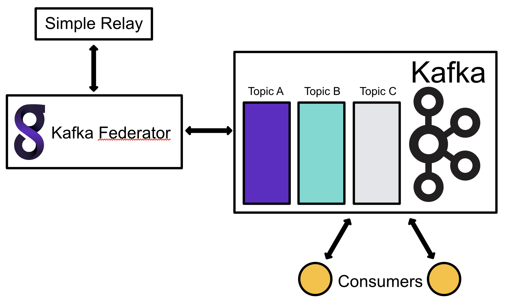

# Kafka Federator

Gravwell also provides a Kafka Federator, that behaves exactly like the Federator, except that it uses Kafka as an upstream transport. Ingesters can connect to it just as with Federator, and ingested entries will be put into Kafka Topics as messages. 



The Kafka Federator can be paired with the [Kafka Consumer](#!ingesters/kafka.md) to read messages from a topic and ingest them into a Gravwell indexer.

## Configuration

Kafka Federator defines listeners and Kafka headers. A listener is similar to a Federator listener, in which ingesters may connect and send entries. Listeners also define what topic to publish messages on. A header sets arbitrary key value pairs in the generated Kafka header. 

Additionally, the global section defines a group leader to connect to and a partition.

## Example

This example generates a single listener that allows tags "windows" and "syslog". Messages are published to the "testing" Kafka topic. A header is also defined that sets several key/value pairs. Note that the special `$TAG`, `$SRC` values are available for use in setting values in a Kafka header. 

```
[Global]
Leader=10.10.0.1:9092                           #point at the kafka group leader
Partition=0                                     #set partition, default to 0 if not specified
Log-Level=INFO                                  #set log level to INFO, OFF disable log out put
Log-File=/opt/gravwell/log/kafka_federator.log  #specify a log file, delete to disable log file

[IngestListener "enclaveA"]
	Ingest-Secret = CustomSecrets
	Cleartext-Bind = 0.0.0.0:4423
	Tags=windows
	Tags=syslog
	Topic=testing
	Kafka-Header-Set=headers

[KafkaHeaders "headers"]
	TAG=$TAG
	SRC=$SRC
	source=$SRC
	foo=bar
```

## Special variables

Kafka headers can be populated with special variables, as shown in the example above.

| Variable | Description |
|----------|-------------|
| $TAG | The entry tag |
| $SRC | The entry source |

