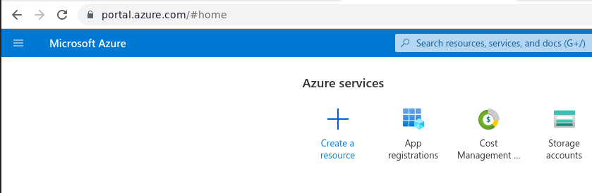
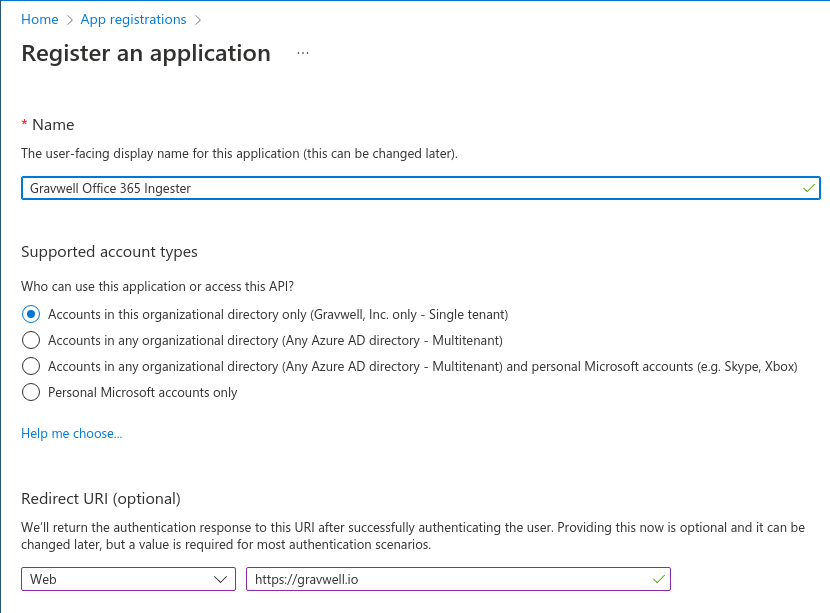
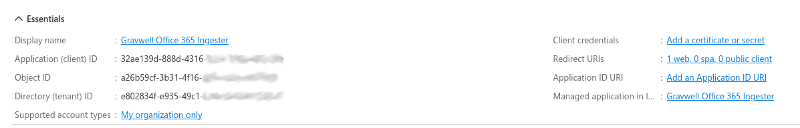
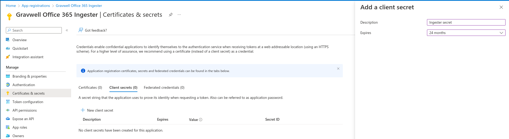
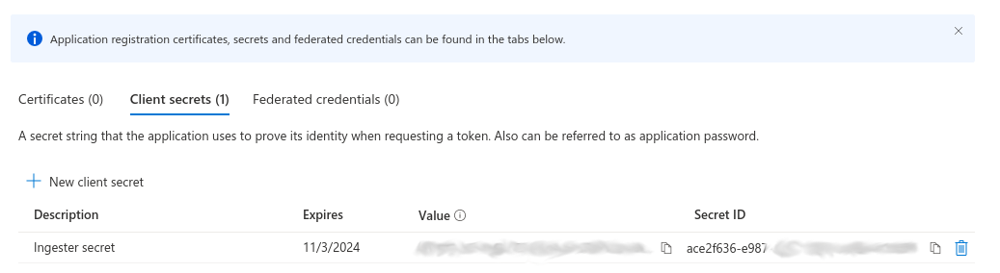

# Office 365 Log Ingester

Gravwell provides an ingester for Microsoft Office 365 logs. The ingester can process all supported log types. In order to configure the ingester, you will need to register a new *application* within the Azure Active Directory management portal; this will generate a set of keys which can be used to access the logs. You will need the following information:

* Client ID: A UUID generated for your application via the Azure management console
* Client secret: A secret token generated for your application via the Azure console
* Azure Directory ID: A UUID representing your Active Directory instance, found in the Azure Active Directory dashboard.  This is sometimes called a Tenant ID.
* Tenant Domain: The domain of your Office 365 domain, e.g. "mycorp.onmicrosoft.com"
* Plan: The type of Office 365 subscription
 * Options are `Enterprise`, `GCC Government`, `GCC High Government`, `DOD Government`

## Office 365 API

The Office 365 API provides a limited set of audit activity for clients. This is not a high fidelity dump of all user activity, nor is it an introspection into email content or activity.  The data provided by the API can provide high level views into basic API activity for accounts.

The [Microsoft Office 365 Management Activity API documentation](https://learn.microsoft.com/en-us/office/office-365-management-api/office-365-management-activity-api-reference) can provide more concrete details on what you can and cannot see via this API.

Note: Your subscription tier heavily influences the depth and quantity of data available in the API. Low-end plans provide very little, while more expensive plans like `GCC High Government` can provide much more detailed audit activity.


## Creating an Azure Application

To create a new Azure Application for our ingester you will need to visit the [Azure Portal](https://portal.azure.com) and log in with administrative O365 credentials.  Then you will need to go to the *App registrations* section.



Within the App registrations portal create a "New registration".



Provide a human friendly name so that you remember why you created this application.  Select an appropriate account type and specify a valid Redirect URI (the ingester will not use this redirect URI but it should be valid and owned by your organization).



Then you will need to grant this application permission to use the Office 365 Management APIs.  This permission allows the ingester to request audit data from the management APIs, including activity and DLP data.  If you do not wish to ingest the DLP data you can remove the DLP log permission.


Finally you will need to go to "Certificates & secrets" and request a new application secret. This will provide a "Secret ID" and "Secret Value".  The Secret Value is what is needed for the ingester configuration.





## Installation and configuration

First, download the installer from the [Downloads page](#!quickstart/downloads.md), then install the ingester:

```
root@gravserver ~# bash gravwell_o365_installer.sh
```

If the Gravwell services are present on the same machine, the installation script should automatically extract and configure the `Ingest-Auth` parameter and set it appropriately. You will now need to open the `/opt/gravwell/etc/o365_ingest.conf` configuration file and set it up for your Office 365 account, replacing the placeholder fields and modifying tags as desired. Once you have modified the configuration as described below, start the service with the command `systemctl start gravwell_o365_ingest.service`

### Basic Configuration

The O365 ingester uses the unified global configuration block described in the [ingester section](#!ingesters/ingesters.md#Global_Configuration_Parameters).  Like most other Gravwell ingesters, the O365 ingester supports multiple upstream indexers, TLS, cleartext, and named pipe connections, a local cache, and local logging.

#### Global Configuration Parameters

| Parameter     | Type    | Default Value     | Description |
|---------------|---------|-------------------|-------------|
| Client-ID     | UUID |                   | Identifier generated for your application via the Azure management console |
| Client-Seecret | String |                | Secret token generated for your application via the Azure console |
| Directory-ID  | UUID |                   | Identifier representing your Active Directory instance, found in the Azure Active Directory dashboard.  This is sometimes called a Tenant ID |
| Tenant-Domain | FQDN |                   | The domain of your Office 365 domain, e.g. "mycorp.onmicrosoft.com" |
| Plan-Name      | String | Enterprise     |  The type of Office 365 subscription in use.  Options are `Enterprise`, `GCC Government`, `GCC High Government`, `DOD Government` |


#### Content-Type Configuration Parameters
| Parameter     | Type    | Default Value     | Description |
|---------------|---------|-------------------|-------------|
| Content-Type  | String  |                   | The log category to fetch from the Microsoft Office 365 audit API |
| Tag-Name      | String  |                   | The Gravwell tag to associate with the fetched log category |

### Example Configuration

The example below shows a sample configuration which connects to an indexer on the local machine (note the `Pipe-Backend-target` setting) and feeds it logs from all supported log types:

```
[Global]
Ingest-Secret = IngestSecrets
Connection-Timeout = 0
Pipe-Backend-target=/opt/gravwell/comms/pipe #a named pipe connection, this should be used when ingester is on the same machine as a backend
Log-Level=ERROR #options are OFF INFO WARN ERROR
State-Store-Location=/opt/gravwell/etc/o365_ingest.state

Client-ID="79fb8690-109f-11ea-a253-2b12a0d35073"
Client-Secret="<secret>"
Directory-ID="e8b7895e-109f-11ea-9dcc-93fb14b5dab5"
Tenant-Domain="acme.gov"
Plan-Name="GCC Government"

[ContentType "azureAD"]
	Content-Type="Audit.AzureActiveDirectory"
	Tag-Name="365-azure"

[ContentType "exchange"]
	Content-Type="Audit.Exchange"
	Tag-Name="365-exchange"

[ContentType "sharepoint"]
	Content-Type="Audit.SharePoint"
	Tag-Name="365-sharepoint"

[ContentType "general"]
	Content-Type="Audit.General"
	Tag-Name="365-general"

[ContentType "dlp"]
	Content-Type="DLP.All"
	Tag-Name="365-dlp"
```
