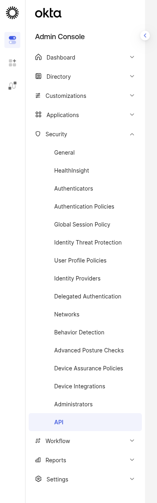
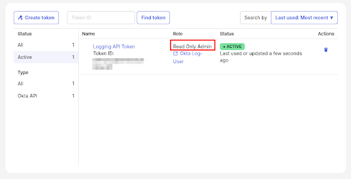
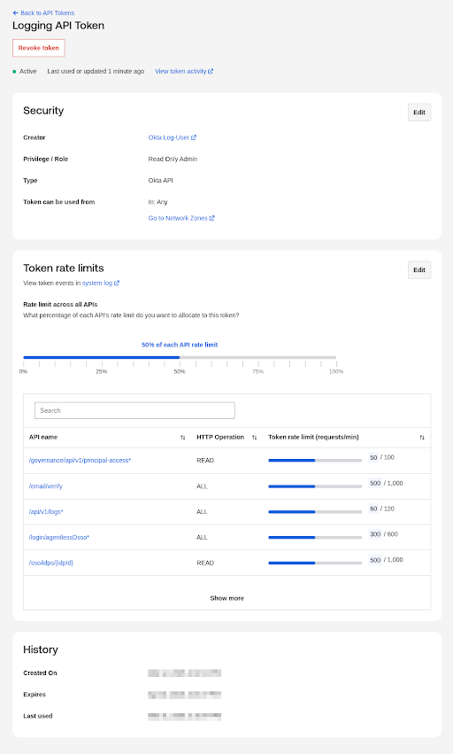

---
myst:
  substitutions:
    package: "gravwell-hosted-runner"
    standalone: "gravwell_hosted_runner"
    dockername: "hosted_runner"
---
# Okta Ingester

The [Okta](https://www.okta.com/) ingester polls the Okta System Log and Users APIs.

* **System logs** (`okta` tag) all Okta system events: logins, MFA challenges, policy evaluations, admin actions, application access, and more. Events are ingested in order with timestamps preserved from the original records.
* **User records** (`okta-users` tag) snapshots of user profile changes, polled every 10 minutes. Useful for correlating identities against activity in the system log.

The tags `okta` and `okta-users` are fixed and expected by the Gravwell Okta kit; they cannot be changed.

This ingester runs as a plugin inside the [Gravwell Hosted Runner](hosted_runner_configuration). Multiple Okta stanzas can coexist alongside other Hosted Runner plugins in a single configuration file.

## Installation

```{include} installation_instructions_template 
```

If you already have the hosted runner installed, you can modify the config.

## Configuration

To configure the ingester you will need the following from Okta:

* **Domain**: Your Okta account domain, e.g. `myorg.okta.com`
* **API Token**: A token generated from the Okta Admin Console. This should be created for a dedicated Read Only Admin service account, not a token from a user. 

See the [Okta documentation](https://developer.okta.com/docs/guides/create-an-api-token/main/) for instructions on generating an API token.

### Creating an Okta Token

Start by creating a dedicated Okta Service Account for logging purposes (something like "Okta Log User"). This user should be assigned to the "Read Only Admin" role. 

```{attention}
Do **not** use a token with write permissions to your Okta instance to the ingester. This gives significantly more access than is needed for monitoring. 
```

You can create an API token in the Okta Admin Console > Security > Api section. 



Create a token....

Once create you should see this token in your list and should double-check the role is "Read Only Admin", and that it is attached to a dedicated service account.



### Token Rate Limits
Okta is extremely sensitive to rate limits so double-check your token rate limits align to the `Request-Per-Minute` Config Parameter. The Ingester primarily hits the `/api/v1/logs` endpoint.



### Okta Stanza Parameters

The Okta ingester is configured via `[Okta "name"]` stanzas in the Hosted Runner configuration file, typically `/opt/gravwell/etc/hosted_runner.conf`. The `[Ingest]` and `[State]` blocks common to all Hosted Runner plugins are described in [Hosted Runner Configuration](hosted_runner_configuration).

| Config Parameter   | Type    | Required | Default | Description                                                               |
|--------------------|---------|----------|---------|---------------------------------------------------------------------------|
| Ingester-UUID      | UUID    | yes      |         | A unique UUID for this ingester instance. Used for state tracking.        |
| Domain             | string  | yes      |         | Your Okta account domain. Must end in `okta.com` (e.g. `myorg.okta.com`). |
| Token              | string  | yes      |         | Okta SSWS API token from the Okta Admin Console.                          |
| Request-Batch-Size | integer | no       | 100     | Number of log entries to request per API call.                            |
| Request-Per-Minute | integer | no       | 60      | Maximum number of API requests per minute.                                |
| Request-Burst      | integer | no       | 10      | Burst capacity for the request rate limiter.                              |

## Example Configuration

```
[Okta "myorg"]
    Ingester-UUID="99c00000-0000-0000-0000-000000000000"
    Domain="myorg.okta.com"
    Token="your-okta-api-token"
```

With optional rate limiting tuned down for lower-tier Okta plans:

```
[Okta "myorg"]
    Ingester-UUID="99c00000-0000-0000-0000-000000000000"
    Domain="myorg.okta.com"
    Token="your-okta-api-token"
    Request-Per-Minute=10
    Request-Burst=5
    Request-Batch-Size=100
```

## Additional Resources

* [Okta System Log API Reference](https://developer.okta.com/docs/reference/api/system-log/)
* [Okta Users API Reference](https://developer.okta.com/docs/reference/api/users/)
* [Creating an Okta API Token](https://developer.okta.com/docs/guides/create-an-api-token/main/)
