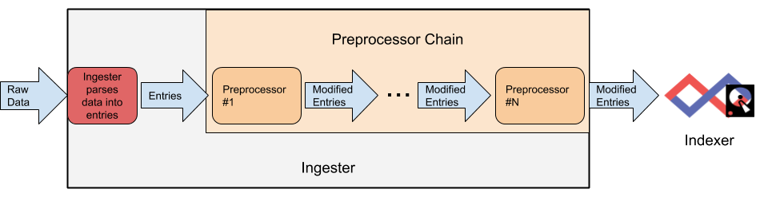

# Ingest Preprocessors

Sometimes, ingested data needs some additional massaging before we send it to the indexer. Maybe you're getting JSON data sent over syslog and would like to strip out the syslog headers. Maybe you're getting gzip-compressed data from an Apache Kafka stream. Maybe you'd like to be able to route entries to different tags based on the contents of the entries. Ingest preprocessors make this possible by inserting one or more processing steps before the entry is sent up to the indexer.

## Preprocessor Data Flow

An ingester reads raw data from some source (a file, a network connection, an Amazon Kinesis stream, etc.) and splits that incoming data stream out into individual entries. Before those entries are sent to a Gravwell indexer, they may optionally be passed through an arbitrary number of preprocessors as shown in the diagram below.



Each preprocessor will have the opportunity to modify the entries. The preprocessors will always be applied in the same order, meaning you could e.g. uncompress the entry's data, then modify the entry tag based on the uncompressed data.

## Configuring Preprocessors

Preprocessors are supported on all packaged ingesters.  One-off and unsupported ingesters may not support preprocessors.

Preprocessors are configured in the ingester's config file using the `preprocessor` configuration stanza.  Each Preprocessor stanza must declare the preprocessor module in use via the `Type` configuration parameter, followed by the preprocessor's specific configuration parameters. Consider the following example for the Simple Relay ingester:

```
[Global]
Ingester-UUID="e985bc57-8da7-4bd9-aaeb-cc8c7d489b42"
Ingest-Secret = IngestSecrets
Connection-Timeout = 0
Insecure-Skip-TLS-Verify=true
Cleartext-Backend-target=127.0.0.1:4023 #example of adding a cleartext connection
Log-Level=INFO

[Listener "default"]
	Bind-String="0.0.0.0:7777" #we are binding to all interfaces, with TCP implied
	Tag-Name=default
	Preprocessor=timestamp

[Listener "syslog"]
	Bind-String="0.0.0.0:601" # TCP syslog
	Tag-Name=syslog

[preprocessor "timestamp"]
	Type = regextimestamp
	Regex ="(?P<badtimestamp>.+) MSG (?P<goodtimestamp>.+) END"
	TS-Match-Name=goodtimestamp
	Timezone-Override=US/Pacific
```

This configuration defines two data consumers (Simple Relay calls them "Listeners") named "default" and "syslog". It also defines a preprocessor named "timestamp". Note how the "default" listener includes the option `Preprocessor=timestamp`. This specifies that entries coming from that listener on port 7777 should be sent to the "timestamp" preprocessor. Because the "syslog" listener does not set any `Preprocessor` option, entries coming in on port 601 will not go through any preprocessors.

## gzip Preprocessor

The gzip preprocessor can uncompress entries which have been compressed with the GNU 'gzip' algorithm.

The GZIP preprocessor Type is `gzip`.

### Supported Options

* `Passthrough-Non-Gzip` (boolean, optional): if set to true, the preprocessor will pass through any entries whose contents cannot be uncompressed with gzip. By default, the preprocessor will drop any entries which are not gzip-compressed.

### Common Use Cases

Many cloud data bus providers will ship entries and/or package in a compressed form.  This preprocessor can decompress the data stream in the ingester rather than routing through a cloud lambda function can incur costs.


### Example: Decompressing compressed entries

Example config:

```
[Preprocessor "gz"]
	Type=gzip
	Passthrough-Non-Gzip=true
```

## JSON Extraction Preprocessor

The JSON extraction preprocessor can parse the contents of an entry as JSON, extract one or more fields from the JSON, and replace the entry contents with those fields. This is a useful way to simplify overly-complex messages into more concise entries containing only the information of interest.

If only a single field extraction is specified, the result will contain purely the contents of that field; if multiple fields are specified, the preprocessor will generate valid JSON containing those fields.

The JSON Extraction preprocessor Type is `jsonextract`.

### Supported Options

* `Extractions` (string, required): This specifies the field or fields (comma-separated) to be extracted from the JSON. Given an input of `{"foo":"a", "bar":2, "baz":{"frog": "womble"}}`, you could specify `Extractions=foo`, `Extractions=foo,bar`, `Extractions=baz.frog,foo`, etc.
* `Force-JSON-Object` (boolean, optional): By default, if a single extraction is specified the preprocessor will replace the entry contents with the contents of that extension; thus selecting `Extraction=foo` will change an entry containing `{"foo":"a", "bar":2, "baz":{"frog": "womble"}}` to simply contain `a`. If this option is set, the preprocessor will always output a full JSON structure, e.g. `{"foo":"a"}`.
* `Passthrough-Misses` (boolean, optional): If set to true, the preprocessor will pass along entries for which it was unable to extract the requested fields. By default, these entries are dropped.
* `Strict-Extraction` (boolean, optional): By default, the preprocessor will pass along an entry if at least one of the extractions succeeds. If this parameter is set to true, it will require that all extractions succeed.

### Common Use Cases

Many data sources may provide additional metadata related to transport and/or storage that are not part of the actual log stream.  The jsonextract preprocessor can downselect fields to reduce storage costs.

### Example: Condensing JSON Data Records

```
[Preprocessor "json"]
	Type=jsonextract
	Extractions=IP,Alert.ID,Message
	Passthrough-Misses=true
```

## JSON Array Split Preprocessor

This preprocessor can split an array in a JSON object into individual entries. For example, given an entry which contains an array of names, the preprocessor will instead emit one entry for each name. Thus this:

```
{"IP": "10.10.4.2", "Users": ["bob", "alice"]}
```

Becomes two entries, one containing "bob" and one containing "alice".

The JSON Array Split preprocessor Type is `jsonarraysplit`.

### Supported Options

* `Extraction` (string): specifies the JSON field containing a struct which should be split, e.g. `Extraction=Users`, `Extraction=foo.bar`. If you do not set `Extraction`, the preprocessor will attempt to treat the entire object as an array to split.
* `Passthrough-Misses` (boolean, optional): If set to true, the preprocessor will pass along entries for which it was unable to extract the requested field. By default, these entries are dropped.
* `Force-JSON-Object` (boolean, optional): By default, the preprocessor will emit entries with each containing one item in the list and nothing else; thus extracting `foo` from `{"foo": ["a", "b"]}` would result in two entries containing "a" and "b" respectively. If this option is set, that same entry would result in two entries containing `{"foo": "a"}` and `{"foo": "b"}`.
* `Additional-Fields` (string, optional): A comma delimited list of additional fields outside the array to be split that will be extracted and included in each entry, e.g. `Additional-Fields="foo,bar, foo.bar.baz"`

### Common Use Cases

Many data providers may pack multiple events into a single entry which can degrade the atomic nature of an event and increase the complexity of analysis.  Splitting a single message that contains multiple events into individual entries can simplify working with the events.


### Example: Splitting Multiple Messages In a Single Record

To split entries which consist of JSON records with an array named "Alerts":

```
[preprocessor "json"]
	Type=jsonarraysplit
	Extraction=Alerts
	Force-JSON-Object=true
```

Input data:

```
{ "Alerts": [ "alert1", "alert2" ] }
```

Output:

```
{ "Alerts": "alert1" }
```

```
{ "Alerts": "alert2" }
```

### Example: Splitting a Top-Level Array

Sometimes the entire entry is an array:

```
[ {"foo": "bar"}, {"x": "y"} ]
```

To split this, use the following definition:

```
[preprocessor "json"]
	Type=jsonarraysplit
```

Leaving the Extraction parameter un-set tells the module to treat the entire entry as an array, giving the following two output entries:

```
{"foo": "bar"}
```

```
{"x": "y"}
```

## JSON Field Filtering Preprocessor

This preprocessor will parse entry data as a JSON object, then extract specified fields and compare them against lists of acceptable values. The lists of acceptable values are specified in files on the disk, one value per line.

It can be configured to either *pass* only those entries whose fields match the lists, or to *drop* those entries which match the lists--whitelisting, or blacklisting. It can be set up to filter against multiple fields, requiring either that *all* fields must match (logical AND) or that *at least one* field must match (logical OR).

This preprocessor is particularly useful to narrow down a firehose of general data before sending it across a slow network link.

The JSON Field Filtering preprocessor Type is `jsonfilter`.

### Supported Options

* `Field-Filter` (string, required): This specifies two things: the name of the JSON field of interest, and the path to a file which contains values to match against. For example, one might specify `Field-Filter=ComputerName,/opt/gravwell/etc/computernames.txt` in order to extract a field named "ComputerName" and compare it against values in `/opt/gravwell/etc/computernames.txt`. The `Field-Filter` option may be specified multiple times in order to filter against multiple fields.
* `Match-Logic` (string, optional): This parameter specifies the logic operation to use when filtering against multiple fields. If set to "and", an entry is only considered a match when *all* specified fields match against the given lists. If set to "or", an entry is considered a match when *any* field matches.
* `Match-Action` (string, optional): This specifies the option which should be take for entries whose fields match the provided lists. It may be set to "pass" or "drop"; if omitted, the default is "pass". If set to "pass", entries which match will be allowed to pass to the indexer (whitelisting). If set to "drop", entries which match will be dropped (blacklisting).

The `Match-Logic` parameter is only necessary when more than one `Field-Filter` has been specified.

Note: If a field is specified in the configuration but is not present on an entry, the preprocessor will treat the entry *as if the field existed but did not match anything*. Thus, if you have configured the preprocessor to only pass those entries whose fields match your whitelist, an entry which lacks one of the fields will be dropped.

### Common Use Cases

The json field filtering preprocessor can down select entries based on fields within the entries.  This allows for building blacklists and whitelists on data flows to ensure that data either does or does not make it to storage.

### Example: Simple Whitelisting

Suppose we have an endpoint monitoring solution which is sending thousands of events per second detailing things which are occurring across the enterprise. Due to the high event volume, we may decide we only want to index events with a certain severity. Luckily, the events include a Severity field:

```
{ "EventID": 1337, "Severity": 8, "System": "email-server-01.example.org", [...] }
```

We know the Severity field goes from 0 to 9, and we decide we want to only pass events with a severity of 6 or higher. We would therefore add the following to our ingester configuration file:

```
[preprocessor "severity"]
	Type=jsonfilter
	Match-Action=pass
	Field-Filter=Severity,/opt/gravwell/etc/severity-list.txt
```

and set `Preprocessor=severity` on the appropriate data input, for instance if we were using Simple Relay:

```
[Listener "endpoint_monitoring"]
	Bind-String="0.0.0.0:7700
	Tag-Name=endpoint
	Preprocessor=severity
```

Finally, we create `/opt/gravwell/etc/severity-list.txt` and populate it with a list of acceptable Severity values, one per line:

```
6
7
8
9
```

After restarting the ingester, it will extract the `Severity` field from each entry and compare the resulting value against those listed in the file. If the value matches a line in the file, the entry will be sent to the indexer. Otherwise, it will be dropped.

### Example: Blacklisting

Building on the previous example, we may find that that our endpoint monitoring system is generating a *lot* of high-severity false positives from certain systems. We may determine that events with the `EventID` field set to 219, 220, or 1338 and the `System` field set to "webserver-prod.example.org" and "webserver-dev.example.org" are always false positives. We can define another preprocessor to get rid of these entries before they are sent to the indexer:

```
[preprocessor "falsepositives"]
	Type=jsonfilter
	Match-Action=drop
	Match-Logic=and
	Field-Filter=EventID,/opt/gravwell/etc/eventID-blacklist.txt
	Field-Filter=System,/opt/gravwell/etc/system-blacklist.txt
```

If we now add this preprocessor to the data input configuration *after* the existing one, the ingester will apply the two filters in order:

```
[Listener "endpoint_monitoring"]
	Bind-String="0.0.0.0:7700
	Tag-Name=endpoint
	Preprocessor=severity
	Preprocessor=falsepositives
```

Last, we create `/opt/gravwell/etc/eventID-blacklist.txt`:

```
219
220
1338
```

and `/opt/gravwell/etc/system-blacklist.txt`:

```
webserver-prod.example.org
webserver-dev.example.org
```

This new preprocessor extracts the `EventID` and `System` fields from every entry which makes it past the first filter. It then compares them against the values in the files. Because we set `Match-Logic=and`, it considers an entry a match if *both* field values are found in the files. Because we set `Match-Action=drop`, any entry which matches on both fields will be dropped. Thus, an entry with EventID=220 and System=webserver-dev.example.org is dropped, while one with EventID=220 and System=email-server-01.example.org will *not* be dropped.

## Regex Router Preprocessor

The regex router preprocessor is a flexible tool for routing entries to different tags based on the contents of the entries. The configuration specifies a regular expression containing a [named capturing group](https://www.regular-expressions.info/named.html), the contents of which are then tested against user-defined routing rules.

The Regex Router preprocessor Type is `regexrouter`.

### Supported Options

* `Regex` (string, required): This parameter specifies the regular expression to be applied to the incoming entries. It must contain at least one [named capturing group](https://www.regular-expressions.info/named.html), e.g. `(?P<app>.+)` which will be used with the `Route-Extraction` parameter.
* `Route-Extraction` (string, required): This parameter specifies the name of the named capturing group from the `Regex` parameter which will contain the string used to compare against routes.
* `Route` (string, required): At least one `Route` definition is required. This consists of two strings separated by a colon, e.g. `Route=sshd:sshlogtag`. The first string ('sshd') is matched against the value extracted via regex, and the second string defines the name of the tag to which matching entries should be routed. If the second string is left blank, entries matching the first string *will be dropped*.
* `Drop-Misses` (boolean, optional): By default, entries which do not match the regular expression will be passed through unmodified. Setting `Drop-Misses` to true will make the ingester drop any entries which 1) do not match the regular expression, or 2) match the regular expression but do not match any of the specified routes.

### Example: Routing to Tag Based on App Field Value

To illustrate the use of this preprocessor, consider a situation where many systems are sending syslog entries to a Simple Relay ingester. We would like to separate out the sshd logs to a separate tag named `sshlog`. Incoming sshd logs are in old-style BSD syslog format (RFC3164):

```
<29>1 Nov 26 11:26:36 localhost sshd[11358]: Failed password for invalid user administrator from 202.198.122.184 port 49828 ssh2
```

By experimenting with regular expressions, we find that the following is a reasonable regular expression to extract the application name (e.g. sshd) from RFC3164 logs into a capturing group named "app":

```
^(<\d+>)?\d?\s?\S+ \d+ \S+ \S+ (?P<app>[^\s\[]+)(\[\d+\])?:
```

We can apply that regular expression to a preprocessor definition, as shown below:

```
[Listener "syslog"]
        Bind-String="0.0.0.0:2601" #we are binding to all interfaces, with TCP implied
        Tag-Name=syslog
        Preprocessor=bsdrouter

[preprocessor "bsdrouter"]
        Type = regexrouter
        Drop-Misses=false
	# Regex: <pri>version Month Day Time Host App[pid]
	Regex="^(<\\d+>)?\\d?\\s?\\S+ \\d+ \\S+ \\S+ (?P<app>[^\\s\\[]+)(\\[\\d+\\])?:"
        Route-Extraction=app
        Route=sshd:sshlog
```

Note that the preprocessor defines the regular expression, then calls out the capturing group "app" in the `Route-Extraction` parameter. It then uses the `Route=ssh:sshlog` definition to specify that those entries whose application name matches "sshd" should be routed to the tag "sshlog". We could define additional `Route` parameters as needed, e.g. `Route=apache:apachelog`.

With the above configuration, logs from sshd will be sent to the "sshlog" tag, while all other logs will go straight to the "syslog" tag. We could extract other applications from similarly-formatted syslog entries by adding additional `Route` specifications, but suppose we had some intermingled logs in RFC 5424 format, as shown below?

```
<101>1 2019-11-26T13:24:56.632535-07:00 web01.example.org webservice 21581 - [useragent="Mozilla/5.0 (Windows NT 10.0; Win64; x64) AppleWebKit/537.36 (KHTML, like Gecko) Chrome/62.0.3191.0 Safari/537.36"] GET /
```

The regular expression we already have won't extract the application name ("webservice") properly, but we can define a *second* preprocessor and put it in the preprocessor chain after the existing one:

```
[Listener "syslog"]
        Bind-String="0.0.0.0:2601" #we are binding to all interfaces, with TCP implied
        Tag-Name=syslog
        Preprocessor=bsdrouter
	Preprocessor=rfc5424router

[preprocessor "bsdrouter"]
        Type = regexrouter
        Drop-Misses=false
	# Regex: <pri>version Month Day Time Host App[pid]
	Regex="^(<\\d+>)?\\d?\\s?\\S+ \\d+ \\S+ \\S+ (?P<app>[^\\s\\[]+)(\\[\\d+\\])?:"
        Route-Extraction=app
        Route=sshd:sshlog

[preprocessor "rfc5424router"]
	Type=regexrouter
	Drop-Misses=false
	# Regex: <pri>version Date Host App
	Regex="^<\\d+>\\d? \\S+ \\S+ (?P<app>\\S+)"
	Route-Extraction=app
	Route=webservice:weblog
	Route=apache:weblog
	Route=postfix:		# drop
```

Note that this new preprocessor definition defines routes for the applications named "webservice" and "apache", sending both to the "weblog" tag. Note also that it specifies that logs from the "postfix" application should be *dropped*, perhaps because those logs are already being ingested from another source.

## Source Router Preprocessor

The source router preprocessor can route entries to different tags based on the SRC field of the entry. Typically the SRC field will be the IP address of the entry's origination point, e.g. the system which created the syslog message sent to Simple Relay.

The source router preprocessor Type is `srcrouter`.

### Supported Options

* `Route` (string, optional): `Route` defines a mapping of SRC field value to tag, separated by a colon. For instance, `Route=192.168.0.1:server-logs` will send all entries with SRC=192.168.0.1 to the "server-logs" tag. Multiple `Route` parameters can be specified. Leaving the tag blank (`Route=192.168.0.1:`) tells the preprocessor to drop all matching entries instead.
* `Route-File` (string, optional): `Route-File` should contain a path to a file containing newline-separated route specifications, e.g. `192.168.0.1:server-logs`.
* `Drop-Misses` (boolean, optional): By default, entries which do not match any of the defined routes will be passed through unmodified. Setting `Drop-Misses` to true will instead drop any entries which do not explicitly match a route definition.

At least one `Route` definition is required, unless `Route-File` is used.

A route can be either a single IP address or a properly formed CIDR specification, both IPv4 and IPv6 are supported.

### Example: Inline Route Definitions

The snippet below shows part of a Simple Relay ingester configuration that uses the source router preprocessor with routes defined inline. Entries originating from 10.0.0.1 will be tagged "internal-syslog", entries originating from 7.82.33.4 will be tagged "external-syslog", and all other entries will retain the default tag "syslog". Any entries with SRC=3.3.3.3 will be dropped.

```
[Listener "syslog"]
        Bind-String="0.0.0.0:2601" #we are binding to all interfaces, with TCP implied
        Tag-Name=syslog
        Preprocessor=srcroute

[preprocessor "srcroute"]
        Type = srcrouter
        Route=10.0.0.0/24:internal-syslog
        Route=7.82.33.4:external-syslog
        Route=3.3.3.3:
        Route=DEAD::BEEF:external-syslog
        Route=FEED:FEBE::0/64:external-syslog
```

### Example: File-based Definitions

The snippet below shows part of a Simple Relay ingester configuration that uses the source router preprocessor with routes defined in a file.

```
[Listener "syslog"]
        Bind-String="0.0.0.0:2601" #we are binding to all interfaces, with TCP implied
        Tag-Name=syslog
        Preprocessor=srcroute

[preprocessor "srcroute"]
        Type = srcrouter
        Route-File=/opt/gravwell/etc/syslog-routes
```

The following is written to `/opt/gravwell/etc/syslog-routes`:

```
10.0.0.0/24:internal-syslog
7.82.33.4:external-syslog
3.3.3.3:
```

## Regex Timestamp Extraction Preprocessor

Ingesters will typically attempt to extract a timestamp from an entry by looking for the first thing which appears to be a valid timestamp and parsing it. In combination with additional ingester configuration rules for parsing timestamps (specifying a specific timestamp format to look for, etc.) this is usually sufficient to properly extract the appropriate timestamp, but some data sources may defy these straightforward methods. Consider a situation where a network device may send CSV-formatted event logs wrapped in syslog--a situation we have seen at Gravwell!

The Regex Timestamp Extraction preprocessor Type is `regextimestamp`.

### Supported Options

* `Regex` (string, required): This parameter specifies the regular expression to be applied to the incoming entries. It must contain at least one [named capturing group](https://www.regular-expressions.info/named.html), e.g. `(?P<timestamp>.+)` which will be used with the `TS-Match-Name` parameter.
* `TS-Match-Name` (string, required): This parameter gives the name of the named capturing group from the `Regex` parameter which will contain the extracted timestamp.
* `Timestamp-Format-Override` (string, optional): This can be used to specify an alternate timestamp parsing format. Available time formats are:
	- AnsiC
	- Unix
	- Ruby
	- RFC822
	- RFC822Z
	- RFC850
	- RFC1123
	- RFC1123Z
	- RFC3339
	- RFC3339Nano
	- Apache
	- ApacheNoTz
	- Syslog
	- SyslogFile
	- SyslogFileTZ
	- DPKG
	- NGINX
	- UnixMilli
	- ZonelessRFC3339
	- SyslogVariant
	- UnpaddedDateTime
	- UnpaddedMilliDateTime
	- UK
	- Gravwell
	- LDAP
	- UnixSeconds
	- UnixMs
	- UnixNano

	Some timestamp formats have values that overlap (for example LDAP and UnixNano can produce timestamps with the same number of digits). If `Timestamp-Format-Override` is not used, the preprocessor will attempt to derive the timestamp in the order listed above. Always use `Timestamp-Format-Override` if using a timestamp format that can conflict with others in this list.

* `Timezone-Override` (string, optional): If the extracted timestamp doesn't contain a timezone, the timezone specified here will be applied. Example: `US/Pacific`, `Europe/Rome`, `Cuba`.
* `Assume-Local-Timezone` (boolean, optional): This option tells the preprocessor to assume the timestamp is in the local timezone if no timezone is included. This is mutually exclusive with the `Timezone-Override` parameter.


### Common Use Cases

Many data streams may have multiple timestamps or values that can easily be interpreted as timestamps.  The regextimestamp preprocessor allows you to force timegrinder to examine a specific timestamp within a log stream.  A good example is a log stream that is transported via syslog using an application that includes it's own timestamp but does not relay that timestamp to the syslog API.  The syslog wrapper will have a well formed timestamp which, but the actual data stream may need to use some internal field for the accurate timestamp.

### Example: Wrapped Syslog Data

```
Nov 25 15:09:17 webserver alerts[1923]: Nov 25 14:55:34,GET,10.1.3.4,/info.php
```

We would like to extract the inner timestamp, "Nov 25 14:55:34", for the TS field on the ingested entry. Because it uses the same format as the syslog timestamp at the beginning of the line, we cannot extract it with clever timestamp format rules. However, the regex timestamp preprocessor can be used to extract it. By specifying a regular expression which captures the desired timestamp in a named submatch, we can extract timestamps from anywhere in an entry. For this entry, the regex `\S+\s+\S+\[\d+\]: (?<timestamp>.+),` should be sufficient to properly extract the desired timestamp.

This config could be used to extract the timestamp shown in the example above:

```
[Preprocessor "ts"]
	Type=regextimestamp
	Regex="\S+\s+\S+\[\d+\]: (?P<timestamp>.+),"
	TS-Match-Name=timestamp
	Timezone-Override=US/Pacific
```

## Regex Extraction Preprocessor

It is highly common for transport buses to wrap data streams with additional metadata that may not be pertinent to the actual event.  Syslog is an excellent example where the Syslog header may not provide value to the underlying data and/or may simply complicate the analysis of the data.  The regexextractor preprocessor allows for declaring a regular expression that can extract multiple fields and reform them into a new structure for format.

The regexextraction preprocessor uses named regular expression extraction fields and a template to extract data and then reform it into an output record.  Output templates can contain static values and completely reform the output data if needed.

Templates reference extracted values by name using field definitions similar to bash.  For example, if your regex extracted a field named `foo` you could insert that extraction in the template with `${foo}`. The templates also support the following special keys:

* `${_SRC_}`, which will be replaced by the SRC field of the current entry.
* `${_DATA_}`, which will be replaced by the string-formatted Data field of the current entry.
* `${_TS_}`, which will be replaced by the string-formatted TS (timestamp) field of the current entry.

The Regex Extraction preprocessor Type is `regexextract`.

### Supported Options

* Passthrough-Misses (boolean, optional): This parameter specifies whether the preprocessor should pass the record through unchanged if the regular expression does not match.
* Regex (string, required): This parameter defines the regular expression for extraction
* Template (string, required): This parameter defines the output form of the record.

### Common Use Cases

The regexpreprocessor is most commonly used for stripping un-needed headers from data streams, however it can be used to reform data into easier to process formats.

#### Example: Stripping Syslog Headers

Given the following record, we want to remove the syslog header and ship just the JSON blob.

```
<30>1 2020-03-20T15:35:20Z webserver.example.com loginapp 4961 - - {"user": "bob", "action": "login", "result": "success", "UID": 123, "ts": "2020-03-20T15:35:20Z"}
```

The syslog message contains a well structured JSON blob but the syslog transport adds additional metadata that does not necessarily enhance the record.  We can use the Regex extractor to pull out the data we want and reform it into an easy to use record.

We will use the regex extractor to pull out the data fields and the hostname, we will then use the template to build a new JSON blob with the host inserted.


```
[Listener "logins"]
	Bind-String="0.0.0.0:7777"
	Preprocessor=loginapp

[Preprocessor "loginapp"]
	Type=regexextract
	Regex="\\S+ (?P<host>\\S+) \\d+ \\S+ \\S+ (?P<data>\\{.+\\})$"
	Template="{\"host\": \"${host}\", \"data\": ${data}}"
```

NOTE: Regular expressions often have backslashes to describe character sets, those backslashes must be escaped!

The resulting data is:

```
{"host": "loginapp", "data": {"user": "bob", "action": "login", "result": "success", "UID": 123, "ts": "2020-03-20T15:35:20Z"}}
```

NOTE: Templates can specify multiple fields constant values.  Extracted fields can be inserted multiple times.

## Forwarding Preprocessor

The forwarding preprocessor is used to split a log stream and forward it to another endpoint.  This can be extremely useful when standing up additional logging tools or when feeding data to external archive processors.  The Forwarding preprocessor is a forking preprocessors.  This means that it will not alter the data stream, it only forwards the data on to additional endpoints.

By default the forwarding preprocessor is blocking, this means that if you specify a forwarding endpoint using a stateful connection like TCP or TLS and the endpoint is not up or is unable to accept data it will block ingestion.  This behavior can be altered using the `Non-Blocking` flag or by using a UDP protocol.

The forwarding preprocessor also supports several filter mechanisms to cut down or specify exactly which data streams are forwarded.  Streams can be filtered using entry tags, sources, or regular expressions which operation on the actual log data.  Each filter specification can be specified multiple times to create an OR pattern.

Multiple forwarding preprocessors can be specified, allowing for a specific log stream to be forwarded to multiple endpoints.

The Forwarding preprocessor Type is `forwarder`.

### Supported Options

* `Target` (string, required): Endpoint for forwarded data.  Should be a host:port pair unless using the `unix` protocol.
* `Protocol` (string, required): Protocol to use when forwarding data.  Options are `tcp`, `udp`, `unix`, and `tls`.
* `Delimiter` (string, optional): Optional delimiter to use when sending data via the `raw` output format.
* `Format` (string, optional): Output format to send data.  Options are `raw`, `json`, and `syslog`.
* `Tag` (string, optional, multiple allowed): Tags used to filter events.  Multiple specifications implies an OR.
* `Regex` (string, optional, multiple allowed): Regular expressions used to filter events.  Multiple specifications implies an OR.
* `Source` (string, optional, multiple allowed): IP or CIDR specifications used to filter events.  Multiple specifications implies an OR.
* `Timeout` (unsigned int, optional, specified in seconds):  Timeout on connection and write attempts for the forwarder
* `Buffer` (unsigned int, optional): Specifies the number of events that the forwarder can buffer when attempting to send data
* `Non-Blocking` (boolean, optional): True specifies that the forwarder will make a best effort to forward data, but will not block ingestion.
* `Insecure-Skip-TLS-Verify` (boolean, optional): Specifies that TLS based connections can ignore invalid TLS certificates.

### Example: Forwarding syslog from a specific set of hosts

For this example we are using the SimpleRelay ingester to ingest syslog messages and forward them in their raw form to another endpoint.  We are using the `Source` filter in the `forward` preprocessor to ONLY forward logs that have the source tag that is from either the `192.168.0.1` IP or within the `192.168.1.0/24` subnet.  The logs are forwarded on in their original format with a newline between each.

```
[Listener "default"]              
	Bind-String="0.0.0.0:601"
	Reader-Type=rfc5424
	Tag-Name=syslog
	Preprocessor=forwardprivnet

[Preprocessor "forwardprivnet"]
	Type=Forwarder               
	Protocol=tcp
	Target="172.17.0.3:601"
	Format="raw"
	Delimiter="\n"
	Buffer=128
	Source=192.168.0.1
	Source=192.168.1.0/24
	Non-Blocking=false
```

### Example: Forwarding Specific Windows Event Logs

For this example we are using the Federator to forward on data streams from potentially many downstream ingesters.  We are using both the `Tag` and `Regex` filters to capture a specific set of entries and forward them on.  Note that we are using the `syslog` format which means that we will send data to the endpoint with an RFC5424 header and the data in the body of the syslog message.  Forwarded data using the syslog format specifies `gravwell` as the Hostname and the entry TAG as the Appname.

The `Tag` filters specify that we only want to forward entries that are using the `windows` or `sysmon` tags.

The `Regex` filters are used so that we only get event data from specific Channel/EventID combinations.  Namely login events from the security provider and execution events from the sysmon provider.
```
[IngestListener "enclaveA"]
	Ingest-Secret = IngestSuperSecrets
	Cleartext-Bind = 0.0.0.0:4023
	Tags=win*
	Preprocessor=forwardloginsysmon
	Preprocessor=forwardprivnet

[Preprocessor "forwardloginsysmon"]
	Type=Forwarder               
	Protocol=tcp
	Target="172.17.0.3:601"
	Format="syslog"
	Buffer=128
	Tag=windows
	Tag=sysmon
	Regex="Microsoft-Windows-Sysmon.+>(1|22)</EventID>"
	Regex="Microsoft-Windows-Security-Auditing.+>(4624|4625|4626)</EventID>"
	Non-Blocking=false

[Preprocessor "forwardsyslog"]
	Type=Forwarder               
	Protocol=tcp
	Target="172.17.0.3:601"
	Format="raw"
	Delimiter="\n"
	Buffer=128
	Tag=syslog
	Source=192.168.0.1
	Source=192.168.1.0/24
	Non-Blocking=false

```


### Example: Forwarding logs to multiple hosts

For this example we are using the Gravwell Federator to forward subsets of logs to different endpoints using different formats.  Because the forwarder preprocessor can be stacked the same way as any other preprocessor, we can specify multiple forwarding preprocessors with their own filters, endpoints, and formats.

```
[IngestListener "enclaveB"]
	Ingest-Secret = IngestSuperSecrets
	Cleartext-Bind = 0.0.0.0:4123
	Tags=win*
	Preprocessor=forwardloginsysmon

[Preprocessor "forwardloginsysmon"]
	Type=Forwarder               
	Protocol=tcp
	Target="172.17.0.3:601"
	Format="syslog"
	Buffer=128
	Tag=windows
	Tag=sysmon
	Regex="Microsoft-Windows-Sysmon.+>(1|22)</EventID>"
	Regex="Microsoft-Windows-Security-Auditing.+>(4624|4625|4626)</EventID>"
	Non-Blocking=false


```

## Gravwell Forwarding Preprocessor

The Gravwell forwarding processor allows for creating a complete Gravwell muxer which can duplicate entries to multiple instances of Gravwell.  This preprocessor can be useful for testing or situations where a specific Gravwell data stream needs to be duplicated to an alternate set of indexers.  The Gravwell forwarding preprocessor utilizes the same configuration structure to specify indexers, ingest secrets, and even cache controls as the packaged ingesters.  The Gravwell forwarding preprocessor is a blocking preprocessor, this means that if you do not enable a local cache it can block the ingest pipeline if the preprocessor cannot forward entries to the specified indexers.

The Gravwell Forwarding preprocessor Type is `gravwellforwarder`.

### Supported Options

See the [Global Configuration Parameters](#!ingesters/ingesters.md#Global_Configuration_Parameters) section for full details on all the Gravwell ingester options.  Most global ingester configuration options are supported by the Gravwell Forwarder preprocessor.

### Example: Duplicating Data In a Federator

For this example we are going to specify a complete Federator configuration that will duplicate all entries to a second cluster.

NOTE: We are enabling an `always` cache on the forwarding preprocessor so that it won't ever block the normal ingest path.

```
[Global]
Ingest-Secret = IngestSecrets
Connection-Timeout = 0
Verify-Remote-Certificates = true
Cleartext-Backend-Target=172.19.0.2:4023 #example of adding a cleartext connection
Log-Level=INFO

[IngestListener "enclaveA"]
	Ingest-Secret = CustomSecrets
	Cleartext-Bind = 0.0.0.0:4423
	Tags=windows
	Tags=syslog-*
	Preprocessor=dup

[Preprocessor "dup"]
	Type=GravwellForwarder
	Ingest-Secret = IngestSecrets
	Connection-Timeout = 0
	Cleartext-Backend-Target=172.19.0.4:4023 #indexer1
	Cleartext-Backend-Target=172.19.0.5:4023 #indexer2 (cluster config)
	Ingest-Cache-Path=/opt/gravwell/cache/federator_dup.cache # must be a unique path
	Max-Ingest-Cache=1024 #Limit forwarder disk usage
```

### Example: Stacking Duplicate Forwarders

For this example we are going to specify a complete Federator configuration and multiple Gravwell preprocessors so that we can duplicate our single stream of entries to multiple Gravwell clusters.

NOTE: The preprocessor control logic does NOT check that you are not forwarding to the same cluster multiple times.

```
[Global]
Ingest-Secret = IngestSecrets
Connection-Timeout = 0
Verify-Remote-Certificates = true
Cleartext-Backend-Target=172.19.0.2:4023 #example of adding a cleartext connection
Log-Level=INFO

[IngestListener "enclaveA"]
	Ingest-Secret = CustomSecrets
	Cleartext-Bind = 0.0.0.0:4423
	Tags=windows
	Tags=syslog-*
	Preprocessor=dup1
	Preprocessor=dup2
	Preprocessor=dup3

[Preprocessor "dup1"]
	Type=GravwellForwarder
	Ingest-Secret = IngestSecrets1
	Cleartext-Backend-Target=172.19.0.101:4023
	Ingest-Cache-Path=/opt/gravwell/cache/federator_dup1.cache
	Max-Ingest-Cache=1024

[Preprocessor "dup2"]
	Type=GravwellForwarder
	Ingest-Secret = IngestSecrets2
	Cleartext-Backend-Target=172.19.0.102:4023
	Ingest-Cache-Path=/opt/gravwell/cache/federator_dup2.cache
	Max-Ingest-Cache=1024

[Preprocessor "dup3"]
	Type=GravwellForwarder
	Ingest-Secret = IngestSecrets3
	Cleartext-Backend-Target=172.19.0.103:4023
	Ingest-Cache-Path=/opt/gravwell/cache/federator_dup3.cache
	Max-Ingest-Cache=1024
```

## Drop Preprocessor

The drop preprocessor does exactly what the name implies, it simple drops entries from the ingest pipeline, effectively throwing them away.

This processor can be useful if an ingest stream is to be primarily handled by another set of preprocessors.  For example, if you want to send data to a remote system using the forwarder preprocessor but NOT ingest it upstream into a Gravwell indexer, you could add a final `drop` preprocessor which will simply discard all entries that it sees.

### Supported Options

None.

### Example: Just Drop Everything

This example has a single preprocessor `drop` which just discards all entries on a Simple Relay listener.

```
[Listener "default"]              
	Bind-String="0.0.0.0:601"
	Reader-Type=rfc5424
	Tag-Name=syslog
	Preprocessor=dropit

[Preprocessor "dropit"]
	Type=Drop               
```

### Example: Forward Entries and Drop

This example forwards entries via a TCP forwarder then drops them.

```
[Listener "default"]              
	Bind-String="0.0.0.0:601"
	Reader-Type=rfc5424
	Tag-Name=syslog
	Preprocessor=forwardprivnet
	Preprocessor=dropit

[Preprocessor "forwardprivnet"]
	Type=Forwarder               
	Protocol=tcp
	Target="172.17.0.3:601"
	Format="raw"
	Delimiter="\n"
	Buffer=128
	Source=192.168.0.1
	Source=192.168.1.0/24
	Non-Blocking=false

[Preprocessor "dropit"]
	Type=Drop               
```

## Cisco ISE Preprocessor

The Cisco ISE preprocessor is designed to parse and accomodate the format and transport of Cisco ISE logs.  See the [Cisco Introduction to ISE Syslogs](https://www.cisco.com/c/en/us/td/docs/security/ise/syslog/Cisco_ISE_Syslogs/m_IntrotoSyslogs.pdf) for more information.

The Cisco ISE preprocessor is named `cisco_ise` and supports the ability to reassemble multipart messages, reformat the messages into a format more appropriate for Gravwell and modern syslog systems, filter unwanted message pairs, and remove redundant message headers.

### Attribute Filtering and Formatting

The Cisco ISE logging system is designed to split a single message across multiple syslog messages.  Gravwell will accept messages that far exceed the maximum message size of syslog, however if you are supporting multiple targets for Cisco ISE messages it may be necessary to enable multipart messages.  Disabling multipart messages in your cisco device and letting Gravwell handle large payloads will be far more efficient.

### Supported Options

* `Passthrough-Misses` (boolean, optional): If set to true, the preprocessor will pass along entries for which it was unable to extract a valid ISE message. By default, these entries are dropped.
* `Enable-Multipart-Reassembly` (boolean, optional): If set to true the preprocessor will attempt to reassemble messages that contain a Cisco remote message header.
* `Max-Multipart-Buffer` (uint64, optional): Specifies a maximum in-memory buffer to use when reassembling multipart messages, when the buffer is exceeded the oldest partially reassembled message will be sent to Gravwell.  The default buffer size is 8MB.
* `Max-Multipart-Latency` (string, optional): Specifies a maximum time duration that a partially reassembled multipart message will be held before it is sent.  Time spans should be specified in `ms` and `s` values.
* `Output-Format` (string, optional): Specifies the output format for sending ISE messages, the default format is `raw`, other options are `json` and `cef`.
* `Attribute-Drop-Filter` (string array, optional): Specifies globbing patterns that can be used to match against attributes within a message which will be removed from the output.  The arguments must be [Unix Glob patterns](https://en.wikipedia.org/wiki/Glob_(programming)), many patterns can be specified.  Attribute drop filters are not compatible with the `raw` output format.
* `Attribute-Strip-Header` (boolean, optional): Specifies that attributes with nested names and/or type information should have the header values stripped.  This is extremely useful for cleaning up poorly formed attribute values.


### Example Configuration

The following `cisco_ise` preprocessor configuration is designed to re-assemble multipart messages, remove unwanted `Step` attributes, and reform the output messages in the CEF format.  It also strips the cisco attribute headers.

```
[preprocessor "iseCEF"]
    Type=cisco_ise
    Passthrough-Misses=false #if its malformed just drop it
    Enable-Multipart-Reassembly=true
    Attribute-Drop-Filters="Step*"
    Attribute-Strip-Header=true
    Output-Format=cef
```

An example output message using this configuration is:

```
CEF:0|CISCO|ISE_DEVICE|||Passed-Authentication|NOTICE| sequence=1 ode=5200 class=Passed-Authentication text=Authentication succeeded ConfigVersionId=44 DeviceIPAddress=8.8.8.8 DestinationIPAddress=1.2.3.4 DestinationPort=1645 UserName=user@company.com Protocol=Radius RequestLatency=10301 audit-session-id=0a700e191cff70005fbbf63f
```

The following `cisco_ise` preprocessor configuration is achieves a similar result, but it contains two attribute filters and re-formats the output message into JSON 

```
[preprocessor "iseCEF"]
    Type=cisco_ise
    Passthrough-Misses=false #if its malformed just drop it
    Enable-Multipart-Reassembly=true
    Attribute-Drop-Filters="Step*"
    Attribute-Strip-Header=true
    Output-Format=json
```

An example output message using this configuration is:

```
{
  "TS":"2020-11-23T12:50:01.926-05:00",
  "Sequence":1,
  "ODE":"5200",
  "Severity":"NOTICE",
  "Class":"Passed-Authentication",
   "Text":"Authentication succeeded",
   "Attributes":{
     "AcsSessionID":"ISE_DEVICE/384429556/212087299",
     "AuthenticationIdentityStore":"AzureBackup",
     "AuthenticationMethod":"PAP_ASCII",
     "AuthenticationStatus":"AuthenticationPassed",
     "audit-session-id":"0a700e191cff70005fbbf63f",
     "device-mac":"00-0c-29-74-9d-e8",
     "device-platform":"win",
     "device-platform-version":"10.0.17134",
  }
}
```
