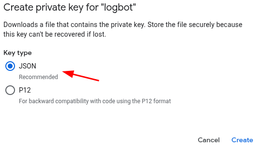
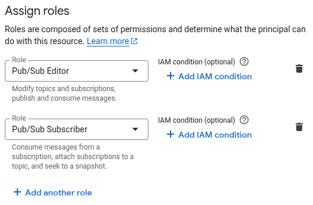

---
myst:
  substitutions:
    package: "gravwell-pubsub"
    standalone: "gravwell_pubsub_ingest"
    dockername: ""
---
# GCP PubSub Ingester

Gravwell provides an ingester capable of fetching entries from Google Compute Platform's [PubSub stream](https://cloud.google.com/pubsub/) service. The ingester can process multiple PubSub streams within a single GCP project. The process of setting up a PubSub stream is outside the scope of this document, but in order to configure the PubSub ingester for an existing stream you will need:

* The Google Project ID
* A file containing GCP service account credentials (see the [Creating a service account](https://cloud.google.com/docs/authentication/getting-started) documentation)
* The name of a PubSub topic

Once the stream is configured, each record in the PubSub stream topic will be stored as a single entry in Gravwell.

## Installation

```{include} installation_instructions_template 
```

## Basic Configuration

The PubSub ingester uses the unified global configuration block described in the [ingester section](ingesters_global_configuration_parameters).  Like most other Gravwell ingesters, PubSub supports multiple upstream indexers, TLS, cleartext, and named pipe connections, a local cache, and local logging.

The configuration file is at `/opt/gravwell/etc/pubsub_ingest.conf`. The ingester will also read configuration snippets from its [configuration overlay directory](configuration_overlays) (`/opt/gravwell/etc/pubsub_ingest.conf.d`).

## PubSub Examples

```
[PubSub "gravwell"]
	Topic-Name=mytopic	# the pubsub topic you want to ingest
	Tag-Name=gcp
	Parse-Time=false
	Assume-Local-Timezone=true

[PubSub "my_other_topic"]
	Topic-Name=foo # the pubsub topic you want to ingest
	Tag-Name=gcp
	Assume-Local-Timezone=false
```

## Installation and configuration

First, download the installer from the [Downloads page](/quickstart/downloads), then install the ingester:

```console
root@gravserver ~# bash gravwell_pubsub_ingest_installer.sh
```

If the Gravwell services are present on the same machine, the installation script should automatically extract and configure the `Ingest-Auth` parameter and set it appropriately. You will now need to open the `/opt/gravwell/etc/pubsub_ingest.conf` configuration file and set it up for your PubSub topic. Once you have modified the configuration as described below, start the service with the command `systemctl start gravwell_pubsub_ingest.service`

The example below shows a sample configuration which connects to an indexer on the local machine (note the `Pipe-Backend-target` setting) and feeds it from a single PubSub topic named "mytopic", which is part of the "myproject-127400" GCP project.

```
[Global]
Ingest-Secret = IngestSecrets
Connection-Timeout = 0
Insecure-Skip-TLS-Verify = false
Pipe-Backend-target=/opt/gravwell/comms/pipe #a named pipe connection, this should be used when ingester is on the same machine as a backend
Log-Level=ERROR #options are OFF INFO WARN ERROR

# The GCP project ID to use
Project-ID="myproject-127400"
Google-Credentials-Path=/opt/gravwell/etc/google-compute-credentials.json

[PubSub "gravwell"]
	Topic-Name=mytopic	# the pubsub topic you want to ingest
	Tag-Name=gcp
	Parse-Time=false
	Assume-Localtime=true
```

Note the following essential fields:

* `Project-ID` - the Project ID string for a GCP project
* `Google-Credentials-Path` - the path to a file containing GCP service account credentials in JSON format
* `Topic-Name` - the name of a PubSub topic within the specified GCP project

You can configure multiple `PubSub` sections to support multiple different PubSub topics within a single GCP project.

You can test the config by running `/opt/gravwell/bin/gravwell_pubsub_ingester -v` by hand; if it does not print out errors, the configuration is probably acceptable.

The PubSub ingester does not provide the `Ignore-Timestamps` option found in many other ingesters. PubSub messages include an arrival timestamp; by default, the ingester will use that as the Gravwell timestamp. If `Parse-Time=true` is specified in the data consumer definition, the ingester will instead attempt to extract a timestamp from the message body.

### Google Authentication Credentials

The PubSub ingester uses the Google Cloud SDK's authentication mechanism to access PubSub streams. This means that you will need to create a service account in GCP with the appropriate permissions, and then download the service account's credentials in JSON format. The path to the credentials file should be specified in the `Google-Credentials-Path` field of the configuration file.

Create a service account in the Google Cloud Console by visiting the [Service Accounts page](https://console.cloud.google.com/iam-admin/serviceaccounts) and clicking "Create Service Account". Follow the prompts to create a new service account and grant it the "Pub/Sub Subscriber" role. After creating the service account, click on it in the list to view its details, then navigate to the "Keys" tab and click "Add Key" -> "Create New Key". Choose the JSON key type and click "Create" to download the credentials file. Save this file to a secure location on the machine where the PubSub ingester is installed and update the `Google-Credentials-Path` field in the configuration file to point to it.



At a minimum, the PubSub ingester requires the "Pub/Sub Subscriber" role. If the ingester is configured without a Subscription ID, it will attempt to create a new subscription to the configured topic automatically, in which case the "Pub/Sub Editor" is required.




The ingester will not re-use subscription IDs across restarts if no subscription ID is configured.  Gravwell highly recommends you create a subscription in the Google Cloud Console and limit the roles assigned.

### Additional Documentation

* [Creating Access Credentials](https://developers.google.com/workspace/guides/create-credentials)
* [Pub/Sub Quick start](https://docs.cloud.google.com/pubsub/docs/publish-receive-messages-console)
* [Topic List](https://console.cloud.google.com/cloudpubsub/topic/list)
* [Service Accounts](https://console.cloud.google.com/iam-admin/serviceaccounts)
