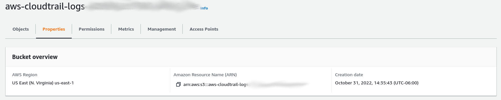
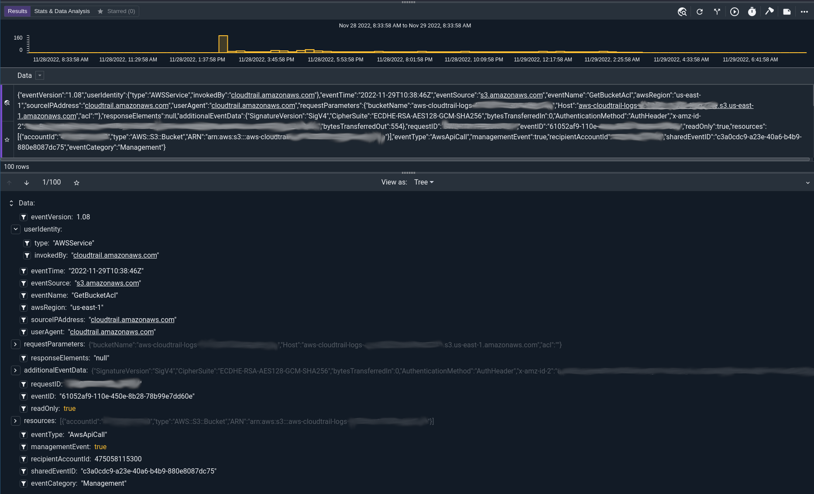

# Amazon Simple Storage Service Ingester (S3)

The Amazon S3 ingester is designed to ingest data directly from the Amazon S3 API.  While this is a convenient method of ingestion and integrates well with other tools like Amazon Cloudtrail and a myriad of other cloud based tools, be aware that this ingester is NOT designed to provide near real-time access to data.  Nor can it "tail" objects, consuming entries as they are written to a bucket.  The Amazon S3 system is a blob storage system with three basic operations: `list`, `get`, `put`;  this means that the ingester must consume entire objects when ingesting.  If new data is written to an S3 object, it is essentially a replacement of the object and the ingester will treat it as such.

S3 buckets are also not meant to provide low latency access to data. The S3 API is basically an HTTP API and most of the systems that write to S3 buckets batch up data and write large chunks at a time.  Be forewarned, you may see delays measured in minutes between when an entry says it was created and when Gravwell can actually consume it.  That being said, the S3 ingester makes integrating with many cloud services extremely easy: just point at the S3 bucket and provide the appropriate access keys and you are off.

## Basic Configuration

The Gravwell S3 ingester can consume from multiple buckets at once and will track its progress using a state file so that you can start and stop the ingester at will.  By default, the ingester will scan S3 buckets every minute looking for changes and ingest new objects that are discovered.  The main configuration for the Gravwell S3 ingester requires a `[Global]` section that specifies all of the usual configuration parameters which tell the ingester how to connect to Gravwell indexers.  The ingester also supports the full suite of [custom preprocessors](/ingesters/preprocessors/preprocessors), <a href="/ingesters/ingesters.html#time_parsing_overrides">time format overrides</a>,  and [custom time format specifications](/ingesters/customtime/customtime).

The S3 ingester relies on a standard configuration file located at `/opt/gravwell/etc/s3.conf` by default, but also supports configuration overlays in the `/opt/gravwell/etc/s3.conf.d/` directory.  Remember to ensure that all configuration overlays have the `.conf` file extension and are readable by the `gravwell` user and/or `gravwell` group.

A single S3 ingester can specify multiple buckets to consume from.  Multiple buckets are specified by creating multiple `[Bucket "name"]` stanzas in either the main `s3.conf` file or in overlay configuration files.

```{note}
We HIGHLY recommend creating a dedicated S3 IAM user for the Gravwell ingester.  It's never a good idea to use privileged credentials for dedicated applications like data ingestion.
```

### Bucket Configuration

Each bucket configuration supports the following configuration options:

| Configuration Parameter | Required      | Default Value | Description |
|-------------------------|---------------|---------------|-------------|
| ID                      | *YES*         |               | AWS IAM User ID to authenticate with |
| Secret                  | *YES*         |               | AWS IAM User secret to authenticate with |
| Region                  | *YES*         |               | AWS region the S3 bucket is registered in (Example: `us-east-2`) |
| Bucket-ARN              | *YES*         |               | AWS S3 bucket resource name (Example: `arn:aws:s3:::aws-cloudtrail-logs-475058115300-aabbccddee`). Required unless using an alternate Endpoint. |
| Endpoint                | NO            |               | Alternate provider endpoint when not using typical AWS S3 services. |
| Bucket-Name             | NO            |               | Define a bucket name for alternate non-AWS S3 endpoints (see alternate endpoint section). |
| Disable-TLS             | NO            | false         | Disable SSL/TLS when connecting to an alternate Endpoint (see alternate endpoint section).. |
| S3-Force-Path-Style     | NO            | false         | Force endpoint resolution to append bucket names to URLs rather than domains (see alternate endpoint section). |
| Tag-Name                | *YES*         |               | Specify the Gravwell tag name to be applied to data ingested from the bucket |
| Reader                  | NO            | line          | Specify how the data is to be interpreted in an S3 object, defaults to line delimited but `cloudtrail` is supported |
| MaxRetries              | NO            | 3             | Specify the maximum number of retries when requesting a bucket object |
| Ignore-Timestamps       | NO            | false         | Do not attempt to resolve timestamps from data contents |
| Assume-Local-Timezone   | NO            | false         | If no timestamp is present, assume local timezone for timestamps |
| Timezone-Override       | NO            |               | Force a specific timezone when interpreting timestamps in data |
| Timestamp-Format-Override | NO          |               | Force the ingester to look for a specific timestamp format |
| Max-Line-Size           | NO            | 4MB           | Limit the maximum length of a single entry when using the `line` Reader |
| Source-Override         | NO            | Ingester IP   | Override the source value attached to each entry |
| File-Filters            | NO            |               | Specify one or more glob patterns for use when matching object names (Example: `AWSLogs/**/*.json.gz`) |
| Preprocessor            | NO            |               | Specify one or more preprocessors to execute on ingested data |

The `Bucket-ARN` configuration parameter wants a fully qualified ARN value, not the HTTP or HTTPS URL (Example: arn:aws:s3:::aws-cloudtrail-logs-stuff).



### Object Match Globs

The S3 ingester will attempt to ingest all objects in an S3 bucket recursively unless one or more `File-Filters` patterns are used to establish which objects should be consumed.  The `File-Filters` patterns support the standard globbing patterns for filenames and "double-star" patterns for recursive directory matches.

For example, if we specify a single `File-Filters` pattern of `*.log` then the ingester will consume all objects that have the file extension `.log` at the first directory level only.  An object named `foo.log` will be consumed but an object named `stuff/foo.log` will not.

Multiple `File-Filters` can be specified to create an OR match pattern; for example the following set of patterns would match all objects that have an extension of `.log` and are located in either the `this`, `that`, or `theother` directories:

```
File-Filters=this/*.log
File-Filters=that/*.log
File-Filters=theother/*.log
```

Arbitrary directory specifications can be achieved using a "double-star" globbing pattern.  For example `File-Filters="AWSLogs/**/*.json.gz"` will match all objects with a file extension of `.json.gz` located in any sub-directory within the `AWSLogs` top level directory.  All of the following objects would be matched by this filter:

```
AWSLogs/475058115300/CloudTrail/us-west-2/2022/11/28/475058115300_CloudTrail_us-west-2_20221128T2320Z_gvNAnhYNeqzmI2bH.json.gz
AWSLogs/475058115300/CloudTrail/us-east-1/2022/11/28/475058115300_CloudTrail_us-east-1_20221128T2320Z_lY7sQmelLGP14BrY.json.gz
AWSLogs/summary/CloudTrail_us-east-1.json.gz
```

### Bucket Data Formats

By default the S3 ingester will process objects using a line reader, essentially expecting line delimited data.  However, the ingester can also natively consume AWS Cloudtrail event records in JSON format.  If no `Reader` is specified for a bucket, `line` is assumed.  The Following options are available for the `Reader` configuration parameter:

* `line` - Line delimited data.
* `cloudtrail` - [Amazon AWS Cloudtrail JSON encoded data](https://docs.aws.amazon.com/awscloudtrail/latest/userguide/cloudtrail-event-reference.html).

## Alternate Endpoints

The S3 ingester is designed to be flexible in handling S3 compatible APIs by providers other than Amazon Web Services.  This means that you can use the S3 ingester to consume logs from other S3 providers like [Minio](https://min.io/), [Linode](https://www.linode.com/lp/object-storage/), [DigitalOcean](https://www.digitalocean.com/products/spaces) and many others.  However, the S3 API has some peculiarities when it comes to defining endpoints, bucket names, and regions.  This section goes over how to configure the S3 ingester to operate against non-AWS S3 providers and managed AWS endpoints like those provided by Cisco.

When configuring the S3 ingster to operate on a non-AWS S3 provider you will need to omit the `Bucket-ARN` parameter and must define the `Endpoint`, `Bucket-Name`, and `S3-Force-Path-Stle`.  Unfortunately there are several ways to specify a path to an S3 bucket that involve varying configurations of domain names and HTTP URLs.  This section will go over the basics of specifying how to generate a configuration that will work with an S3 compatible endpoint that is not AWS.

The first configuration parameter required is the `Endpoint` parameter, this is typically a domain name provided by your S3 provider, The Endpoint may contain the region embedded in it, but you will still need to specify the region in `Region` parameter.  Some examples in include `us-east-l.inodeobjects.com`, `cisco-managed-us-east-1.s3.amazon.com`, or `192.168.1.1:9000`.  The Endpoint should be the host the ingester will be connecting to.  The `Bucket-Name` parameter is required when providing a custom Endpoint, however depending on your provider you may need to adjust the `Endpoint` and `S3-Force-Path-Style` configuration parameters.

For example, Linode provided a S3 target of `testing.us-east-1.linodeobjects.com` when we created our bucket named `testing`; for this case we provide `Endpoint="us-east-1.linodeobjects.com"` and `Bucket-Name="testing"`.  For a custom Minio object storage deployment we might set `Endpoint=192.168.1.1:9000`, `Bucket-Name="testing"`, and `S3-Force-Path-Style=true`.  Additional examples for a few providers are available below.

## Example Configurations

The most basic S3 configuration is a single indexer and a single bucket which consumes line delimited data.

```
Global]
Ingest-Secret = "IngestSecrets"
Cleartext-Backend-Target=172.19.0.2:4023 #example of adding a cleartext connection
Log-File=/tmp/s3.log
State-Store-Location=/tmp/s3.state

[Bucket "default"]
	Region="us-east-1"
	ID=AKI..."
	Secret="SuperSecretKey..."
	Bucket-ARN = "arn:aws:s3:::aws-super-special-logs"
	Tag-Name="s3-logs"
```

This example ingester will consume every object in the specified bucket, derive a timestamp, then push the data to the `s3-logs` Gravwell tag.

### Amazon Cloudtrail Log Handling

To consume AWS Cloudtrail logs from an S3 bucket, automatically extracting individual records and deriving the appropriate timestamp, the `cloudtrail` reader is available.

```
Global]
Ingest-Secret = "IngestSecrets"
Cleartext-Backend-Target=172.19.0.2:4023 #example of adding a cleartext connection
Log-File=/tmp/s3.log
State-Store-Location=/tmp/s3.state

[Bucket "default"]
	Region="us-east-1"
	ID=AKI..."
	Secret="SuperSecretKey..."
	Bucket-ARN = "arn:aws:s3:::aws-cloudtrail-logs-123456-7890"
	Tag-Name="aws-cloudtrail"
	Reader=cloudtrail
	File-Filters=**/*.json.gz
```

The Cloudtrail reader does the dirty work of interpreting the Cloudtrail JSON schema and extracting out discrete events and processing the "eventTime" timestamp and attaching it to the event.  Using the `cloudtrail` reader you will get nicely segmented events:



### Linode Object Storage

In this example we have a bucket named `testing` and a provided Linode URL of `https://testing.us-east-1.linodeobjects.com`.

```
[Bucket "linode"]
	ID=AKI..."
	Secret="SuperSecretKey..."
	Tag-Name="linode-logs"
	Bucket-Name="testing"
	Endpoint="us-east-1.linodeobjects.com"
	Region="us-east-1"
	S3-Force-Path-Style=false
	File-Filters="**/*.log"
```

### Minio Self-Hosted Object Storage

Minio provides an excellent [open source implementation](https://github.com/minio/minio) of an S3 compatible object storage server; they even provide a super easy to use [Docker image](https://hub.docker.com/r/minio/minio).  Using a default Docker deployment the Minio server is listening on port 9000 and uses a path style specification for accessing objects.  The region defaults to `us-east-1` but can be altered in the configuration.  Here is an example configuration for Minio:

```
[Bucket "minio"]
	ID=AKI..."
	Secret="SuperSecretKey..."
	Tag-Name="minio-logs"
	Bucket-Name="testing"
	Endpoint="172.16.0.4:9000"
	Region="us-east-1"
	S3-Force-Path-Style=true
	File-Filters="**/auth.*.log"
```

### Managed AWS S3 Endpoints

Some companies provide access to managed AWS regions that are technically AWS but not in the standard set of regions.  For these cases we can use an alternate Endpoint setup to still interact with the custom regions.  For this case we will look at a configuration designed to pull back Cisco Umbrella logs that are hosted on the Cisco managed AWS region.

```
[Bucket "umbrella"]
	ID=AKI..."
	Secret="SuperSecretKey..."
	Tag-Name="umbrella-logs"
	Bucket-Name="123456_7368697474657227732066756c6c"
	Endpoint="cisco-managed-us-east-1.s3.amazonaws.com"
	Region="cisco-managed-us-east-1"
	S3-Force-Path-Style=true
	File-Filters="auditlog/**/*.log"
```
