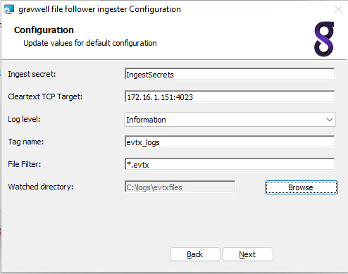

# Windows File Follower

The Windows File Follower ingester is the best way to ingest files on a local windows system or to rapidly ingest Windows EVTX files during forensic investigations.  Most file types can be updated on the fly and the file follower service will detect the file changes and ingest the new data.

The most common use case for File Follower is monitoring a directory containing log files which are actively being updated, such as from a custom Windows application that writes log files to a location on disk.  The file follower is also a good option when performing forensic investigations because you can gather up large quantities of EVTX files and drag them into a folder to be ingested.

```{attention}
Do not use the file follower to follow actively written EVTX files on a Windows system; the kernel does not produce inotify events on these EVTX files.  The [Windows event ingester](/ingesters/winevent) is a better option for pulling in live event logs.
```

## Installation

Download the Gravwell Windows File Follower installer: 

| Ingester Name | Installer    | More Info |
| :------------ | :----------- | :-------- |
| Windows File Follower | <a data-bs-custom-class="hash-popover" href="https://update.gravwell.io/archive/5.7.0/installers/gravwell_file_follow_5.7.0.1.msi">Download <i class="fa-solid fa-download"></i></a>&nbsp;&nbsp;&nbsp;<a data-bs-custom-class="hash-popover" href="javascript:void(0);" data-bs-toggle="popover" data-bs-placement="bottom" data-bs-html="true" data-bs-content='<code class="docutils literal notranslate"><span class="pre">e58bfc118b6cc9bc1be41be1d816a89556b261b292788a2a389cd037c457821d</span></code>'>(SHA256)</a> | [Documentation](/ingesters/win_file_follow) |

The Gravwell Windows file follower is installed using a signed MSI package.  Gravwell signs both the Windows executable and MSI installer with our private key pairs, but depending on download volumes, you may see a warning about the MSI being untrusted.  This is due to the way Microsoft "weighs" files.   Basically, as they see more people download and install a given package, it becomes more trustworthy.  Don't worry though, we have a well audited build pipeline and we sign every package.

During the install you will be prompted with an initial configuration, you can use this prompt to input your initial indexer endpoint, ingest secret, log level, and an initial directory to watch.  If you wish to configure additional followers, you will need to configure them in the `C:\Program Files\gravwell\filefollow\file_follow.cfg` configuration file as an administrator and restart the Gravwell File Follow service.



## Startup considerations

At startup, file follower will ingest any existing data in the tracked paths before servicing inotify events. If you are starting file follower to ingest a large amount of existing data, it is recommended that you do not write to the tracked paths until the initial ingest is complete. Writing to tracked paths during initial ingest could result in poor performance or missing inotify events due to kernel buffering.

## Basic Configuration

The File Follower configuration file is by default located in `C:\Program Files\gravwell\filefollow\file_follow.cfg`.

The File Follower ingester uses the unified global configuration block described in the [ingester section](ingesters_global_configuration_parameters).  Like most other Gravwell ingesters, File Follower supports multiple upstream indexers, TLS, cleartext, and named pipe connections, and local logging.

```{note}
We recommend strongly against using a file cache with the File Follower ingester, since it is already tracking its position within the source files.
```

An example configuration for the File Follower ingester, configured to watch several different types of log files in `c:\logs\customapp\` and recursively follow files under `c:\logs\evtxfiles`:

```
[Global]
Ingest-Secret = IngestSecrets
Connection-Timeout = 0
Insecure-Skip-TLS-Verify = false
Cleartext-Backend-target=172.20.0.1:4023 #example of adding a cleartext connection
Cleartext-Backend-target=172.20.0.2:4023 #example of adding another cleartext connection
#State-Store-Location="C:\\Program Files\\gravwell\\filefollow\\file_follow.cache"
Log-Level=ERROR #options are OFF INFO WARN ERROR
Max-Files-Watched=64

[Follower "custom logs"]
        Base-Directory="c:\\logs\\customapp\\"
        File-Filter="*.log" #we are looking for all authorization log files
        Tag-Name="customapp"
        Assume-Local-Timezone=true
[Follower "evtx"]
        Base-Directory=`c:\logs\evtxfiles`
        File-Filter="*.evtx" #we are looking for all authorization log files
        Tag-Name=forensic_windows
	Recursive=true
```

In this example we have two followers, one is looking to actively follow custom application logs as they are written to the `c:\logs\customapp` location, the other is looking for EVTX files in `c:\logs\evtxfiles\`.


## Additional Global Parameters

### Max-Files-Watched

The Max-Files-Watched parameter prevents the File Follower from maintaining too many open file descriptors. If `Max-Files-Watched=64` is specified, the File Follower will actively watch up to 64 log files. When a new file is created, the File Follower will stop actively watching the oldest existing file in order to watch the new one. However, if the old file is later updated, it will return to the top of the queue.

We recommend leaving this setting at 64 in most cases; configuring the limit too high can run into limits set by the kernel.

## Follower Configuration

The File Follower configuration file contains one or more "Follower" directives:

```
[Follower "syslog"]
        Base-Directory="c:\logs\"
        File-Filter="app.[0-9].log" #we are looking for all authorization log files
        Tag-Name=app
```

Each follower specifies at minimum a base directory and a filename filtering pattern. This section describes possible configuration parameters which can be set per follower.

###	Base-Directory

The Base-Directory parameter specifies the directory which will contain the files to be ingested. It should be an absolute path and contain no wildcards.

### File-Filter

The File-Filter parameter defines the filenames which should be ingested. It can be as simple as a single file name:

```
File-Filter="foo.log"
```

Or it can contain multiple patterns:

```
File-Filter="kern*.log,kern*.log.[0-9]"
```

which will match any filename beginning with "kern" and ending with ".log", or beginning with "kern" and ending with ".log.0" through ".log.9".

The full matching syntax, as defined in [https://golang.org/pkg/path/filepath/#Match](https://golang.org/pkg/path/filepath/#Match):

```
pattern:
	{ term }
term:
	'*'         matches any sequence of non-Separator characters
	'?'         matches any single non-Separator character
	'[' [ '^' ] { character-range } ']'
	            character class (must be non-empty)
	c           matches character c (c != '*', '?', '\\', '[')
	'\\' c      matches character c

character-range:
	c           matches character c (c != '\\', '-', ']')
	'\\' c      matches character c
	lo '-' hi   matches character c for lo <= c <= hi
```

### Recursive

The recursive parameter directs the File Follower to ingest files matching the File-Filter recursively under the Base-Directory.

By default, the ingester will only ingest those files matching the File-Filter under the top level of the Base-Directory; the following would ingest `c:\temp\incoming\foo.log` but not `c:\tmp\incoming\system1\foo.log`:

```
Base-Directory="c:\\temp\\incoming"
File-Filter="foo.log"
Recursive=false
```

By setting Recursive=true, the configuration will ingest **any** file named foo.log at any directory depth under `c:\tmp\incoming`.

### Tag-Name

The Tag-Name parameter specifies the tag to apply to entries ingested by this follower.

### Ignore-Line-Prefix

The ingester will drop (not ingest) any lines beginning with the string passed to Ignore-Line-Prefix. This is useful when ingesting log files which contain comments, such as Bro logs. The Ignore-Line-Prefix parameter may be specified multiple times.

The following indicates that lines beginning with `#` or `//` should not be ingested:

```
Ignore-Line-Prefix="#"
Ignore-Line-Prefix="//"
```

### Ignore-Glob

The ingester will drop (not ingest) any lines that match the given glob pattern. Globs are text patterns containing wildcards (such as `*`). For example, to drop any line that contains the word "foo" anywhere in the line:

```
Ignore-Glob="*foo*"
```

Ignore-Glob can be specified multiple times and supports the same wildcard syntax as the File-Filter option.

### Regex-Delimiter

The `Regex-Delimiter` option allows the user to specify a regular expression which will be used to split entries, rather than newlines. Thus, if your input files look like this:

```
####This is the first entry
additional data
####This is the second entry
```

You could add the following line to your follower definition:

```
Regex-Delimiter="####"
```

This will parse the preceding file into two entries:

```
####This is the first entry
additional data
```

and

```
####This is the second entry
```

```{note}
`Timestamp-Delimited` overrides `Regex-Delimiter`; set one or the other.
```

### Timestamp-Delimited

The Timestamp-Delimited parameter is a boolean specifying that each occurrence of a time stamp should be considered the start of a new entry. This is useful when log entries may span multiple lines. When specifying Timestamp-Delimited, the Timestamp-Format-Override parameter must also be set.

If a log file looks like this:

```
2012-11-01T22:08:41+00:00 Line 1 of the first entry
Line 2 of the first entry
2012-11-01T22:08:43+00:00 Line 1 of the second entry
Line 2 of the second entry
Line 3 of the second entry
```

Provided the follower is configured with `Timestamp-Delimited=true` and `Timestamp-Format-Override=RFC3339`, it will generate the following two entries:

```
2012-11-01T22:08:41+00:00 Line 1 of the first entry
Line 2 of the first entry
```
```
2012-11-01T22:08:43+00:00 Line 1 of the second entry
Line 2 of the second entry
Line 3 of the second entry
```

```{note}
`Timestamp-Delimited` overrides `Regex-Delimiter`; set one or the other.
```

### Ignore-Timestamps

The Ignore-Timestamps parameter indicates that the follower should not attempt to extract a timestamp from each line of the file, but rather tag each line with the current time.

### Assume-Local-Timezone

Assume-Local-Timezone is a boolean setting which directs the ingester to parse timestamps which lack timezone specifications as though they were in the local time zone rather than the default UTC.

Assume-Local-Timezone and Timezone-Override are mutually exclusive.

### Timezone-Override

The Timezone-Override parameter directs the ingester to parse timestamps which lack timezone specifications as though they were in the given time zone rather than the default UTC. The timezone should be specified in IANA database string format as shown in [https://en.wikipedia.org/wiki/List_of_tz_database_time_zones](https://en.wikipedia.org/wiki/List_of_tz_database_time_zones); for example, US Central Time should be specified as follows:

```
Timezone-Override="America/Chicago"
```

Assume-Local-Timezone and Timezone-Override are mutually exclusive. `Timezone-Override="Local"` is functionally equivalent to `Assume-Local-Timezone=true`

### Timestamp-Format-Override

Data values may contain multiple timestamps which can cause some confusion when attempting to derive timestamps out of the data.  Normally, the followers will grab the left most timestamp that can be derived, but if there are multiple timestamps in an entry it may be useful to specify a format to try first.  "Timestamp-Format-Override" tells the follower to try a specific format first.  The following timestamp formats are available:

* AnsiC
* Unix
* Ruby
* RFC822
* RFC822Z
* RFC850
* RFC1123
* RFC1123Z
* RFC3339
* RFC3339Nano
* Apache
* ApacheNoTz
* Syslog
* SyslogFile
* SyslogFileTZ
* DPKG
* Custom1Milli
* NGINX
* UnixMilli
* ZonelessRFC3339
* SyslogVariant
* UnpaddedDateTime

Refer to [the timegrinder documentation](https://pkg.go.dev/github.com/gravwell/gravwell/v3/timegrinder) for a full list of possible overrides, with examples.

To force the follower to first look for timestamps that match the RFC3339 specification, add `Timestamp-Format-Override=RFC3339` to the follower. Note that if it is unable to find an RFC3339 timestamp, it will attempt to match against other formats too.

### Timestamp-Regex and Timestamp-Format-String

The `Timestamp-Regex` and `Timestamp-Format-String` options may be used in tandem to specify an additional timestamp format for use when parsing timestamps for this follower. For example, if you are ingesting logs containing Oracle WebLogic timestamps (e.g. "Sep 18, 2020 12:26:48,992 AM EDT"), you would add the following to your configuration:

```
	Timestamp-Regex=`[JFMASOND][anebriyunlgpctov]+\s+\S{1,2},\s+\d{4}\s+\d{1,2}:\d\d:\d\d,\d+\s+\S{2}\s+\S+`
	Timestamp-Format-String="Jan _2, 2006 3:04:05,999 PM MST"
```

The `Timestamp-Format-String` parameter should be a Go-style timestamp format as defined [in this document](https://golang.org/pkg/time/). The `Timestamp-Regex` parameter should be a regular expression which can match the timestamps you wish to extract; note that it must also be able to match the `Timestamp-Format-String` and will return an error if it does not match.

The format defined using these options will be inserted at the top of the list of formats used by timegrinder, meaning it will be checked first, but if a valid timestamp is not found with the user-defined format, the rest of the timegrinder formats will also be tried.


## Ingesting EVTX Files

A common use case during forensic investigations is to acquire Windows EVTX files from a large set of endpoints and then analyze their contents.  The Windows File Follower ingester is well suited to perform this task; however, there are a few things to note when ingesting EVTX files and any other large volumes of static data in files.

The first thing to remember is that the ingester relies on windows inotify events to know when to attach to another new file or check an existing file for updates to read.  If you attempt to follow EVTX files on a live system located at `c:\windows\system32\winevt\logs`, you will find that the ingester will ingest all the existing data but not continue to ingest new data as it is written into the files.  This is due to the way the EVTX files are populated. When the Windows kernel writes to those files, it does not trigger a file modification event; other log files written by user land applications do however.  For this reason, we highly recommend NOT using the file follower to capture live event logs on a windows system; use the Windows Events ingester instead.

Another item of note is ingest and indexer performance. The Gravwell File Follower ingester will attempt to ingest data as fast as it can as a matter of course.  However, if you have several hundred gigabytes of EVTX logs and you drag them into the watched folder, this means that data may come into the indexers wildly out of order and across many time ranges.  The Gravwell indexer will do its best to prebuffer and arrange data as it gets it to minimize the impact, but there is only so much it can do.   All of your data will still be indexed and searchable, but the storage may be highly fragmented and you may see some slow downs.  A better approach when ingesting very large data sets is to stop the file follower service, populate your watched folder, then start the service.  The service will perform a startup scan of all the available files and order them based on file modification date, and then it will begin consuming one file at a time in order.  As a result, the data will reach your indexers in a less fragmented state and you will generally take some strain off of your indexers.
