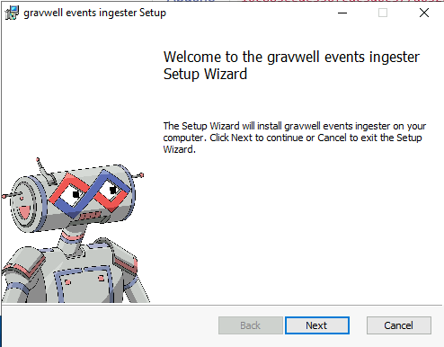
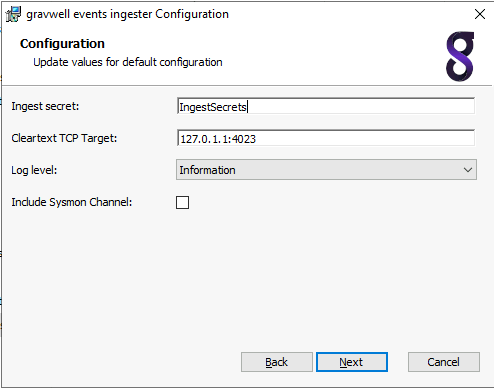
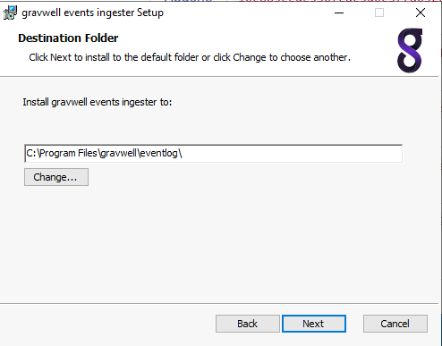
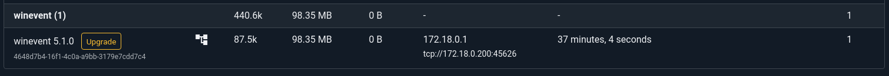
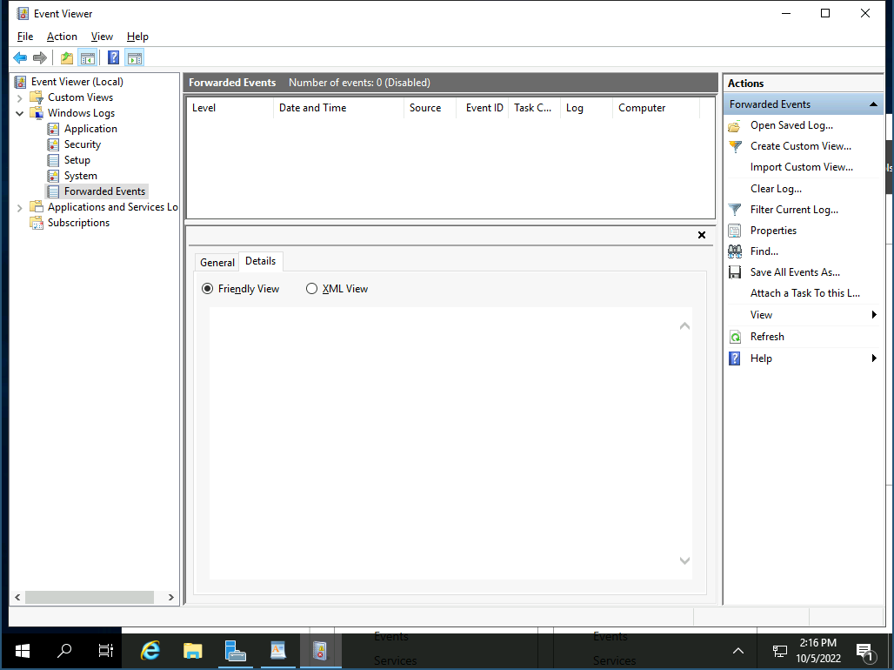
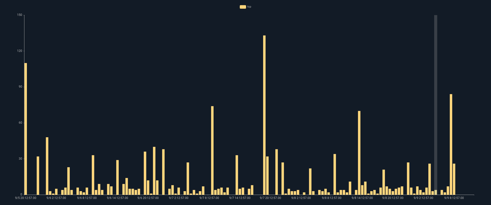

# Windows Event Service

The Gravwell Windows events ingester runs as a service on a Windows machine and sends Windows events to the Gravwell indexer.  The ingester consumes from the `System`, `Application`, `Setup`, and `Security` channels by default.  Each channel can be configured to consume from a specific set of events or providers.

## Basic Configuration

The Windows Event ingester uses the unified global configuration block described in the [ingester section](ingesters_global_configuration_parameters).  Like most other Gravwell ingesters, the Windows Event ingester supports multiple upstream indexers, TLS, cleartext, and named pipe connections, a local cache, and local logging.

## EventChannel Examples

```
[EventChannel "system"]
	Tag-Name=windows
	Channel=System #pull from the system channel

[EventChannel "sysmon"]
	Tag-Name=sysmon
	Channel="Microsoft-Windows-Sysmon/Operational"
	Max-Reachback=24h  #reachback must be expressed in hours (h), minutes (m), or seconds(s)

[EventChannel "Application"]
	Channel=Application #pull from the application channel
	Tag-Name=winApp #Apply a new tag name
	Provider=Windows System #Only look for the provider "Windows System"
	EventID=1000-4000 #Only look for event IDs 1000 through 4000
	EventID=1,2,3,4 #also look for events 1, 2, 3, and 4
	Level=verbose #Only look for verbose entries
	Max-Reachback=72h #start looking for logs up to 72 hours in the past
	Request-Buffer=16 #use a large 16MB buffer for high throughput
	Request-Size=1024 #Request up to 1024 entries per API call for high throughput

[EventChannel "System Critical and Error"]
	Channel=System #pull from the system channel
	Tag-Name=winSysCrit #Apply a new tag name
	Level=critical #look for critical entries
	Level=error #AND for error entries
	Max-Reachback=96h #start looking for logs up to 96 hours in the past

[EventChannel "Security prune"]
	Channel=Security #pull from the security channel
	Tag-Name=winSec #Apply a new tag name
	EventID=-400 #ignore event ID 400
	EventID=-401 #AND ignore event ID 401
```

## Installation

Download the Gravwell Windows Events installer: 

| Ingester Name | Installer    | More Info |
| :------------ | :----------- | :-------- |
| Windows Events | <a data-custom-class="hash-popover" href="https://update.gravwell.io/archive/5.4.3/installers/gravwell_win_events_5.4.3.msi">Download <i class="fa-solid fa-download"></i></a>&nbsp;&nbsp;&nbsp;<a data-custom-class="hash-popover" href="javascript:void\(0\)" data-toggle="popover" data-placement="bottom" data-html="true" data-content='<code class="docutils literal notranslate"><span class="pre">83f8de1a0ef2f1a0612b74b5624c11f3a3d3aa5c898e494ad12afc9f3d28029e</span></code>'>(SHA256)</a> | [Documentation](/ingesters/winevent) |

Run the .msi installation wizard to install the Gravwell events service.  On first installation the installation wizard will prompt to configure the indexer endpoint and ingest secret.  Subsequent installations and/or upgrades will identify a resident configuration file and will not prompt.





```{note}
The Log Level selection is for internal logging only, it does not affect which Windows events are captured by the ingester.  Setting the level to Information will cause the ingester to emit log events when it starts, stops, and attaches to event Channels.
```



The ingester is configured with the `config.cfg` file located at `%PROGRAMDATA%\gravwell\eventlog\config.cfg`.  The configuration file follows the same form as other Gravwell ingesters with a `[Global]` section configuring the indexer connections and multiple `EventChannel` definitions.


To modify the indexer connection or specify multiple indexers, change the connection IP address to the IP of your Gravwell server and set the Ingest-Secret value.  This example shows configuring an encrypted transport:

```
Ingest-Secret=YourSecretGoesHere
Encrypted-Backend-target=ip.addr.goes.here:port
```

Once configured, this file can be copied to any other Windows system from which you would like to collect events.

### Silent Installation

The Windows event ingester is designed to be compatible with an automated deployment.  This means that a domain controller can push the installer to clients and invoke installation without user interaction.  To force a silent installation execute the installer with administrative privileges via [msiexec](https://docs.microsoft.com/en-us/windows-server/administration/windows-commands/msiexec) with the `/quiet` argument.  This installation method will install the default configuration and start the service.

To configure your specific parameters you will then need to either push a modified configuration file to `%PROGRAMDATA%\gravwell\eventlog\config.cfg` and restart the service, or also provide the `CONFIGFILE` argument with the fully qualified path to the `config.cfg` file.

Note that you may need to create the `%PROGRAMDATA%\gravwell\eventlog` path.

A complete execution sequence for a Group Policy push might look like:

```
msiexec.exe /i gravwell_win_events_5.1.4.msi /quiet
xcopy \\share\gravwell_config.cfg %PROGRAMDATA%\gravwell\eventlog\config.cfg
sc stop "GravwellEvents Service"
sc start "GravwellEvents Service"
```

Or

```
msiexec.exe /i gravwell_win_events_3.3.12.msi /quiet CONFIGFILE=\\share\gravwell_config.cfg
```

## Troubleshooting

You can verify the Windows ingester connectivity by navigating to the Ingester page on the web interface.  If the Windows ingester is not present, check the status of the service either via the windows GUI or by running `sc query GravwellEvents` at the command line.


If the ingester has successfully connected you can navigate to the Ingesters & Federators page and look for the ingester in the list.  It will be labeled under the "winevent" section.



Clicking on the listed ingester will show the functional configuration as well as some additional data about the Event channels being monitored.


## Optional Sysmon Integration

The Sysmon utility, part of the sysinternals suite, is an effective and popular tool for monitoring Windows systems. There are plenty of resources with examples of good sysmon configuration files. At Gravwell, we like to use the modular sysmon config on [github from olafhartong](https://github.com/olafhartong/sysmon-modular).

Edit the Gravwell Windows agent config file located at `%PROGRAMDATA%\gravwell\eventlog\config.cfg` and add the following lines:

```
[EventChannel "Sysmon"]
        Tag-Name=sysmon #Apply a new tag name
        Provider=Microsoft-Windows-Sysmon #Only look for the provider
        Channel=Microsoft-Windows-Sysmon/Operational
```

[Download the default sysmon configuration file](https://raw.githubusercontent.com/olafhartong/sysmon-modular/master/sysmonconfig.xml)

[Download sysmon](https://technet.microsoft.com/en-us/sysinternals/sysmon)

Install `sysmon` with your configuration using an administrator shell (Powershell works too) by running the following command:

```
sysmon.exe -accepteula -i sysmonconfig-export.xml
```

Restart the Gravwell service via standard windows service management.

### Example Configuration with Sysmon

```
[EventChannel "system"]
        Tag-Name=windows
        #no Provider means accept from all providers
        #no EventID means accept all event ids
        #no Level means pull all levels
        #no Max-Reachback means look for logs starting from now
        Channel=System #pull from the system channel

[EventChannel "application"]
        Tag-Name=windows
        Channel=Application #pull from the system channel

[EventChannel "security"]
        Tag-Name=windows
        Channel=Security #pull from the system channel

[EventChannel "setup"]
        Tag-Name=windows
        Channel=Setup #pull from the system channel

[EventChannel "sysmon"]
        Tag-Name=windows
        Provider=Microsoft-Windows-Sysmon #Only look for the provider
        Channel=Microsoft-Windows-Sysmon/Operational
```

## Windows Event Forwarding

The Gravwell Winevent ingester can be combined with Windows Event Forwarding (WEF) to simplify deployments and reduce the number of endpoints the ingester must be installed on.  Windows Event Forwarding is an integrated Windows service that allows for forwarding events to a central collection point using integrated Windows functionality.  More information on WEF can be found on [several](https://learn.microsoft.com/en-us/windows/security/threat-protection/use-windows-event-forwarding-to-assist-in-intrusion-detection) [Microsoft](https://social.technet.microsoft.com/wiki/contents/articles/33895.windows-event-forwarding-survival-guide.aspx) [resources](https://learn.microsoft.com/en-us/defender-for-identity/configure-event-forwarding).

Configuring Windows Event Forwarding is beyond the scope of this document, but actually collecting the forwarded events is very simple.

First you will need to install the winevent ingester on the Windows system that will be receiving the forwarded events.  Then you will want to validate the name of the channel that is configured to receive the forwarded events on the collection box.  Typically that is `ForwardedEvents`.



```{note}
Forwarded events will still contain the correct `Channel` in their logs.
```

To enable the collection of forwarded events first we need to open the winevent configuration file located at `%PROGRAMDATA%\gravwell\eventlog\config.cfg` as an Administrator and insert a new Listener stanza that is pointed at the WEF collection channel:

```
[EventChannel "WEF Events"]
        Tag-Name=windows
        Channel=ForwardedEvents
```

## Example Windows Searches

Assuming the default tag names are used, to see ALL sysmon entries in their entirety run this search:

```gravwell
tag=sysmon
```

To see ALL Windows events in their entirety run:

```gravwell
tag=windows
```

For the following searches we can use the `winlog` search module to filter and extract specific events and fields.  To see all network connection rates per computer using sysmon data:

```gravwell
tag=sysmon winlog Provider == "Microsoft-Windows-Sysmon" EventID == 3 Protocol |
stats count by Protocol |
chart count by Protocol
```




To show all successful logons across all logon types (including service logons) using standard Windows logs:

```gravwell
tag=windows words User32 4624
| winlog Provider=="Microsoft-Windows-Security-Auditing" EventID==4624 LogonType LogonProcessName=="User32 " 
  TargetUserName Computer TargetDomainName
| lookup -r windows_login_types LogonType logon_type name as LogonType
| table TargetUserName Computer TargetDomainName LogonType TIMESTAMP
```

```{note}
The above query needs to have the `windows_login_types` resource that is provided by the Windows Resource kit.
```

