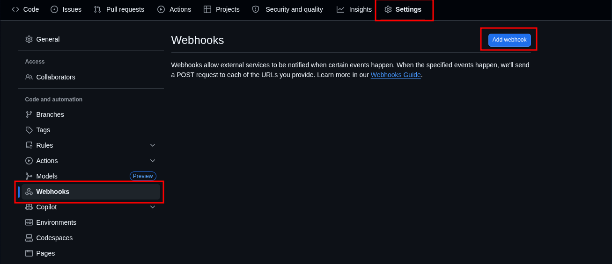
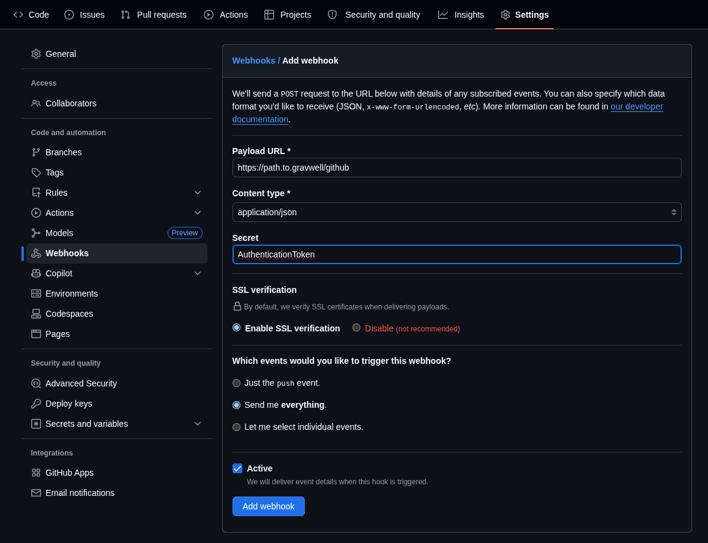

# GitHub

:::{csv-table}
:align: left
:width: 45%
:widths: 15, 25
**Integration Details**
    Ingester, • [HTTP - HEC](http_splunk_hec_compatibility) <br /> • [Simple Relay](/ingesters/simple_relay)
         Kit, [GitHub Kit](https://github.com/gravwell/kits/tree/main/github)
:::

## GitHub Configuration

### [Option 1] Using Gravwell HTTP HEC Ingester
* [Streaming the audit log for your enterprise](https://docs.github.com/en/enterprise-cloud@latest/admin/monitoring-activity-in-your-enterprise/reviewing-audit-logs-for-your-enterprise/streaming-the-audit-log-for-your-enterprise#setting-up-streaming-to-splunk)

Follow the instructions for setting up streaming to Splunk. For the configuration page point to your Gravwell HTTP ingester.

1. Navigate to your github enterprise page.
2. Go to: Settings > Audit Log > Log Streaming > Configure Stream > Splunk.
3. On the configuration page you will point th the public address and port of the Gravwell Ingester.
4. Ensure SSL verification check box is selected.
5. Click `Check endpoint` to verify github can connect and write to the Gravwell Ingester.
6. Save.

If you would like to include API requests in your audit log streaming:
1. Navigate to your github enterprise page.
2. Go to: Settings > Audit Log > Settings > API Requests.
3. `Select Enable API Request Events`.
4. Save.


### [Option 2] Using WebHooks to export Logs
* [Creating a repository webhook](https://docs.github.com/en/enterprise-cloud@latest/webhooks/using-webhooks/creating-webhooks)

Github provides webhooks for exporting logs depending on what you want to export for example for monitoring single repository, app, enterprise, global, etc. Follow the instructions for setting up: 

1. On the main page of the repository select: Settings > Webhooks > Add webhook



2. Fill out the following fields:
   * **Payload URL:** 
      * Example: `https://path.to.gravwell/github`
   * **Content Type:**
      * Example: `application/json`
   * **Secret:**
      * Example: `AuthenticationToken`
   * **Which events would you like to trigger this webhook:**
      * Example: `Send me everything`



## Gravwell Configuration

### Gravwell Storage Well Configuration

Setup the well configuration in your Gravwell indexers.

**Sample well config:**  
Create or edit: `/opt/gravwell/etc/gravwell.conf.d/github-well.conf`
```ini
[Storage-Well "github"]
    Location=/opt/gravwell/storage/github
    Tags=github*
```
### Gravwell Ingester Configuration

Setup the HTTP HEC configuration file.

#### [Option 1] Using Gravwell HTTP HEC Ingester
Create or edit: `/opt/gravwell/etc/gravwell_http_ingester.conf.d/github.conf`

**Sample Ingester config:**  
```ini
[HEC-Compatible-Listener "github"]
    URL="/services/collector"
    #TokenValue="AuthenticationToken"
    Health-Check-URL="/services/collector" # Github Validates the HEC endpoint
    Tag-Match=github:github
    Tag-Match=github-audit:github_audit
```

#### [Option 2] Streaming Logs
Create or edit: `/opt/gravwell/etc/gravwell_http_ingester.conf.d/github.conf`
**Sample Ingester config:**  
```ini
[Listener "github"]
    URL="/github"
    #TokenValue= "AuthenticationToken"
    Tag-Name=github
```

```{note}
Remember to restart the service to apply the new config:
`sudo systemctl restart gravwell_http_ingester.service`
```