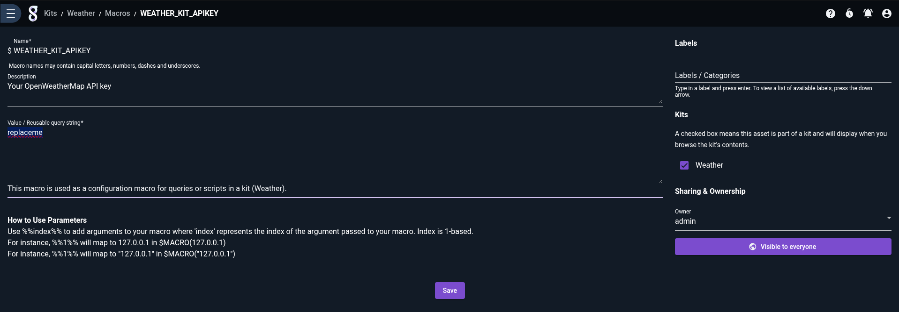

# OpenWeather

:::{csv-table}
:align: left
:width: 45%
:widths: 15, 25
**Integration Details**
         Kit, [Weather Kit](https://github.com/gravwell/kits/tree/main/weather)
:::

## OpenWeather Configuration

An API key is required which can be obtained after signing up at [openweathermap](https://openweathermap.org/appid). Once created, your key will be emailed to you and will also be available in your account dashboard.

## Gravwell Configuration

Gravwell uses its scripting interface to request data from the OpenWeather API included in the Gravwell Kit. After installing the Weather Kit and obtaining an API Key replace the value `replaceme` in the Macro `$WEATHER_KIT_APIKEY`.



### Gravwell Storage Well Configuration

Setup the well configuration in your Gravwell indexers.

**Sample well config:**  
Create or edit: `/opt/gravwell/etc/gravwell.conf.d/weather-well.conf`
```ini
[Storage-Well "weather"]
    Location=/opt/gravwell/storage/weather
    Tags=weather*
```
