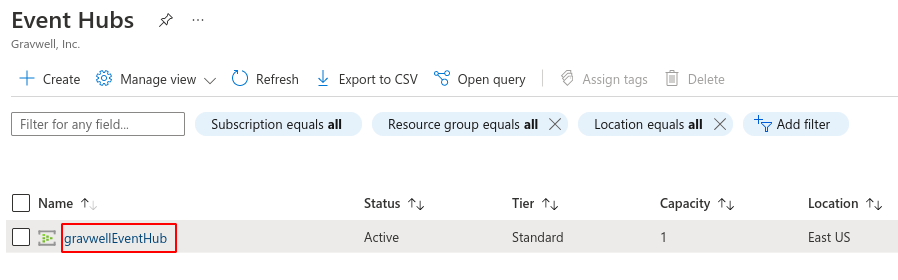
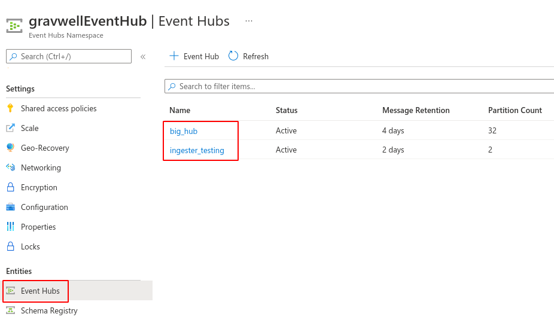
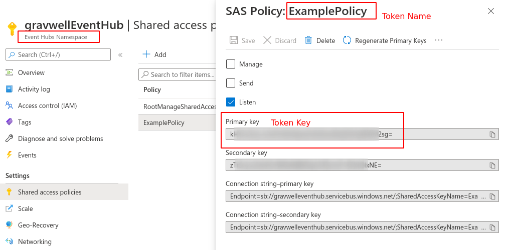
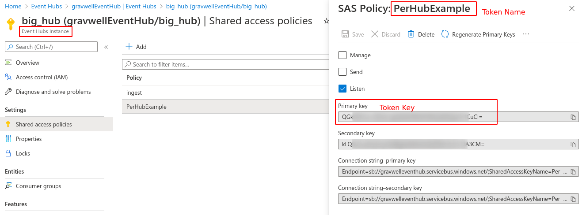

# Azure

:::{csv-table}
:align: left
:width: 45%
:widths: 15, 25
**Integration Details**
    Ingester, [Azure Event Hubs Ingester](/ingesters/eventhubs.md)
         Kit, [Azure Kit](https://github.com/gravwell/kits/tree/main/azure)
:::

## Azure Configuration

Microsoft provides documentation on how to setup logging to an external partner:
* [Stream Azure data to an event hub and external partner](https://learn.microsoft.com/en-us/azure/azure-monitor/platform/stream-monitoring-data-event-hubs)
* [Create an Event Hub](https://learn.microsoft.com/en-us/azure/event-hubs/event-hubs-create)
* [Using Diagnostic settings to stream logs](https://learn.microsoft.com/en-us/azure/azure-monitor/platform/diagnostic-settings?tabs=portal#create-a-diagnostic-setting)


If you do not already have an Event Hub with these logs you can create a new Event Hub following Microsoft's documentation above. 

In order to consume events you will need the following pieces of information:

* The name of the *Namespace* in which the Event Hub exists.
* The name of the *Event Hub* itself.
* The name of the Shared Access Policy token to use for authentication.
* The primary key of the Shared Access Policy token to use for authentication.

The Event Hubs Namespace is a grouping which contains your Event Hubs. When the Event Hubs page is first opened within the Azure portal, the names listed are *Namespaces*; in the screenshot below, there is a single Namespace named "gravwellEventHub":



Selecting the Namespace, you may then select the "Event Hubs" option to see a list of Event Hub names; in the screenshot below, there are two hubs named "big_hub" and "ingester_testing":



The Shared Access Policy token is used to authenticate with Azure. Each token has a name and a key. Tokens may be defined at the Namespace level, giving access to all Event Hubs in the Namespace:



Or a token may be defined for a single Event Hub:



After creating an Event Hub you will need to configure Azure to send logs by following the documentation above.
1. Azure Portal > Activity Log > Diagnostics Settings
2. Select Diagnostics settings and create a new setting
3. Select the events to log
   The Azure kit monitors three log planes for relevant events:
   * Activity Log — ARM control-plane operations: resource creates/deletes, RBAC assignments, Policy evaluations, subscription-level administrative actions
   * Entra ID Audit — Directory operations: user/group/app/SP management, role assignments, conditional access policy changes
   * Entra ID Sign-in — Authentication events: interactive sign-ins, non-interactive/batch sign-ins, service principal sign-ins, managed identity sign-ins
4. Select the Event Hub created above
5. Save

## Gravwell Configuration

### Gravwell Storage Well Configuration

Setup the well configuration in your Gravwell indexers.

**Sample well config:**  
Create or edit: `/opt/gravwell/etc/gravwell.conf.d/azure-well.conf`
```ini
[Storage-Well "azure"]
    Location=/opt/gravwell/storage/azure
    Tags=azure*
```
### Gravwell Ingester Configuration

Raw Event Hub JSON records come with multiple records arrays per message which makes EV extraction cumbersome. With a preprocessor, you can split into separate events with important fields available as top-level EVs 

**Sample Azure config:**  
Create or edit: `/opt/gravwell/etc/INGESTER_Azure/azure.conf`
```ini
[Preprocessor "azure-records"]
    Type=jsonarraysplit
    Extraction=records

[EventHub "subscription"]
    Event-Hubs-Namespace=<your event hub namespace>
    Event-Hub=<your event hub for subscription/resource level logs>
    Token-Name=XXXX
    Token-Key=XXXXX
    Initial-Checkpoint="start"
    Tag-Name=azure-activity
    Parse-Time=false
    Assume-Local-Timezone=true
    Preprocessor=azure-records

[EventHub "auditlogs"]
    Event-Hubs-Namespace=<your event hub namespace>
    Event-Hub=<your event hub for azure ad logs>
    Token-Name=XXXX
    Token-Key=XXXXX
    Initial-Checkpoint="start"
    Tag-Name=azure-ad
    Parse-Time=false
    Assume-Local-Timezone=true
    Preprocessor=azure-records

[EventHub "signin"]
    Event-Hubs-Namespace=<your event hub namespace>
    Event-Hub=<your event hub for signin logs>
    Token-Name=XXXX
    Token-Key=XXXXX
    Initial-Checkpoint="start"
    Tag-Name=azure-signin
    Parse-Time=false
    Assume-Local-Timezone=true
    Preprocessor=azure-records
```

```{note}
Remember to restart the service to apply the new config:
`sudo systemctl restart gravwell_azure_event_hubs.service`
```
