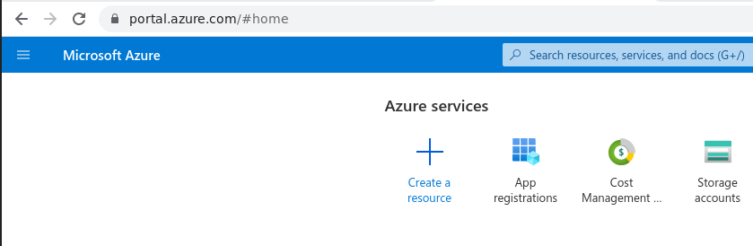
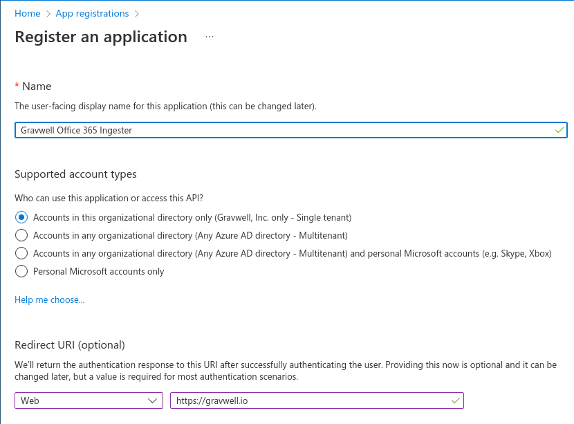
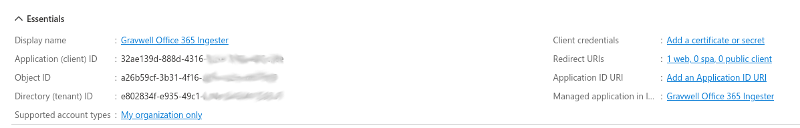
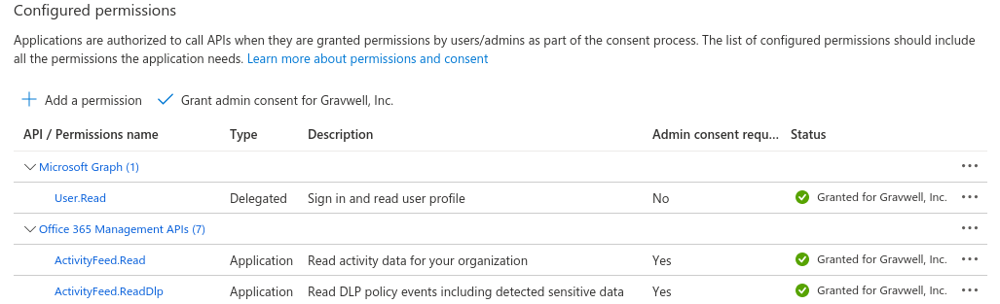
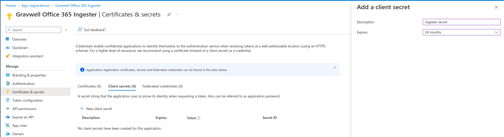
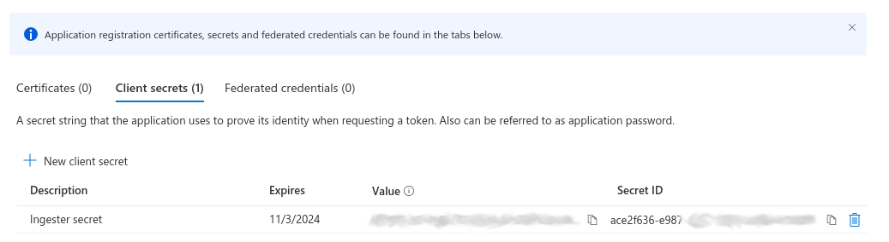

# Office 365

:::{csv-table}
:align: left
:width: 45%
:widths: 15, 25
**Integration Details**
    Ingester, [Office 365](/ingesters/o365.md)
         Kit, [Office 365](https://github.com/gravwell/kits/tree/main/o365)
:::

## Office 365 Configuration

Gravwell provides an ingester for Microsoft Office 365 logs. The ingester can process all supported log types. In order to configure the ingester, you will need to register a new *application* within the Azure Active Directory management portal; this will generate a set of keys which can be used to access the logs. You will need the following information:

* Client ID: A UUID generated for your application via the Azure management console
* Client secret: A secret token generated for your application via the Azure console
* Azure Directory ID: A UUID representing your Active Directory instance, found in the Azure Active Directory dashboard.  This is sometimes called a Tenant ID.
* Tenant Domain: The domain of your Office 365 domain, e.g. "mycorp.onmicrosoft.com"
* Plan: The type of Office 365 subscription
  * Options are `Enterprise`, `GCC Government`, `GCC High Government`, `DOD Government`

### Office 365 API

The Office 365 API provides a limited set of audit activity for clients. This is not a high fidelity dump of all user activity, nor is it an introspection into email content or activity.  The data provided by the API can provide high level views into basic API activity for accounts.

The [Microsoft Office 365 Management Activity API documentation](https://learn.microsoft.com/en-us/office/office-365-management-api/office-365-management-activity-api-reference) can provide more concrete details on what you can and cannot see via this API.

```{note}
Your subscription tier heavily influences the depth and quantity of data available in the API. Low-end plans provide very little, while more expensive plans like `GCC High Government` can provide much more detailed audit activity.
```

### Creating an Azure Application

To create a new Azure Application for our ingester you will need to visit the [Azure Portal](https://portal.azure.com) and log in with administrative O365 credentials.  Then you will need to go to the *App registrations* section.



Within the App registrations portal create a "New registration".



Provide a human friendly name so that you remember why you created this application.  Select an appropriate account type and specify a valid Redirect URI (the ingester will not use this redirect URI but it should be valid and owned by your organization).



Then you will need to grant this application permission to use the Office 365 Management APIs. Specifically, add permissions for:

* Microsoft Graph `User.Read`
* Office 365 Management APIs `ActivityFeed.Read`
* Office 365 Management APIs `ActivityFeed.ReadDlp`

These allow the ingester to request audit data from the management APIs, including activity and DLP data.  If you do not wish to ingest the DLP data, you can remove the DLP log permission.



Note that you will need to click the "Grant admin consent" button on this page to actually enable the management API methods. If you are not an administrator in your O365 tenant, you will need to get an administrator to grant consent. Refer to [the Microsoft documentation](https://learn.microsoft.com/en-us/office/office-365-management-api/get-started-with-office-365-management-apis) for more information about permissions and admin consent.

Finally you will need to go to "Certificates & secrets" and request a new application secret. This will provide a "Secret ID" and "Secret Value".  The Secret Value is what is needed for the ingester configuration.






## Gravwell Configuration

For instructions on installing the Office 365 Ingester see: [Office 365 Log Ingester](https://docs.gravwell.io/ingesters/o365.html)

### Gravwell Storage Well Configuration

**Sample well config:**  
Create or edit: `/opt/gravwell/etc/gravwell.conf.d/o365.well`
```ini
[Storage-Well "o365"]
    Location=/opt/gravwell/storage/o365
    Tags=365*
    Accelerator-Name=fulltext
	Accelerator-Args="-ignoreFloat -ignoreUUID"
```

### Gravwell Office 365 Ingester Configuration
**Sample Office 365 Ingester config:**  
Create or edit: `/opt/gravwell/etc/o365_ingest.conf`
```ini
Log-Level=ERROR #options are OFF INFO WARN ERROR
Log-File=/opt/gravwell/log/o365.log
#Ingest-Cache-Path=/opt/gravwell/cache/o365_ingest.cache #allows for ingested entries to be cached when indexer is not available
State-Store-Location=/opt/gravwell/etc/o365_ingest.state

# The following settings define your Office 365 information.
# The Client-ID and Client-Secret fields are obtained by registering
# an application in the Azure Active Directory management portal
Client-ID=REPLACEME     # UUID generated for your application via Azure mgmt console
Client-Secret=REPLACEME # secret generated for your app
Directory-ID=REPLACEME  # UUID
Tenant-Domain=REPLACEME # e.g. mycorp.onmicrosoft.com

[ContentType "azureAD"]
	Content-Type="Audit.AzureActiveDirectory"
	Tag-Name="365-azure"

[ContentType "exchange"]
	Content-Type="Audit.Exchange"
	Tag-Name="365-exchange"

[ContentType "sharepoint"]
	Content-Type="Audit.SharePoint"
	Tag-Name="365-sharepoint"

[ContentType "general"]
	Content-Type="Audit.General"
	Tag-Name="365-general"

[ContentType "dlp"]
	Content-Type="DLP.All"
	Tag-Name="365-dlp"
```
