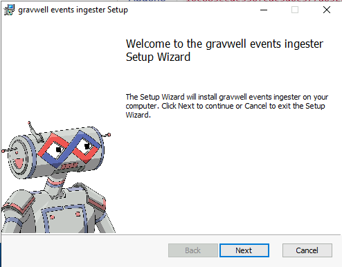
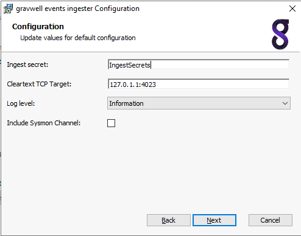
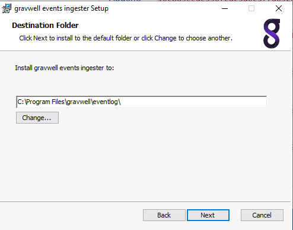
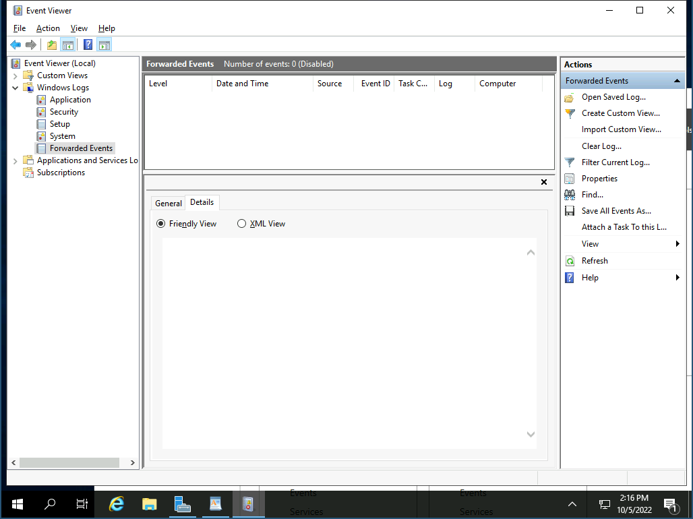

# Window Event Service

:::{csv-table}
:align: left
:width: 45%
:widths: 15, 25
**Integration Details**
    Ingester, [Windows Event Ingester](/ingesters/winevent)
         Kit, [Window Kit](https://github.com/gravwell/kits/tree/main/)
:::

## Window Event Service Configuration

 A well defined collection strategy and data management are key to achieving data omniscience, especially with logs as cumbersome as those formatted in XML, and thus it is recommended to consider the following:

*Plan your collection strategy accordingly for your environment*

Consider the following to create your use cases:
* Ingestion Strategy
    * **Local vs Remote:** Will the Windows Events ingester be deployed locally on each target system, or will you use a `Window Event Collection (WEC)` server?
    * **Scale:** Identify the total number of target systems to monitor and if multiple collectors are required to manage load or simplify collection across diverse subnets and DMZs.
    * **Network Trust:** Is a `federator` required to securely traverse untrusted networks or restricted segments?
* Resource & Change Management
    * **Hardware Allocation:** Ensure available infrastructure (CPU, RAM, and Storage) meets the requirements your desired setup.
    * **Agility:** Consider if a configuration change is needed, how quickly/accurately can it be changed across your environment?

### [Option 1] Deploy locally (to individual windows systems)

Run the .msi installation wizard to install the Gravwell events service. On first installation, the installation wizard will prompt to configure the indexer endpoint and ingest secret. Subsequent installations and/or upgrades will identify a resident configuration file and will not prompt.





```{note}
The Log Level selection is for internal logging only, it does not affect which Windows events are captured by the ingester. Setting the level to Information will cause the ingester to emit log events when it starts, stops, and attaches to event Channels.
```



The ingester is configured with the `config.cfg` file located at `%PROGRAMDATA%\gravwell\eventlog\config.cfg`. The configuration file follows the same form as other Gravwell ingesters with a `[Global]` section configuring the indexer connections and multiple `EventChannel` definitions.


To modify the indexer connection or specify multiple indexers, change the connection IP address to the IP of your Gravwell server and set the Ingest-Secret value. This example shows configuring an encrypted transport:

```
Ingest-Secret=YourSecretGoesHere
Encrypted-Backend-target=ip.addr.goes.here:port
```

Once configured, this file can be copied to any other Windows system from which you would like to collect events.

For silent installation or troubleshooting steps: [Windows Event Ingester](/ingesters/winevent.md)

### [Option 2] Windows Event Forwarding

The Gravwell Winevent ingester can be combined with Windows Event Forwarding (WEF) to simplify deployments and reduce the number of endpoints the ingester must be installed on. Windows Event Forwarding is an integrated Windows service that forwards events to a central collection point using integrated Windows functionality. More information on WEF can be found on [several](https://learn.microsoft.com/en-us/windows/security/threat-protection/use-windows-event-forwarding-to-assist-in-intrusion-detection) [Microsoft](https://social.technet.microsoft.com/wiki/contents/articles/33895.windows-event-forwarding-survival-guide.aspx) [resources](https://learn.microsoft.com/en-us/defender-for-identity/configure-event-forwarding).

Configuring Windows Event Forwarding is beyond the scope of this document, but actually collecting the forwarded events is very simple.

First you will need to install the winevent ingester on the Windows system that will be receiving the forwarded events. Then you will want to validate the name of the channel that is configured to receive the forwarded events on the collection box. Typically that is `ForwardedEvents`.



```{note}
Forwarded events will still contain the correct `Channel` in their logs.
```

### [Option 3] Deploy in an AD Domain environment with a WEC Server

```{note}
It is recommended that collector servers be placed in a central location relative to its source systems (i.e the same forest and network as its source systems) as well as their destination (i.e. gravwell indexer).
```

#### 1) Create the collector GPO:
* Set the Wecsvc (Windows Event Collector) and WinRM (Windows Remote Management) services to start automatically
* For WinRM client, set the following:
    * Allow Basic authentication: Disabled
    * Allow unencrypted traffic: Disabled
    * Disallow Digest authentication: Enabled
        * **Consider setting “Trusted Hosts” and/or only allowing Kerberos authentication**
    * Desired audit policy (unless already configured)
* For WinRM service, set the following:
    * Allow Basic authentication: Disabled
    * Allow unencrypted traffic: Disabled
    * Disallow WinRm from storing RunAs credentials: Enabled
        * **Consider disabling “Allow remote server management through WinRM”, only allowing Kerberos authentication, and/or setting “Specify channel binding token hardening level” (when using HTTPS)**

#### 2) Create the source GPO:
* Set the WinRM (Windows Remote Management) service to start automatically
* For WinRM client, set the following:
    * Allow Basic authentication: Disabled
    * Allow unencrypted traffic: Disabled
    * Disallow Digest authentication: Enabled
        * **Consider setting “Trusted Hosts” and/or only allowing Kerberos authentication**
* For WinRM service, set the following:
    * Allow Basic authentication: Disabled
    * Allow unencrypted traffic: Disabled
    * Disallow WinRm from storing RunAs credentials: Enabled
        * **Consider disabling “Allow remote server management through WinRM” if remote management of these computers should be disable and/or only allowing Kerberos authentication as this is the most secure option available for authentication**

#### 3) Once GPOs are pushed and the servers/clients have been restarted, proceed:

* Verify by opening powershell on the target system and running:
   * `Get-GPO -Name "NAME OF SOURCE GPO"`
* If results come back, the GPO has been applied to the target system; otherwise an error indicates the GPO has not been applied. Check if the GPO has been linked to the target system's OU or if a linked WMI filter is causing this by opening Group Policy Management.

#### 4) Copy over the XML files for the desired level of event collection and run the following for each:
* `wecutil cs "PATH_TO_XML"`

#### 5) To validate this was successful, perform one of the following:
* `wecutil es` (to show all WEC subscriptions)
* Open Event Viewer, select “Subscriptions” from the left tree menu

#### 6) Lastly, verify the “Forwarded Events” log is:
* At least sized to the maximum recommended view size: 4194240
* Configured to your desired retention setting

#### 7) Once each client system updates group policy, you should see events showing up in the “Forwarded Events” log

#### Helpful links:
* [Microsoft WEC/WEF documentation](https://learn.microsoft.com/en-us/windows/security/operating-system-security/device-management/use-windows-event-forwarding-to-assist-in-intrusion-detection#what-format-is-used-for-forwarded-events)
* [Windows Event Collection server setup](https://learn.microsoft.com/en-us/windows/win32/wec/setting-up-a-source-initiated-subscription)
* [NSA WEC/WEF program](https://github.com/nsacyber/Event-Forwarding-Guidance/blob/master/README.md)
* [Palantir WEC/WEF program](https://github.com/palantir/windows-event-forwarding)
* [ASD WEC/WEC program](https://www.cyber.gov.au/resources-business-and-government/maintaining-devices-and-systems/system-hardening-and-administration/system-monitoring/windows-event-logging-and-forwarding)


## Gravwell Configuration

### Gravwell Storage Well Configuration

Setup the well configuration in your Gravwell indexers.

**Sample well config:**  
Create or edit: `/opt/gravwell/etc/gravwell.conf.d/windowsevent-well.conf`
```ini
[Storage-Well "windowsevent"]
    Location=/opt/gravwell/storage/windowsevent
    Tags=windows*
```
### Gravwell Ingester Configuration
**Sample Window Event Service config:**  
Create or edit: `%PROGRAMDATA%\gravwell\eventlog\config.cfg`

#### [Option 1] Deploy locally (to individual windows systems)
```ini
[EventChannel "system"]
    Tag-Name=windows
    Channel=System #pull from the system channel

[EventChannel "sysmon"]
    Tag-Name=sysmon
    Channel="Microsoft-Windows-Sysmon/Operational"
    Max-Reachback=24h # reachback must be expressed in hours (h), minutes (m), or seconds(s)

[EventChannel "Application"]
    Channel=Application # pull from the application channel
    Tag-Name=winApp # Apply a new tag name
    Provider=Windows System # Only look for the provider "Windows System"
    EventID=1000-4000 # Only look for event IDs 1000 through 4000
    EventID=1,2,3,4 # also look for events 1, 2, 3, and 4
    Level=verbose # Only look for verbose entries
    Max-Reachback=72h #start looking for logs up to 72 hours in the past
    Request-Buffer=16 # use a large 16MB buffer for high throughput
    Request-Size=1024 # Request up to 1024 entries per API call for high throughput

[EventChannel "System Critical and Error"]
    Channel=System # pull from the system channel
    Tag-Name=winSysCrit # Apply a new tag name
    Level=critical # look for critical entries
    Level=error # AND for error entries
    Max-Reachback=96h # start looking for logs up to 96 hours in the past

[EventChannel "Security prune"]
    Channel=Security # pull from the security channel
    Tag-Name=winSec # Apply a new tag name
    EventID=-400 # ignore event ID 400
    EventID=-401 # AND ignore event ID 401
```
#### [Option 2] Windows Event Forwarding
```ini
[EventChannel "WEF Events"]
    Tag-Name=windows
    Channel=ForwardedEvents
```

#### [Option 3] Deploy in a AD Domain environment with a WEC Server
```ini

```

```{note}
Remember to restart the gravwell service via standard windows service management to apply the new config.
```