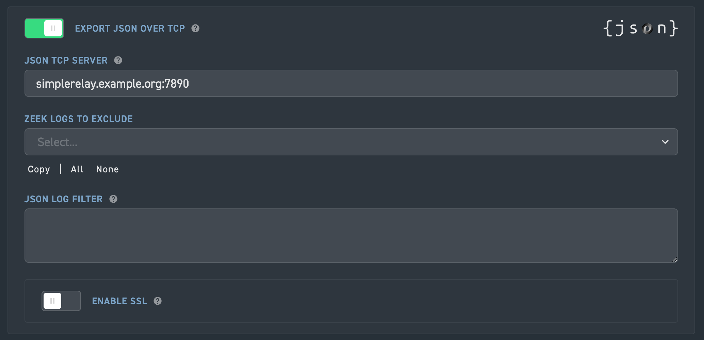

# Corelight

:::{csv-table}
:align: left
:width: 45%
:widths: 15, 25
**Integration Details**
    Ingester, [Simple Relay](/ingesters/simple_relay)
Preprocessor, [Corelight JSON to TSV](/ingesters/preprocessors/corelight.md)
         Kit, [Corelight Kit](https://github.com/gravwell/kits/tree/main/corelight)
:::

## Corelight Configuration

Follow these steps to export logs from your Corelight sensor to the Gravwell Ingester.

### [Option 1] Web GUI
* Navigate to the **Sensor > Export** tab.
* Enable the **EXPORT JSON OVER TCP** Slider
* Enter the **IP address** and **Port**



### [Option 2] CLI
Run the following command to update the configuration:

```bash
corelight-client configuration update --export.json_tcp.enable true --export.json_tcp.destination <IP>:<PORT>
```

### [Option 3] Setting up Corelight@Home to export logs to Gravwell
Edit the configuration file at: `/etc/corelight-softsensor.conf`
```bash
# Definen the capture interface
Corelight::sniff    eth0

# EnableJSON over TCP export
Corelight::json_enable  T
# Target IP and Port of your Gravwell ingester
Corelight::json_server  192.168.0.10:7890
```

Restart Service with:  
```systemctl restart corelight-softsensor```

## Gravwell Configuration

### Gravwell Storage Well Configuration

Corelight generates highly orthogonal data (UUIDs, floating-point timestamps, IPv6). To optimize indexing performance and memory usage, we recommend a dedicated well with specific indexing flags.

**Recommend Engine:** Bloom or Index
**Crucial Flags:** `ignroeFloat` and `ignoreUUID` to reduce index bloat.

**Sample well config:**  
Create or edit: `/opt/gravwell/etc/gravwell.conf.d/corelight.well`
```ini
[Storage-Well "corelight"]
    Location=/opt/gravwell/storage/corelight
    Tags=corelight*
    Accelerator-Name=fulltext
    Accelerator-Args="-ignoreFloat -ignoreUUID"
```

### Gravwell Simple Relay Ingester Configuration
We recommend using the **Simple Relay** ingester. The following configuration listens on port `7890`, extracts the `_path` field from the JSON payload, and dynamically routes data to descriptive tags.

```{note}
Ensure your firewalls allows traffic on port `7890` between the Corelight sensor and the Gravwell ingester.
```

### Gravwell Ingester Configuration: Simple Relay
File: `/opt/gravwell/etc/simple_relay.conf.d/corelight.conf`
```ini
[JSONListener "corelight"]
    Bind-String="0.0.0.0:7890"
    Default-Tag=corelight
    Extractor="_path"
    Tag-Match=bacnet:corelight_bacnet
    Tag-Match=capture_loss:corelight_capture_loss
    Tag-Match=cip:corelight_cip
    Tag-Match=conn:corelight_conn
    Tag-Match=conn_long:corelight_conn_long
    Tag-Match=conn_red:corelight_conn_red
    Tag-Match=corelight_burst:corelight_burst
    Tag-Match=corelight_overall_capture_loss:corelight_overall_capture_loss
    Tag-Match=corelight_profiling:corelight_profiling
    Tag-Match=datared:corelight_datared
    Tag-Match=dce_rpc:corelight_dce_rpc
    Tag-Match=dga:corelight_dga
    Tag-Match=dhcp:corelight_dhcp
    Tag-Match=dnp3:corelight_dnp3
    Tag-Match=dns:corelight_dns
    Tag-Match=dns_red:corelight_dns_red
    Tag-Match=dpd:corelight_dpd
    Tag-Match=encrypted_dns:corelight_encrypted_dns
    Tag-Match=enip:corelight_enip
    Tag-Match=enip_debug:corelight_enip_debug
    Tag-Match=enip_list_identity:corelight_enip_list_identity
    Tag-Match=etc_viz:corelight_etc_viz
    Tag-Match=files:corelight_files
    Tag-Match=files_red:corelight_files_red
    Tag-Match=ftp:corelight_ftp
    Tag-Match=generic_dns_tunnels:corelight_generic_dns_tunnels
    Tag-Match=generic_icmp_tunnels:corelight_generic_icmp_tunnels
    Tag-Match=http:corelight_http
    Tag-Match=http2:corelight_http2
    Tag-Match=http_red:corelight_http_red
    Tag-Match=icmp_specific_tunnels:corelight_icmp_specific_tunnels
    Tag-Match=intel:corelight_intel
    Tag-Match=ipsec:corelight_ipsec
    Tag-Match=irc:corelight_irc
    Tag-Match=iso_cotp:corelight_iso_cotp
    Tag-Match=kerberos:corelight_kerberos
    Tag-Match=known_certs:corelight_known_certs
    Tag-Match=known_devices:corelight_known_devices
    Tag-Match=known_domains:corelight_known_domains
    Tag-Match=known_hosts:corelight_known_hosts
    Tag-Match=known_names:corelight_known_names
    Tag-Match=known_remotes:corelight_known_remotes
    Tag-Match=known_services:corelight_known_services
    Tag-Match=known_users:corelight_known_users
    Tag-Match=local_subnets:corelight_local_subnets
    Tag-Match=local_subnets_dj:corelight_local_subnets_dj
    Tag-Match=local_subnets_graphs:corelight_local_subnets_graphs
    Tag-Match=log4shell:corelight_log4shell
    Tag-Match=modbus:corelight_modbus
    Tag-Match=mqtt_connect:corelight_mqtt_connect
    Tag-Match=mqtt_publish:corelight_mqtt_publish
    Tag-Match=mqtt_subscribe:corelight_mqtt_subscribe
    Tag-Match=mysql:corelight_mysql
    Tag-Match=notice:corelight_notice
    Tag-Match=ntlm:corelight_ntlm
    Tag-Match=ntp:corelight_ntp
    Tag-Match=ocsp:corelight_ocsp
    Tag-Match=openflow:corelight_openflow
    Tag-Match=packet_filter:corelight_packet_filter
    Tag-Match=pe:corelight_pe
    Tag-Match=profinet:corelight_profinet
    Tag-Match=profinet_dce_rpc:corelight_profinet_dce_rpc
    Tag-Match=profinet_debug:corelight_profinet_debug
    Tag-Match=radius:corelight_radius
    Tag-Match=rdp:corelight_rdp
    Tag-Match=reporter:corelight_reporter
    Tag-Match=rfb:corelight_rfb
    Tag-Match=s7comm:corelight_s7comm
    Tag-Match=signatures:corelight_signatures
    Tag-Match=sip:corelight_sip
    Tag-Match=smartpcap:corelight_smartpcap
    Tag-Match=smartpcap-stats:corelight_smartpcap-stats
    Tag-Match=smb_files:corelight_smb_files
    Tag-Match=smb_mapping:corelight_smb_mapping
    Tag-Match=smtp:corelight_smtp
    Tag-Match=smtp_links:corelight_smtp_links
    Tag-Match=snmp:corelight_snmp
    Tag-Match=socks:corelight_socks
    Tag-Match=software:corelight_software
    Tag-Match=specific_dns_tunnels:corelight_specific_dns_tunnels
    Tag-Match=ssh:corelight_ssh
    Tag-Match=ssl:corelight_ssl
    Tag-Match=ssl_red:corelight_ssl_red
    Tag-Match=stats:corelight_stats
    Tag-Match=stepping:corelight_stepping
    Tag-Match=stun:corelight_stun
    Tag-Match=stun_nat:corelight_stun_nat
    Tag-Match=suricata_corelight:corelight_suricata_corelight
    Tag-Match=suricata_eve:corelight_suricata_eve
    Tag-Match=suricata_stats:corelight_suricata_stats
    Tag-Match=suricata_zeek_stats:corelight_suricata_zeek_stats
    Tag-Match=syslog:corelight_syslog
    Tag-Match=tds:corelight_tds
    Tag-Match=tds_rpc:corelight_tds_rpc
    Tag-Match=tds_sql_batch:corelight_tds_sql_batch
    Tag-Match=traceroute:corelight_traceroute
    Tag-Match=tunnel:corelight_tunnel
    Tag-Match=unknown-smartpcap:corelight_unknown-smartpcap
    Tag-Match=util_stats:corelight_util_stats
    Tag-Match=vpn:corelight_vpn
    Tag-Match=weird:corelight_weird
    Tag-Match=weird_red:corelight_weird_red
    Tag-Match=weird_stats:corelight_weird_stats
    Tag-Match=wireguard:corelight_wireguard
    Tag-Match=x509:corelight_x509
    Tag-Match=x509_red:corelight_x509_red
    Tag-Match=zeek_doctor:corelight_zeek_doctor
```


```{note}
Remember to restart the service to apply the new config:
`sudo systemctl restart gravwell_simple_relay.service`
```