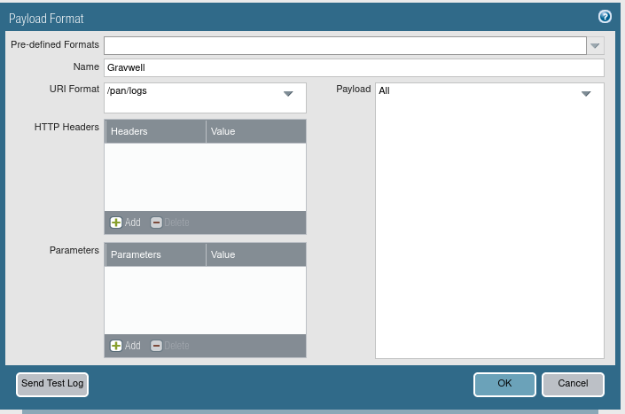
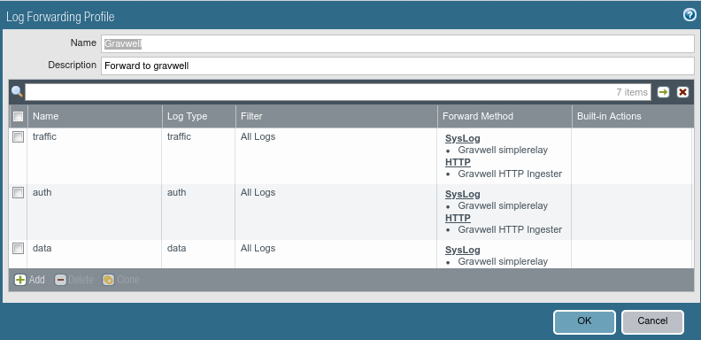

# Palo Alto

:::{csv-table}
:align: left
:width: 45%
:widths: 15, 25
**Integration Details**
    Ingester, • [Simple Relay](/ingesters/simple_relay) <br /> • [HTTP Ingester](/ingesters/http)
Preprocessor, [Corelight JSON to TSV](/ingesters/preprocessors/regexextract.md)
         Kit, [Palo Alto Kit](https://github.com/gravwell/kits/tree/main/paloalto)
:::

## Palo Alto Configuration

### [Option 1] Syslog Forwarding to Simple Relay
[Configure Syslog Monitoring](https://docs.paloaltonetworks.com/ngfw/administration/monitoring/use-syslog-for-monitoring/configure-syslog-monitoring)

Configure Syslog forwarding as described in the Palo Alto documentation:

* `Transport`: Use the same protocol selected here in the `Bind-String` in the simple relay config.
* `Port`: Use the same port selected here in the `Bind-String` in the simple relay config.
* `Format`: IETF


### [Option 2] HTTP Log Fowarding to HTTP Ingester
[Configure HTTP Log Forwarding](https://docs.paloaltonetworks.com/ngfw/administration/monitoring/forward-logs-to-an-https-destination)

Configure HTTP log forwarding as described in the Palo Alto documentation:

#### HTTP Server Profile

* `Address`: Field corresponds to the HTTP Ingester's address.
* `Port`: Use the same port selected here in the `Bind` in the global section of your HTTP Ingester.
* `HTTP Method`: Set field to POST.
* `Username`: Use the same username here as in the HTTP ingester config.
* `Password`: Use the same password here as in the HTTP ingester config.

#### Payload Format tab 
Set each log type as shown below in the image:
* `URI Format`: Use the same path as set in the `URL` in the HTTP ingester config.



#### Log Forwarding Profile 
Create a log forwarding profile which sends all desired log types to the HTTP Server Profile created above. Note that it is possible to use one Log Forwarding Profile to send logs to both syslog and HTTP ingesters at the same time, if desired, as seen below:




## Gravwell Configuration

### Gravwell Storage Well Configuration

Setup the well configuration in your Gravwell indexers.

**Sample well config:**  
Create or edit: `/opt/gravwell/etc/gravwell.conf.d/pan-well.conf`
```ini
[Storage-Well "pan"]
    Location=/opt/gravwell/storage/pan
    Tags=pan*
```

### [Option 1] Gravwell Ingester Configuration: Simple Relay
**Sample Palo Alto config:**  
Create or edit: `/opt/gravwell/etc/simple_relay.conf.d/paloalto.conf`
```ini
Listener "syslogtcp_paloalto"]
        Bind-String="tcp://0.0.0.0:6601"
        Reader-Type=line
        Tag-Name=pan_events
        Assume-Local-Timezone=true
        Preprocessor="PaloAlto Audit Router"
        Preprocessor="PaloAlto Tunnel Inspection Router"
        Preprocessor="PaloAlto PAN Type Router"

    # Route Audit logs. Audit logs identify as AUDIT in the 3rd CSV field and
    # use a different CSV layout than standard SYSTEM logs.
    [preprocessor "PaloAlto Audit Router"]
        Type=regexrouter
        Drop-Misses=false
        Regex=`^(?:[^,]*,){2}(?P<subtype>AUDIT|audit),`
        Route-Extraction=subtype
        Route=AUDIT:pan_audit
        Route=audit:pan_audit

    # Route Tunnel Inspection logs. These logs use START/END in the 4th CSV field
    # instead of a family name such as TRAFFIC or THREAT.
    # The additional severity check helps distinguish this format from other PAN logs.
    [preprocessor "PaloAlto Tunnel Inspection Router"]
        Type=regexrouter
        Drop-Misses=false
        Regex=`^(?:[^,]*,){3}(?P<event>START|END|start|end),(?:[^,]*,){27}(?:informational|low|medium|high|critical),`
        Route-Extraction=event
        Route=START:pan_tunnel
        Route=END:pan_tunnel
        Route=start:pan_tunnel
        Route=end:pan_tunnel

    # Route all remaining PAN log families by the 4th CSV field.
    [preprocessor "PaloAlto PAN Type Router"]
        Type=regexrouter
        Drop-Misses=false
        Regex=`^(?:[^,]*,){3}(?P<type>[^,]+),`
        Route-Extraction=type
        Route=AUTHENTICATION:pan_auth
        Route=CONFIG:pan_config
        Route=CORRELATION:pan_correlation
        Route=DECRYPTION:pan_decryption
        Route=GLOBALPROTECT:pan_globalprotect
        Route=GTP:pan_gtp
        Route=HIP-MATCH:pan_hipmatch
        Route=HIPMATCH:pan_hipmatch
        Route=IPTAG:pan_iptag
        Route=SCTP:pan_sctp
        Route=SYSTEM:pan_system
        Route=THREAT:pan_threat
        Route=TRAFFIC:pan_traffic
        Route=USERID:pan_userid
```

```{note}
Remember to restart the service to apply the new config:
`sudo systemctl restart gravwell_simple_relay.service`
```

### [Option 2] Gravwell Ingester Configuration: HTTP
Create or edit: `/opt/gravwell/etc/gravwell_http_ingester.conf`
```ini
[Global]
Connection-Timeout = 0
Log-Level=INFO #options are OFF INFO WARN ERROR
Ingest-Cache-Path=/opt/gravwell/cache/http_ingester.cache
#Max-Ingest-Cache=1024 #Number of MB to store, localcache will only store 1GB before stopping.  This is a safety net
Bind=":8080"
Max-Body=4096000 #about 4MB
Log-File=/opt/gravwell/log/http_ingester.log #optional log file
Health-Check-URL="/health/check"
```

Create or edit: `/opt/gravwell/etc/gravwell_http_ingester.d/paloalto.conf`
```
[Listener "palo"]
        AuthType=basic
        Username=paloalto
        Password=paloaltopassword
        URL="/pan/logs"
        Tag-Name=pan_events
        Assume-Local-Timezone=true
        Preprocessor="PaloAlto Audit Router"
        Preprocessor="PaloAlto Tunnel Inspection Router"
        Preprocessor="PaloAlto PAN Type Router"

[preprocessor "PaloAlto Audit Router"]
    Type=regexrouter
    Drop-Misses=false
    Regex=`^(?:[^,]*,){2}(?P<subtype>AUDIT|audit),`
    Route-Extraction=subtype
    Route=AUDIT:pan_audit
    Route=audit:pan_audit

[preprocessor "PaloAlto Tunnel Inspection Router"]
    Type=regexrouter
    Drop-Misses=false
    Regex=`^(?:[^,]*,){3}(?P<event>START|END|start|end),(?:[^,]*,){27}(?:informational|low|medium|high|critical),`
    Route-Extraction=event
    Route=START:pan_tunnel
    Route=END:pan_tunnel
    Route=start:pan_tunnel
    Route=end:pan_tunnel

[preprocessor "PaloAlto PAN Type Router"]
    Type=regexrouter
    Drop-Misses=false
    Regex=`^(?:[^,]*,){3}(?P<type>[^,]+),`
    Route-Extraction=type
    Route=AUTHENTICATION:pan_auth
    Route=CONFIG:pan_config
    Route=CORRELATION:pan_correlation
    Route=DECRYPTION:pan_decryption
    Route=GLOBALPROTECT:pan_globalprotect
    Route=GTP:pan_gtp
    Route=HIP-MATCH:pan_hipmatch
    Route=HIPMATCH:pan_hipmatch
    Route=IPTAG:pan_iptag
    Route=SCTP:pan_sctp
    Route=SYSTEM:pan_system
    Route=THREAT:pan_threat
    Route=TRAFFIC:pan_traffic
    Route=USERID:pan_userid
```

```{note}
Remember to restart the service to apply the new config:
`sudo systemctl restart gravwell_http_ingester.service`
```