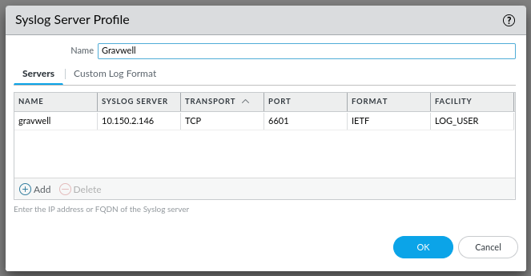

# Palo Alto

:::{csv-table}
:align: left
:width: 45%
:widths: 15, 25
**Integration Details**
    Ingester, [Simple Relay Ingester](/ingesters/simple_relay.md)
Preprocessor, [Corelight JSON to TSV](/ingesters/preprocessors/regexextract.md)
         Kit, [Palo Alto Kit](https://github.com/gravwell/kits/tree/main/paloalto)
:::

## Palo Alto Configuration
[Configure Syslog Monitoring](https://docs.paloaltonetworks.com/pan-os/9-1/pan-os-admin/monitoring/use-syslog-for-monitoring/configure-syslog-monitoring)

Configure log forwarding as described in the Palo Alto documentation:

* `Transport`: Use the same protocol selected here in the `Bind-String` in the simple relay config.
* `Port`: Use the same port selected here in the `Bind-String` in the simple relay config.
* `Format`: IETF



## Gravwell Configuration

### Gravwell Storage Well Configuration

Setup the well configuration in your Gravwell indexers.

**Sample well config:**  
Create or edit: `/opt/gravwell/etc/gravwell.conf.d/pan-well.conf`
```ini
[Storage-Well "pan"]
    Location=/opt/gravwell/storage/pan
    Tags=pan*
```
### Gravwell Ingester Configuration: Simple Relay
**Sample Palo Alto config:**  
Create or edit: `/opt/gravwell/etc/simple_relay.conf.d/paloalto.conf`
```ini
[Listener "syslogtcp"]
        Bind-String="tcp://0.0.0.0:6601"
        Reader-Type=line
        Tag-Name=syslog
        Assume-Local-Timezone=true #if a time format does not have a timezone, assume local time
        Preprocessor="PaloAlto PAN"

[preprocessor "PaloAlto PAN"]
        Type = regexrouter
        Drop-Misses=false
        Regex=`^[^,]+,[^,]+,[^,]+,(?P<type>[^,]+),`
        Route-Extraction=type
        Route=AUTHENTICATION:pan_auth
        Route=CONFIG:pan_config
        Route=CORRELATION:pan_correlation
        Route=DECRYPTION:pan_decryption
        Route=GLOBALPROTECT:pan_globalprotect
        Route=GTP:pan_gtp
        Route=HIPMATCH:pan_hipmatch
        Route=IPTAG:pan_iptag
        Route=SCTP:pan_sctp
        Route=SYSTEM:pan_system
        Route=THREAT:pan_threat
        Route=TRAFFIC:pan_traffic
        Route=USERID:pan_userid
```

```{note}
Remember to restart the service to apply the new config:
`sudo systemctl restart gravwell_simple_relay.service`
```