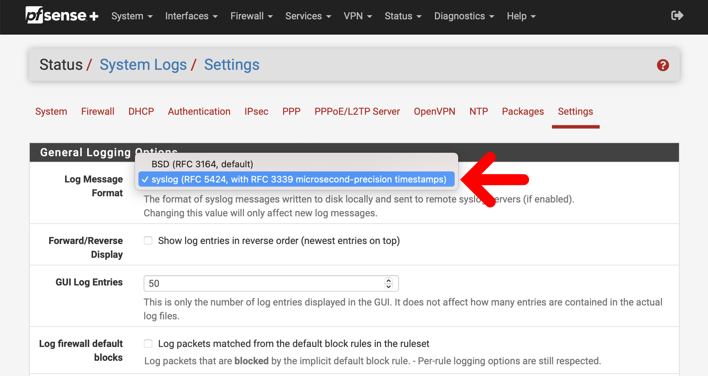
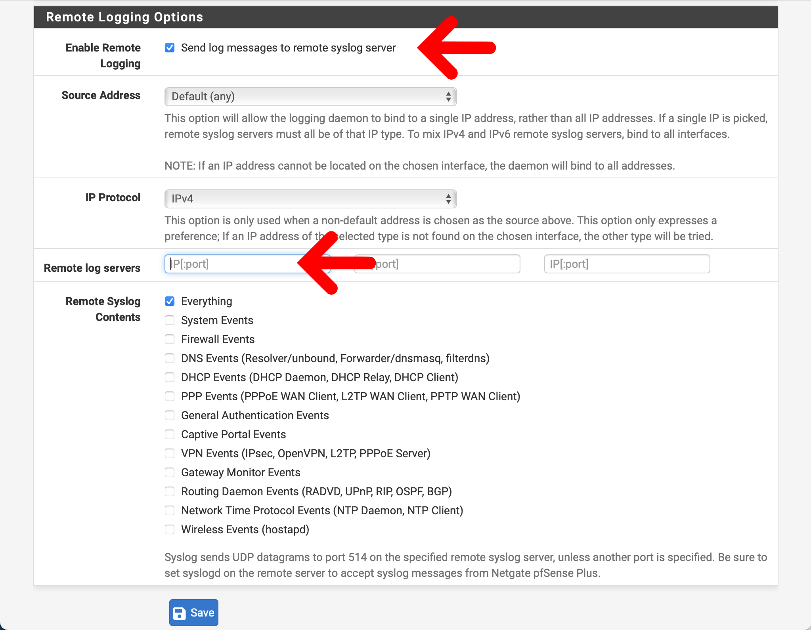

# pfSense

:::{csv-table}
:align: left
:width: 45%
:widths: 15, 25
**Integration Details**
    Ingester, [Simple Relay](https://docs.gravwell.io/ingesters/simple_relay.html)
         Kit, [pfSense Kit](https://github.com/gravwell/kits/tree/main/pfSense)
:::

## pfSense Configuration

### Set the Log Message Format to RFC 5424
1. Open the web interface for pfSense, and navigate to Status -> System Logs
2. Click on the Settings tab to view logging options
3. Ensure that the Log Message Format is set to "syslog (RFC 5424…)"




### Enable Remote Logging
1. Open the web interface for pfSense, navigate to Status -> System Logs, and click on the Settings tab
2. Scroll down to the Remote Logging Options section
3. Check the box to enable remote logging
4. Add the IP address of your Simple Relay ingester in the list of remote logging servers
   * Be sure to match the port chosen for your Simple Relay listener!
5. Enable the remote syslog contents as you see fit.
   * If you want to use the firewall components in this kit, be sure to check the box for Firewall Events
6. Click Save

You can read more about remote logging in pfSense® [here](https://docs.netgate.com/pfsense/en/latest/monitoring/logs/remote.html).




## Gravwell Configuration

### Gravwell Storage Well Configuration

Setup the well configuration in your Gravwell indexers.

**Sample well config:**  
Create or edit: `/opt/gravwell/etc/gravwell.conf.d/pfsense-well.conf`
```ini
[Storage-Well "pfsense"]
    Location=/opt/gravwell/storage/pfsense
    Tags=pfsense*
```

### Gravwell Ingester Configuration: Simple Relay
**Sample pfSense config:**  
Create or edit: `/opt/gravwell/etc/simple_relay.conf.d/pfsense.conf`
```ini
[Listener "pfsensesyslogudp"]
    Bind-String="udp://0.0.0.0:515" #standard UDP based RFC5424 syslog
    Reader-Type=rfc5424
    Tag-Name=pfsensesyslog
    Assume-Local-Timezone=true
```

```{note}
Remember to restart the service to apply the new config:
`sudo systemctl restart gravwell_simple_relay.service`
```