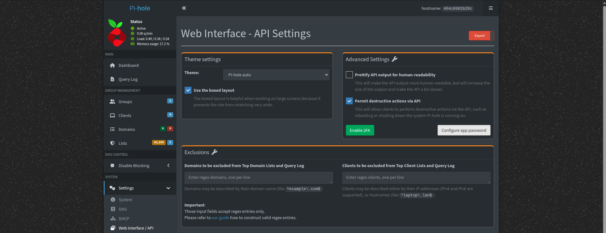

# Pi-hole

:::{csv-table}
:align: left
:width: 45%
:widths: 15, 25
**Integration Details**
         Kit, [Pi-hole Kit](https://github.com/gravwell/kits/tree/main/pihole)
:::

## Pi-hole Configuration

An API key is required use the following steps to get the key:

*Pi-hole v6.0+:*
1. Log into your Admin Dashboard
2. Go to `Settings > API/Web Interface` tab
3. Switch the view from Basic to Export using the toggle at the top right
4. Click Configure app password
5. Copy the generated password



*Pi-hole v5.x and earlier:*
1. Log into your Admin Dashboard
2. Go to `Settings > API/Web Interface` tab
3. Click the `Show API` token button
4. Confirmation box will appear; click Yes, show API token and copy the raw text string

## Gravwell Configuration

Gravwell uses its scripting interface (in the Pi-hole Kit) to request data from the Pi-hole API.

1. Set the `$PIHOLE_IP` macro to the IP Address of your pihole instance
2. Change the `$PIHOLE_PORT` macro to the port of your pihole instance (Usually 80)
3. Get the API key from your pihole instance. Go to `Settings > API` and then the `Show API` token button
4. Set the `$PIHOLE_APIKEY` macro to the token from the previous step
5. Set the `PIHOLE_TAG` macro to the desired tag name. The default is `pihole-queries`
6. If you used a tag name other than the default you will need to update the extractor to your new tag name
7. Go to scripts and enable the `PiHole Script` to run every 5 minutes with a cron schedule of `*/5 * * * *`

### Gravwell Storage Well Configuration

Setup the well configuration in your Gravwell indexers.

**Sample well config:**  
Create or edit: `/opt/gravwell/etc/gravwell.conf.d/pihole.conf`
```ini
[Storage-Well "pihole"]
    Location=/opt/gravwell/storage/pihole
    Tags=pihole*
```
