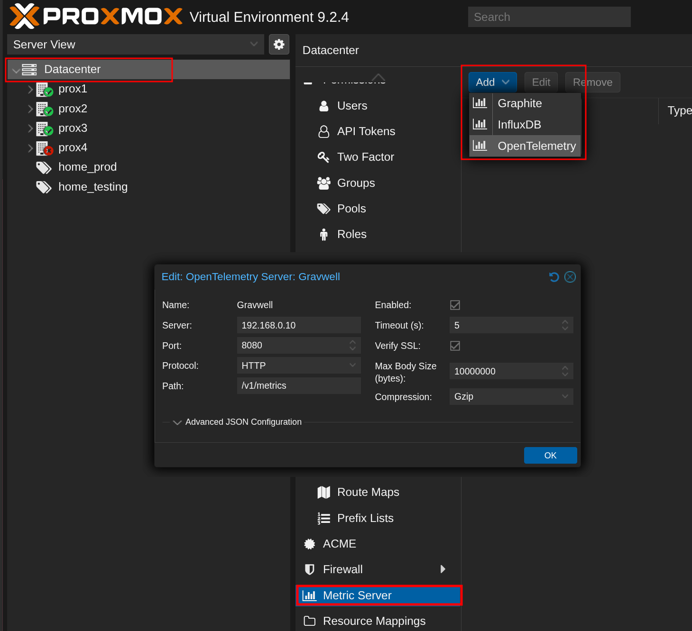

# Proxmox

:::{csv-table}
:align: left
:width: 45%
:widths: 15, 25
**Integration Details**
    Ingester, [HTTP Ingester](/ingesters/http)
:::

## Proxmox Configuration

There are two primary methods to monitor Proxmox environments.
* **Open Telemetry (Simplest, metrics only):** Proxmox provides metrics about the environment and individual virtual machines through OpenTelemetry. This method requires no additional installation and is useful for monitoring things like system, storage, and network usage. 
* **Systemd logs (Proxmox Logs):** Systemd logs will include proxmox commands, such as vm power on and restart. This method requires installing an application onto Proxmox through the command line interface.

If using both methods it is recommended to send to different URL's and different tags.

### [Option 1] Exporting Proxmox Metrics via OpenTelemetry

Open telemetry collects metrics about each of the nodes and individual vms. This can be configured to send to the HTTP ingester in the Proxmox web interface by clicking on the Datacenter -> Metric Server -> Add -> OpenTelemetry

* `Name`: Use an identifiable name.
* `Server`: Field corresponds to the HTTP Ingester's address.
* `Port`: Use the same port selected here in the `Bind` in the global section of your HTTP Ingester.
* `Protocol`: Use the same protocol used for your HTTP Ingester.
* `Path` Use the same value set here in the `URL` in your HTTP Ingester (e.g /v1/metrics)



### [Option 2] Exporting Proxmox Systemd logs

Install systemd-journal-remote to export logs to gravwell
```
apt update && apt install systemd-journal-remote
```

Edit or create `/etc/systemd/journal-upload.conf` with the following
```
[Upload]
URL=http://ingesterIP:port # Set to the same values used in your HTTP Ingester
# ServerKeyFile=/etc/ssl/private/journal-upload.pem
# ServerCertificateFile=/etc/ssl/certs/journal-upload.pem
# TrustedCertificateFile=/etc/ssl/ca/trusted.pem
```

Remember to enable and restart the service.
```
sudo systemctl enable systemd-journal-upload.service
sudo systemctl restart systemd-journal-upload.service
sudo systemctl status systemd-journal-upload.service
```

The first time this is executed it will attempt to upload the entire log file which may be over the max file size of the Gravwell HTTP ingester. You may need to increase the Max-Body size in the 
* Find the current file size with `journalctl --disk-usage`
* Modify `/opt/gravwell/etc/gravwell_http_ingester.conf` and increase `Max-Body` to ingest this size

## Gravwell Configuration

### Gravwell Storage Well Configuration

Setup the well configuration in your Gravwell indexers.

**Sample well config:**  
Create or edit: `/opt/gravwell/etc/gravwell.conf.d/proxmox-well.conf`
```ini
[Storage-Well "proxmox"]
    Location=/opt/gravwell/storage/proxmox
    Tags=prox-*
    Tags=otel-prox-*
```

### Gravwell Ingester Configuration: HTTP
**Sample Proxmox HTTP config:**  
Create or edit: `/opt/gravwell/etc/gravwell_http_ingester.conf.d/auth0.conf`
```ini
# [Option 1] Open Telemetry Metrics Listener
[OpenTelemetry-Metrics-Listener "otel-metrics"]
    URL="/v1/metrics"                # Standard OTLP metrics endpoint
    Tag-Name="otel-prox-metrics"     # Tag for ingested metrics
    Ignore-Timestamps=false          # Use timestamps from OTLP data
    Debug-Posts=true                 # Log debug info about requests
    Encode-As-JSON=true              # Encode metrics as JSON and include in the entry DATA, (doubles storage requirements)
#    Preprocessor="otel-processor"   # Optional preprocessor

# [Option 2] Exporting Proxmox Systemd logs
[Listener "systemd"]
    URL="/upload"
    Tag-Name=prox-systemd
```

```{note}
Remember to restart the service to apply the new config:
`sudo systemctl restart gravwell_http_ingester.service`
```


