# Kits

Kits are Gravwell's way of bundling up a lot of related items (dashboards, queries, scheduled searches, autoextractors) for easy installation on other systems. A kit might contain tools for analyzing Netflow data, or for monitoring a homebrewing setup. Gravwell Inc. provides pre-built kits for common usecases, but users can also build their own kits from within the Gravwell UI.

## What's in a Kit

There are many components which make up a kit. First, there are the *contents* of the kit, which fall into 2 categories:

* Items: Regular Gravwell components such as dashboards, scheduled searches, macros, actionables, etc.
* Configuration Macros: These are specialized macros which the kit uses to configure itself, which can allow greater flexibility in e.g. choices of tags used. For instance, rather than using `tag=netflow` in all queries, a Netflow kit can say `tag=$NETFLOW_KIT_TAG`, then define a configuration macro named NETFLOW_KIT_TAG. At installation time, the kit prompts the user for which tag or tags contain Netflow records.

There are a few other things which help *identify* a kit that are useful to keep in mind:

* ID: Identifies the kit. Gravwell uses namespaces similar to Android applications, e.g. "io.gravwell.netflowv5".
* Version: Kits may be updated over time, and the version number tracks this so Gravwell can automatically notify of new kit versions.
* Name: A user-friendly name for the kit, e.g. "Netflow v5".
* Description: A detailed description of what the kit does.
* MinVersion/MaxVersion: Some kits require specific Gravwell features; to ensure those features are available, these fields specify which Gravwell versions are compatible with the kit.
* Dependencies: Kits can depend on other kits, like packages in a Linux distribution. Gravwell's Netflow v5 kit depends on the Network Enrichment kit, for example. Dependencies are automatically installed along with the kit.

## Browsing Installed Kits

Kits are managed through the Kits page, located in the main menu. When you load the kits page, you will first see a list of installed kits. In the image below, we see two installed kits:

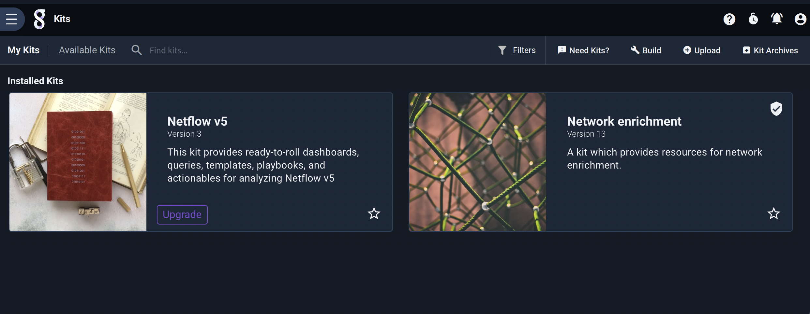

Clicking one of the kits will put you into the *context* of the selected kit and display the kit's contents:

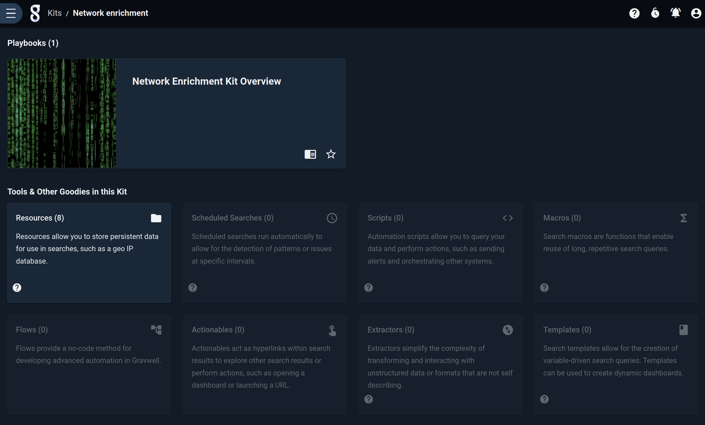

The UI is now in the kit's *context*, meaning it will only show that kit's contents until you leave the context. For example, browsing to the Dashboards page from the main menu will show only two two dashboards included with that particular kit:

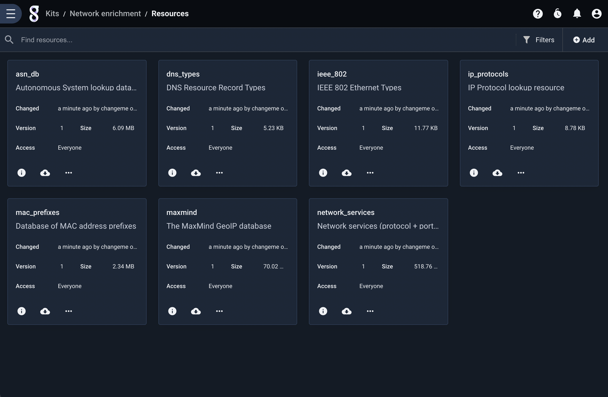

Note the text "Kits / Netflow v5 / Dashboards" at the top of the page. This indicates that we are *inside* that particular kit. To leave the kit context, click the Gravwell logo next to the main menu button.

## Installing Kits

To install a kit, you must enter kit management mode by clicking the "Manage Kits" button in the upper-right corner of the main kits page. If you have no kits installed, the UI will automatically take you to the 'Available Kits' tab, otherwise the default view will show your currently-installed kits. To find and install kits, click the 'Available Kits' label at the top of the screen.

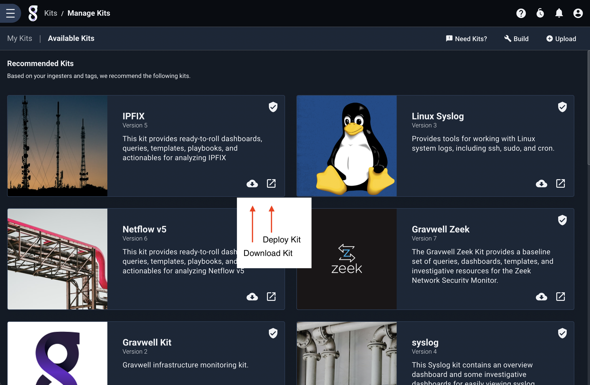

You can click the kit details button to learn more about a given kit. Once you've decided on a kit to install, click the install kit button. The system will download the kit, then pop up a wizard for installation. In the screenshot below, we have selected the IPFIX kit for installation. The first page shows a list of items contained in the kit:

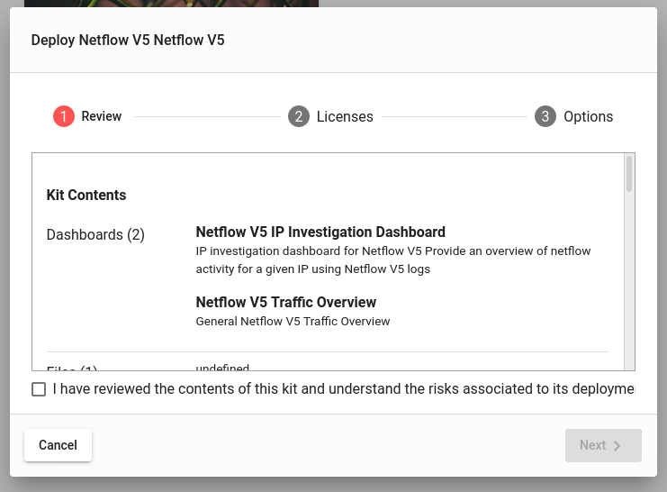

After reviewing the contents, click the checkbox and select the Next button. The wizard will then display any licenses packaged with the kit; note that if there are multiple licenses, you will have to select each one individually from the list on the left and click each checkbox before continuing.

Next, the wizard will prompt for *Configuration Macros*, if any are defined by the kit. A configuration macro allows install-time configuration of the queries which are shipped by the kit; these will typically include a default value but also provide a description to help you figure out what to enter. In this screenshot, it needs to know which tag contains IPFIX records; because we intend to use the "ipfix" tag, we can leave the default value alone.

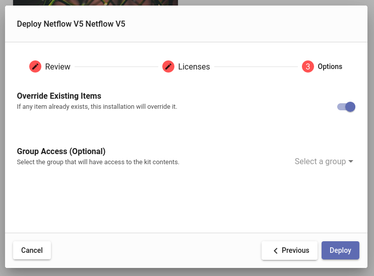

The final page of the wizard prompts for additional options. "Override Existing Items", if checked, will overwrite any conflicting objects which may already exist on the system--for instance, if you have created a resource named "foo", but the kit will also create a resource named "foo". The "Group Access" dropdown allows you to optionally select a group which can see the contents of the kit. Admin users will also have the option to install the kit *globally*, meaning all users can see it.

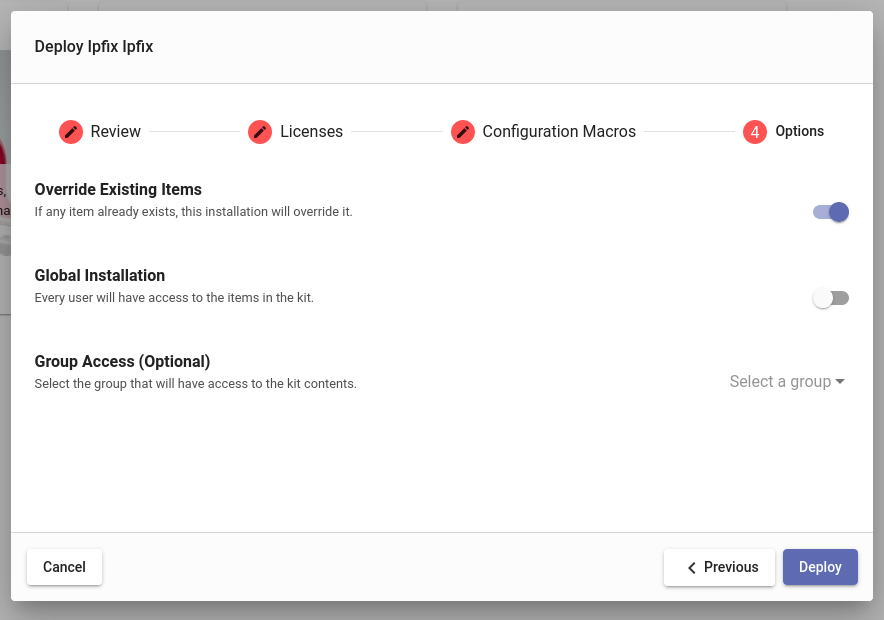

When you click the "Deploy" button, the kit and any dependencies will be installed. This may take a minute or so, but eventually the kit will be listed as one of your installed kits.

Note: If you abort the installation wizard, the kit will not be installed, but the downloaded kit will be shown in the "My kits" page under the label "Kits Staged for Deployment", as seen below. You can chose to delete the staged kit or restart the installation wizard.

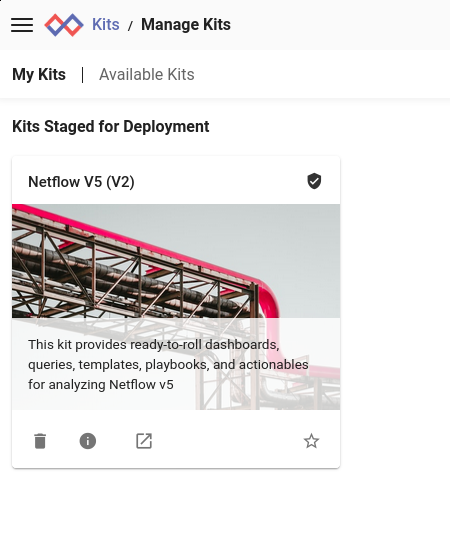

## Upgrading Kits

Gravwell will periodically push updates to the official kit server. When one of your installed kits has an update available, an "Upgrade" button will appear on that kit's tile:

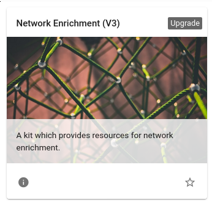

Clicking the button will launch an upgrade wizard similar to the installation wizard. The most important difference is the **Backup** option. If you have modified any of the items which were included in the kit, the wizard will notify you and provide options for copying or downloading the modified items. In the screenshot below, we see that three resources were changed and the wizard is offering download links for them. Other objects, like dashboards, can be "cloned" during the upgrade rather than downloaded.

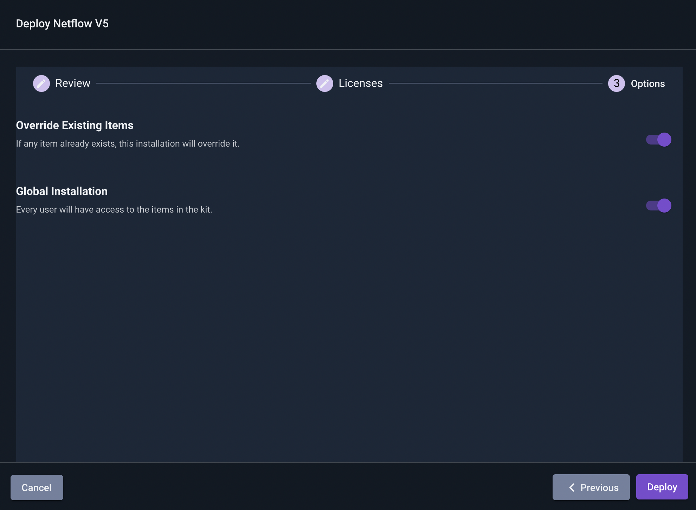

If there are no items which have been modified, the Backup step will not be shown. The rest of the wizard is identical to the installation wizard, although defaults such as group access should be already set for you.

Attention: The upgrading a kit to a new version involves the *complete deletion* of the previous version's contents. Do not click the "Deploy" button at the end of the wizard until you are prepared for this to happen!

## Uninstalling Kits

To remove an installed kit, enter kit management mode by clicking the "Manage Kits" button in the upper-right corner of the main kits page. Then select the trash can icon on the desired kit. A dialog will pop up for confirmation:

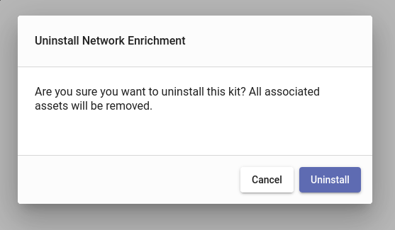

If you click "Uninstall", the kit will be removed, unless you have manually changed any of the kit contents. If you have modified any of the kit items, you will see a second dialog warning you of this fact and allowing one last chance to abort the process:

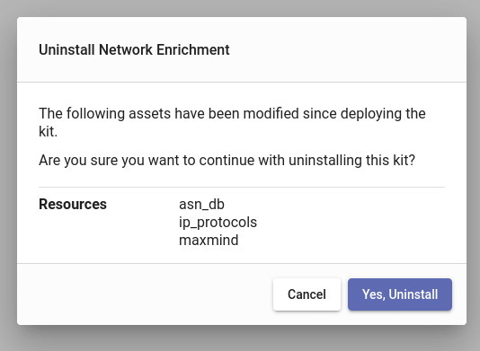

## The Kit Server

By default, Gravwell will check for available kits at `https://kits.gravwell.io/kits`. If you don't see any kits listed in the "Available Kits" page, make sure you can hit that server from your Gravwell webserver. We are currently working on a toolset to allow self-hosted kit servers.