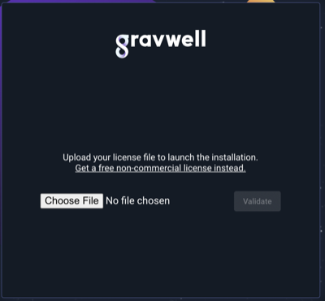
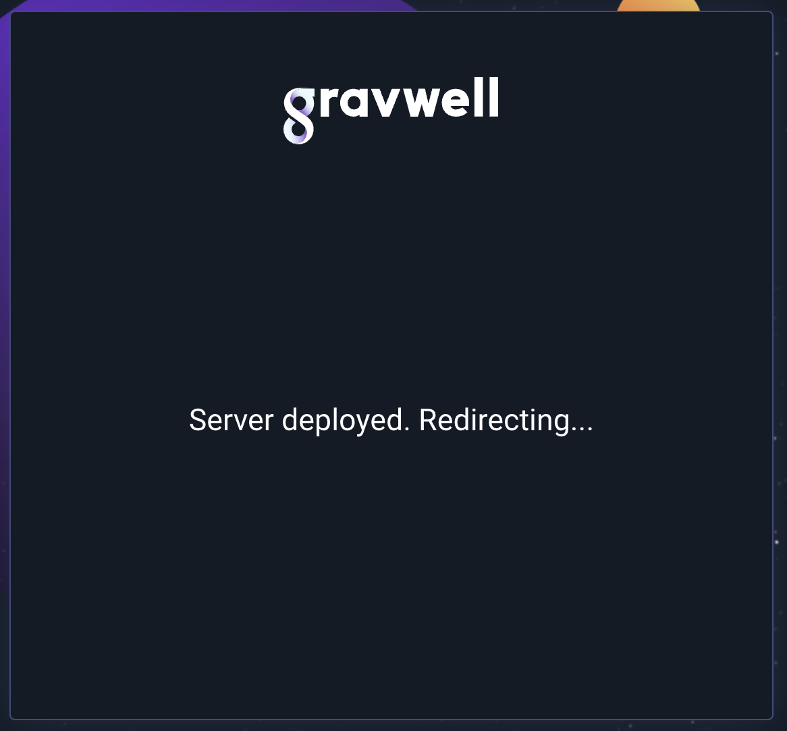
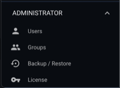
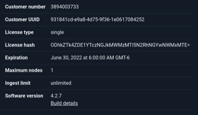
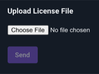

# Gravwell License System

Gravwell provides several license tiers that enable additional features and capabilities.  The most basic license tier is the Community Edition and the most advanced tier is the Unlimited license.  The Community Edition license allows for limited ingest on a single indexer and is the only license tier that is not unlimited ingest, all other license tiers have no ingest limit.

Gravwell installations are licensed using a license file that is located at the path /opt/gravwell/etc/license by default.  The license location can be controlled in the gravwell.conf file by setting the License-Location variable in the [Global] configuration block.  Gravwell will validate the license at each startup and periodically check it.

## Installing a License

A license can be installed via the GUI, the CLI, or by simply copying the license file to the appropriate location.  Only administrative users can update the license via the GUI or CLI.  At startup, if no license is installed or the current license is invalid the system will wait for a valid license to be installed.  The GUI will prompt for a license upload and wait for a valid license before completing startup.  The license installation API validates the provided license and will not allow you to install an invalid license.

If you use the CLI or GUI to install a license Gravwell will distribute the license to all connected indexers automatically.  Gravwell will also validate the installed license for each indexer and update if nessasary at each connection.  That means that if you bring a new indexer online it will automatically receive the appropriate license when the webserver connects.

## Updating a License

Updating a Gravwell license can be performed using the CLI or GUI without restarting Gravwell, but if you just copy the license file to the appropriate directory you must restart Gravwell in order for the license to be reloaded.  Only administrators can update the license file through the GUI or CLI.  To update the license, log into Gravwell as an administrator and navigate to the license section under the administrator panel.  The License page will provide details about your license and its expiration date, select the new license file and upload it to update the webserver and all connected Gravwell indexers.

## License Expiration

All Gravwell licenses have an expiration date and once a license has expired Gravwell will not start.  A license expires in four discrete steps:

1. Warning about upcoming expiration
2. Expiration grace period
3. Ingest is disabled
4. Search is disabled

Prior to expiring Gravwell will post a notification in the GUI warning that the license is about to expire, once the expiration date is reached there is a 14 day grace period where Gravwell is fully functional.  The grace period allows you to continue using Gravwell, but if you restart the Gravwell indexer or webserver it will stop and wait for a valid license.  Once the Grace period has expired Gravwell will disable ingest, in this state you can still query your data but Gravwell will not ingest any new data.  After the query grace period expires Gravwell will disable search functionality.

Gravwell will never delete data due to license expiration, all stored data, resources, dashboards, and query history is preserved.  If a new license is installed everything will be right where you left it.

Here is a handy table that explains the events leading up to and after license expiration.

| Event | Description | Time to License Expiration |
|-------|-------------|:--------------------------:|
| Warning 1 | A notification indicating that the license will expire in less than 30 days | T - 30 days |
| Warning 2 | A notification indicating that the license will expire in less than 15 days | T - 15 days |
| Expiration | A notification indicating that the license is expired, 14 day grace period begins | T - 0 |
| Ingest Disabled | Ingest is disabled and a notification indicating that the license is expired | T + 15 days |
| Query Disabled | Searching is disabled and a notification indicating that the license is expired | T + 30 days |
