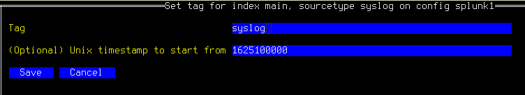

# The Migration Tool

Gravwell provides an interactive tool for migrating text files and Splunk data into Gravwell. This document describes how to install, configure, and use it.

## Installation

The `migrate` tool is included in the `gravwell-tools` package for Debian and Redhat, and is also available as a standalone shell installer on [our downloads page](/quickstart/downloads). Once installed, the program is located at `/usr/local/sbin/gravwell_migrate`.

## Basic Configuration

The migration tool stores its configuration in two different places:

* A top-level config file, by default located at `/opt/gravwell/etc/migrate.conf`.
* A config directory, by default `/opt/gravwell/etc/migrate.conf.d`, which contains automatically-generated config snippets stored by the program.

Both of these locations may be specified manually using the `-config-file` parameter to point at your main config file, and `-config-overlays` to point at a directory you wish to use for configuration snippets; this can be useful if you don't have write access to `/opt/gravwell/etc`.

As a user, you should only need to modify `migrate.conf`. The following is a simple configuration which migrates data from both Splunk and from files on disk:

```
[Global]
Ingester-UUID="0796e339-bd04-4dbf-be8d-f92fa5b08792"
Ingest-Secret = IngestSecrets
Connection-Timeout = 0
Insecure-Skip-TLS-Verify=false
Cleartext-Backend-Target=192.168.1.50:4023
State-Store-Location=/opt/gravwell/etc/migrate.state
Log-Level=INFO
Log-File=/opt/gravwell/log/migrate.log

[Splunk "splunk1"]
	Token=`eyJraWQiOj[...]nlHnn4Oivew`
	Server=splunk.example.org

[Files "auth"]
	Base-Directory="/var/log"
	File-Filter="auth.log,auth.log.[0-9]"
	Tag-Name=auth
	Recursive=true
	Ignore-Line-Prefix="#"
	Ignore-Line-Prefix="//"
	Timezone-Override="UTC" #force the timezone
```

It specifies:

* Data should be ingested to the Gravwell indexer at `192.168.1.50:4023`, using `IngestSecrets` as the token to authenticate with Gravwell.
* There is a Splunk server at `splunk.example.org` which can be accessed using the given token (the token has been shortened for this document).
* It should pull `auth.log`, `auth.log.1`, `auth.log.2` and so on from `/var/log` and ingest each line as an entry, using the Gravwell tag "auth".

The sections on migrating files and migrating Splunk data have detailed descriptions of the configuring each migration type; see below.

## Launching the Tool

To start the tool, just run the provided binary:

```
/usr/local/sbin/gravwell_migrate
```

If the configuration is valid, you should see the main menu of the migrate tool (see screenshot below). The UI displays several panes of information: the main menu where you select actions, the "Jobs" pane where running migrations are tracked, the "Logs" pane where debugging information is displayed, and the "Help" pane which shows some basic key combinations.


## Migrating Files

Importing files from the disk is quite simple. First, set up the configuration file to point at files on the disk you're interested in ingesting. Then, from the main menu, select the "Files" option. You should see a list of all the `Files` config blocks you defined. For instance, given the following configuration block, you should see a menu which resembles the screenshot below.

```
[Files "auth"]
	Base-Directory="/tmp/log"
	File-Filter="auth.log,auth.log.[0-9]"
	Tag-Name=auth2
	Ignore-Timestamps=true #do not ignore timestamps
	Recursive=true
```


Selecting "auth" opens another menu from which the migration can be launched. To begin the migration, press the `s` key or select the "Start" option. As seen below, a job will appear in the Jobs pane showing the migration progress. In this case, there were 2 files ingested, for a total of 1444 entries and 141537 bytes of data. 


Note that there are actually two jobs shown in the screenshot. After the first migration job completed, "Start" was selected again. However, the migration tool tracks how much of each file it has ingested, so it will not duplicate data; the second job simply noted that there was no new data to ingest and exited.

### File Configuration Details
The migrate tool can have multiple `Files` configuration blocks which allows the migrate tool to consume from many different directories, applying tags, custom timestamps, and even custom preprocessors to different batches of files.  If you are performing a very large migration from many different file sources, you can set up a big config file that points at all your sources, fire up the migration jobs, and head home for the weekend.  The `migrate` tool will walk each directory and consume each file according to the given configuration.

A `Files` configuration target is defined using the `Files` specifier with a unique name. Here is an example looking for files in `/tmp/logs`:

```
[Files "auth"]
	Base-Directory="/tmp/logs/"
	File-Filter="auth.log,auth.log.[0-9]" #we are looking for all authorization log files
	Tag-Name=auth
```

The `Files` configuration element can contain the following parameters:


| Config Parameter | Required | Description | Example |
|------------------|----------|-------------|---------|
| Base-Directory   |   X      | A full path to the directory containing flat files to be ingested. | `Base-Directory=/var/log/auth` |
| File-Filter      |   X      | A comma separated list of file glob patterns that specify which files to consume. | `File-Filter="*.log,*.log.gz,file.txt,file.?.txt"` |
| Tag-Name         |   X      | The tag name that the migrate tool should ingest all files into.  This must be a valid tag name. | `Tag-Name=auth` |
| Ignore-Timestamps |         | A Boolean value indicating if the migrate tool should not attempt to resolve timestamps, but should instead the timestamp of now. The default value is false. | `Ignore-Timestamps=true` |
| Assume-Local-Timezone |     | A Boolean indicating that if the resolved timestamps do not have a timezone, use the local timezone. The default is false, meaning use UTC. | `Assume-Local-Timezone=true` |
| Timezone-Override |         | A string indicating that if the resolved timestamps do not have a timezone, use the given timezone. The timezone must be specified in IANA format. | `Timezone-Override="America/New_York"` |
| Recursive |                 | A Boolean indicating that the tool should recurse into any sub-directories found in the `Base-Directory` and attempt to match and consume files. Default is false. | `Recursive=true` |
| Ignore-Line-Prefix |        | A string which indicates that a line should be ignored.  This can be specified multiple times and is useful for dealing with headers on files. | `Ignore-Line-Prefix="#" |
| Preprocessor |              | Specify preprocessors to be applied to entries as they are consumed from flat files.  More than one preprocessor can be specified and they are executed in order. | `Preprocessor="logins"` |


Here is an example config snippet which shows the full range of config options for a directory, including the use of a preprocessor:

```
[Files "testing"]
	Base-Directory="/tmp/testlogs/"
	File-Filter="app.log,app.log.[0-9],host.log*"
	Tag-Name=apps
	Assume-Local-Timezone=true #Default for assume localtime is false
	Ignore-Timestamps=false
	Recursive=true
	Ignore-Line-Prefix="#"
	Ignore-Line-Prefix="//"
	Preprocessor="loginapps"

[Preprocessor "loginapp"]
	Type=regexextract
	Regex="\\S+ (?P<host>\\S+) \\d+ \\S+ \\S+ (?P<data>\\{.+\\})$"
	Template="{\"host\": \"${host}\", \"data\": ${data}}"
```


## Migrating Splunk Data


### Configuring Splunk Tokens

In order to fetch data from a Splunk server, you must generate an authentication token which the migration tool can use to communicate with Splunk. Tokens may be generated in the Splunk UI under Settings > Tokens.


On the Tokens page, click the `New Token` button, then fill in the "Audience" field with something like "Gravwell migration", select a token expiration time if desired (+60d is a good choice), and click `Create`. The UI will then display a token in the "Token" field as seen below; copy this and save it somewhere, because it cannot be retrieved later!


This token string should be inserted into the `Token` field of a Splunk configuration block in the main config file. The `Server` field should correspond to whatever IP address or hostname you use to access your Splunk server.

### Configuring Splunk Migrations

The migrate tool must know a few basic things about the Splunk server in order to connect:

* The server's IP or hostname.
* A valid auth token for the Splunk server.

These properties are defined in a `Splunk` configuration block within the config file. The simplest version might look like this, defining a server named "splunk1":

[Splunk "splunk1"]
	Token=`eyJraWQiOj[...]nlHnn4Oivew`
	Server=splunk.example.org

Multiple `Splunk` blocks may be defined, although each must have a unique name. The following parameters may be used in a `Splunk` config block:

| Config Parameter | Required | Description | Example |
|------------------|----------|-------------|---------|
| Server	| X	| The hostname or IP address of the Splunk server. Port 8089 must be accessible. | `splunk.example.org` |
| Token		| X	| A valid Splunk auth token. | `eyJraWQiOj[...]nlHnn4Oivew` |
| Ingest-From-Unix-Time | | A Unix timestamp which specifies the default "start" time to use when copying entries from the Splunk server. This may be overridden on a per-sourcetype basis. | 1625100000 |
| Index-Sourcetype-To-Tag | | A mapping of a Splunk index and sourcetype pair to a Gravwell tag; format is `index,sourcetype,tag`. Can also be set interactively from within the migrate tool. | `main,json,importedjson` (maps the index "main" and sourcetype "json" to the Gravwell tag "importedjson") |
| Preprocessor |              | Specify preprocessors to be applied to entries as they are consumed from Splunk.  More than one preprocessor can be specified and they are executed in order. | `Preprocessor="logins"` |

```{note}
The migrate tool will automatically create a file named `splunk1.conf` in `/opt/gravwell/etc/migrate.conf.d` to store your index+sourcetype→tag mappings (see below). Settings in this file will be merged with the settings in the main configuration file automatically.
```

### Importing Data

To import data from Splunk, make sure you have configured at least one `Splunk` block in the config file (see configuration section above), then select "Splunk" from the main menu. This will open a new menu (below) in which you can select which Splunk server to migrate from.


Once a server has been selected, you will see the server's menu:


### Mapping index+sourcetype to tag

You must now define how Splunk's data organization should be mapped to Gravwell. In Splunk, data is organized into indexes and sourcetypes. In Gravwell, data simply receives a tag. To define these mappings, select "Manage Mappings"; this will open the mapping screen:


Initially, the tool is not aware of which indexes and sourcetypes exist on the Splunk server. Select "Scan" to connect to the Splunk server and query this information; this may take a few seconds. Once the scan is complete, several index+sourcetype pairs should be visible, each with a blank tag:


Select a pair which you wish to import and press enter. A form (below) will be displayed in which you may enter the Gravwell tag to be used; note that it will only allow you to type valid tag characters. You may also set a Unix timestamp to start the migration from, if you wish to exclude old data.



```{note}
If the Unix timestamp is set to 0, migration will begin from 1970, which can take a long time to complete even when no data is present. To speed things up, we strongly recommend either setting a timestamp in this form, or setting the `Ingest-From-Unix-Time` parameter in the config file (see above).
```

After you have set the tag for the desired index + sourcetype pairs, you can select "Write Config" to write out a file in the `migrate.conf.d` directory which will store the mappings permanently.

### Starting Migrations

Having defined mappings from Splunk index+sourcetype to Gravwell tag, you may now launch migration jobs. From the server menu, select "Start Migrations". A menu will appear showing the index+sourcetype → tag mappings you defined earlier. Selecting one of these mappings will start a migration job:


You can launch multiple migrations at once. Note that Splunk migrations may take a while; if you exit the migrate tool while a Splunk migration is running, the job will be halted as soon as possible and the most recent timestamp will be stored to resume later--we make every effort to avoid data duplication!

### Quitting the Tool

You can exit the migration tool at any time by hitting Ctrl-C, or by backing all the way up to the top-level menu and pressing `q`. The tool will gracefully shut down all in-progress migrations and save its state. Note that if a particularly data-heavy Splunk migration job is in progress, it may take several seconds for the data to finish transferring; the UI will notify you that it is still waiting on some jobs and will quit when all are done.
