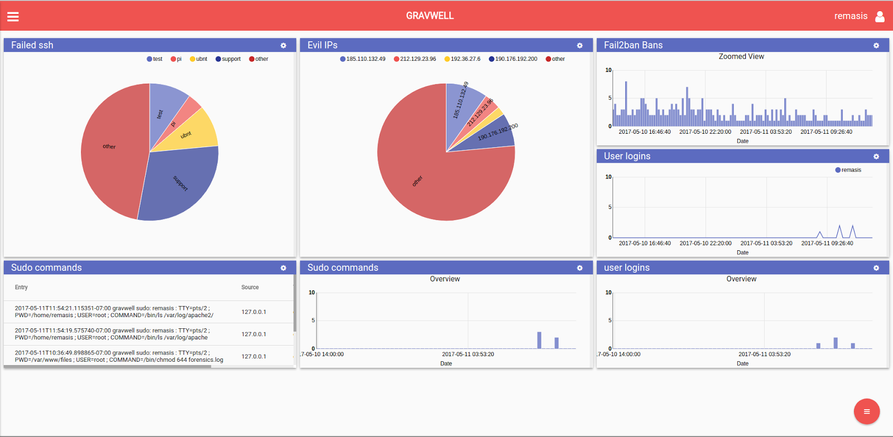
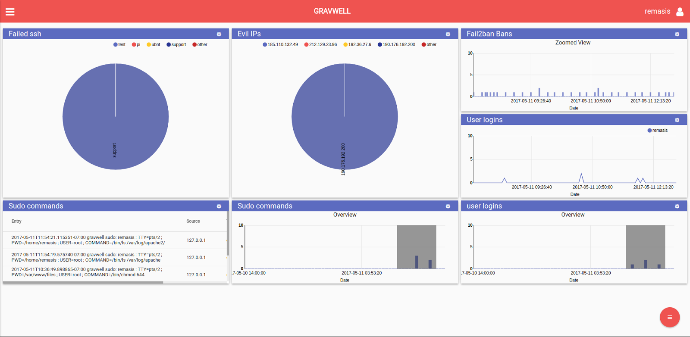

# Quick Start Instructions

This section contains basic “quick start” instructions for getting Gravwell up and running. 
These instructions support the most common use case and act as an introduction to Gravwell.  Please note, the “Quick Start” instructions do not take advantage of the more advanced Gravwell features regarding distributed computing and storage mechanisms. If you require a more advanced setup, please review the Advanced topics section of this guide.

## Installation
Installing Gravwell on a single machine is quite simple. Just follow the instructions in this section. For more advanced environments involving multiple systems, review the Advanced Topics section.

### Gravwell Backend
The Gravwell backend package comes as an installer file. You should have received an installer file or a link to download one (probably named something like “gravwell_8675309_0.2.sh”). Gravwell has been tested on all of the major Linux distributions and runs well, but Ubuntu Server LTS is preferred. Help installing Ubuntu can be found at https://tutorials.ubuntu.com/tutorial/tutorial-install-ubuntu-server.

Using a terminal on the server that is to host Gravwell issue the following command as a superuser (e.g. via the `sudo` command):

```
root@gravserver ~ # bash gravwell_8675309_0.2.sh
```

Follow the prompts and, after completion, you should have a running Gravwell instance.

After installing Gravwell, open a web browser and navigate to the server (e.g. https://gravwell.mycompany.com). You should be met with a login screen. The default username and password are “admin” and “changeme”. Needless to say, your first action after logging in should be changing the admin password. This can be done by choosing “Account Settings” from the navigation sidebar or clicking the “user” icon in the upper right.

### Text Ingester
The Gravwell server package comes with a text ingester capable of consuming almost any text log format.

Using a terminal on the Gravwell server, issue the following command as a superuser (e.g. via the `sudo` command):

```
root@gravserver ~ # bash gravwell_simple_relay_installer.sh
```

### Single Machine Gravwell Instance
If your installation is entirely contained on one machine, as it is in these quick start instructions, the Text Ingester installer will extract the configuration options and configure itself appropriately. If you are using an advanced setup where not all Gravwell components are running on a single system, review the advanced topics section of the documentation.

You now have a running Simple Relay service on the Gravwell server which will ingest any text data sent to it (by default it listens on port 7777). The configuration file for this service is located at `/opt/gravwell/etc/simple_relay.conf`. See the Advanced Topics -> Ingesters -> Simple Relay section for advanced configuration.

## Feeding Data
This section provides basic instructions for sending data into Gravwell. Review the Advanced topics -> Ingesters section for advanced instructions for setting up other data ingesters.

The “System Stats” page in Gravwell can help you see if the Gravwell server is receiving any data. If no data is reported and you think that is an error, view the ingesters section of the advanced topics.

### Syslog
Once the Gravwell server is installed and the Simple Relay text ingester service is running, you can start feeding any log or text data into Gravwell. Start with syslog. By default, the Simple Relay ingester listens on port 7777

To send the syslog entries from any other linux server to Gravwell, a single configuration line should be added to the file /etc/rsyslog.conf on the desired server.

```
*.* @@gravwell.addr.goes.here:7777;RSYSLOG_FileFormat
```

Many linux services (such as DNS, Apache, ssh, and others) can be configured to send event data via syslog. Using syslog as a “go between” for those services and Gravwell is often the easiest way to configure those services to send events remotely.

Adding this line to an Apache configuration entry, for example, will send all apache logs out via syslog.

```
CustomLog "|/usr/bin/logger -t apache2.access -p local6.info" combined
```

### Network
A primary strength of Gravwell is the ability to ingest binary data. This quick-start guide helps you get a basic network packet capture up and running. The Network ingester and Gravwell server should be running on the same machine for most users, but it is not required.

The default Gravwell install does not include a network ingester. The current version of the network ingester does not run as a service (this is slated for the next release). Currently, the full command line is used to configure and run the ingester.

With a terminal on the system with which you wish to capture network data, run the following command:

```
./NetworkCapture -dev eth0 -ingest-secret IngestSecrets -pipe-conns /opt/gravwell/comms/pipe -promisc -snaplen 65535 -tag-name=pcap
```

If disk space is a concern, you may wish to change the “snaplen” parameter of the above command to capture only packet metadata. “-snaplen 96” is usually sufficient.

### Archived Logs
The Simple Relay ingester can also be used to ingest any old logs (such as apache, syslog, etc). By utilizing a basic network comms tool, like netcat, any data can be shoveled into the Simple Relay ingester.

For example, on a webserver running apache, you could do a command like:

```
user@webserver ~# cat /var/log/apache2/access.log | nc -q gravwell.server.address 7777
```

Note: If you are ingesting a very large set of logs in multiple files, it is recommended that the MassFileIngester utility is used to pre-optimize and ingest en masse, rather than relaying through the Text ingester.

## Searching
Once the Gravwell server is up and running and receiving data, the power of the search pipeline is made available.

Here are a few example searches based on the type of data ingested in this quick-start setup.

Assuming that there is syslog data being generated by some linux servers and ingested by the Simple Relay text ingester, you are now prepared to see what kind of analytics can be performed.

### Syslog Example
Syslog, in all its various forms is a core component of any unix logging and auditing operation. It is important to have complete visibility into logins, crashes, sessions, or any other service action while debugging and defending unix infrastructure.  Gravwell makes it easy to get syslog data off of many remote machines into a central location and ready for query.  For this example we will pursue some SSH logs and examine how an administrator or security professional might check up on secure shell activity.

In this example, servers to send ssh login data to a Gravwell instance. If you want to see a list of all ssh-related entries, you can issue a search like:

```
tag=syslog grep ssh
```

The breakdown of the search command is as follows:

<table><tr><td>tag=syslog</td><td>Only look at data tagged “syslog”. The SimpleRelay ingester config file tags data with “syslog” tag by default.</td></tr><tr><td>grep ssh</td><td>The “grep” module (named after the similar linux command) searches for specific text. In this case, the search is looking for any entry that contains “ssh” in it.</td></tr></table>

The search results come back as two graphs and a series of log entries. The graphs show the frequency plot of matching records that made it through the pipeline. These graphs can be used to identify the frequency of log entries and to navigate around the time window of the search, narrowing down the view without reissuing the search.  Nearly every search has the ability to refocus and adjust the time window, only searches which alter the order of time do not have the overview and zoomed graph.

The “Overview” graph can be used as a tool to narrow down the window you would like to explore without re-issuing an entire search. Here are see the results of all entries containing “ssh”.


These results might give a very broad insight but now is the time to try and get a more focused search going. For this example, seeing successful ssh logins is the topic of interest. Of additional interest is extracting some fields and evaluating those fields. Since these are text records,  use the “regex” search pipeline module and issue the following search:

```
tag=syslog grep ssh | regex ".*sshd.*Accepted (?P<method>\S*) for (?P<user>\S*) from (?P<ip>[0-9]+.[0-9]+.[0-9]+.[0-9]+)" 
```

Breaking down the search:

* ```tag=syslog```: Limit searches to data tagged “syslog”
* ```grep ssh```: This will do a simple grep for “ssh” to filter down the results quickly
* ```regex ".*sshd.*Accepted (?P<method>\S*) for (?P<user>\S*) from (?P<ip>[0-9]+.[0-9]+.[0-9]+.[0-9]+)"```: This is a regular expression to grab successful logins. Building regular expressions is well outside the scope of this document but note the “(?P<foo> .*)” style syntax which will assign any matched group into an enumerated field (named “foo” in this case). These enumerated fields are useful for performing analysis, charting, etc. In this example, Gravwell is used to extract a “method” (publickey or password), a username, and an IP address from any successful logins. A good resource for help with regular expressions is located at https://regex-golang.appspot.com/assets/html/index.html.

The results are filtered down to only logins:


If additional parameters are added to the end of that query, the responses can be charted  on those enumerated fields. If you want a chart of all the usernames that have logged in, you would issue the following search:

```
tag=syslog grep ssh | regex ".*sshd.*Accepted (?P<method>\S*) for (?P<user>\S*) from (?P<ip>[0-9]+.[0-9]+.[0-9]+.[0-9]+)" | count by user | chart count by user
```

The breakdown of  the new search query items is as follows:

* ```count by user```: Instructs the search pipeline to take the output from the regex module and hand that to a count aggregator module based on the “user” field.
* ```chart count by user```: Pipe the output of the count module into a charting renderer on that ‘count by user’ field.

The results show a nice graph of all users that have logged into the system during the search timeframe. You can change the graph type to get different views into the data as well as use the Overview chart to select window timeslices. Looks like the IT admin ‘remasis’ is the only user to log into these systems lately, as expected.


### Network Examples
Video games are a hobby in the example house. This led to wanting to see who was playing and how often. The example house uses a 10.0.0.0/24 network subnet and Blizzard Entertainment games use port 1119 for game traffic the following search in Gravwell was issued:

```
tag=pcap packet ipv4.DstIP !~ 10.0.0.0/24 tcp.DstPort==1119 ipv4.SrcIP | count by SrcIP | chart count by SrcIP
```

A review of the search command is as follows:

* ```tag=pcap```: Tells Gravwell to only search through items with this Tag name. This Tag gets set by the ingester (see the network ingester command from earlier). Good utilization of Tags can acts as a first “filter” to make sure a search isn’t going through terabytes of video files to find an apache log entry.
* ```packet```: Invokes the packet parsing search pipeline module and enables the rest of the options in this command.
  * ```ipv4.DstIP !~ 10.0.0.0/2```: The Gravwell packet parser splits out a packet into its various fields. In this case, the search is comparing Destination IPs and looking for those not in the 10.0.0.x class C subnet
  * ```tcp.DstPort == 1119```: Specify a port. This will filter only packets destined for port 1119, used by most Blizzard Entertainment games.
  * ```ipv4.SrcIP```: Callout this field without a comparison operator to tell the packet parser to extract and place into the pipeline.
* ```count by SrcIP```: Pipe the filtered results from the packet parser into the math count module and specify the field to be aggregated around.
* ```chart count by SrcIP```: Pipe the count results into the charting renderer for display, again centered around the SrcIP enumerated value.

Results: The top charts represent the frequency of all packets matching those filters. The bottom chart is the end result of charting by Source IP. The blue is a gaming desktop and the red is a mobile device. Looks like someone was up playing games past their bedtime...


For more details on using the packet parsing search module, see the Advanced Topics -> Search Modules -> Packet section.

## Dashboards
Dashboards are powerful aggregated views of searches that grant superhuman powers of observance.

Navigate to the “Dashboard List” and click the “+” floating action button to create a new dashboard -- call it “SSH auth monitoring”. Then, add a search. For this example, use the SSH authentication search from earlier. Re-issue that search and from the results screen, use the floating action button to open the actions menu and choose “Add to Dashboard” and select the new dashboard.

Next, a tile to display any results on the dashboard needs to be added. Click the “+” button, or use the floating action button to access the “Add a Tile” action button. Tiles need a data source and a display method (called a “renderer”). Select the ssh search and the “overview” renderer. Add another tile for the “zoom” renderer, and another for the “text” renderer to show the raw data.

### Dashboards in Action
I have a dashboard that displays SSH logins, the usernames of failed logins, and any sudo/superuser commands that are issued on a server. All of this data is generated by syslog.

In this screenshot, I loaded up the dashboard and noticed I there were some successful logins to the server as well as some superuser commands and the standard barrage of ssh login failures that happens to any linux machine open to the internet.



The pie chart of user accounts isn’t revealing any user accounts I have on the system so it doesn’t look like I have anything to worry about there, but just to be sure, I want to zoom in on the successful logins and take a closer look. On any “Overview” display renderer you can click and drag to “brush” over the time window you would like to explore further, just like on the search results page. If this is something you want to do, make sure you include a dashboard tile with the “Overview” display renderer.

By default, zooming in on one overview will zoom in on any other searches that are attached to this dashboard. So, when I zoom in on the successful logins, the rest of the charts will update to reflect this smaller time range. The screenshot below shows that a single IP was attempting to login with the “support” user (which doesn’t exist on this server) and that the only logins were from a user “remasis” (me) and a couple of sudo commands were issued. All is well.


