# Quick Start Instructions

This section contains basic “quick start” instructions for getting Gravwell up and running.  These instructions support the most common use case and act as an introduction to Gravwell.  Please note, the “Quick Start” instructions do not take advantage of the more advanced Gravwell features regarding distributed search and storage that are available in the Cluster Edition. If you require a more advanced setup, please review the Advanced Topics section of this guide.

This guide is suitable for Community Edition users as well as users with a paid single-node Gravwell subscription.

Note: Community Edition users will need to obtain their own license from [https://www.gravwell.io/download](https://www.gravwell.io/download) before beginning installation. Paid users should already have received a license file via email.

## Installation
Installing Gravwell on a single machine is quite simple--just follow the instructions in this section. For more advanced environments involving multiple systems, review the Advanced Topics section.

Gravwell is distributed in four ways: via a Docker container, via a distribution-agnostic self-extracting installer, via a Debian package repository, and via a Redhat package repository. We recommend using the Debian repository if your system runs Debian or Ubuntu, the Redhat packages if your system runs RHEL, CentOS, or SuSE, and the self-extracting installer otherwise. The Docker distribution is also useful for those familiar with Docker. Gravwell has been tested on all of the major Linux distributions and runs well, but Ubuntu Server LTS is preferred. Help installing Ubuntu can be found at https://tutorials.ubuntu.com/tutorial/tutorial-install-ubuntu-server.

### Debian repository

Installing from the Debian repository is quite simple. We need to take a few steps first to add Gravwell's PGP signing key and Debian package repository, but then it's just a matter of installing the `gravwell` package:

```
curl https://update.gravwell.io/debian/update.gravwell.io.gpg.key | sudo apt-key add -
echo 'deb [ arch=amd64 ] https://update.gravwell.io/debian/ community main' | sudo tee /etc/apt/sources.list.d/gravwell.list
sudo apt-get install apt-transport-https
sudo apt-get update
sudo apt-get install gravwell
```

The installation process will prompt to set some shared secret values used by components of Gravwell. We strongly recommend allowing the installer to generate random values (the default) for security.

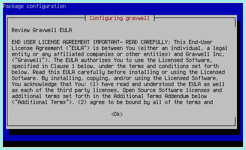

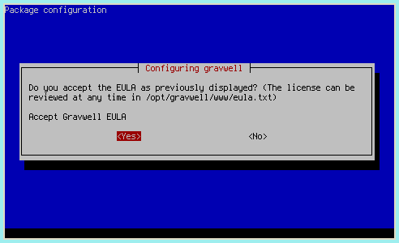

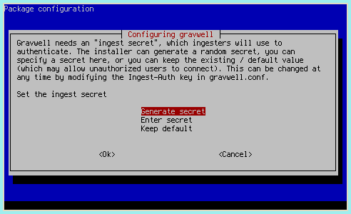

### Redhat/CentOS Repositories

Gravwell is available as a `yum` repository for both Redhat and CentOS Linux distributions. To use the Gravwell yum repository, add the following stanza to your `yum.conf` (located in `/etc/yum.conf`)

```
[gravwell]
name=gravwell
baseurl=https://update.gravwell.io/rhel 
gpgkey=https://update.gravwell.io/rhel/gpg.key
```

Next perform the following:

```
yum update
yum install -y gravwell
```

Once installed you will have to bump the centOS firewall for webports, executing the following:

```
sudo firewall-cmd --zone=public --add-service=http
sudo firewall-cmd --zone=public --add-service=https
```

You should now be able to access the Gravwell web interface on the IP assigned to the centOS/RHEL system.

### Docker Container

Gravwell is available on Dockerhub as a single container including both the webserver and indexer. Refer to [the Docker installation instructions](#!configuration/docker.md) for detailed instructions on installing Gravwell in Docker.

### Self-contained Installer

For non-Debian systems, download the self-contained installer from our [downloads page](#!quickstart/downloads.md).

Then run the installer:

```
sudo bash gravwell_X.X.X.sh
```

Follow the prompts and, after completion, you should have a running Gravwell instance.

Note: If your distribution does not use SystemD, you will have to start the Gravwell processes manually after installation. Please contact support@gravwell.io if you need help.

## Configuring the License

Once Gravwell is installed, open a web browser and navigate to the server (e.g. [https://localhost/](https://localhost/)). It should prompt you to upload a license file.

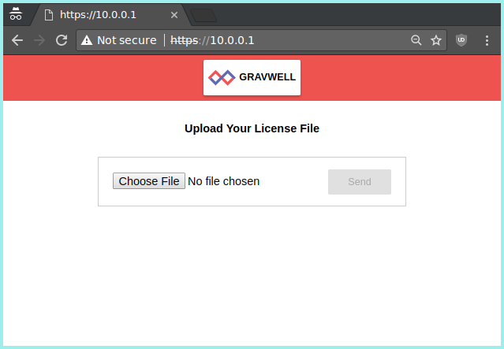

Once the license is uploaded and verified, Gravwell should present a login screen. Log in as "admin" with the password "changeme".

Attention: The default username/password combination for Gravwell is admin/changeme. We highly recommend changing the admin password as soon as possible! This can be done by choosing “Account Settings” from the navigation sidebar or clicking the “user” icon in the upper right.


## Configuring Ingesters

A freshly installed Gravwell instance, by itself, is boring. You'll want some ingesters to provide data. You can either install them from the Debian repository or head over to [the Downloads page](downloads.md) to fetch self-extracting installers for each ingester.

The ingesters available in the Debian repository can be viewed by running `apt-cache search gravwell`:

```
root@debian:~# apt-cache search gravwell
gravwell - Gravwell data analytics platform (gravwell.io)
gravwell-federator - Gravwell ingest federator
gravwell-file-follow - Gravwell file follow ingester
gravwell-netflow-capture - Gravwell netflow ingester
gravwell-network-capture - Gravwell packet ingester
gravwell-simple-relay - Gravwell simple relay ingester
```

If you install them on the same node as the main Gravwell instance, they should be automatically configured to connect to the indexer, but you'll need to set up data sources for most. See the [ingester configuration documents](#!ingesters/ingesters.md) for instructions on that.

We highly recommend installing the File Follow ingester (gravwell-file-follow) as a first experiment; it comes pre-configured to ingest Linux log files, so you should be able to see some entries immediately by issuing a search such as `tag=auth`:

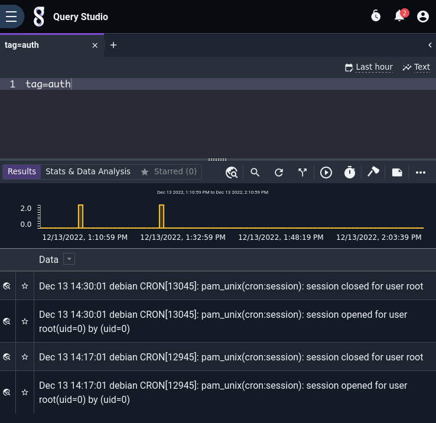

### File Ingester

The File Follower ingester is one of the simplest ways to start getting logs into Gravwell, because it comes pre-configured to ingest standard Linux log files.

If you're using the Gravwell Debian repository, installation is just a single apt command:

```
apt-get install gravwell-file-follow
```

Otherwise, download the installer from the [Downloads page](#!quickstart/downloads.md). Using a terminal on the Gravwell server, issue the following command as a superuser (e.g. via the `sudo` command) to install the ingester:

```
root@gravserver ~ # bash gravwell_file_follow_installer.sh
```

If the Gravwell services are present on the same machine, the installation script will automatically extract and configure the `Ingest-Auth` parameter and set it appropriately. However, if your ingester is not resident on the same machine as a pre-existing Gravwell backend, the installer will prompt for the authentication token and the IP address of the Gravwell indexer. You can set these values during installation or leave them blank and modify the configuration file in `/opt/gravwell/etc/file_follow.conf` manually. See the [ingesters documentation](#!ingesters/ingesters.md) for more information on configuring the ingester.

### Simple Relay Ingester

Gravwell's 'Simple Relay' ingester can ingest line-delimited or syslog-formatted messages over the network. It's another good way to start getting data into Gravwell from your existing data sources.

If you're using the Gravwell Debian repository, installation is just a single apt command:

```
apt-get install gravwell-simple-relay
```

Otherwise, download the installer from the [Downloads page](#!quickstart/downloads.md). Using a terminal on the Gravwell server, issue the following command as a superuser (e.g. via the `sudo` command) to install the ingester:

```
root@gravserver ~ # bash gravwell_simple_relay_installer.sh
```

If the Gravwell services are present on the same machine, the installation script will automatically extract and configure the `Ingest-Auth` parameter and set it appropriately.  However, if your ingester is not resident on the same machine as a pre-existing Gravwell backend, the installer will prompt for the authentication token and the IP address of the Gravwell indexer. You can set these values during installation or leave them blank and modify the configuration file in `/opt/gravwell/etc/simple_relay.conf` manually. See the [ingesters documentation](#!ingesters/ingesters.md) for more information on configuring the ingester.

### Ingester Notes
If your installation is entirely contained on one machine, as it is in these quick start instructions, the ingester installers will extract the configuration options and configure themselves appropriately. If you are using an advanced setup where not all Gravwell components are running on a single system, review the [ingesters](#!ingesters/ingesters.md) section of the documentation.

You now have the File Follow and Simple Relay services running on the Gravwell server. File Follow will automatically ingest log entries from some files in `/var/log/`. By default it ingests /var/log/auth.log with the "auth" tag, /var/log/dpkg.log with the "dpkg" tag, and /var/log/dmesg and /var/log/kern.log with the "kernel" tag.

Simple Relay will ingest syslog entries sent to it on TCP port 601 or UDP port 514; these will be tagged with the "syslog" tag. The Simple Relay config file also contains an entry to listen for any line-delimited data on port 7777. This can be disabled if you only intend to use syslog; simply comment out the `[Listener "default"]` section in the config file and restart the simple relay service. The configuration file for this service is located at `/opt/gravwell/etc/simple_relay.conf`. See the Simple Relay section of the [Ingesters documentation](#!ingesters/ingesters.md) for advanced configuration options.

## Feeding Data into Gravwell
This section provides basic instructions for sending data into Gravwell. Review the [ingesters](#!ingesters/ingesters.md) section for instructions for setting up other data ingesters.

The “System Stats” page in Gravwell can help you see if the Gravwell server is receiving any data. If no data is reported and you think that is an error, double-check that the ingesters are running (`ps aux | grep gravwell` should show `gravwell_webserver`, `gravwell_indexer`, `gravwell_simple_relay`, and `gravwell_file_follow`) and that their configuration files are correct.

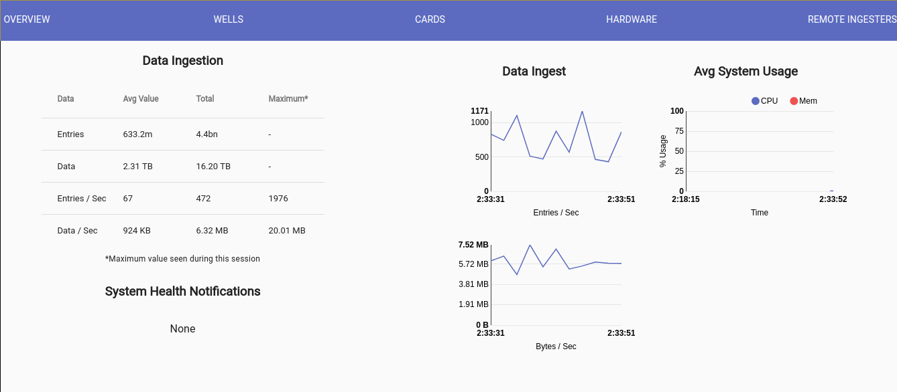

### Ingesting Syslog
Once the Gravwell server is installed and the Simple Relay text ingester service is running, you can start feeding any log or text data into Gravwell via the syslog protocol. By default, the Simple Relay ingester listens for TCP syslog on port 601 and UDP syslog on port 514.

To send the syslog entries from a Linux server running rsyslog to Gravwell, create a new file named `/etc/rsyslog.d/90-gravwell.conf` on the server and paste the following line into it for UDP syslog:

```
*.* @gravwell.addr.goes.here;RSYSLOG_SyslogProtocol23Format
```

or use this instead for TCP syslog:

```
*.* @@gravwell.addr.goes.here;RSYSLOG_SyslogProtocol23Format
```

(note the use of `@` in the UDP configuration vs. `@@` for TCP)

Then restart the rsyslog daemon:

```
sudo systemctl restart rsyslog.service
```

Many Linux services (such as DNS, Apache, ssh, and others) can be configured to send event data via syslog. Using syslog as a “go between” for those services and Gravwell is often the easiest way to configure those services to send events remotely.

Adding this line to an Apache configuration entry, for example, will send all Apache logs to rsyslog, which will forward them to Gravwell:

```
CustomLog "|/usr/bin/logger -t apache2.access -p local6.info" combined
```

### Archived Logs
The Simple Relay ingester can also be used to ingest any old logs (Apache, syslog, etc) that are sitting around on the filesystem. By utilizing a basic network comms tool like netcat, any data can be shoveled into the Simple Relay ingester's line-delimited listener. By default Simple Relay listens for line-delimated entries on TCP port 7777.

For example, if you have some old Apache log files you'd like to analyze in Gravwell, you could run a command like this to ingest them:

```
user@webserver ~# cat /tmp/apache-oct2017.log | nc -q gravwell.server.address 7777
```

Note: If you are ingesting a very large set of logs in multiple files, we recommend using the MassFileIngester utility to pre-optimize and ingest en masse, rather than relaying through the Simple Relay ingester.

### Network Packet Ingester

A primary strength of Gravwell is the ability to ingest binary data. The network ingester allows you to capture full packets from the network for later analysis; this provides much better flexibility than simply storing Netflow or other condensed traffic information at the cost of increased storage use.

If you're using the Gravwell Debian repository, installation is just a single apt command:

```
apt-get install libpcap0.8 gravwell-network-capture
```

Otherwise, download the installer from the [Downloads page](#!quickstart/downloads.md). To install the network ingester, simply run the installer as root (the file name may differ slightly):

```
root@gravserver ~ # bash gravwell_network_capture_installer.sh
```

The network ingester requires the libpcap shared libraries. If using the standalone installer, you'll need to make sure you have also installed the libraries; the package is `libpcap0.8` on Debian.

If the ingester is on a machine with a Gravwell backend already installed, the installer should automatically pick up the correct `Ingest-Secrets` value and populate the config file with it. In any case, review the configuration file in `/opt/gravwell/etc/network_capture.conf` before running. Make sure at least one "Sniffer" section is uncommented, with the Interface field set to one of your system's network interfaces. For more information, see the [Ingesters documentation](#!ingesters/ingesters.md)

Note: The Debian package and the standalone installer should both prompt for a device from which to capture. If you wish to change your selection, open `/opt/gravwell/etc/network_capture.conf`, set the desired interface, and run `service gravwell_network_capture restart` to restart the ingester.

## Searching
Once the Gravwell server is up and running and receiving data, the power of the search pipeline is made available.

Here are a few example searches based on the type of data ingested in this quick-start setup. For these examples, we assume there is syslog data being generated by Linux servers and ingested via the Simple Relay text ingester, and that packets are being captured from the network as described in the preceding sections.

### Syslog Example
Syslog is a core component of any Unix logging and auditing operation. It is important to have complete visibility into logins, crashes, sessions, or any other service action while debugging and defending unix infrastructure.  Gravwell makes it easy to get syslog data off your many remote machines into a central location and ready for query.  For this example we will pursue some SSH logs and examine how an administrator or security professional might keep tabs on SSH activity.

In this example, servers to send SSH login data to a Gravwell instance. If you want to see a list of all SSH-related entries, you can issue a search like:

```
tag=syslog grep ssh
```

The breakdown of the search command is as follows:

* `tag=syslog`: Only look at data tagged “syslog”. The SimpleRelay ingester is set up to tag data with the “syslog” tag when it comes in via TCP port 601 or UDP port 514.
* `grep ssh`: The “grep” module (named after the similar linux command) searches for specific text. In this case, the search is looking for any entry that contains “ssh” in it.

The search results come back as an overview graph and a series of log entries. The overview graph shows the frequency plot of matching records that made it through the pipeline. This graph can be used to identify the frequency of log entries and to navigate around the time window of the search, narrowing down the view without re-issuing the search.  Nearly every search has the ability to refocus and adjust the time window; only searches which alter the order of time do not have the overview graph.

Here are see the results of all entries containing “ssh”:

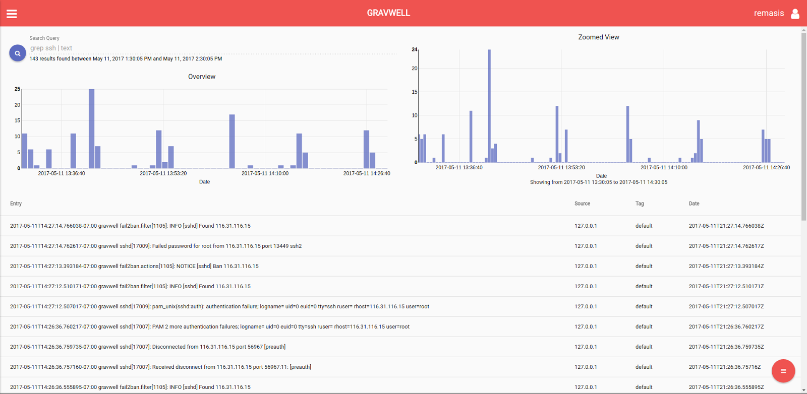

These results might give a very broad insight, but to truly extract useful information we need to refine our search. For this example, we will extract successful SSH logins. We'll also extract some particular fields from the log records to make displaying the results easier:

```
tag=syslog syslog Appname==sshd Message~Accepted | regex -e Message "Accepted\s(?P<method>\S+)\sfor\s(?P<user>\S+)\sfrom\s(?P<ip>\S+)"
```

Breaking down the search:

* ```tag=syslog```: Limit searches to data tagged “syslog”
* ```syslog Appname==sshd Message~Accepted```: This will invoke the syslog module to filter to only syslog messages generated by the "sshd" application and contain the string "Accepted" in the Message body
* ```regex -e Message "Accepted\s(?P<method>\S+)\sfor\s(?P<user>\S+)\sfrom\s(?P<ip>\S+)"```: This is a regular expression operates on just the Message body which was extracted using the syslog module.  We extract the user, IP, and method of successful login.

The results are filtered down to only logins:

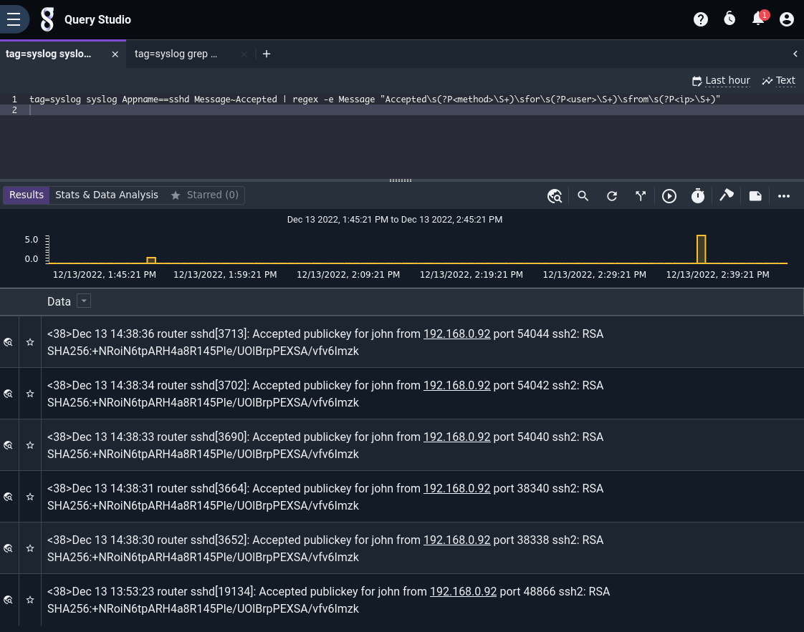

If you click the "Enumerated Values" button at the bottom of the results, we can see all the available enumerated values which have been extracted by this search.

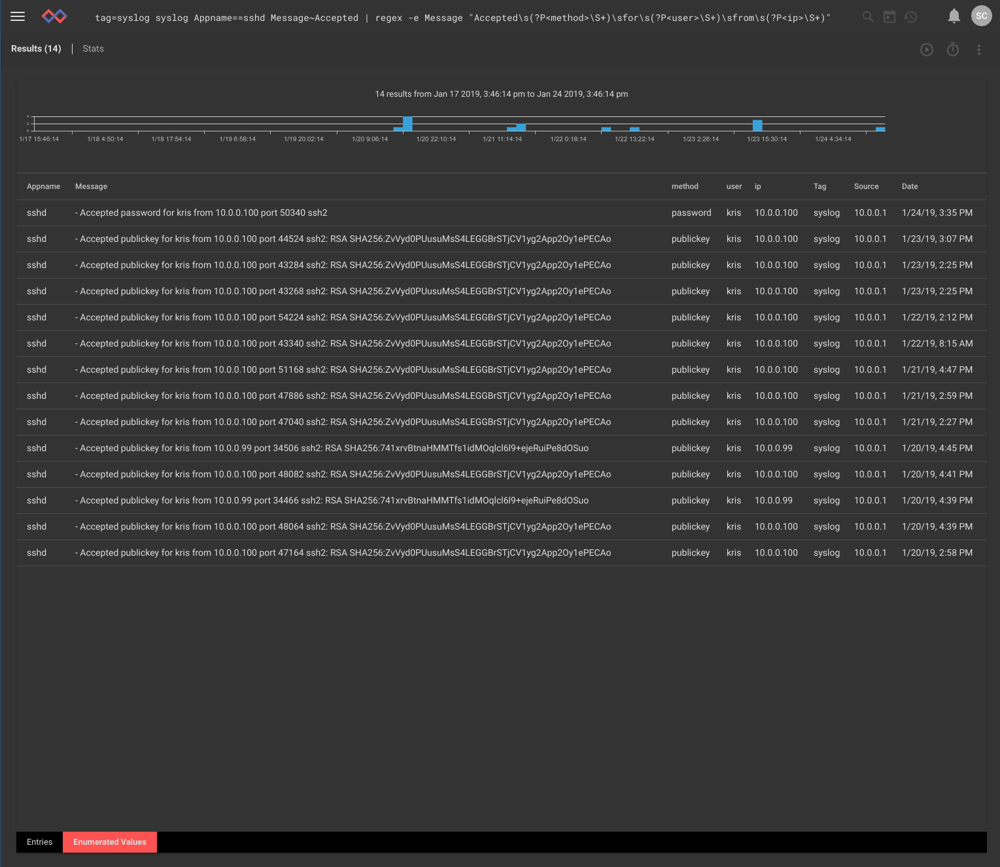

We can specify a *render module* at the end of the query to change how results are displayed. If you want a chart of all the usernames that have logged in, you could issue the following search:

```
tag=syslog syslog Appname==sshd Message~Accepted | regex -e Message "Accepted\s(?P<method>\S+)\sfor\s(?P<user>\S+)\sfrom\s(?P<ip>\S+)" | count by user | chart count by user
```

The breakdown of  the new search query items is as follows:

* ```count by user```: The `count` module will count how many times each `user` value (as extracted by regex) appears.
* ```chart count by user```: Pipe the output of the count module into a charting renderer, drawing a separate line per user with magnitude determined by the count module's results.

The results show a nice graph of all users that have logged into the system during the search timeframe. You can change the graph type to get different views into the data as well as use the overview chart to select smaller timeframes of the results. Looks like the IT admin 'kris' is the only user to log into these systems lately, as expected.

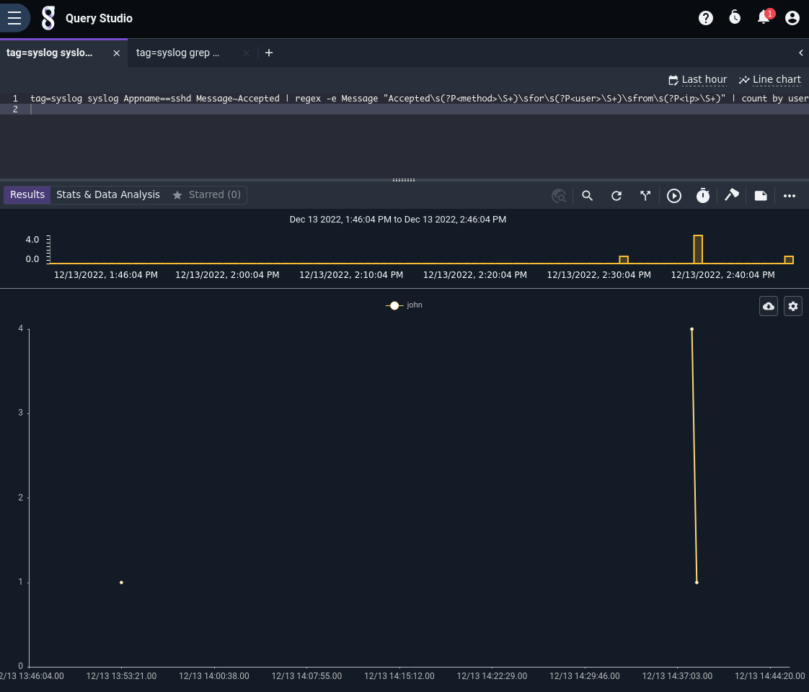

You can also click on the charting icon (the zig zag line) and change the type of chart.  Here is the exact same data displayed in a bar chart.

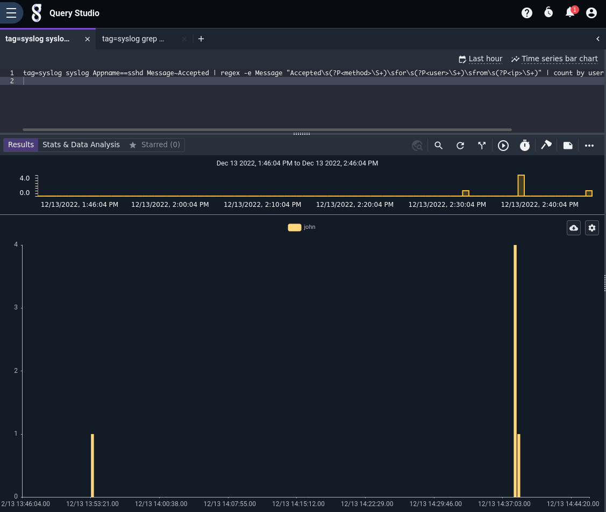

### Network Examples
Consider an example home network in which the user has set up the packet capture ingester on their Linux router, thus capturing all packets to and from the Internet. We can use this data to analyze use patterns, such as when particular games are played. The example house uses a 10.0.0.0/24 network subnet and Blizzard Entertainment games use port 1119 for game traffic. The following search will show which PCs are playing Blizzard games and when:

```
tag=pcap packet ipv4.DstIP !~ 10.0.0.0/24 tcp.DstPort==1119 ipv4.SrcIP | count by SrcIP | chart count by SrcIP
```

A review of the search command is as follows:

* ```tag=pcap```: Tells Gravwell to only search through items tagged 'pcap'.
* ```packet```: Invokes the packet parsing search pipeline module and enables the rest of the options in this command.
  * ```ipv4.DstIP !~ 10.0.0.0/24```: The Gravwell packet parser splits out a packet into its various fields. In this case, the search is comparing Destination IPs and looking for those not in the 10.0.0.x class C subnet
  * ```tcp.DstPort == 1119```: Specifies a destination port. This will filter only packets destined for port 1119, used by most Blizzard Entertainment games.
  * ```ipv4.SrcIP```: Specifying this field without a comparison operator tells the packet parser to extract and place the source IP into the pipeline.
* ```count by SrcIP```: Pipe the filtered results from the packet parser into the math count module and tell it to count how many times each source IP appears.
* ```chart count by SrcIP```: Pipe the count results into the charting renderer for display, drawing a separate line for each source IP value.

Results: We see two systems sending traffic to port 1119. The IP represented in yellow (10.0.0.6) appears to be passive traffic, while 10.0.0.183 in blue is actively communicating with the Blizzard games services.

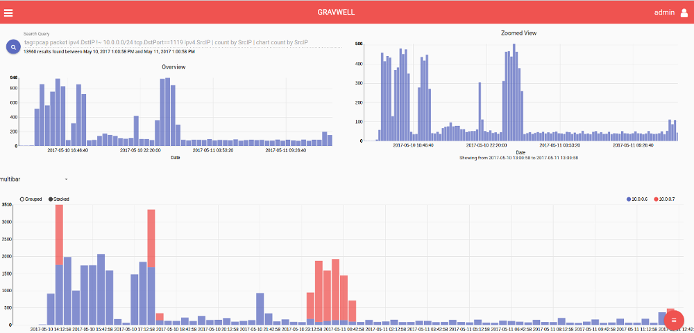

For more details on using the packet parsing search module, see the [packet search module documentation](#!search/packet/packet.md).

## Dashboards
Dashboards are aggregated views of searches that provide a view into multiple aspects of the data at once.

Navigate to the “Dashboards" page (use the menu at top-left) and click the "+Add" button to create a new dashboard -- call it “SSH auth monitoring”. Then, add a search. For this example, use the SSH authentication search from earlier. Re-issue that search and from the results screen, use the 3-dot menu in the upper right to choose “Add to Dashboard” and select the new dashboard. A popup in the lower right should inform you that the search was added to the dashboard and provide a link to go to that dashboard; click the link.

The dashboard should have automatically created a tile for the search, but you may wish to resize it. You can change how the tile is displayed by selecting "Edit tile" from the tile's menu.

### Dashboards in Action
One common use case for Gravwell is keeping track of network activity. Here we see a dashboard that reports on outbound and inbound bandwidth rates, active MACs on wifi, Windows networking events, and general packet frequency. All of this data is extracted from pcap, netflow, and Windows events.

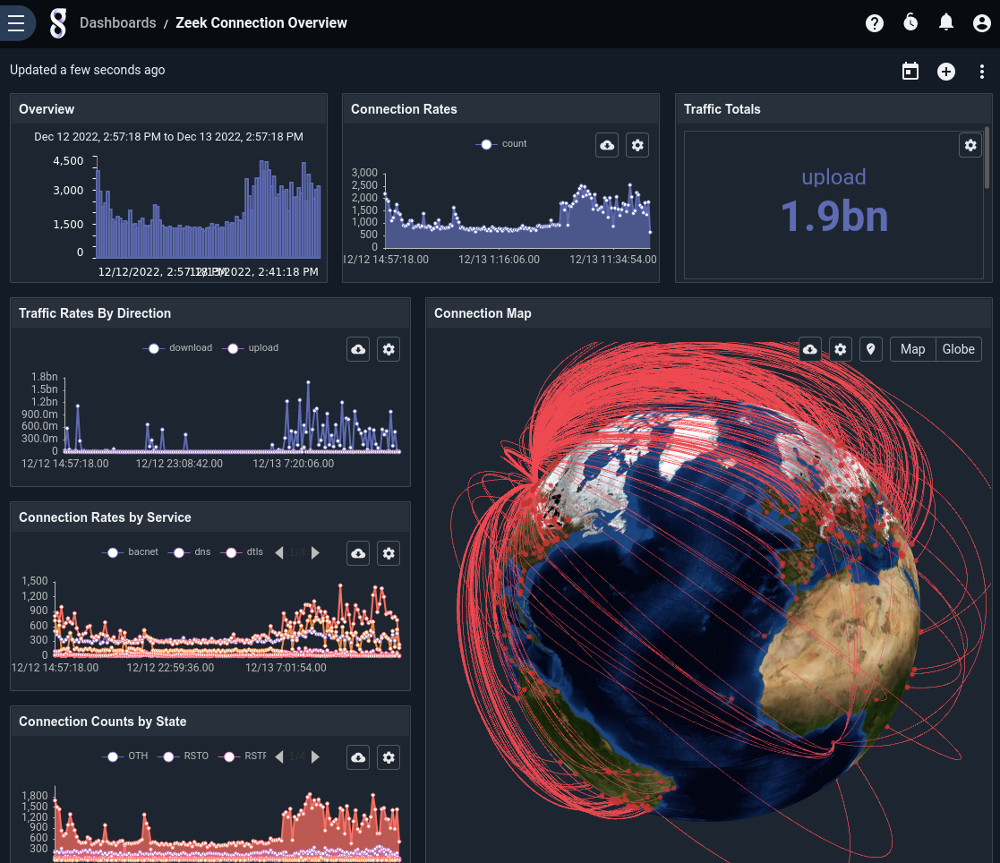

The outbound traffic chart shows a pretty big spike for an otherwise quiet system around 10:34 AM, so we zoom in by "brushing" out a smaller timeframe on the Overview chart. By default, zooming in on one overview will zoom in on any other searches that are attached to this dashboard. So, when we zoom in on the successful logins, the rest of the charts will update to reflect this smaller time range. Zooming in we can see the spike for the address 10.0.0.57. To further investigate we could use a pre-built network investigation dashboard, but that's outside the scope of this quickstart.

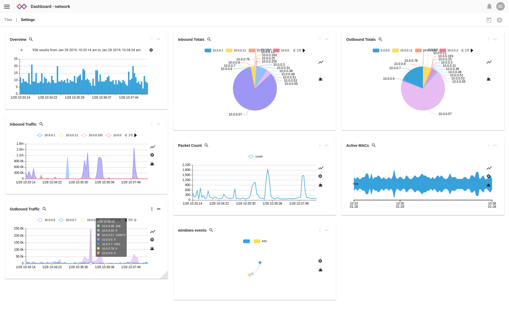

## Updating Gravwell

Upgrading Gravwell is an uneventful affair, we take great pains to ensure that the installation and upgrade process is fast and easy.  The upgrade process is different depending on your original installation method.  If you are using one of the package repositories, such as Debian, Gravwell is upgraded like any other application:


```
apt update
apt upgrade
```


If your original installation method was the self-contained shell installer, you simply download and run the latest version of the installer.  The self-contained installers act as both installation and upgrade systems, they will detect an existing installation and skip over any steps that do not apply to an upgrade.


### Upgrade Tips

There are a few tips to upgrading that can help in some installations.


* Cluster configurations should cascade indexer upgrades so that ingesters can continue normal operation during the upgrade
 * The same is true for distributed webserver configurations, the load balancer will shift users as needed
* If possible, time upgrades to the search agent when there are no large automated script jobs running
* Distribution package managers will sometimes prompt about upstream configuration file changes, keep your configs
 * Its ok to check what changed, we are usually just adding configurations for new features
 * If you accept upstream configuration files it may overwrite your configurations and cause components failures


After an upgrade it is always a good practice to check the state of Gravwell by ensuring that all indexers are present and accounted for and that ingesters have reconnected and are reporting the expected version numbers.


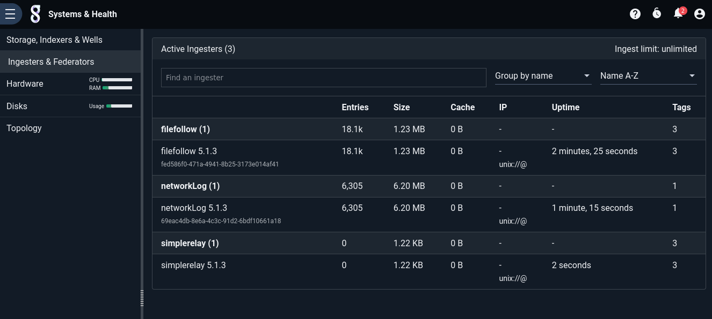


## Advanced Topics

### Crash Reporting and Metrics

The Gravwell software has automated crash reporting & metrics reporting built in. For more information about what gets sent back to us at Gravwell, see the [crash reporting and metrics page](#!metrics.md)

### Clustered Configurations

Users with multi-node licenses can deploy multiple indexer and webserver instances and coordinate them over the network. We highly recommend coordinating with Gravwell's support team before deploying such a setup, but will outline the basic steps in this document.

For most use cases, a single webserver and multiple indexer nodes will be desirable. For simplicity, we will describe an environment in which the webserver resides on the same node as one of the indexers.

First, perform a single-node Gravwell installation as described above on the system which will be the head node. This will install the webserver and indexer and generate authentication secrets:

```
root@headnode# bash gravwell_installer.sh
```

Next, make a copy of `/opt/gravwell/etc/gravwell.conf` somewhere else and remove any lines beginning with 'Indexer-UUID'. Copy this gravwell.conf file and the installer to each of the indexer nodes. On the indexer nodes, we pass additional arguments to the installer to disable installation of the webserver and to specify that the existing gravwell.conf file should be used rather than generating a new one:

```
root@indexer0# bash gravwell_installer.sh --no-webserver --no-searchagent --use-config /root/gravwell.conf
```

Repeat this process for each indexer node.

The final step of the installation is to inform the webserver of all these indexers. On the *head node*, open `/opt/gravwell/etc/gravwell.conf` and find the 'Remote-Indexers' line. It should look something like `Remote-Indexers=net:127.0.0.1:9404`. Now duplicate that line and modify the IPs to point at the other indexers (you can specify IP addresses or hostnames). For example, if there is an indexer on the local machine and on 3 other machines named indexer0.example.net, indexer1.example.net, and indexer2.example.net, the config file should contain these lines:

```
Remote-Indexers=net:127.0.0.1:9404
Remote-Indexers=net:indexer0.example.net:9404
Remote-Indexers=net:indexer1.example.net:9404
Remote-Indexers=net:indexer2.example.net:9404
```

Restart the webserver with the command `systemctl restart gravwell_webserver`. Now, when you view the "Systems Stats" page and click on the "Hardware" tab, you should see entries for each of the 4 indexer processes.
