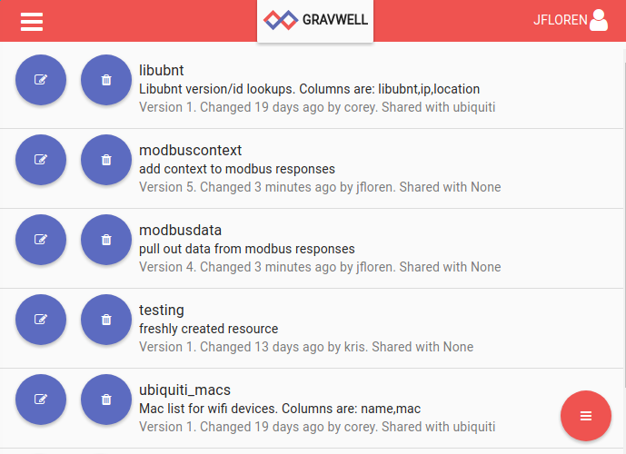
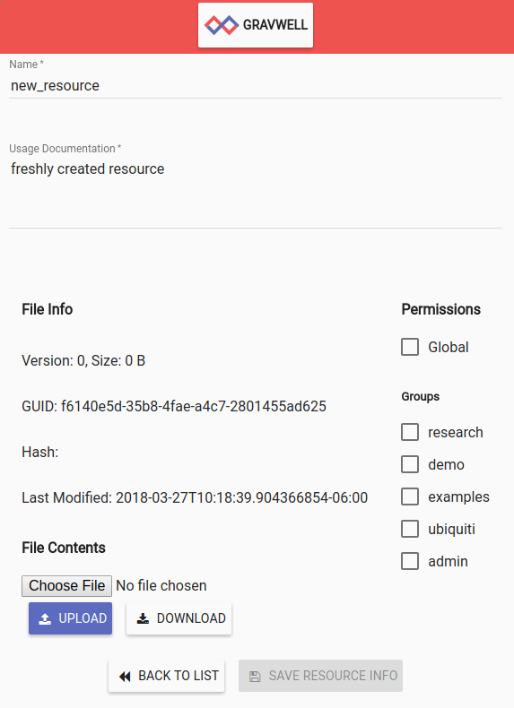
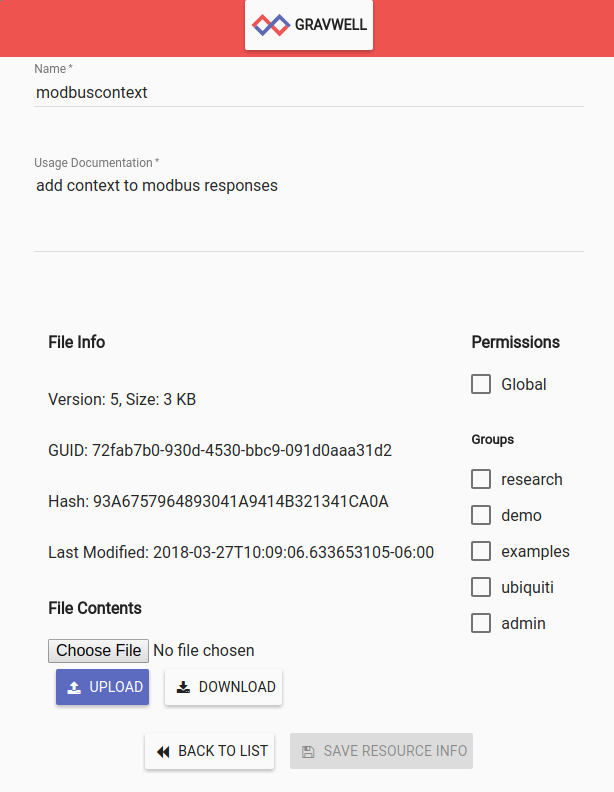

# Resources

Resources allow users to store persistent data for use in searches. Resources can be manually uploaded by a user or automatically created by search modules. Resources are used by the `lookup` module to store lookup tables and by the `anko` module to store scripts.

The format of a resource is not restricted; from the point of view of Gravwell, a resource is simply a stream of bytes. Deriving meaning from that stream of bytes is up to the search modules: `lookup` expects data in a particular binary encoding, while `anko` simply treats the resource as a text file. Scripts written for the `anko` module may themselves create and access resources in a variety of formats such as JSON-encoded text.

## Resource basics

Every resource is uniquely identified with a UUID, which is assigned when the resource is created. Resources also have a human-friendly name selected by the user. A resource can be accessed by specifying either the GUID or the name, but be aware that names can be changed. When building a dashboard or a search query you intend to share with others, we recommend using the GUID to refer to the resource.

Global resources are resources created by admin-level users for access by all users. Resources can also be shared with particular groups.

The creation of a resource is kept separate from the act of putting data into that resource. First, a resource is created, with a name and description specified by the creator. Gravwell allocates a UUID for the resource at this point and creates an empty resource in the system. Then the user may populate the resource (specified by name or UUID) with data.

Resource data can be generated by hand or by running a search. For example, a search that results in a table display can be downloaded as 'lookupdata' and uploaded into the resource system.

Note: When actually uploading a resource into the system, it may be necessary to convert or otherwise alter the format of your data before it can be used by Gravwell search modules. For example, if a user had a csv of hostnames and mac addresses for use by the lookup module, they would first need to convert the csv to "lookupdata" filetype.

### Resource name resolution

The resource system does not enforce unique resource names. Multiple users can have a resource named "foo", or indeed one user can own multiple resources named "foo". It is therefore important to be aware of the way the resource system resolves resource names into unique GUIDs.

Consider an example invocation of an anko script in a search: `anko myscript`. The resource manager will attempt to locate a resource named `myscript` in the following order:

* Check if the invoking user has a resource named `myscript`; if he or she has multiple resources with that name, it will return the first match.
* Check each group to which the user belongs. If there is a resource named `myscript` shared with one of the user's groups, it will return that resource.
* Check if there is a global resource named `myscript`.

Note that the user could be a member of groups A and B, and that there could be one resource named `myscript` shared with group A and another unique resource named `myscript` shared with group B; which resource is returned is not certain. Similarly, if there are multiple global resources named `myscript`, any one of them could be returned.

This ambiguity can be overcome in two ways. The safest choice is to specify the resource as a GUID, which can be found in the resource editing page as shown in the resource management section below, but GUIDs are very unwieldy and provide little useful context to the user.

Luckily, it is also possible to select a resource by name with more precision by prefixing the resource name with a namespace. The following are valid namespace selections:

* `GLOBAL:myscript` specifies a global resource named `myscript`. This will ignore any resources owned by the invoking user and go straight to the global resources.
* `user=jfloren:myscript` specifies a resource named `myscript` belonging to the user `jfloren`. Note that this will fail if the invoking user does not have access to this resource.
* `group=security:myscript` specifies a resource named `myscript` which is shared to the group `security`. Note that this will fail if the invoking user is not a member of the security group.

## Managing resources with the GUI

Resources are managed via the main menu of the user interface. Open the menu and select "Resources".



Resources can be created and deleted from this menu. 

### Deleting resources

To delete an existing resource, click the trash can icon next to the desired resource in the list. Note that the system does not currently ask for confirmation before deleting the resource, so be cautious.

### Creating resources

To create a new resource, select the "Add" button in the upper right:



Set the resource name and description as desired and select any groups which should be able to read the resource, then select a file to upload. Note that the resource will not be created or uploaded until you hit the 'Save' button!


### Editing resources

To edit an existing resource, click the pencil "Edit" icon below the desired resource in the resource list. This will open the resource editing screen:



The name, description, and group sharing can all be managed from this screen. Admin users can also chose to make a resource global or non-global.

To change the actual contents of the resource, drag a file into the grey 'File' region or click to select a new file, exactly as when creating a new resource. Note that the Version, Hash, Size, and Last Modified fields change when a different file is uploaded.

Attention: Changes to the resource description will not be saved unless the "Save" button is clicked.

## Using resources

Resources are used by some search modules. This example will use the 'lookup' module to do a basic reference lookup of MAC address to hostname (which we originally generated from a csv file).

An example csv might look like:
```
mac,hostname
mobile-device-1,40:b0:fa:d7:af:01
desktop-1,64:bc:0c:87:bc:71
mobile-device-2,40:b0:fa:d7:ae:02
desktop-2,64:bc:0c:87:9a:11
```

Any module that utilizes a resource will use the '-r' switch for specifying the resource. In this example we will use the lookup module which has a general syntax of:

```
lookup -r <resource name> <enumerated value> <column to match> <column to extract> as <valuename>
```

Applying our example of mac->hostname lookup we would have a query like:

```
tag=pcap packet eth.SrcMAC | count by SrcMAC | lookup -r macnames SrcMAC mac hostname as devicename |  table SrcMAC devicename count
```

Exact syntax and utilization of resources is defined by the search module utilizing it. Reference the documentation for a specific module for more information about the resource usage by a given module.

Use cases and examples will also be available on the blog at https://www.gravwell.io/blog/


## Access control

Each resource belongs to a single user. The owner and the admin users are the only users allowed to modify or delete the resource.

The owner can set a list of groups which are allowed to access the resource. They can read it, but not modify or delete.

## Managing Resources with the CLI

The Gravwell CLI client has basic support for managing resources. Having started the client, run the `resource` command to enter resource mode.

	#>  resource
	resource>

The `list` command will output a list of existing resources.

	resource>  list
	+-----------------------------------------+-------------------+------------------------------+----------+-----------+----------------------+
	|                                    GUID |              Name |                Creation Date |    Owner |    Groups |          Description |
	+=========================================+===================+==============================+==========+===========+======================+
	|    98abb985-52ef-4b09-9353-c4352603d863 |               foo |    2018-01-24T12:28:44-07:00 |     john |           |           a resource |
	+-----------------------------------------+-------------------+------------------------------+----------+-----------+----------------------+
	|    cce311fd-96d9-4a39-b36e-c088d2ee8546 |    globalresource |    2018-01-24T12:42:45-07:00 |    admin |           |    a global resource |
	+-----------------------------------------+-------------------+------------------------------+----------+-----------+----------------------+


Note: Because the tables generated by the client are wide, some screens might not be able to show the entire table without wrapping.

It shows that there is a resource named "foo" owned by the user 'john', and another resource named "globalresource" owned by 'admin'.

Use the `create` command to create a new resource:

	resource>  create
	Name>  myresource
	Description>  My new resource
	Created new resource with GUID b6c36f76-3a45-44a3-9ff1-f6ebb47bb329

Once the resource has been created, we can upload data to it:

	resource>  update
	+-----------------------------------------+-------------------+------------------------------+----------+-----------+----------------------+
	|                                    GUID |              Name |                Creation Date |    Owner |    Groups |          Description |
	+=========================================+===================+==============================+==========+===========+======================+
	|    98abb985-52ef-4b09-9353-c4352603d863 |               foo |    2018-01-24T12:28:44-07:00 |     john |           |           a resource |
	+-----------------------------------------+-------------------+------------------------------+----------+-----------+----------------------+
	|    cce311fd-96d9-4a39-b36e-c088d2ee8546 |    globalresource |    2018-01-24T12:42:45-07:00 |    admin |           |    a global resource |
	+-----------------------------------------+-------------------+------------------------------+----------+-----------+----------------------+
	|    b6c36f76-3a45-44a3-9ff1-f6ebb47bb329 |        myresource |    2018-01-24T12:45:15-07:00 |     john |           |      My new resource |
	+-----------------------------------------+-------------------+------------------------------+----------+-----------+----------------------+
	GUID>  b6c36f76-3a45-44a3-9ff1-f6ebb47bb329
	file path>  /tmp/mydata

When we run the `update` command, the client first prints out existing resources; we select the GUID of the resource we just created, then provide a file to upload (in this case `/tmp/mydata`)

Finally, we can use the `delete` command to remove a resource that is no longer needed:

```
resource>  delete
+-----------------------------------------+-------------------+------------------------------+----------+-----------+----------------------+
|                                    GUID |              Name |                Creation Date |    Owner |    Groups |          Description |
+=========================================+===================+==============================+==========+===========+======================+
|    cce311fd-96d9-4a39-b36e-c088d2ee8546 |    globalresource |    2018-01-24T12:42:45-07:00 |    admin |           |    a global resource |
+-----------------------------------------+-------------------+------------------------------+----------+-----------+----------------------+
|    b6c36f76-3a45-44a3-9ff1-f6ebb47bb329 |        myresource |    2018-01-24T12:45:15-07:00 |     john |           |      My new resource |
+-----------------------------------------+-------------------+------------------------------+----------+-----------+----------------------+
|    98abb985-52ef-4b09-9353-c4352603d863 |               foo |    2018-01-24T12:28:44-07:00 |     john |           |           a resource |
+-----------------------------------------+-------------------+------------------------------+----------+-----------+----------------------+
GUID>  b6c36f76-3a45-44a3-9ff1-f6ebb47bb329
resource>  list
+-----------------------------------------+-------------------+------------------------------+----------+-----------+----------------------+
|                                    GUID |              Name |                Creation Date |    Owner |    Groups |          Description |
+=========================================+===================+==============================+==========+===========+======================+
|    98abb985-52ef-4b09-9353-c4352603d863 |               foo |    2018-01-24T12:28:44-07:00 |     john |           |           a resource |
+-----------------------------------------+-------------------+------------------------------+----------+-----------+----------------------+
|    cce311fd-96d9-4a39-b36e-c088d2ee8546 |    globalresource |    2018-01-24T12:42:45-07:00 |    admin |           |    a global resource |
+-----------------------------------------+-------------------+------------------------------+----------+-----------+----------------------+
```
