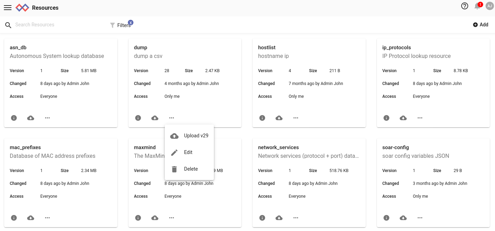

# リソース

リソースは、検索に使用する永続的なデータを保存することができます。リソースはユーザが手動でアップロードすることもできるし、検索モジュールが自動的に作成することもできる。リソースはルックアップテーブルを格納するための`lookup`モジュールやスクリプトを格納するための`anko`モジュールで使用される。

リソースの形式は特に制限されない。Gravwellから見るとリソースは単なるバイトの流れである。Gravwellから見れば、リソースは単なるバイトの流れであり、そのバイトの流れから意味を導き出すのは検索モジュールに任されている。lookup "は特定のバイナリエンコーディングのデータを期待し、"anko "はリソースを単にテキストファイルとして扱う。anko`モジュール用に書かれたスクリプトは、JSONエンコードされたテキストなど、さまざまなフォーマットのリソースを作成したり、アクセスしたりすることができます。

## リソースの基礎知識

すべてのリソースは、リソースの作成時に割り当てられるUUIDで一意に識別されます。また、リソースには、ユーザーが選択した親しみやすい名前が付けられます。リソースにアクセスするには、GUIDまたは名前のどちらかを指定しますが、名前は変更される可能性があるので注意が必要です。ダッシュボードや検索クエリを作成して他の人と共有する場合は、GUIDを使ってリソースを参照することをお勧めします。

グローバルリソースは、管理者レベルのユーザーが作成し、すべてのユーザーがアクセスできるリソースです。リソースは特定のグループと共有することもできます。

リソースの作成は、そのリソースにデータを入れる行為とは別に行われます。まず、作成者が指定した名前と説明を持つリソースが作成されます。この時点でリソースにUUIDが割り当てられ、システム内に空のリソースが作成される。次に、ユーザーはリソース（名前またはUUIDで指定）にデータを入力することができる。

リソースのデータは、手作業で生成することも、検索を実行して生成することもできる。例えば、検索の結果、表が表示された場合、「lookupdata」としてダウンロードし、リソースシステムにアップロードすることができる。

注意：実際にリソースをシステムにアップロードする際には、Gravwellの検索モジュールで使用する前に、データのフォーマットを変換またはその他の方法で変更する必要がある場合があります。例えば、ホスト名とマックアドレスのcsvを検索モジュールで使用する場合、まずcsvを「lookupdata」というファイルタイプに変換する必要があります。

### リソース名の解決

リソースシステムでは、ユニークなリソース名を強制していません。複数のユーザが "foo "という名前のリソースを持つこともできますし、一人のユーザが "foo "という名前のリソースを複数持つこともできます。そのため、リソースシステムがリソース名を一意のGUIDに解決する方法を知っておくことが重要です。

検索で anko スクリプトを呼び出す例を考えてみましょう。`anko myscript`. リソースマネージャは、以下の順序で `myscript` という名前のリソースを探そうとします。

* 呼び出したユーザが `myscript` という名前のリソースを持っているかどうかをチェックし、その名前のリソースを複数持っている場合は、最初にマッチしたものを返します。
* そのユーザが所属するグループをそれぞれチェックします。ユーザーが所属するグループのいずれかと共有されている `myscript` という名前のリソースがあれば、そのリソースが返されます。
* `myscript` という名前のグローバルリソースがあるかどうかをチェックします。

ユーザーがグループAとBのメンバーである可能性があり、グループAで共有されている`myscript`という名前のリソースと、グループBで共有されている`myscript`という名前のユニークなリソースが存在する可能性があり、どちらのリソースが返されるかは定かではないことに注意してください。同様に、`myscript`という名前のグローバルリソースが複数ある場合は、そのうちのどれかが返される可能性があります。

この曖昧さを解消するには2つの方法があります。最も安全な方法は、リソースをGUIDで指定することです。GUIDは、以下のリソース管理のセクションで示すように、リソース編集ページで見つけることができますが、GUIDは非常に扱いにくく、ユーザーに有用なコンテキストをほとんど提供しません。

幸いなことに、リソース名の前に名前空間を付けることで、より正確にリソースを選択することも可能です。以下は、有効な名前空間の選択です。

* `GLOBAL:myscript` は、`myscript` という名前のグローバルリソースを指定します。この場合、起動したユーザが所有するリソースは無視され、グローバルリソースに直接アクセスします。
* `user=jfloren:myscript` は、ユーザー `jfloren` に属する `myscript` という名前のリソースを指定します。起動したユーザーがこのリソースへのアクセス権を持っていない場合は失敗することに注意してください。
* `group=security:myscript` は、グループ `security` に共有されている `myscript` という名前のリソースを指定します。呼び出したユーザーがセキュリティグループのメンバーでない場合は失敗します。

### リソースドメイン

状況によっては、複数のウェブサーバが同一のインデクサに接続されている場合があります。例えば、サービスプロバイダーが顧客ごとに独立したGravwellクラスタを構築し、さらに「オーバーウォッチ」と呼ばれるウェブサーバで*すべての*インデクサに接続し、すべての顧客の統計情報を収集できるようにしている場合があります。2つのウェブサーバが異なるリソースセットを持ち、同じインデクサに接続した場合、インデクサはリソースセットを両方のウェブサーバに同時に同期させようとするため、スラッシュが発生します。

この問題を防ぐために、ウェブサーバーには *ドメイン* を設定することができます。ドメインは基本的にリソースの追加の名前空間を提供する番号です。ドメインは `gravwell.conf` の `Webserver-Domain` 設定パラメータで指定します。上述のオーバーウォッチの例では、サービスプロバイダは顧客クラスタをドメイン0に設定したまま、オーバーウォッチのウェブサーバをドメイン1に設定することができます。

注意： [データストアを利用した分散型ウェブサーバ](#!distributed/frontend.md)として設定されたウェブサーバは、お互いにリソースを調整して同期しているため、この問題は発生しません。ただし、同じデータストアに接続するすべてのウェブサーバーは、同じドメイン内にある必要があります。

## GUIによるリソースの管理

リソースの管理は、ユーザーインターフェースのメインメニューで行います。メニューを開き、「ツールとリソース」のサブメニューを開いて、「リソース」を選択します。


リソースの作成や削除は、このメニューから行います。

### リソースの削除

既存のリソースを削除するには、削除したいリソースの三点メニューをクリックし、[削除]を選択します。



### リソースの作成

新しいリソースを作成するには、右上の「追加」ボタンを選択します。


リソースの名前と説明を任意に設定し、リソースを読むことができるグループを選択して、アップロードするファイルを選択します。Save」ボタンを押すまでは、リソースの作成やアップロードは行われませんのでご注意ください。

この時点でオプションとして[labels](#!gui/labels/labels.md)を追加したり、インストールしたキットの一部としてリソースをタグ付けすることができます。

### リソースの編集

既存のリソースを編集するには、リソース一覧で目的のリソースの下にある鉛筆の「編集」アイコンを クリックします。リソースの編集画面が表示されます。


この画面では、名前、説明、グループ共有などを管理することができます。管理者は、リソースのグローバル化、非グローバル化を選択することができます。

リソースの実際の内容を変更するには、新しいリソースを作成するときと同様に、灰色の「ファイル」領域にファイルをドラッグするか、クリックして新しいファイルを選択します。別のファイルがアップロードされると、バージョン、ハッシュ、サイズ、最終更新日時のフィールドが変更されることに注意してください。

注意 リソースの説明の変更は、「保存」ボタンをクリックしない限り保存されません。

## リソースの利用

リソースは一部の検索モジュールで使用されます。この例では、'lookup'モジュールを使用して、MACアドレスからホスト名への基本的な参照検索を行います(元々はcsvファイルから生成したものです)。

csvファイルの例は以下の通りです。:
```
mac,hostname
mobile-device-1,40:b0:fa:d7:af:01
desktop-1,64:bc:0c:87:bc:71
mobile-device-2,40:b0:fa:d7:ae:02
desktop-2,64:bc:0c:87:9a:11
```

リソースを使用するモジュールは、リソースを指定するために「-r」スイッチを使用します。この例では、次のような一般的な構文を持つlookupモジュールを使用します:

```
lookup -r <resource name> <enumerated value> <column to match> <column to extract> as <valuename>
```

先ほどのmac->hostname検索の例に当てはめると、次のようなクエリになります:

```
tag=pcap packet eth.SrcMAC | count by SrcMAC | lookup -r macnames SrcMAC mac hostname as devicename |  table SrcMAC devicename count
```

リソースの正確な構文と利用方法は、それを利用する検索モジュールによって定義されます。特定のモジュールによるリソースの使用についての詳細は、特定のモジュールのドキュメントを参照してください。

使用例は、ブログ（https://www.gravwell.io/blog/）でも公開しています。


## アクセスコントロール

各リソースは、1人のユーザーに属します。オーナーとadminユーザーのみがリソースの変更や削除を行うことができます。

オーナーは、リソースへのアクセスを許可するグループのリストを設定することができます。これらのユーザーはリソースを読むことはできますが、変更や削除はできません。

## CLIによるリソースの管理

Gravwell CLIクライアントはリソースを管理するための基本的な機能を備えています。クライアントを起動し、`resource`コマンドを実行するとリソースモードになります。

	#>  resource
	resource>

`list`コマンドは、既存のリソースのリストを出力します。

	resource>  list
	+-----------------------------------------+-------------------+------------------------------+----------+-----------+----------------------+
	|                                    GUID |              Name |                Creation Date |    Owner |    Groups |          Description |
	+=========================================+===================+==============================+==========+===========+======================+
	|    98abb985-52ef-4b09-9353-c4352603d863 |               foo |    2018-01-24T12:28:44-07:00 |     john |           |           a resource |
	+-----------------------------------------+-------------------+------------------------------+----------+-----------+----------------------+
	|    cce311fd-96d9-4a39-b36e-c088d2ee8546 |    globalresource |    2018-01-24T12:42:45-07:00 |    admin |           |    a global resource |
	+-----------------------------------------+-------------------+------------------------------+----------+-----------+----------------------+


注：クライアントが生成するテーブルは幅が広いため、画面によってはテーブル全体を折り返さずに表示できない場合があります。

ユーザー'john'が所有する "foo "という名前のリソースと、'admin'が所有する "globalresource "という名前のリソースがあることを示しています。

新しいリソースを作成するには、`create`コマンドを使用します。:

	resource>  create
	Name>  myresource
	Description>  My new resource
	Created new resource with GUID b6c36f76-3a45-44a3-9ff1-f6ebb47bb329

リソースの作成が完了したら、データをアップロードします:

	resource>  update
	+-----------------------------------------+-------------------+------------------------------+----------+-----------+----------------------+
	|                                    GUID |              Name |                Creation Date |    Owner |    Groups |          Description |
	+=========================================+===================+==============================+==========+===========+======================+
	|    98abb985-52ef-4b09-9353-c4352603d863 |               foo |    2018-01-24T12:28:44-07:00 |     john |           |           a resource |
	+-----------------------------------------+-------------------+------------------------------+----------+-----------+----------------------+
	|    cce311fd-96d9-4a39-b36e-c088d2ee8546 |    globalresource |    2018-01-24T12:42:45-07:00 |    admin |           |    a global resource |
	+-----------------------------------------+-------------------+------------------------------+----------+-----------+----------------------+
	|    b6c36f76-3a45-44a3-9ff1-f6ebb47bb329 |        myresource |    2018-01-24T12:45:15-07:00 |     john |           |      My new resource |
	+-----------------------------------------+-------------------+------------------------------+----------+-----------+----------------------+
	GUID>  b6c36f76-3a45-44a3-9ff1-f6ebb47bb329
	file path>  /tmp/mydata

`update`コマンドを実行すると、クライアントはまず既存のリソースを表示します。先ほど作成したリソースのGUIDを選択し、アップロードするファイル（ここでは`/tmp/mydata`）を指定します。

最後に、不要になったリソースを削除するには、`delete`コマンドを使用します。:

```
resource>  delete
+-----------------------------------------+-------------------+------------------------------+----------+-----------+----------------------+
|                                    GUID |              Name |                Creation Date |    Owner |    Groups |          Description |
+=========================================+===================+==============================+==========+===========+======================+
|    cce311fd-96d9-4a39-b36e-c088d2ee8546 |    globalresource |    2018-01-24T12:42:45-07:00 |    admin |           |    a global resource |
+-----------------------------------------+-------------------+------------------------------+----------+-----------+----------------------+
|    b6c36f76-3a45-44a3-9ff1-f6ebb47bb329 |        myresource |    2018-01-24T12:45:15-07:00 |     john |           |      My new resource |
+-----------------------------------------+-------------------+------------------------------+----------+-----------+----------------------+
|    98abb985-52ef-4b09-9353-c4352603d863 |               foo |    2018-01-24T12:28:44-07:00 |     john |           |           a resource |
+-----------------------------------------+-------------------+------------------------------+----------+-----------+----------------------+
GUID>  b6c36f76-3a45-44a3-9ff1-f6ebb47bb329
resource>  list
+-----------------------------------------+-------------------+------------------------------+----------+-----------+----------------------+
|                                    GUID |              Name |                Creation Date |    Owner |    Groups |          Description |
+=========================================+===================+==============================+==========+===========+======================+
|    98abb985-52ef-4b09-9353-c4352603d863 |               foo |    2018-01-24T12:28:44-07:00 |     john |           |           a resource |
+-----------------------------------------+-------------------+------------------------------+----------+-----------+----------------------+
|    cce311fd-96d9-4a39-b36e-c088d2ee8546 |    globalresource |    2018-01-24T12:42:45-07:00 |    admin |           |    a global resource |
+-----------------------------------------+-------------------+------------------------------+----------+-----------+----------------------+
```
