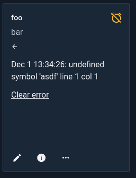
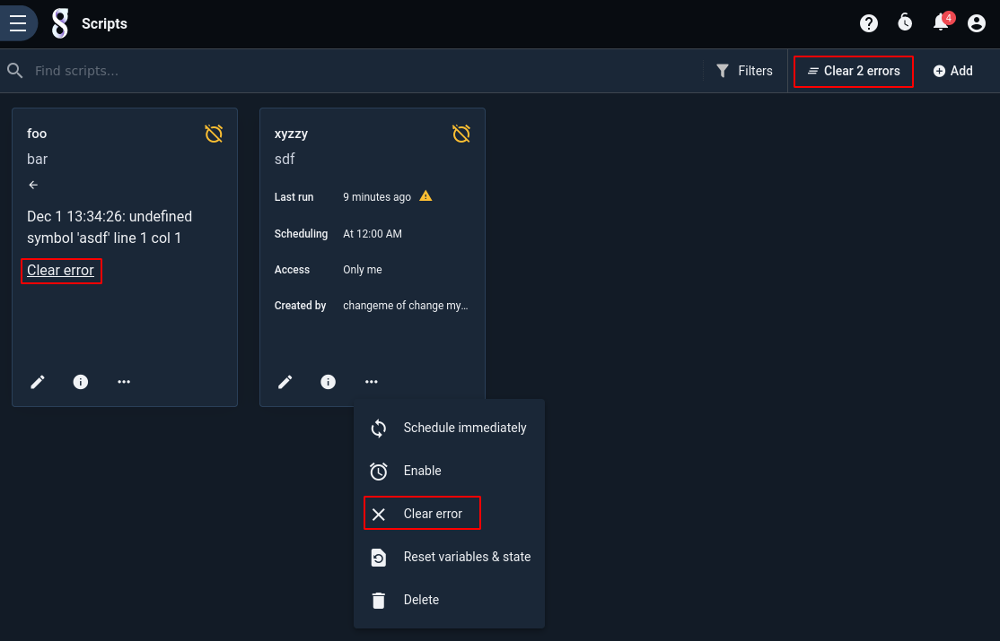

# Scheduling Searches and Scripts with the Search Agent

It is often advantageous to perform searches or run scripts automatically, for instance running a search every morning to detect malicious behavior from the previous night. Using Gravwell's search agent, searches and [search scripts](scriptingsearch) can be run on customized scheduled.

The scheduling feature allows the user to schedule both regular searches and [search scripts](scriptingsearch).

## Setting up the Search Agent

The Gravwell Search Agent is now included in the main Gravwell install packages and will be installed by default. Disabling the webserver component with the `--no-webserver` flag or setting the `--no-searchagent` flag will disable installation of the Search Agent. The Search Agent is installed automatically by the Gravwell Debian package.

For more information about configuring (or disabling) the search agent, see [the search agent documentation](searchagent).

## Managing Scheduled Searches

Scheduled searches are managed from the 'Scheduled Searches' page, located under the "Automation" sub-menu of the main menu. The following screenshot shows a single scheduled search which runs every hour:


### Creating a Scheduled Search

To create a new scheduled search, click the 'Add' button in the upper-right corner of the Scheduled Searches page. A new page will open:


You must provide a search query, specify a timeframe over which it should run, give it a name and description, and define the schedule. You may also optionally chose one or more groups whose members may see the results of this scheduled search, define [labels](/gui/labels/labels), or assign the scheduled search to an installed kit.

```{note}
Gravwell uses the cron schedule format to specify when a search should run. If you're not familiar with cron, check out [the Wikipedia article](https://en.wikipedia.org/wiki/Cron) and try [this site to experiment with scheduling](https://cron.help/)
```

Below, we have defined a simple scheduled search which runs every minute and counts how many entries came in over the last minute:


Note that we have selected the "Enable this scheduled query" option, which automatically enables Backfill Scheduling. Backfill Scheduling is intended to help cover any potential lapses in which Gravwell is unable to run a scheduled search on schedule -- for instance, during an upgrade. If a scheduled run is missed, Gravwell will go back and run the search over the missed timespan as soon as possible.

After clicking Save, the search now shows up in the scheduled search listing and will soon run, updating the 'Last Run' field:


### Timeframe Offsets

It may not always be appropriate for your scheduled search to query up to "now". For example, you may be ingesting some logs in a batched process that runs every ten minutes; running a query over the last hour will most likely miss data!

Setting a timeframe offset helps with this problem. It simply shifts the start and end times over which the query runs. Consider a scheduled search with the timeframe set to 1 hour. Normally, this search executes over the data from 1 hour ago to the current time. If, however, we set a timeframe offset of 30 minutes, the search will execute over data ranging from 1 hour 30 minutes ago to 30 minutes ago.

## Managing Scheduled Scripts

Scheduled scripts are managed from the 'Scripts' page, located under the "Automation" sub-menu of the main menu. Scripts are managed in exactly the same way as scheduled searches, with identical controls available.

### Creating a Scheduled Script

To create a scheduled search, click the 'Add' button in the upper right of the Scripts page. This will open the New Script page, with a text area for entering a script:


Once you have entered the script, a name, a description, and a schedule, click "Save" or "Save & Exit" to create the script.

### Debugging Scripts

By default, the right-hand side of the script editing page will show the "Info" tab, but note the column of icons at the far right. Clicking the check mark will open the Debugging tab, which can be used to test your scripts. When you click the "Debug" button, the Search Agent will execute your script as soon as possible, *with printing functions enabled*. This can be very helpful when attempting to debug a problematic script. The example below shows a very simple script and the debug output.


## Viewing Search Results

To see the last results of a scheduled search, click the 'Results' link:


The most recent set of results for the scheduled search will load:


## Disabling a Scheduled Search or Script

Disabling a scheduled search will prevent it from running again until it is re-enabled. To disable a search, open the three-dot menu to view additional options and select Disable:


To re-enable, repeat the process; rather than "Disable", the menu will say "Enable".

## Scheduling a Search/Script Immediately

You can force a scheduled search or script to run immediately at any time. Open the three-dot menu for that search/script and select "Schedule immediately". The search agent will run it as soon as possible.


## Clearing Errors

When a script encounters an error during execution, an icon will be displayed on the scripts page to indicate that an error has occurred. 


Clicking the icon will display the error message:



Note that the most recent error will be preserved even if the script successfully runs later--this is to make sure you are aware of any *periodic* failures which may be occurring. The error message may be cleared by either clicking the "Clear error" option below the error message or selecting "Clear error" from the script's 3-dot menu. There is also a button at the top right of the page which will clear *all* errors.



## Deleting a Scheduled Search/Script

To delete a scheduled search, select the "Delete" option:


