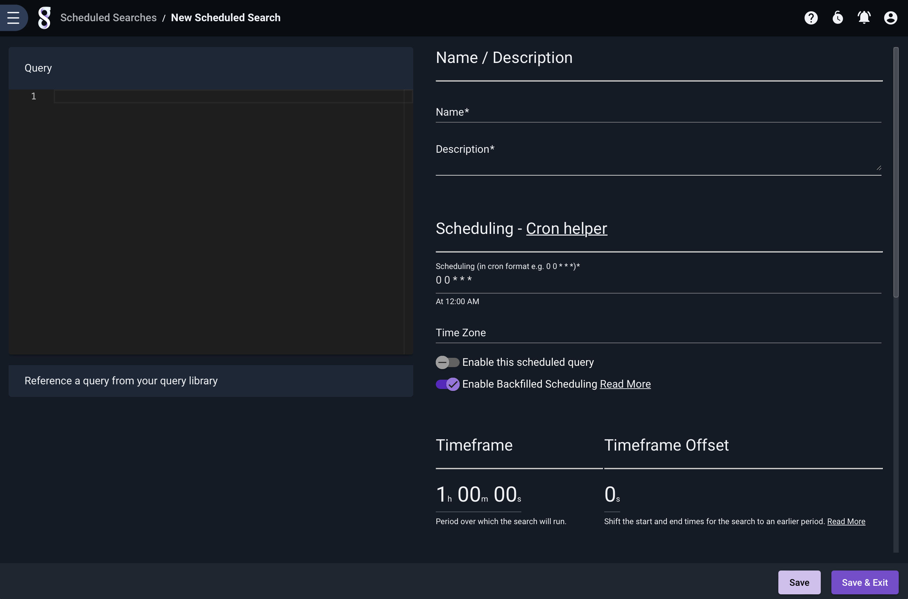
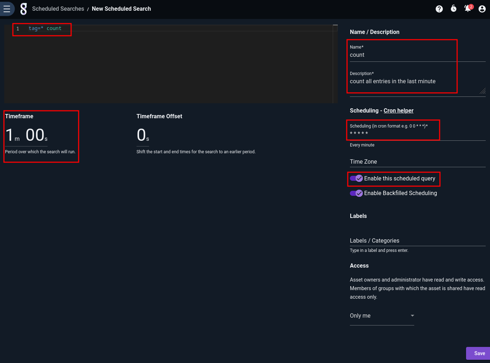
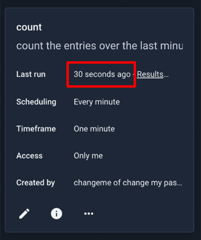
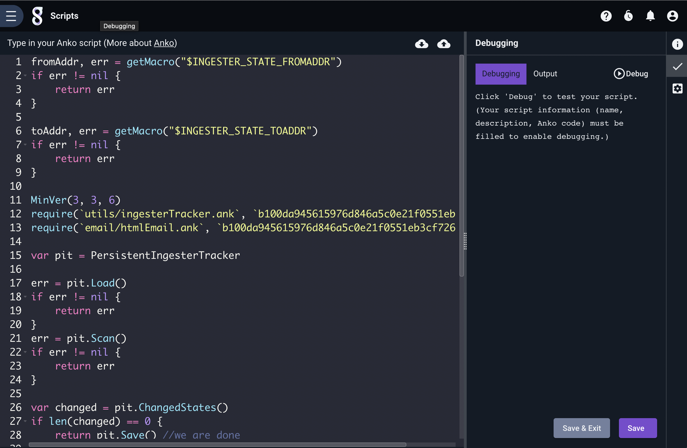
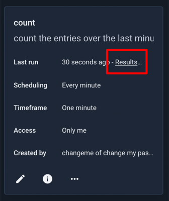
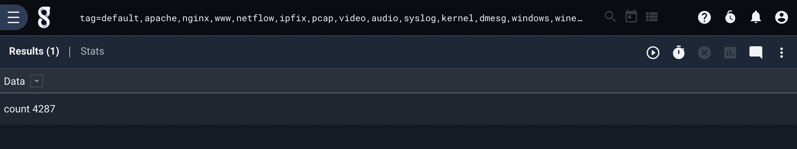
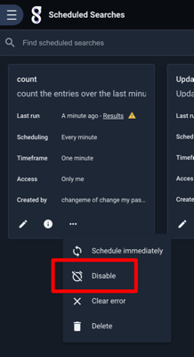
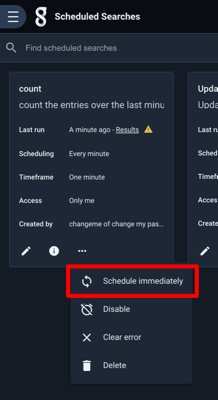
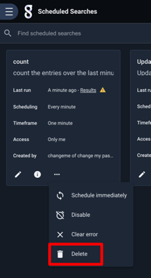

# Scheduling Searches and Scripts with the Search Agent

It is often advantageous to perform searches or run scripts automatically, for instance running a search every morning to detect malicious behavior from the previous night. Using Gravwell's search agent, searches and [search scripts](scriptingsearch.md) can be run on customized scheduled.

The scheduling feature allows the user to schedule both regular searches and [search scripts](scriptingsearch.md).

## Setting up the Search Agent

The Gravwell Search Agent is now included in the main Gravwell install packages and will be installed by default. Disabling the webserver component with the `--no-webserver` flag or setting the `--no-searchagent` flag will disable installation of the Search Agent. The Search Agent is installed automatically by the Gravwell Debian package.

For more information about configuring (or disabling) the search agent, see [the search agent documentation](searchagent.md)

## Managing Scheduled Searches

Scheduled searches are managed from the 'Scheduled Searches' page, located under the "Automation" sub-menu of the main menu. The following screenshot shows a single scheduled search which runs every hour:

### Creating a Scheduled Search

To create a new scheduled search, click the 'Add' button in the upper-right corner of the Scheduled Searches page. A new page will open:

You must provide a search query, specify a timeframe over which it should run, give it a name and description, and define the schedule. You may also optionally chose one or more groups whose members may see the results of this scheduled search, define [labels](#!gui/labels/labels.md), or assign the scheduled search to an installed kit.

Note: Gravwell uses the cron schedule format to specify when a search should run. If you're not familiar with cron, check out [the Wikipedia article](https://en.wikipedia.org/wiki/Cron) and try [this site to experiment with scheduling](https://cron.help/)

Below, we have defined a simple scheduled search which runs every minute and counts how many entries came in over the last minute:

Note that we have selected the "run after saving" option. This tells the searchagent to run the search as soon as it can, then begin the regular schedule. This is particularly useful when you're running searches to update a lookup table.

After clicking Save, the search now shows up in the scheduled search listing and will soon run, updating the 'Last Run' field:

## Managing Scheduled Scripts

Scheduled scripts are managed from the 'Scripts' page, located under the "Automation" sub-menu of the main menu. Scripts are managed in exactly the same way as scheduled searches, with identical controls available.

### Creating a Scheduled Script

To create a scheduled search, click the 'Add' button in the upper right of the Scripts page. This will open the New Script page, with a text area for entering a script:

Once you have entered the script, a name, a description, and a schedule, click "Save" or "Save & Exit" to create the script.

### Debugging Scripts

By default, the right-hand side of the script editing page will show the "Info" tab, but note the column of icons at the far right. Clicking the checkmark will open the Debugging tab, which can be used to test your scripts. When you click the "Debug" button, the Search Agent will execute your script as soon as possible, *with printing functions enabled*. This can be very helpful when attempting to debug a problematic script. The example below shows a very simple script and the debug output.

## Viewing Search Results

To see the last results of a scheduled search, click the 'View Results' icon:

The most recent set of results for the scheduled search will load:

## Disabling a Scheduled Search or Script

Disabling a scheduled search will prevent it from running again until it is re-enabled. To disable a search, open the three-dot menu to view additional options and select Disable:

To re-enable, repeat the process; rather than "Disable", the menu will say "Enable".

## Scheduling a Search/Script Immediately

You can force a scheduled search or script to run immediately at any time. Open the three-dot menu for that search/script and select "Schedule immediately". The search agent will run it as soon as possible.

## Deleting a Scheduled Search/Script

To delete a scheduled search, select the "Delete" option:

