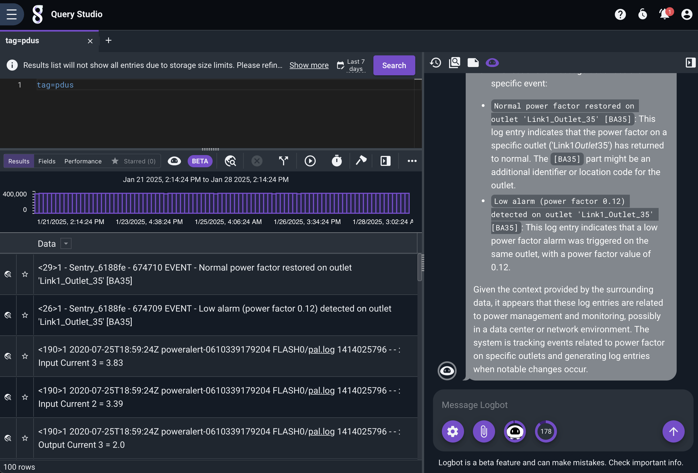
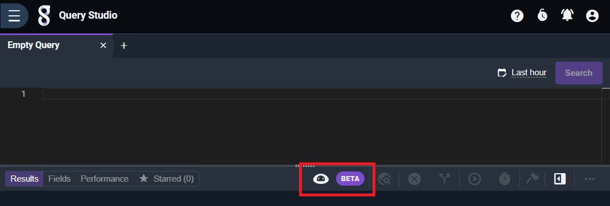
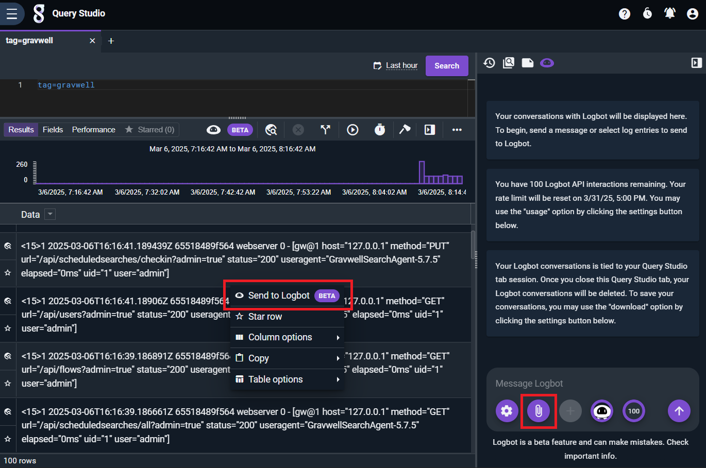
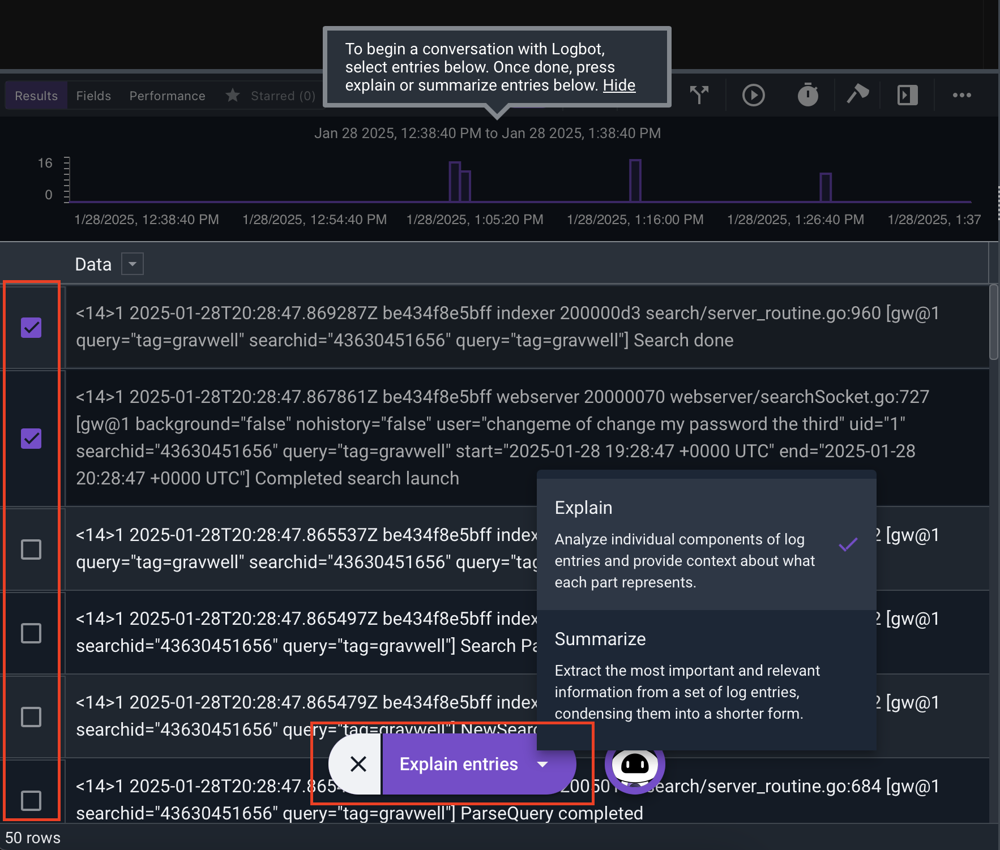
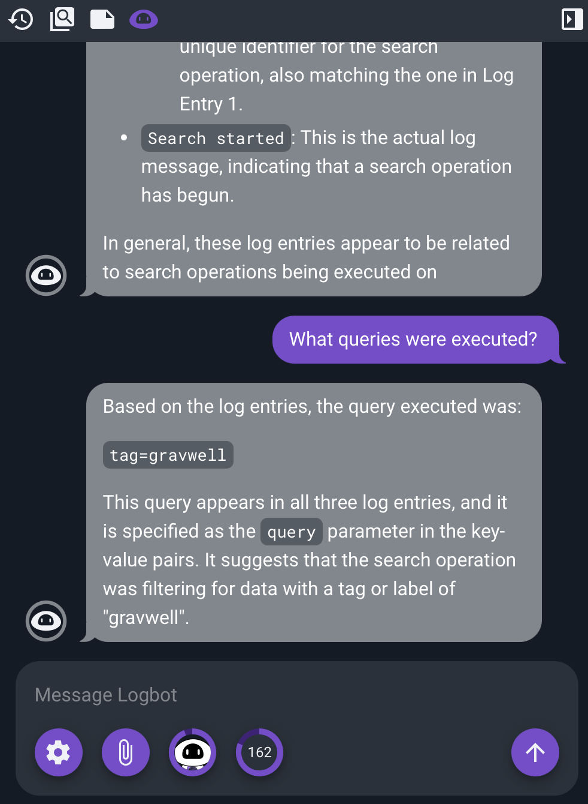
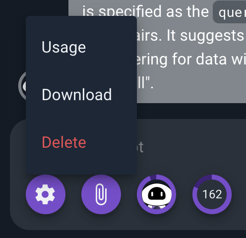
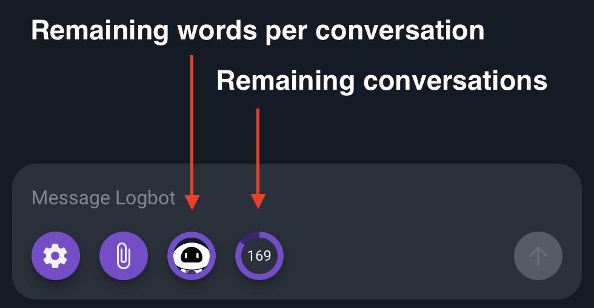

# Logbot AI

```{note}
Logbot AI is a beta feature and can make mistakes. Always check important information before relying on output from Logbot.
```



## Introduction

Logbot AI is a Large Language Model (LLM) powered chat assistant that can be prompted to explain or summarize entries in a query, write Gravwell queries, and interact with Gravwell. 

Logbot AI is available through the Query Studio interface. When Logbot AI is enabled, the chat interface can be accessed from within the right side pane in Query Studio. After a query has been executed, Logbot AI can be sent log entries.

## Logbot AI Overview

```{note}
Logbot AI can only be sent log entries associated with text and raw renderer search results.
```

When available and enabled, Logbot AI is accessible via the button in Query Studio. You can immediately begin talking to Logbot or launch a search and send entries to your conversation.



Entries can be right clicked to choose "Send to Logbot" or the "attach entries" button in the conversation view can be used for the same purpose.



You'll then have the option to ask Logbot to either "explain" or "summarize" the selected entries.



Logbot AI will begin streaming information as a conversation. This conversation is interactive, and you can ask Logbot AI additional questions. Logbot AI maintains the context of the current conversation when asking it additional questions, up to the word limit (see below).



The conversation can be erased or downloaded, and additional entries can be attached to the conversation using the menu buttons at the bottom of the conversation window.



Once a conversation is erased, Logbot AI will lose any context about the conversation. This means that new conversations will not be able to reference information from previous ones.

## API Limitations

Your license affects the priority and amount of interactions allowed with Logbot AI. Two components make up Logbot AI's API limitations: words per conversation and number of conversations.

During a conversation with Logbot AI, the entire conversation is used as state for the conversation. The number of words in a conversation is limited for performance reasons. Once this limit is reached, Logbot AI will not interact anymore until a new conversation is started.

The number of conversations allowed per month is limited by your license.

During a conversation, the Logbot AI UI shows your remaining words in the conversation, as well as the remaining conversations in the month.



## Limiting access to AI features

Because search entries may contain sensitive data, administrators may wish to limit access to the AI feature. There are two ways to do this:

- **Per user**: Capability Based Access Control ([CBAC](/cbac/cbac)) allows administrators to disable AI access to specific users or groups.
- **Per system**: Enable may be set to false in the AI section of your instance's gravwell.conf to disable the AI feature for all users.

(remote-ai-services)=
## Remote AI Services

When Gravwell's Artificial Intelligence (AI) feature is enabled and any user converses with the AI, their messages and any attached search entries are sent to a remote service for processing. Gravwell will send requests to the remote system specified in its [system configuration](#ai-server-url). The service is either Gravwell-hosted (`https://api.gravwell.ai/`) or a third-party OpenAI-compatible endpoint.

### Gravwell-hosted AI services

If your [system is configured](#ai-server-url) to use `https://api.gravwell.ai/`, your system is using a Gravwell-hosted AI service.

When engaging with Logbot or other Gravwell AI services, you should be cognizant of the following points which may affect data privacy:

- Gravwell AI services run in Gravwell infrastructure on Gravwell GPUs (no third parties). Gravwell infrastructure is on-prem and SOC2 compliant (our servers are in cages in shared datacenters in the continental US)
- Gravwell AI is NOT trained using any customer interactions or data and will not be in the future
- Interactions with Gravwell AI services may be stored on Gravwell infrastructure in memory or logs until rotation/cleanup. Any deletion requests (e.g. GDPR) should be submitted to [privacy@gravwell.io](mailto:privacy@gravwell.io) or as directed by any contract you may have with Gravwell
- Gravwell humans in charge of AI services may review interactions to improve the AI services and/or prevent abuse

### Configuring a third party LLM service

Instead of using the Gravwell-hosted AI service, you can configure Gravwell to use any OpenAI-compatible API endpoint (such as OpenAI, Anthropic, or a self-hosted model). This is done by setting the following parameters in the `[AI]` section of your `gravwell.conf`:

| Parameter | Description |
|-----------|-------------|
| `AI-Server-URL` | The URL of the OpenAI-compatible API endpoint. |
| `Third-Party-Provider` | Must be set to `true` to enable third-party mode. This disables license-based authentication and the Gravwell health check. |
| `Model` | The model name to use for chat completions (e.g. `gpt-4o`). Required when `Third-Party-Provider` is true. |
| `Include-Header` | Additional HTTP headers for requests to the AI server, typically used for authentication. Can be specified multiple times for multiple headers. |
| `System-Prompt-File` | Optional path to a file containing a custom system prompt for all Logbot conversations. |

Below is an example configuration that connects to OpenAI's API:

```
[AI]
	Enable=true
	AI-Server-URL="https://api.openai.com/v1/"
	Third-Party-Provider=true
	Model="gpt-4o"
	Include-Header="Authorization: Bearer sk-your-api-key"
```

```{note}
When using a third-party provider, Gravwell does not enforce conversation or word limits via the license — those limits are governed by the third-party service. Be aware that all messages and attached search entries will be sent to the configured third-party endpoint.
```

## Logbot Agent

Logbot includes an agentic capability that allows it to autonomously use tools to answer questions and write queries. When you ask Logbot to write a query, it uses an internal tool-calling loop to inspect your available tags, sample data, validate query syntax, and iteratively build a correct Gravwell query.

The agent has access to a set of MCP (Model Context Protocol) tools that allow it to interact with your Gravwell instance. The agent will automatically call tools as needed — for example, listing your tags to understand what data is available, sampling entries to understand data formats, and parsing queries to validate correctness before returning a result.

The maximum number of tool-call iterations per request is controlled by the `Max-AI-Tool-Iterations` configuration parameter.

## MCP Server

Gravwell exposes a [Model Context Protocol](https://modelcontextprotocol.io/) (MCP) server that allows external AI-powered tools to interact with your Gravwell instance. The MCP server is available at the `/api/mcp` endpoint on your webserver and uses the Streamable HTTP transport.

MCP tools are gated by [CBAC](/cbac/cbac) and any applied token permissions — users will only see tools they have permission to use.

### Available MCP Tools

The following tools are available via the MCP server:

| Tool | Description |
|------|-------------|
| `whoami` | Get information about the authenticated user |
| `parse_query` | Parse and validate a Gravwell query string |
| `save_query` | Save a query to the query library |
| `update_query` | Update an existing saved query |
| `list_queries` | List saved queries from the query library |
| `search_history` | Get the user's search history |
| `list_tags` | List all tags available to the user |
| `sample_tag_entries` | Retrieve the last 10 entries from a tag |
| `execute_query` | Execute a Gravwell query and return results |
| `ping_indexers` | Ping all indexers to check connectivity |
| `system_description` | Get hardware/OS descriptions for webserver and indexers |
| `system_stats` | Get live system statistics |
| `indexer_stats` | Get indexer storage statistics |
| `ingester_stats` | Get ingester connection and throughput statistics |
| `well_stats` | Get detailed well data for all indexers |
| `storage_overview` | Get a storage summary for all indexers |
| `list_resources` | List resources visible to the user |
| `load_skill` | Load a skill by name into the conversation context |
| `list_knowledge_bases` | List available knowledge bases |
| `knowledge_base_list_keys` | List all keys in a knowledge base |
| `knowledge_base_search` | Search a knowledge base using BM25 keyword search |
| `knowledge_base_get_data` | Retrieve data at a specific key in a knowledge base |
| `list_extractors` | List auto-extraction definitions |
| `create_extractor` | Create a new auto-extraction definition |
| `update_extractor` | Update an existing auto-extraction definition |
| `list_macros` | List search macros |
| `create_macro` | Create a new search macro |
| `update_macro` | Update an existing search macro |
| `list_alerts` | List alert definitions |
| `create_alert` | Create a new alert definition |
| `update_alert` | Update an existing alert definition |
| `list_scheduled_searches` | List scheduled search automations |
| `create_scheduled_search` | Create a new scheduled search automation |
| `update_scheduled_search` | Update an existing scheduled search |
| `list_flows` | List flow automations |
| `list_playbooks` | List playbooks |
| `get_playbook` | Get a playbook by UUID including its body |
| `create_playbook` | Create a new playbook |
| `update_playbook` | Update an existing playbook |

### Connecting External AI Tools via MCP

The MCP server can be used with any MCP-compatible client. Authentication is performed using a Gravwell API token or session cookie. Below are example configurations for Github Copilot CLI and Claude Code CLI.

#### GitHub Copilot CLI

Add the following to your `.github/copilot/mcp.json` file (or workspace `.vscode/mcp.json`):

```json
{
  "mcpServers": {
    "gravwell": {
      "type": "http",
      "url": "https://your-gravwell-instance/api/mcp",
      "headers": {
        "Gravwell-Token": "<your-gravwell-api-token>"
      }
    }
  }
}
```

#### Claude Code CLI

Add the following to your `.claude.json` file:

```json
{
  "mcpServers": {
    "gravwell": {
      "type": "http",
      "url": "https://your-gravwell-instance/api/mcp",
      "headers": {
        "Gravwell-Token": "<your-gravwell-api-token>"
      }
    }
  }
}
```

```{note}
API tokens can be generated in the Gravwell [Tokens API](/tokens/tokens).
```
