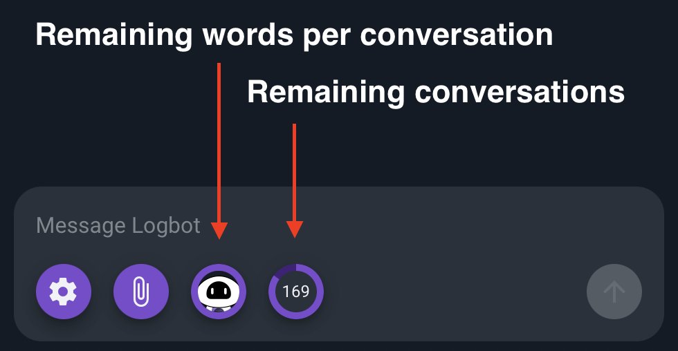

# Logbot AI 

```{note}
Logbot AI is a beta feature and can make mistakes. Always check important information before relying on output from Logbot.
```


## Introduction

Logbot AI is a Large Language Model (LLM) powered chat assistant that can be prompted to explain or summarize entries in a query. Logbot AI can be used to quickly understand new datasets, find inconsistencies in regular data, and explain abstract data fields.

Logbot AI is currently in beta and is available through the Query Studio interface. When Logbot AI is enabled, the chat interface can be accessed from within the right side pane in Query Studio. After a query has been executed, Logbot AI can be sent log entries.

## Enabling Logbot AI

Logbot AI is disabled by default on all Gravwell installations. To enable Gravwell globally, you must add the following to your `gravwell.conf` and restart the webserver service:

```
[AI]
Enable=true
```

Once globally enabled, Logbot AI access can be user/group controlled via the [CBAC](/cbac/cbac) system, if your license supports it.

## Logbot AI Overview

```{note}
Logbot AI can only be sent log entries associated with text and raw renderer search results.
```

When available and enabled, Logbot AI is accessable via the button in Query Studio. You can immediately begin talking to Logbot or launch a search and send entries to your conversation.


Entries can be right clicked to choose "Send to Logbot" or the "attach entries" button in the conversation view can be used for the same purpose.


You'll then have the option to ask Logbot to either "explain" or "summarize" the selected entries.


Logbot AI will begin streaming information as a conversation. This conversation is interactive, and you can ask Logbot AI additional questions. Logbot AI maintains the context of the current conversation when asking it additional questions, up to the word limit (see below).


The conversation can be erased or downloaded, and additional entries can be attached to the conversation using the menu buttons at the bottom of the conversation window.


Once a conversation is erased, Logbot AI will lose any context about the conversation. This means that new conversations will not be able to reference information from previous ones.

## API Limitations

Your license affects the priority and amount of interactions allowed with Logbot AI. Two components make up Logbot AI's API limitations: words per conversation and number of conversations.

During a conversation with Logbot AI, the entire conversation is used as state for the conversation. The number of words in a conversation is limited for performance reasons. Once this limit is reached, Logbot AI will not interact anymore until a new conversation is started.

The number of conversations allowed per month is limited by your license. 

During a conversation, the Logbot AI UI shows your remaining words in the conversation, as well as the remaining conversations in the month.



## How Gravwell Processes and Uses Logbot AI Data

When Gravwell's Artificial Intelligence (AI) feature is enabled and any user converses with the AI, their messages as well as any attached search entries will be sent to https://api.gravwell.ai/ for processing. Because search entries may contain sensitive data, administrators may wish to limit access to the AI feature. There are multiple ways to do this:


- Per user: Capability Based Access Control ([CBAC](/cbac/cbac)) allows administrators to disable AI access to specific users or groups. 
- Per system: Enable may be set to false in the AI section of your instance's gravwell.conf to disable the AI feature for all users. 

When engaging with Logbot or other Gravwell AI services, you should be cognizant of the following points which may affect data privacy:

- Gravwell AI services run in Gravwell infrastructure on Gravwell GPUs (no third parties). Gravwell infrastructure is on-prem and SOC2 compliant (our servers are in cages in shared datacenters in the continental US)
- Gravwell AI is NOT trained using any customer interactions or data and will not be in the future
- Interactions with Gravwell AI services may be stored on Gravwell infrastructure in memory or logs until rotation/cleanup. Any deletion requests (e.g. GDPR) should be submitted to privacy@gravwell.io or as directed by any contract you may have with Gravwell
- Gravwell humans in charge of AI services may review interactions to improve the AI services and/or prevent abuse. For example, we expect most users will ask Logbot to explain log entries, but if lots of users are asking it to write Gravwell queries (which it currently doesn't do very well), we want to be able to adapt to those needs


