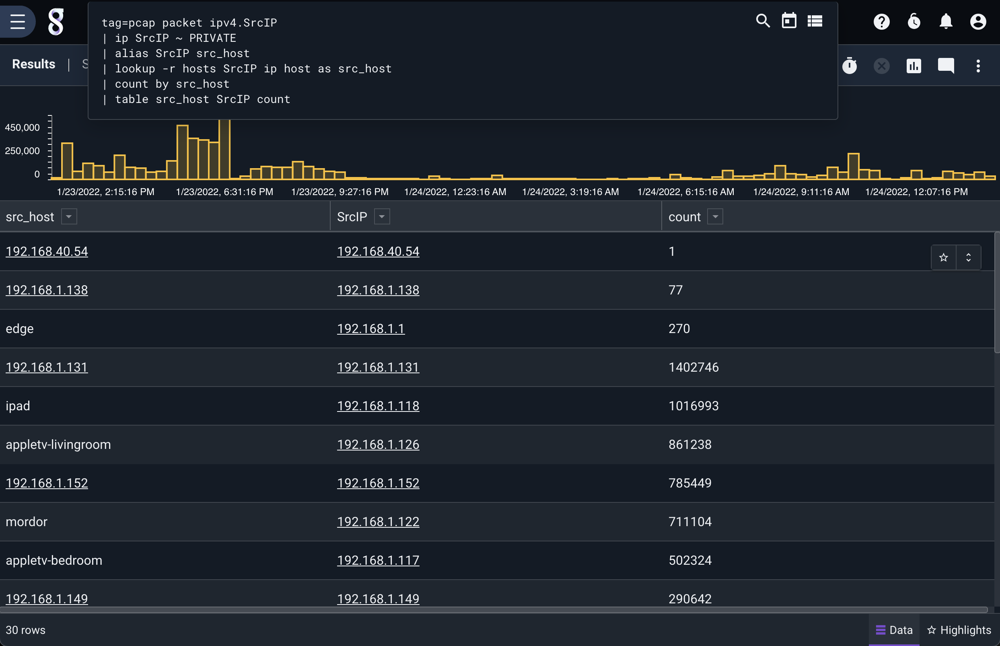

# Alias

エイリアスモジュールは、既存の列挙された値を"クローン"することができます。新しい列挙値を変更しても元の列挙値は変更されません。これは特に、`lookup`モジュールのために抽出した列挙された値を事前に入力しておきたい場合に便利です:

```
tag=pcap packet ipv4.SrcIP | ip SrcIP ~ PRIVATE | alias SrcIP src_host | lookup -r hosts SrcIP ip hostname as src_host | count by src_host | table src_host SrcIP count
```



エイリアスモジュールは、一つ以上の*pairs*の引数である source と destination を受け取ります。したがって、上の例では、既存の列挙された 'SrcIP' は 'src_host' にエイリアスされています。ルックアップモジュールがその結果を列挙された 'src_host' に書き込むとき、元の 'SrcIP' の値は変更されません。

複数のエイリアスを同時に作ることができます。
`alias foo bar X Y` は "foo" を "bar" に、"X" を "Y" にエイリアスします。
