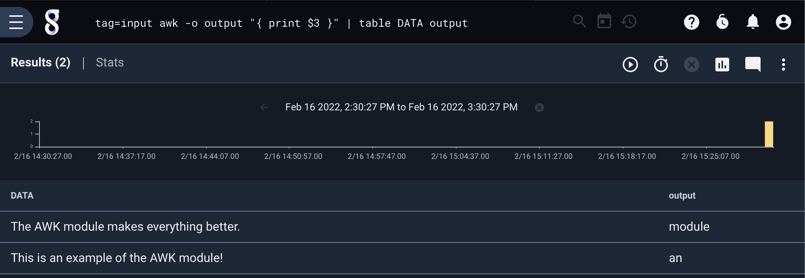
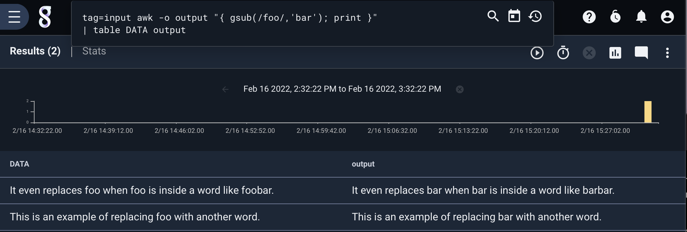
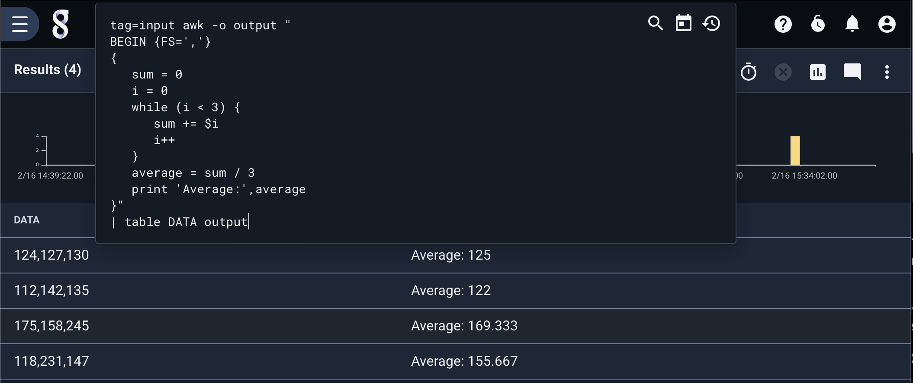

## Awk

The `awk` module is a fully functional implementation of the awk programming language, and conforms to the [POSIX AWK specification](https://pubs.opengroup.org/onlinepubs/9699919799/utilities/awk.html). `awk` is used for filtering, pattern matching, and textual data processing. 

The AWK programming language is beyond the scope of this documentation. You can find a full description of the language in the [AWK specification](https://pubs.opengroup.org/onlinepubs/9699919799/utilities/awk.html). 

### Supported Options

* `-e`: Use an enumerated value as the input instead of the raw data.
* `-o`: Set the output enumerated value. By default, the output will be set to the input enumerated value (or the raw data if `-e` is not set).

### Examples

#### Printing tokens

In this example, we simply print the third token in a whitespace delimited input stream. 

```
tag=input awk -o output "{ print $3 }" | table DATA output
```



#### Global find and replace

This example replaces all instances of the characters "foo" with "bar". 

```
tag=input awk -o output "{ gsub(/foo/,'bar'); print }" | table DATA output
```



#### Taking the average of numeric CSV records

This example takes a per row average of comma delimited numbers.

```
tag=input awk -o output "
BEGIN {FS=','}
{
   sum = 0
   i = 0
   while (i < 3) {
      sum += $i
      i++
   }
   average = sum / 3
   print 'Average:',average
}"
| table DATA output
```


